# arch-docs-tools — architecture

| | |
|---|---|
| Deliverable | `arch-docs-tools` (Claude Code plugin), root `arch-docs-tools/` |
| Version verified | `0.3.1` (`arch-docs-tools/.claude-plugin/plugin.json` l.3) |
| Commit verified | HEAD `5e5dfd9` (2026-09-27), working tree clean apart from the untracked `docs/architecture/feedback/` written by this run |
| Date of verification | 2026-09-27 |
| Releases covered | `0.1.0` (`e8d248f`), `0.2.0` (`949110b`), `0.3.0` (`aed07f8`), `0.3.1` (`5e5dfd9`) |

This is a regeneration. The previous version of this document described
0.1.0/0.2.0. Every path, line number, count and version below was re-read
from the working tree at the commit above. Section 8 lists what the earlier
document said that no longer holds.

Sibling deliverables `review-loop-tools` and `qa-loop-tools` are documented
separately. The cross-plugin picture lives in `overview.md`.

Note on provenance: this document was produced by the plugin it describes.
Where that run, or a probe made during it, exposed a behavior, the text says
"observed" or "probe". Probes were run in a scratch directory outside the
repo with the home directory and the data directory redirected, so they read
no real transcript and wrote nothing into the repo.

## 1. What it is

`arch-docs-tools` produces architecture documentation for an arbitrary
repository, and since 0.3.0 it also records each run and lets the agent file
a field report about the plugin itself.

It is a prompt-orchestrated system. The control logic is three markdown
prompt files (two skills and one sub-agent definition). Eight stdlib-only
Python scripts give the prompts deterministic measurements, checks and
records. There is no server, no database and no network call. The external
dependencies are the Claude Code plugin host, `python3`, `git`, and two
things the host keeps on disk: the installed-plugins registry and the
session transcripts.

Files in the deliverable (all 14, from `git ls-files arch-docs-tools`):

| Path | Role | Kind | Lines |
|---|---|---|---:|
| `arch-docs-tools/.claude-plugin/plugin.json` | Plugin manifest | JSON | 16 |
| `arch-docs-tools/skills/arch-docs/SKILL.md` | Orchestrator prompt: six stages | Prompt | 86 |
| `arch-docs-tools/skills/feedback/SKILL.md` | Field-report prompt: quick bundle or full report | Prompt | 74 |
| `arch-docs-tools/agents/arch-documenter.md` | Sub-agent prompt: DETAIL and OVERVIEW modes | Prompt | 124 |
| `arch-docs-tools/scripts/repo_survey.py` | Size, language and buildable-unit survey | Python, own | 64 |
| `arch-docs-tools/scripts/mermaid_lint.py` | Heuristic linter for fenced mermaid blocks | Python, own | 103 |
| `arch-docs-tools/scripts/coverage_check.py` | Docs folder against source tree | Python, own | 61 |
| `arch-docs-tools/scripts/arch_summary.py` | Start marker and run summary | Python, own | 214 |
| `arch-docs-tools/scripts/field_log.py` | Anomaly and dispatch telemetry | Python, mirrored | 277 |
| `arch-docs-tools/scripts/run_summary.py` | Loop run summary, plugin identity, platform probes | Python, mirrored | 467 |
| `arch-docs-tools/scripts/loop_usage.py` | Effective-token accounting from transcripts | Python, mirrored | 305 |
| `arch-docs-tools/scripts/feedback.py` | Field report scaffold, finalize, quick | Python, mirrored | 706 |
| `arch-docs-tools/FIELD-QUESTIONS.md` | Watch items, settled decisions, generated item list | Docs read by a script | 46 |
| `arch-docs-tools/README.md` | User-facing description | Docs | 84 |

"Mirrored" means authored in `review-loop-tools/scripts/` and copied here
byte for byte (section 3.9). The eight Python files total 2,197 lines, which
is what `repo_survey.py` reports for this deliverable (8 files, 2,197 LOC,
all `.py`). The six non-Python files are invisible to the survey (section 7).

Repo-level wiring: `.claude-plugin/marketplace.json` lists the plugin with
`"source": "./arch-docs-tools"` and no version. `git log -- arch-docs-tools`
shows four commits, one per release.

## 2. Top-level architecture

### 2.1 How the parts relate (high-level)

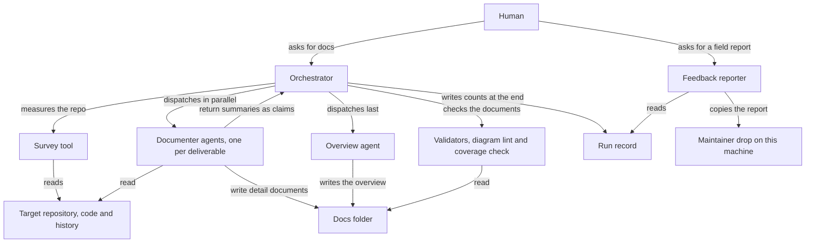

Data flow in one paragraph: the orchestrator marks the start of the run,
turns a survey into a deliverable plan, and dispatches one documenter per
deliverable. Each documenter turns source plus history into one markdown
document and a summary block. The overview agent turns those summaries,
treated as claims, into the shared overview. Two validators feed issues and
gaps back to the producing agent. At the end the orchestrator writes a
counts-only record of the run. Separately, and only by invitation, a second
skill turns that record plus measured token cost plus the agent's own
observations into a field report for the plugin maintainer.

Sources: `arch-docs-tools/skills/arch-docs/SKILL.md` l.5-86,
`arch-docs-tools/skills/feedback/SKILL.md` l.5-74,
`arch-docs-tools/agents/arch-documenter.md` l.7-124.

### 2.2 Prompt-to-script wiring (detailed)

Which prompt names which script, and with which verb.

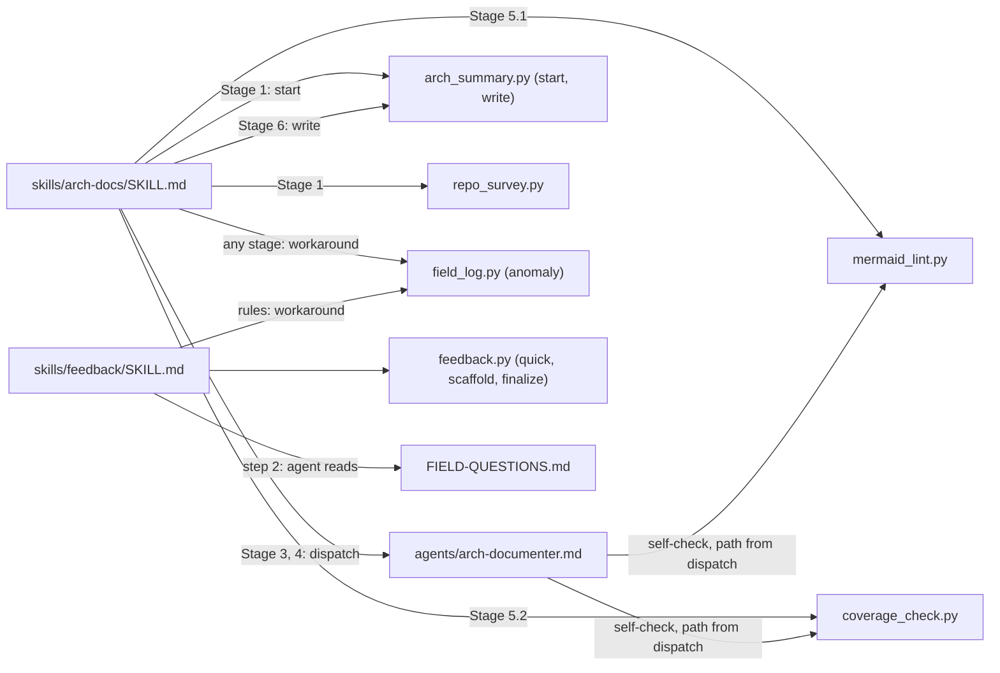

Sources: `skills/arch-docs/SKILL.md` l.17, 18, 49-50, 61, 65, 79, 86;
`skills/feedback/SKILL.md` l.15, 24, 31, 54, 73;
`agents/arch-documenter.md` l.21-28, 123.

### 2.3 Script-to-script dependencies (detailed)

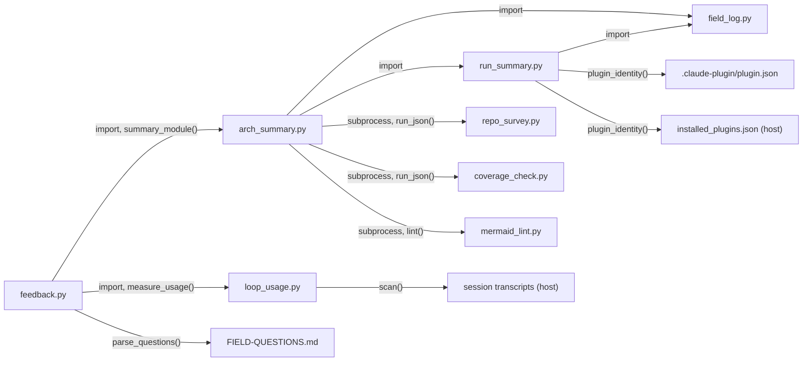

The three original scripts (`repo_survey.py`, `coverage_check.py`,
`mermaid_lint.py`) import nothing from each other. They are reached only as
subprocesses, from a prompt or from `arch_summary.py` l.52-58 and l.84-102.

Sources: `scripts/feedback.py` l.96-102, 136-165, 282-297;
`scripts/arch_summary.py` l.21-25, 52-58, 84-102, 124-126;
`scripts/run_summary.py` l.28-30, 63-89; `scripts/loop_usage.py` l.45-59,
148-212.

### 2.4 Runtime resolution

Both skills reference every script as
`${CLAUDE_PLUGIN_ROOT}/scripts/<name>.py`. The documenter never references
that variable. It uses the script paths carried in its dispatch
(`agents/arch-documenter.md` l.22-27).

The plugin version that a record reports is read from the `plugin.json`
beside the running script, not from memory or from the registry
(`scripts/run_summary.py` l.63-66). The registry entry is recorded next to
it, with a flag saying whether the two agree (l.69-88).

Observed: in the dispatch that produced this document the two validator
paths pointed into the repo working tree, not into a plugin cache. The
earlier version of this document asserted which cache directory ran. That
claim was not re-verifiable and has been removed.

## 3. Module inventory

### 3.1 Plugin manifest — `arch-docs-tools/.claude-plugin/plugin.json`

- Purpose: declares the plugin to the host. Fields: `name`, `version`
  (`0.3.1`), `description`, `author`, `keywords`, `license` (`MIT`).
- No `hooks`, `commands` or `mcpServers` keys. The plugin ships no hook
  script. Verified: `find arch-docs-tools -name "*.sh"` returns nothing.
- Second consumer since 0.3.0: `run_summary.plugin_identity()` reads `name`
  and `version` from this file (`scripts/run_summary.py` l.63-66). Those two
  values become the report's file name stem and id prefix
  (`scripts/feedback.py` l.373-380, 402).
- Interaction: `HANDOFF.md` ritual 1 (l.115-118) states the plugin cache is
  keyed by this `version`, so an unbumped version means installed users
  never receive a change.

### 3.2 Orchestrator skill — `arch-docs-tools/skills/arch-docs/SKILL.md`

- Purpose: the six-stage pipeline. Frontmatter `name: arch-docs` (l.2). The
  description doubles as the invocation trigger (l.3).
- Contract (l.5-12): dispatches `arch-documenter` subagents in the
  foreground, decides the split, runs the scripts, never writes architecture
  content itself, never modifies source, and must not end a turn with a
  dispatch promised but not made. Output goes to `docs/architecture/` unless
  the user names another location.
- Stages, each verified against the file:
  1. **Survey** (l.14-23). New in 0.3.0: first run `arch_summary.py start
     docs/architecture` (l.16-17). Then run `repo_survey.py`, skim the README
     and docs, and identify candidate deliverables. Ignore vendored and
     generated code.
  2. **Split decision** (l.25-37). Rules in section 4. Announce the plan.
     Ask the user only when the split is "genuinely ambiguous (borderline
     size, unclear boundaries)", offering 2-3 options.
  3. **Detail documents** (l.39-51). One DETAIL dispatch per deliverable,
     all in a single message. Payload: name, slug, root paths, survey JSON,
     output path, the only-deliverable flag, a reminder of the two diagram
     classes (l.45-47, added in 0.2.0), and both validator script paths.
     Collect each MANIFEST.
  4. **Overview** (l.53-57, multi-deliverable only). One OVERVIEW dispatch
     with all MANIFESTs labeled as claims, the survey JSON, the detail doc
     paths, the output path and the lint script path.
  5. **Validate** (l.59-69). Lint over `docs/architecture/*.md`. Issues go
     back to the producing agent with the exact lint output. "Repeat once;
     if issues survive two fix passes, list them in your report rather than
     looping." Then the coverage check against the repo root. The
     orchestrator judges the gaps.
  6. **Report** (l.71-86). One block: files written, split and why, diagram
     count, coverage numbers, validation failures, next steps. New in 0.3.0:
     then run `arch_summary.py write docs/architecture` (l.78-81) and end
     with a one-line invitation to `/arch-docs-tools:feedback` (l.81-84),
     "as an invitation and never a gate".
- Standing instruction, not tied to a stage (l.84-86): whenever the
  orchestrator works around the plugin, record it at that moment with
  `field_log.py anomaly docs/architecture workaround "<one line>"`.
- Design patterns: pipeline with stage gates, fan-out and fan-in, bounded
  retry (lint, two passes), human in the loop only on an ambiguity
  predicate, write-ahead start marker.
- Dependencies: five scripts (`arch_summary.py`, `repo_survey.py`,
  `mermaid_lint.py`, `coverage_check.py`, `field_log.py`), the
  `arch-documenter` agent, the host's variable expansion and subagent
  dispatch.

### 3.3 Documenter agent — `arch-docs-tools/agents/arch-documenter.md`

- Purpose: writes one document per dispatch. Frontmatter: `tools: Read,
  Grep, Glob, Bash, Write, Edit` (l.4), `model: inherit` (l.5).
- Accuracy rules (l.13-28): source-verified claims only, cited paths,
  `Inference:` labels, a self-run coverage check against the deliverable
  root, a self-run lint with every issue fixed before returning.
- Diagram rules (l.30-67), rewritten in 0.2.0. Two classes. High-level
  diagrams use roles in plain words, at most six participants per sequence
  diagram, messages of at most eight words, no commands, flags, paths, JSON
  keys or script names, unquoted aliases, no semicolons. Detailed diagrams
  use precise identifiers and quoted flowchart labels. The rule cites its own
  measurement: "a first pass produced 221 messages carrying script names,
  flags or paths" (l.66-67).
- DETAIL mode (l.69-105). Input: name, slug, root paths, survey stats,
  output path, script paths. Output: five mandated sections, the overview
  treatment prepended when it is the only deliverable (l.89-91), and a
  fenced JSON MANIFEST with six fixed keys at the end of the response
  (l.93-105). Item 3 now reads "3-5 ... more when the dispatch asks for
  scenario coverage" (l.80-82).
- OVERVIEW mode (l.107-124). Input: all MANIFESTs, survey stats, detail doc
  paths, output path. Output: the shared document and a 2-3 line prose
  summary, no manifest.
- The write boundary ("only ever WRITE files inside the docs output
  directory", l.10-11) is enforced by the prompt only. The tool list has
  `Write`, `Edit` and `Bash` with no path restriction, and the plugin ships
  no hook.
- Interaction: the MANIFEST is the only structured channel from DETAIL
  agents to the OVERVIEW agent. The orchestrator relays it.

### 3.4 Feedback skill — `arch-docs-tools/skills/feedback/SKILL.md`

New in 0.3.0. Invoked as `/arch-docs-tools:feedback`, with `--quick` for the
numbers alone.

- Purpose: file a field report for the maintainer of the plugin, not for
  the owner of the documented repo (l.5-8). "An empty section is a good
  answer; a guess is not" (l.11).
- Quick path (l.13-19): one command, `feedback.py quick docs/architecture`,
  then the commit step.
- Full path (l.21-65), six steps: scaffold a draft, read two sections of
  `FIELD-QUESTIONS.md`, fill in the draft below each guide comment, finalize,
  commit by explicit path, tell the user three lines.
- Rules (l.67-74): report only what the run showed, never a gate, record
  deviations when they happen.
- Things the agent must not do (l.51-52): write item ids, edit the front
  matter, paste the run summary. The script does all three.
- Provenance: this file is the `review-loop-tools` feedback skill with
  eleven lines changed (`diff review-loop-tools/skills/feedback/SKILL.md
  arch-docs-tools/skills/feedback/SKILL.md`). It is not byte-identical and is
  not in the mirrored list of `HANDOFF.md` ritual 2.
- Dependencies: `feedback.py`, `field_log.py`, `FIELD-QUESTIONS.md`, `git`.

### 3.5 `arch-docs-tools/scripts/repo_survey.py`

Unchanged since 0.1.0.

- Interface: `repo_survey.py [root]` (default `.`). Prints one JSON object:
  `root` (absolute), `total_files`, `total_loc`, `by_top_dir` (per top-level
  directory: `files`, `loc`, `languages` as extension to LOC, with
  root-level files keyed as `"."`), `manifests` (list of `{path, kind}`).
- What it counts (l.13-16, 45-58): files whose lowercase extension is in
  `SOURCE_EXT`, 26 extensions. LOC is a raw line count of the file opened in
  binary mode. Unreadable files are skipped silently.
- What it skips (l.10-12, 29-30): 18 directory names in `EXCLUDE`, plus any
  directory whose name starts with a dot. `.md`, `.json`, `.yaml` and `.toml`
  are not source extensions.
- Manifest detection (l.17-22, 34-44): 12 file names in `MANIFESTS` when the
  containing directory is at depth 3 or less. `.xcodeproj` and
  `.xcworkspace` directories found at depth 3 or less are recorded as
  `kind: "xcode"` and pruned from the walk. Deeper ones are neither recorded
  nor pruned.
- Patterns: single-pass `os.walk` with in-place pruning. Pure stdlib. No git
  dependency.
- Consumers: the orchestrator (split decision), every documenter through the
  dispatch payload, and `arch_summary.py` l.124, which re-runs it.

### 3.6 `arch-docs-tools/scripts/mermaid_lint.py`

Changed in 0.2.0 (84 to 103 lines). Unchanged since.

- Interface: `mermaid_lint.py <file.md> [...]`. One issue per line on
  stdout as `path:line: message`. A summary `mermaid_lint: N block(s), M
  issue(s)` on stderr. Exit 1 on any issue, 2 on missing arguments, else 0
  (l.75-100).
- Block extraction (l.83-95): a line whose stripped form starts with the
  mermaid fence opens a block. The next line whose stripped form starts with
  a plain fence closes it. Indented fences are accepted. An unclosed fence
  at end of file is an issue.
- Checks per block (`lint_block`, l.25-73):
  1. Empty block (l.27-29).
  2. Diagram type (l.30-33): the first non-blank line must start with one
     of 14 prefixes in `TYPES` (l.18-20). Probe: `architecture-beta`,
     `gitGraph`, and a block that opens with an init directive are all
     reported as unknown.
  3. Bracket balance (l.45-47, 67-69): after `strip_quoted` replaces every
     quoted string, the counts of `()`, `[]` and `{}` are summed across the
     whole block. New in 0.2.0: in an `erDiagram`, a relationship line is
     skipped entirely (l.43-44). The pattern requires whitespace on both
     sides of the crow's-foot token.
  4. Sequence diagrams only, new in 0.2.0 (l.48-55): a semicolon in the
     text after the colon of a `Note` or message line is an issue. A
     `participant ... as "..."` line is an issue.
  5. Flowcharts only (l.56-66, 70-72): `subgraph` count must equal the
     count of lines that are exactly `end`. Every unquoted `[label]` that
     contains any of `( ) ; |` is reported as "needs quotes".
- Blind spots found by probe are listed in section 7.
- Consumers: the orchestrator (Stage 5), each documenter (self-check), and
  `arch_summary.py` l.84-102, which re-runs it and keeps only counts and
  issue kinds.

### 3.7 `arch-docs-tools/scripts/coverage_check.py`

Changed in 0.3.0 (58 to 61 lines).

- Interface: `coverage_check.py <docs-dir> <src-root>`. Exactly two
  arguments or exit 2 (l.19-22). Prints JSON `{source_files, mentioned,
  unmentioned, top_unmentioned: [{path, loc}]}`. Always exits 0.
- Corpus (l.24-33): every `.md` under `docs-dir`, recursively, concatenated
  into one string. New in 0.3.0: any directory named `feedback` is pruned
  from that walk (l.26-28). The comment gives the reason: "a report that
  names a file must not count as coverage". Probe: two reports in
  `feedback/` left the coverage numbers unchanged.
- Source set (l.11-16, 36-40): the same `EXCLUDE` set and dot-directory rule
  as the survey, but a narrower `SOURCE_EXT` of 20 extensions.
- "Mentioned" decision (l.44): the path relative to `src-root` appears as a
  substring of the corpus, or the basename does. Case-sensitive.
- Output ordering (l.53-58): unmentioned files sorted by LOC descending, top
  25 reported.
- Consumers: the orchestrator (Stage 5, with the repo root), each DETAIL
  documenter (with its deliverable root), and `arch_summary.py` l.125.

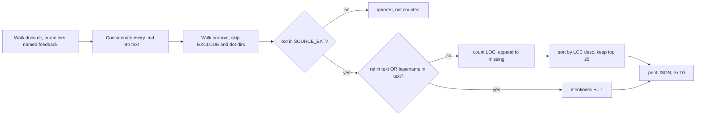

### 3.8 `arch-docs-tools/scripts/arch_summary.py`

New in 0.3.0. The only script written for this plugin in that release.

- Interface (l.4-6, 190-211):
  - `arch_summary.py start <docs-dir>` creates `<docs-dir>/feedback/` and
    writes `run.json` with `started_ts` and `started_at`. Probe: it creates
    the docs directory itself when that does not exist.
  - `arch_summary.py write <docs-dir>` writes
    `<docs-dir>/feedback/run-summary.json`. Exit 1 when `<docs-dir>` is not
    a directory (l.205-207).
  - `arch_summary.py write <docs-dir> --print` prints the summary and
    writes nothing.
  - Anything else: usage on stderr, exit 2.
- Python interface used by `feedback.py`: `write(docs_dir, stop_note="")`
  (l.177-188), reached through `summary_module()`.
- What `build()` does (l.104-175), in order: resolve the repo root through
  git, read the plugin identity, read every top-level `.md` in the docs
  directory, read the start marker, re-run the survey, the coverage check and
  the lint as subprocesses, read `anomalies.jsonl`, and assemble the record.
- What it records per document (`docs_in`, l.60-82): file name, bytes,
  lines, diagram count, diagram kinds, whether a "Not covered" heading
  exists, the number of `Inference:` labels, and the modification time.
- What it records from the lint (l.84-102): block count, issue count, and
  issues grouped by kind. The kind is the message with everything from the
  first quote or backtick removed, because "a lint line quotes the document"
  (l.95).
- The window (l.110-123, 150-153). Start is the marker. Without a marker
  the fallback is the oldest document written within twelve hours of the
  newest, and the gap is reported in `missing`. End is the newest document's
  modification time.
- The split (l.136-138) is derived from the docs directory: one document or
  fewer is "single document", otherwise "overview + N detail document(s)",
  where N counts every top-level `.md` not named `overview.md`.
- `objective` (l.162-172) is a dict of five display lines. `feedback.py`
  prints each pair in the report's glance section (`scripts/feedback.py`
  l.213-214). `run_summary.build()` has no such key, so this is the one
  place where the shared report script depends on a shape only this plugin
  produces.
- Patterns: atomic write through a `.partial` file and `os.replace`
  (l.182-187). Every subprocess and file read is wrapped so a failure yields
  a missing value, not an exception.
- Privacy rule stated in the docstring (l.16-17): "Counts and document
  names only: no source paths, no document text."
- Dependencies: `field_log` and `run_summary` (imports), the three original
  scripts (subprocess), `git`.

### 3.9 The four mirrored scripts

`field_log.py`, `run_summary.py`, `loop_usage.py` and `feedback.py` are
authored in `review-loop-tools/scripts/` and mirrored into
`qa-loop-tools/scripts/` and `arch-docs-tools/scripts/`. `HANDOFF.md` ritual
2 (l.130-138) states the rule and asks for `cmp` before every commit.

Byte identity verified on 2026-09-27 at HEAD `5e5dfd9` with `cmp -s`:

| Script | against `review-loop-tools/scripts/` | against `qa-loop-tools/scripts/` |
|---|---|---|
| `field_log.py` | identical | identical |
| `run_summary.py` | identical | identical |
| `loop_usage.py` | identical | identical |
| `feedback.py` | identical | identical |

Because the copies are identical, their full behavior belongs in
`review-loop-tools.md`, the document of the plugin that authors them. That
document is regenerated separately and was not checked from here. The
inventory below records only what this plugin uses, what is reachable but
inert here, and what is dead weight here.

### 3.10 `arch-docs-tools/scripts/field_log.py` (mirrored)

- Used here:
  - The `anomaly` verb, from both skills. It appends one row to
    `<docs-dir>/feedback/anomalies.jsonl` (l.127-149, 250-266).
  - `read_rows` (l.97-113), `now_iso` (l.120-121) and `feedback_dir`
    (l.74-80), imported by `arch_summary.py`.
  - Internals those reach: `scrub` (l.65-72, folds the home directory to a
    tilde and caps at 400 characters), `norm_code` (l.123-125), `append_row`
    (l.115-118, takes an exclusive file lock), `off` (l.62-63).
- Reachable but inert here: `loop_phase` (l.82-87) and `loop_round`
  (l.89-95) look for `.phase` and `ledger.json`. A docs directory has
  neither. Probe: the row carries `"phase": ""` and no `round` key.
- Not used here: the `dispatch-start` and `dispatch-end` verbs, `dispatch`
  (l.165-202), `pair_dispatches` (l.208-238), `short_agent`, `base_phase`,
  `live`, `_payload`. They are driven by hooks, and this plugin has none.
  Even if called, `dispatch` returns early because `live("")` is false
  (l.172-174).
- The `codes` verb prints a vocabulary of 27 codes (l.32-60). One,
  `workaround`, is prescribed by this plugin's skills. The other 26 name
  events in the two loop plugins.
- Contract (l.17-20, 272-277): never fails its caller, never creates the
  directory it is given, always exits 0. Probe: an anomaly against a missing
  directory prints `"recorded": false`, exits 0 and creates nothing.
  `FIELD_LOG_OFF=1` silences it.

### 3.11 `arch-docs-tools/scripts/run_summary.py` (mirrored)

- Used here, all through `arch_summary.py`:
  - `plugin_identity()` (l.63-89): name, version, `running_from`, the
    matching registry entry, `install_matches_running`.
  - `platform_info(name)` (l.91-99): macOS version, architecture, the host
    CLI version, Python and git versions. A failed probe is `"unknown"`. The
    Xcode probe runs only for a plugin whose name starts with `qa-`.
  - `load_json` (l.36-41) and `iso` (l.350-353).
  - Internals those reach: `tilde` (l.50-53), `probe` (l.55-61).
- Not used here: `load_text`, `parse_rounds`, `finding_counts`, `stop_info`,
  `settings`, `panel_runs`, `coverage_counts`, `closeout_suites`,
  `loop_root`, `hygiene`, `git_state`, `loop_window`, `build`, `write`,
  `main`. That is 15 of 21 functions. They read `ledger.json`,
  `verdict.json`, `rounds.md`, `panel.json` and `coverage.json`, none of
  which a docs run produces.
- `feedback.py` never calls this module's `build` or `write` in this plugin,
  because `summary_module()` tries `arch_summary` first (section 3.13).
- `hygiene()` (l.266-288) looks for `hygiene_check.sh` beside itself. This
  plugin does not ship that script, so the function would report
  `"ran": false`. It is unreachable here in any case.

### 3.12 `arch-docs-tools/scripts/loop_usage.py` (mirrored)

- Used here: `parse_time` (l.61-79) and `measure` (l.231-259), imported by
  `feedback.measure_usage()` (`scripts/feedback.py` l.282-297). `measure`
  reaches `project_dir`, `scan`, `by_role`, `role_of`, `eff`, `_meta`,
  `agent_type_of` and `_images`.
- Not referenced by either skill: the command line (l.261-302). It works by
  hand and offers `--repo` and `--dir`, which `feedback.py` does not pass
  through.
- Accounting (l.26-28, 81-85): effective = input x1 + cache read x0.1 +
  cache write x2 + output x5. Records are deduplicated by request id. An
  image counts a flat 1,600.
- Where it looks (l.45-59): under `~/.claude/projects/`, in a directory
  named after the repo's absolute path with every non-alphanumeric character
  replaced by a hyphen. It tries the path as given and its real path.
- Roles (l.214-217): a main session is `orchestrator`. A subagent is its
  type with any plugin prefix removed. In this plugin that yields
  `orchestrator` and `arch-documenter`. DETAIL and OVERVIEW dispatches share
  one role. `by_dispatch` separates them by label.
- Window filter is per record, not per file (l.20-24, 180-188). A record
  with no parsable timestamp is counted and tallied as `undated`.

### 3.13 `arch-docs-tools/scripts/feedback.py` (mirrored)

- Verbs (l.4-8, 683-703): `scaffold`, `finalize`, `quick`, `questions`. The
  first three are named by the feedback skill. `questions` prints the parsed
  watch items and settled decisions and is not referenced by any prompt.
  Probe: it finds 10 watch items and 6 settled decisions.
- How it selects this plugin's summary builder (l.96-102): it looks for
  `arch_summary.py` beside itself first, then `run_summary.py`. The comment
  says why: "arch-docs-tools ships run_summary.py too (for its
  plugin-identity and platform probes), but its report is arch_summary's."
  The script is identical in all three plugins. The file that sits beside it
  decides its behavior.
- `scaffold` (l.341-442): resolve the source directory, load the run
  summary or build it now when missing or of another schema, measure usage
  into `usage.json`, and write a draft with front matter, a glance section,
  a token table, the watch items with an `_unanswered_` placeholder each,
  and eight guided sections (`SECTIONS`, l.50-80). It refuses to overwrite
  an existing draft without `--force`.
- `finalize` (l.568-681): strip guide comments, check every watch answer
  (`check_watch`, l.456-484), mint an id per item (`mint_ids`, l.502-549),
  write `_none_` into empty known sections, append the summary and usage as
  two fenced JSON appendices, set `status: filed`, copy the file to the
  drop, and print the list of files to stage. Probe: a draft with ten
  unanswered watch items is refused with exit 1 and ten messages.
- `quick` (l.696-701): scaffold and finalize with no questions. A quick
  bundle never reuses a draft (l.390-395).
- Id format (l.43, 402): `ad-<version>-<yyyymmdd>-<host>-<n>`. `ad` is this
  plugin's short name.
- The drop (`drop_dir`, l.551-566): `quiller/inbox/<host>/` under the XDG
  data directory, or under `~/.local/share` when that variable is unset,
  relative, or resolves inside the host repo.
- Reachable but inert here:
  - `resolve_source` archive fallback (l.124-133). A docs directory has no
    `archive/` of loops.
  - `upgrade_allowlist` (l.301-331). It acts only on a `.gitignore` whose
    first line contains "Managed by" and "-loop-tools".
  - The glance branches for `stop`, `findings`, `dispatches`,
    `unattended_defaults` and `hygiene` (l.196-212, 227-243). The arch
    summary has none of those keys.
  - `dispatches.jsonl` in the staging list (l.658-660). Nothing here writes
    it.
- Dependencies: the summary builder, `loop_usage`, `FIELD-QUESTIONS.md`,
  `git`.

### 3.14 `arch-docs-tools/FIELD-QUESTIONS.md`

New in 0.3.0. Shipped with the plugin so the field agent reads the same
text the maintainer wrote.

- Three sections: 10 watch items (l.11-26), 6 settled decisions (l.28-40),
  and a generated list of earlier items (l.42-46).
- Read by a script: `feedback.parse_questions()` parses the first two
  sections by their heading prefix and the bullet shape `- **<id>** — <text>`
  (`scripts/feedback.py` l.136-165). A change to either format breaks the
  scaffold silently, by producing zero watch items.
- The third section is written by `tools/render_field_questions.py`, a
  maintainer tool outside this deliverable, from
  `docs/inbox/dispositions.json`. It currently reads "No field items
  recorded for this plugin yet" (l.45). Verified: that file holds 71 items,
  none for this plugin.
- Two watch items ask the field about the plugin's own known weak points:
  `w-coverage-blind-spot` (l.22) and `w-lint-false-positive` (l.19).

### 3.15 `arch-docs-tools/README.md`

User-facing narrative: the five-step pipeline (l.8-37), the accuracy
contract (l.39-43), usage (l.45-53), the model note (l.55-60), and since
0.3.0 a feedback section (l.62-84). The "How it works" list does not mention
the start marker or the run summary. The feedback section does (l.84).

## 4. Split-decision rules

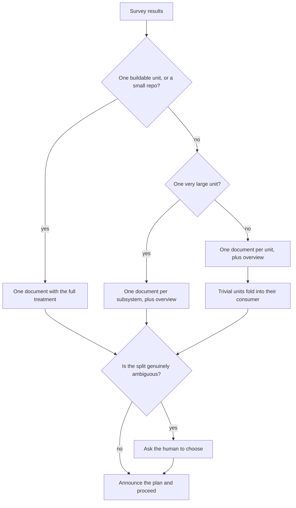

Sources: `skills/arch-docs/SKILL.md` l.27-37. "Small" is under about 15K
LOC, "very large" is above about 50K LOC, "trivial" is under about 1K LOC.
All three are prose approximations. Nothing in the scripts computes or
enforces them. How subsystems are identified in the very-large case is not
specified.

## 5. Sequence diagrams

Participants are roles, not files. Exact commands, flags and JSON shapes are
in sections 3 and 6. The "Sources" line under each diagram carries the paths.

| Role | What it stands for |
|---|---|
| Human | The person in the session |
| Orchestrator | The main session running the docs skill |
| Measurement scripts | The start marker, the survey, the lint, the coverage check and the run summary |
| Validators | The lint and the coverage check only |
| Documenter agent | A sub-agent in DETAIL mode |
| Overview agent | A sub-agent in OVERVIEW mode |
| Repository | The target source tree and its git history |
| Docs folder | The output directory for documents |
| Feedback folder | The subfolder that holds run records and reports |
| Reporter | The session running the feedback skill |
| Report script | The field-report script |

### 5.1 Single-deliverable run

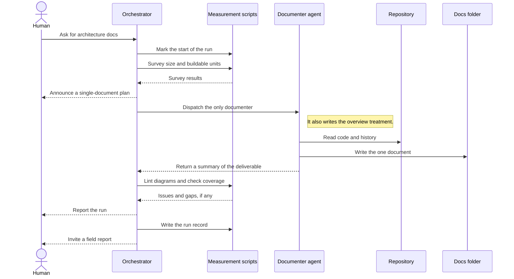

Sources: `skills/arch-docs/SKILL.md` l.16-18 (marker, survey), l.27-28
(single document), l.39-51 (dispatch), l.59-69 (validate), l.71-86 (report,
record, invitation). `agents/arch-documenter.md` l.89-91 (overview
treatment). Stage 4 is skipped. The summary block is still collected
(`SKILL.md` l.51) but nothing consumes it.

### 5.2 Multi-deliverable run

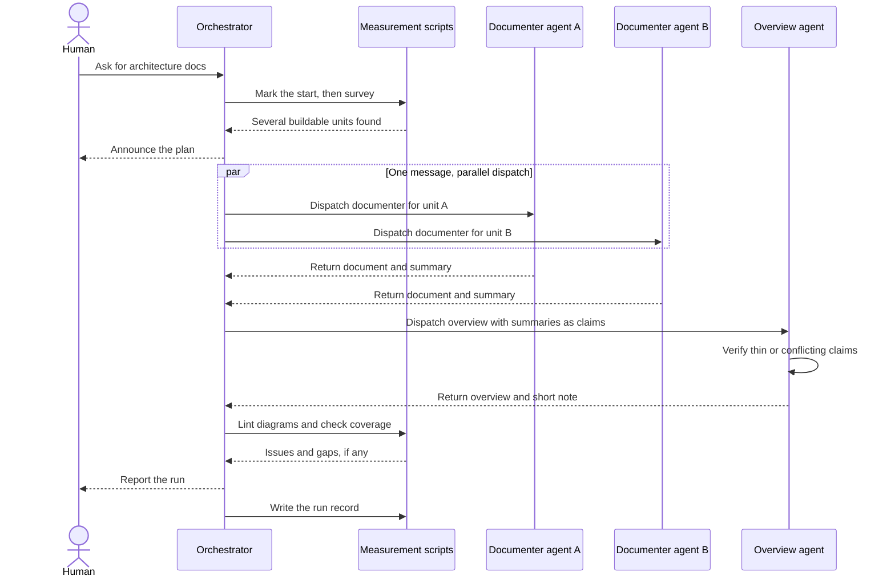

Sources: `skills/arch-docs/SKILL.md` l.29-31 (split), l.41-42 (one message),
l.53-57 (overview), l.78-81 (record). `agents/arch-documenter.md` l.109-112
(claims). The same flow serves a single unit above about 50K LOC, with
subsystems in place of units (`SKILL.md` l.32-33). The earlier document
drew that case as its own diagram. It differs only in how roots are chosen,
which the skill does not specify.

### 5.3 Inside a DETAIL documenter

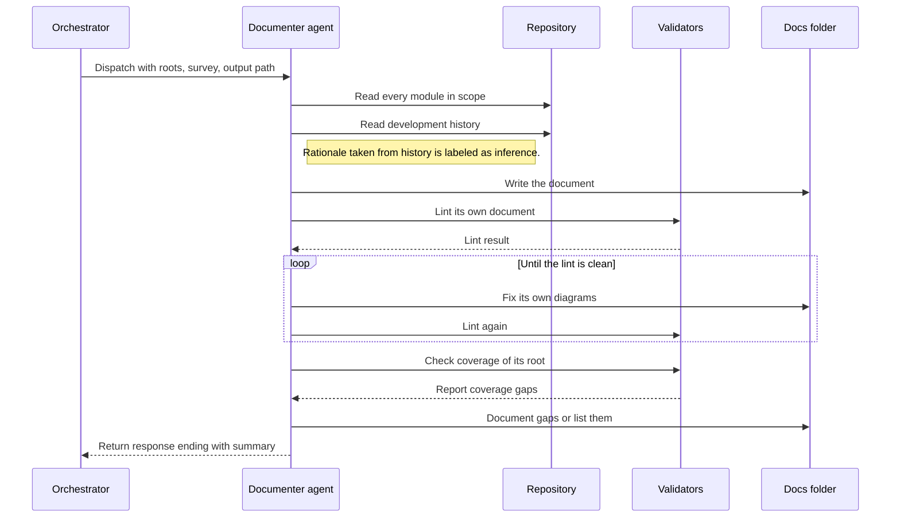

Sources: `agents/arch-documenter.md` l.7-28 (sources, accuracy rules),
l.69-105 (structure, summary block). The self-checks use the script paths
carried in the dispatch. The coverage self-check runs against the
deliverable root, not the repo root (l.21-23). The agent's own lint loop has
no pass cap. The cap in 5.4 belongs to the orchestrator.

### 5.4 Lint-fix loop, capped at two passes

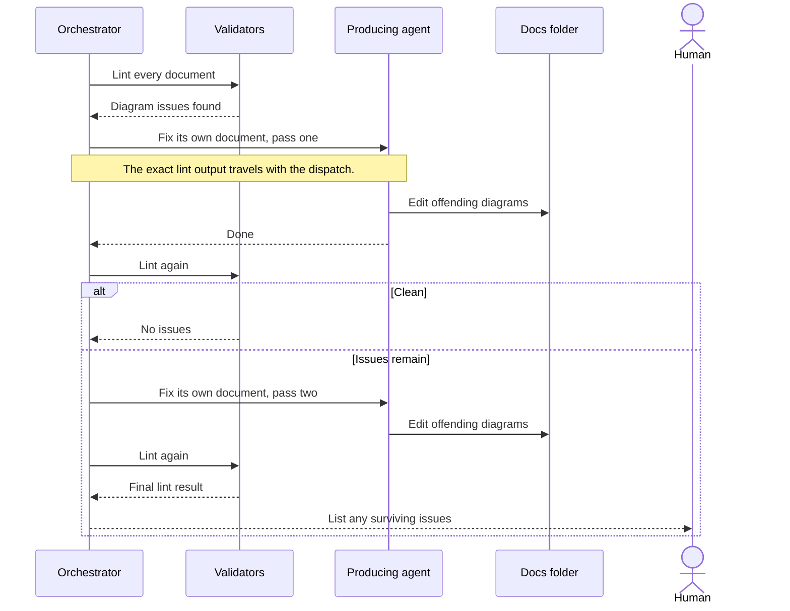

Sources: `skills/arch-docs/SKILL.md` l.61-64. The run record written
afterwards holds the lint numbers of the final state only
(`scripts/arch_summary.py` l.84-102). How many passes were needed is not
recorded anywhere. Watch item `w-lint-second-pass` asks the agent instead
(`FIELD-QUESTIONS.md` l.18).

### 5.5 Coverage-gap loop and the "Not covered" appendix

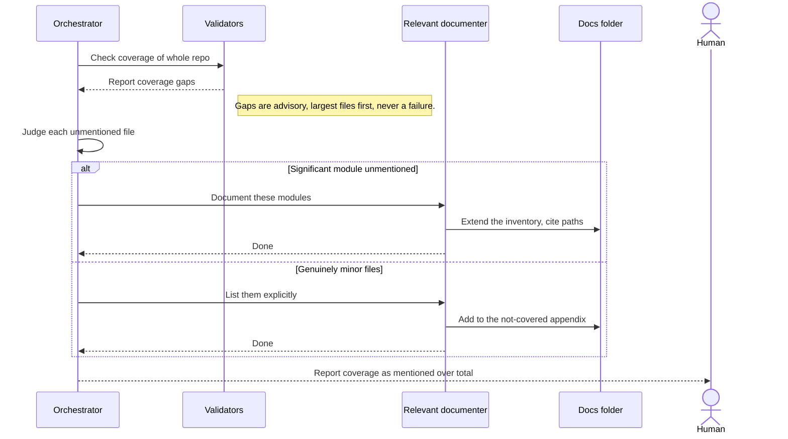

Sources: `skills/arch-docs/SKILL.md` l.65-69, `scripts/coverage_check.py`
l.53-58. The skill does not mandate a re-run after the fix and sets no pass
cap for this loop.

### 5.6 Ambiguous split: ask the human

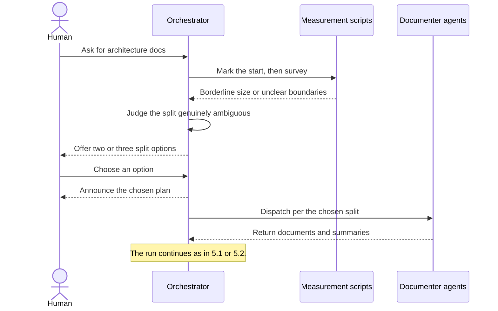

Sources: `skills/arch-docs/SKILL.md` l.34-37. This is the only point in the
docs skill that waits for a person. Watch item `w-split-ambiguous` asks how
often it happens (`FIELD-QUESTIONS.md` l.17).

### 5.7 Writing the run record

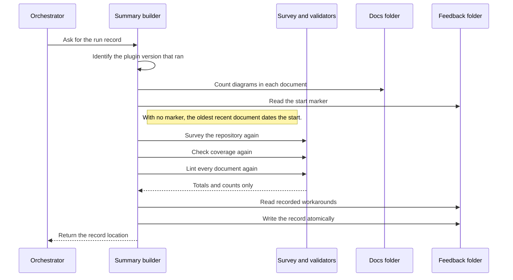

Sources: `scripts/arch_summary.py` l.104-175 (`build`), l.177-188
(`write`), `scripts/run_summary.py` l.63-89 (identity). The record is
measured at the end, from the final documents. It is not a log of what the
orchestrator saw during the run.

### 5.8 Quick feedback bundle

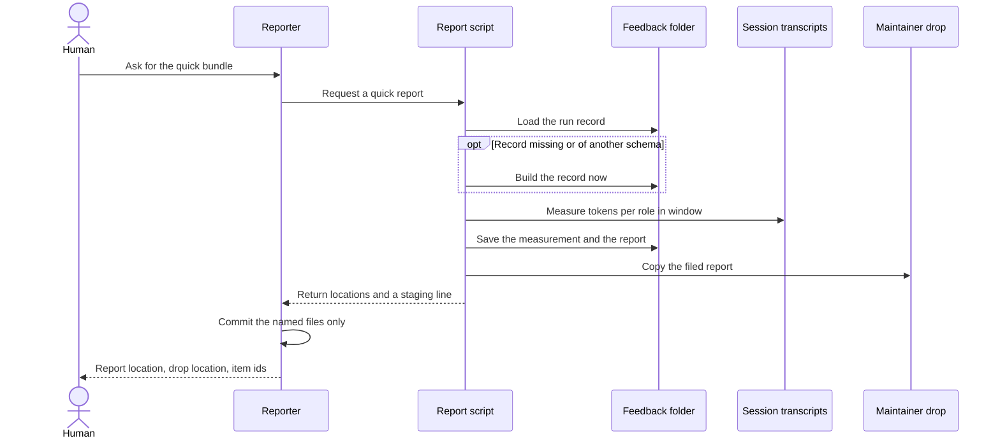

Sources: `skills/feedback/SKILL.md` l.13-19, 58-65;
`scripts/feedback.py` l.341-372 (load or build, measure), l.568-681
(finalize), l.696-701 (`quick`). Probe: a quick report on a scratch repo
produced zero items, a drop copy, and a staging line naming the report, the
run record, the usage file and the anomaly log.

### 5.9 Full field report

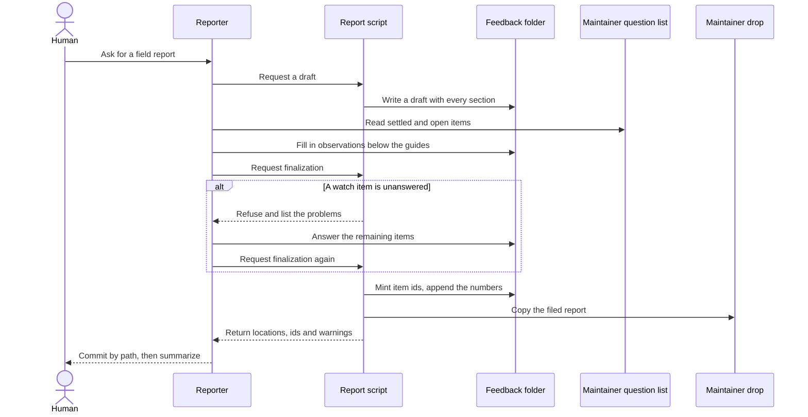

Sources: `skills/feedback/SKILL.md` l.21-65; `scripts/feedback.py`
l.341-442 (scaffold), l.456-484 (watch answers), l.502-549 (ids and the
repro or evidence warning), l.605-615 (refusal), l.636-639 (appendices),
l.647-657 (drop). Nothing is sent over a network. The drop is a directory on
the same machine, read by `tools/ingest_feedback.py`, which is outside this
deliverable.

## 6. Data model

The earlier document said the plugin kept no state. That stopped being true
in 0.3.0. A docs run now leaves a `feedback/` subfolder in the docs
directory, and a filed report also leaves a copy outside the repo.

### 6.1 Contracts between components

| Contract | Producer to consumer | Shape (verified) |
|---|---|---|
| Survey | `repo_survey.py` to skill, agents, `arch_summary.py` | `{root, total_files, total_loc, by_top_dir: {dir: {files, loc, languages}}, manifests: [{path, kind}]}` |
| Coverage | `coverage_check.py` to skill, agent, `arch_summary.py` | `{source_files, mentioned, unmentioned, top_unmentioned: [{path, loc}]}`, at most 25 entries |
| Lint | `mermaid_lint.py` to skill, agent, `arch_summary.py` | text: `path:line: message` lines on stdout, a count on stderr, exit code |
| MANIFEST | DETAIL agent to skill to OVERVIEW agent | `{deliverable, purpose, key_modules[], external_dependencies[], shared_concepts[], cross_observations[]}` in a fenced JSON block |
| Start marker | `arch_summary.py start` to `arch_summary.py write` | `{started_ts, started_at}` |
| Run summary | `arch_summary.py write` to `feedback.py` | section 6.3 |
| Anomaly row | `field_log.py anomaly` to `arch_summary.py` | `{ts, code, detail, source, phase}` |
| Usage | `feedback.py` (through `loop_usage.measure`) to the report | section 6.3 |

### 6.2 State layout on disk (detailed)

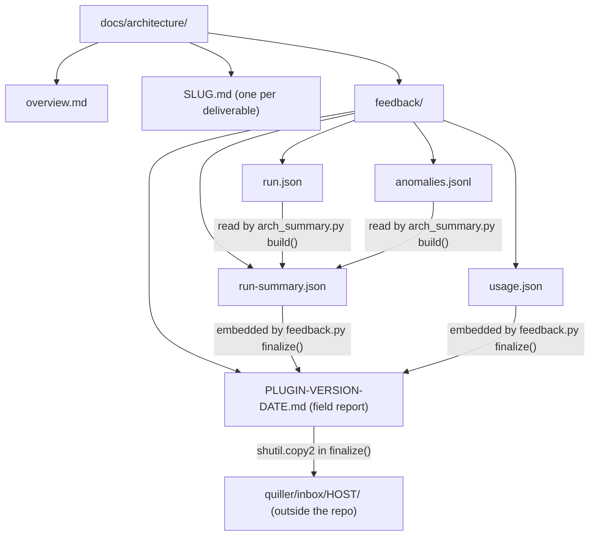

| File | Writer | When |
|---|---|---|
| `overview.md`, `<slug>.md` | `arch-documenter` agents | Stages 3 and 4 |
| `feedback/run.json` | `arch_summary.py start` (l.196-204) | Stage 1 |
| `feedback/anomalies.jsonl` | `field_log.py anomaly` (l.127-149) | any moment of a workaround |
| `feedback/run-summary.json` | `arch_summary.py write` (l.177-188) | Stage 6, or by `feedback.py scaffold` when missing |
| `feedback/usage.json` | `feedback.py scaffold` (l.368-371) | when a report is scaffolded |
| `feedback/<plugin>-<version>-<date>.md` (`PLUGIN-VERSION-DATE.md` in the diagram) | `feedback.py scaffold`, then `finalize` | when a report is filed |
| A second report on the same day | same | suffix `-2`, `-3` (l.392-395) |

Observed in this repo: `docs/architecture/feedback/run.json` exists and is
untracked. It was written by the Stage 1 step of the run that produced this
document.

### 6.3 Data shapes (detailed)

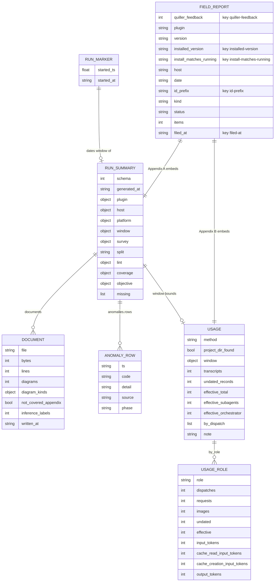

The five front-matter keys of `FIELD_REPORT` that contain a hyphen are drawn
with an underscore and carry the real key as a comment, so the diagram
renders on older Mermaid versions.

Sources: `RUN_MARKER` `scripts/arch_summary.py` l.200-201. `RUN_SUMMARY`
and `DOCUMENT` l.76-81, 142-175. `ANOMALY_ROW` `scripts/field_log.py`
l.141-145. `USAGE` and `USAGE_ROLE` `scripts/loop_usage.py` l.219-259 and
`scripts/feedback.py` l.288-296. `FIELD_REPORT` is the report's front
matter, `scripts/feedback.py` l.398-403 and l.632-634.

Nested objects in `RUN_SUMMARY`: `plugin` is `{name, version, running_from,
installed, install_matches_running}`. `host` is `{repo, loop_dir, git_repo,
loop_dir_ignored}`, where `loop_dir` holds the docs directory. `window` is
`{started_at, ended_at, basis, wall_s}`. `lint` is `{ran, blocks, issues,
by_kind}`. `coverage` is `{source_files, mentioned, unmentioned}` without
the file list.

## 7. State of the architecture

### 7.1 Design decisions and their rationale

- **Prompts are the control plane and scripts are the measurement plane.**
  Everything that needs judgment lives in the three prompt files.
  Everything that must be deterministic is a stdlib Python script. The
  introducing commit (`e8d248f`) calls the survey "deterministic" and the
  validators a "scripted validation loop".
- **The orchestrator never writes content** (`skills/arch-docs/SKILL.md`
  l.7-8). Inference: this keeps each document attributable to one agent,
  which is what makes "re-dispatch the producing agent" possible.
- **MANIFESTs are claims.** Stated in the skill (l.55-56), the agent
  (l.110-112) and as settled decision `s-manifests-are-claims`
  (`FIELD-QUESTIONS.md` l.39).
- **The coverage check always exits 0 and the lint is a hard gate.**
  Settled as `s-coverage-is-advisory` (l.37). The lint's heuristic nature is
  settled as `s-lint-is-heuristic` (l.36): "a full render check was not
  adopted".
- **Two diagram classes** (0.2.0). The rationale is documented, not
  inferred. Commit `949110b` records that a shipped sequence diagram failed
  to render because of a semicolon in a note, that 115 aliases carried
  quotes, and that the lint gained checks for both.
- **A start marker at Stage 1** (0.3.0). Documented in the "As built" table
  of `docs/proposal-agent-feedback-process.md` (l.391): "arch-docs has no
  loop state to date a run from."
- **The run record is re-measured, not logged.** `arch_summary.py write`
  runs the survey, the lint and the coverage check again. Inference: this
  spares the orchestrator from passing numbers around and makes the record
  independent of what the orchestrator remembers. The cost is in 7.2.
- **Counts only.** The record carries no source path and no document text
  (`scripts/arch_summary.py` l.16-17). Lint issues are reduced to kinds
  (l.95-100). Anomaly text has the home directory folded to a tilde
  (`scripts/field_log.py` l.65-72). Rationale stated in the code: the
  summary "leaves the host repo inside a field report".
- **Shared scripts are mirrored, not imported from a common package.**
  Inference: each plugin is installed and cached on its own, so each must be
  self-contained. `feedback.py` is written to be identical everywhere and to
  take its behavior from the file beside it (l.27-29, 96-102).
- **Feedback is an invitation, never a gate** (`skills/arch-docs/SKILL.md`
  l.82, `skills/feedback/SKILL.md` l.70-71).
- **Regenerate, do not hand-edit** (`s-regenerate-not-hand-edit`,
  `FIELD-QUESTIONS.md` l.40). This document is an instance of that rule.
- **`model: inherit`** (`s-documenter-inherits`, l.38, and
  `README.md` l.55-60).

### 7.2 Coupling and accumulated debt

**The survey and the coverage check disagree on what a source file is.**
Verified by parsing both files. `EXCLUDE` is identical (18 names).
`SOURCE_EXT` is not: the survey has 26 extensions
(`scripts/repo_survey.py` l.13-16) and the coverage check has 20
(`scripts/coverage_check.py` l.14-16). The six the coverage check lacks are
`.css`, `.h`, `.html`, `.scss`, `.sh` and `.sql`. What follows:

- A file of those six kinds counts toward a deliverable's size and can
  decide the split, but it can never appear as a coverage gap. A documenter
  that ignores every shell script still gets a perfect coverage score.
- The two totals are not comparable. On this repo the survey counts 55
  files and the coverage check counts 37. The difference is the 18 shell
  scripts (1,768 LOC), all in the two sibling plugins.
- Since 0.3.0 the mismatch is written into every run record.
  `arch_summary.py` stores the survey's `total_files` beside the coverage
  check's `source_files` (l.154-161) and prints both in the report's glance.
  Probe: a scratch repo with one Python file and one shell script produced
  "Survey: 2 source files" and "Coverage: 1/1 source files mentioned" in the
  same record.
- The 20-extension set is identical to `SOURCE_EXT` in
  `review-loop-tools/scripts/hotspots.py` l.12. Inference: the coverage set
  was copied from there and the survey set was widened on its own.
- Known to the maintainer: `BACKLOG.md` l.28-35 and watch item
  `w-coverage-blind-spot`. The stated plan is to wait for a field
  measurement before changing anything.

**Both scripts are blind to prompts and configuration.** Neither counts
`.md`, `.json`, `.yaml` or `.toml`, and both prune dot-directories. For this
plugin that hides 6 of 14 files, including all three prompt files that hold
the control logic. The dispatch that produced this document asked for the
markdown files to be checked by hand for that reason.

**Two different fallbacks for the repo root.** `arch_summary.repo_root`
falls back to the current directory (l.37). `feedback.repo_root` falls back
to the parent of the directory it was given (l.112). For a loop directory at
the top of a repo the two agree. For `docs/architecture` they do not. Probe,
in a directory that is not a git repo: the report's front matter said `host:
docs`, the id prefix ended in `-docs`, and the drop would be
`quiller/inbox/docs/`. The same value is passed to the token measurement, so
it looks for transcripts of a repo named after the `docs` folder. Inside a
git repo both functions ask git and agree.

**The token measurement trusts the git top-level path.**
`feedback.measure_usage` passes the repo root to `loop_usage.measure`
(l.292), which derives the transcript directory from that path.
`loop_usage.py` has a `--dir` override, and `feedback.py` exposes only
`--since` and `--until`. Inference, from the storage rule in the
`loop_usage.py` docstring and not tested against the host: a session started
from any path other than the git top-level stores its transcripts elsewhere,
and the report then says "no transcript directory for this repo". Observed:
the session that produced this document was started from a path different
from the repository root.

**The split is guessed from the folder, not recorded from the decision.**
`arch_summary.py` l.136-138 labels the run by counting top-level `.md`
files. Two detail documents with no `overview.md` are reported as "overview
+ 2 detail document(s)". A stale or unrelated markdown file in the docs
directory is counted as a document. The orchestrator's actual decision and
its reason exist only in the Stage 6 text shown to the human.

**The run window ends at the last document write.** `ended` is the newest
document's modification time (l.123). Validation, fix dispatches that change
no file, the report and the summary itself fall outside it. `feedback.py`
adds 120 seconds to the end when measuring usage (l.290-291). Probe: when
the marker is newer than every document, `wall_s` is null.

**The record holds the final lint state only.** A run that needed two fix
passes and a run that was clean at once produce the same `lint` block.

**Two ways of finding a mermaid block.** The lint accepts indented fences
(`scripts/mermaid_lint.py` l.85-86). The summary's diagram counter requires
the fence at the start of a line and a first token of letters, digits and
hyphens (`scripts/arch_summary.py` l.74). A block inside a list item, or one
that opens with an init directive, is linted but not counted, so
`documents[].diagrams` and `lint.blocks` can differ.

**Most of the mirrored code is dead weight here.** 15 of 21 functions in
`run_summary.py` are unreachable in this plugin. So are the dispatch half of
`field_log.py` and 26 of its 27 anomaly codes. This is the price of byte
identity and it is a deliberate one. The practical consequence is release
churn: 0.3.1 exists only because two mirrored files changed. The changes
were a new anomaly code for `mutate.py` and two hygiene kinds, neither of
which this plugin can reach (`git diff aed07f8..5e5dfd9 -- arch-docs-tools`).
Inference: the version bump was forced by the identity rule together with
the version-keyed cache.

**Loop vocabulary leaks into this plugin's user-facing text.** The feedback
skill says the report covers "verdicts" (l.3), never quotes "finding
claims" (l.8), and tells the agent to answer "from the loop's files" (l.39).
`README.md` l.71-72 lists "the verdicts and counts". A docs run has no
verdicts, findings or loop. The record's `host.loop_dir` and
`host.loop_dir_ignored` keys hold the docs directory.

**The start marker is never staged.** The staging list printed by
`finalize` names the report, `run-summary.json`, `usage.json`,
`anomalies.jsonl` and `dispatches.jsonl` (`scripts/feedback.py` l.658-660).
`run.json` is not among them. Observed: it sits untracked in this repo.
Inference: harmless, since the summary copies the start time, but a host
with a strict clean-tree rule will see an untracked file after every run.

**`docs/architecture` is hard-coded in every command line.** Nine commands
across the two skills name it (five in the docs skill, four in the feedback
skill), although `skills/arch-docs/SKILL.md` l.11-12
allows another location. The feedback skill tells the agent to substitute
the real directory (l.28). The docs skill does not.

**Lint blind spots and false positives**, all confirmed by probe:

| Input | Result | Kind |
|---|---|---|
| `actor U as "Quoted"` | not flagged, only `participant` is checked (l.53) | missed |
| Semicolon in a `loop`, `alt` or `opt` label | not flagged, only notes and messages are checked (l.39-40) | missed |
| Unquoted diamond label with a semicolon | not flagged, only square brackets are checked (l.62) | missed |
| Edge label with parentheses | not flagged | missed |
| Cylinder node `[(Database)]` | flagged as "needs quotes" | false positive |
| Unmatched parenthesis in sequence text | flagged as unbalanced, reported at the block's first line | arguable |
| `architecture-beta`, `gitGraph`, an init directive | flagged as unknown type | false positive |

**Coverage "mentioned" is a basename substring.** A single mention of
`feedback.py` covers every `feedback.py` in the tree. This matters in this
repo, where the four mirrored scripts exist three times each. A mention in
any one plugin's document marks all three copies as covered. The corpus
pools every document in the folder, so a file mentioned only in another
deliverable's document counts as covered.

**Thresholds live only in prose.** About 15K, 1K and 50K LOC appear in the
skill and nowhere in code. The survey does not say which rule fired.

**The coverage loop is uncapped and has no mandated re-check.**

**No enforcement hooks.** The write boundary and the foreground-dispatch
rule are prompt-only. A second consequence is recorded in `BACKLOG.md`
l.46-47: with no hooks there is no per-dispatch timing, so the run record
carries wall-clock for the whole run only.

**Test coverage is indirect or absent.** `repo_survey.py`,
`mermaid_lint.py`, `coverage_check.py` and `arch_summary.py` have no test in
the repo. `review-loop-tools/tests/feedback_selftest.py` exercises the four
mirrored scripts, but it accepts only the two loop plugins (its usage line,
l.6). Byte identity carries those results over for shared code paths. The
paths that exist only here are untested: `summary_module()` choosing
`arch_summary`, the `objective` lines in the glance, and a docs directory
two levels below the repo root. The repo-root finding above is in exactly
that untested area.

**`FIELD-QUESTIONS.md` is a parsed file with a free-text look.** A heading
renamed or a bullet reformatted yields zero watch items and a report that
finalizes with nothing to answer.

**No field record yet.** The generated section of `FIELD-QUESTIONS.md` is
empty and `docs/inbox/dispositions.json` holds no item for this plugin. The
three script defects known at 0.3.0 were found by the maintainer's own
session, not by a field report
(`docs/proposal-agent-feedback-process.md` l.398-402).

### 7.3 Vestigial code

No file in the deliverable is unreferenced. Within files:

- `arch_summary.build` and `arch_summary.write` accept a `stop_note`
  parameter and never use it (l.104, 177-178). Inference: kept so the
  signature matches `run_summary.write`, which `feedback.py` calls through
  the same name.
- `feedback.py questions` is referenced by no prompt. Inference: a
  maintainer or debugging aid.
- `loop_usage.py`'s command line is referenced by no prompt in this plugin.
- The unused halves of the mirrored scripts (sections 3.10 and 3.11) are
  vestigial from this plugin's point of view and live from the repo's.

## 8. What changed since the previous version of this document

The previous version was written against 0.1.0 and 0.2.0. These statements
in it no longer hold and have been replaced:

| Earlier statement | Now |
|---|---|
| Version `0.1.0` | `0.3.1` |
| Seven files, three Python scripts | 14 files, eight Python scripts |
| One commit in the plugin's history | Four |
| `mermaid_lint.py` 84 lines, `coverage_check.py` 58 lines | 103 and 61 |
| The survey reports this deliverable as 3 files, 206 LOC | 8 files, 2,197 LOC |
| Every `SKILL.md` and agent line reference | All moved, all re-read |
| The lint balances brackets "regardless of diagram type" | `erDiagram` relationship lines are exempt since 0.2.0 |
| The lint's check list had four items | Six: semicolons in sequence text and quoted participant aliases were added in 0.2.0 |
| The agent prompt says "flowchart/architecture" at l.32 | That text is gone. The diagram rules were rewritten in 0.2.0 |
| The agent mandates 3-5 sequence diagrams | "more when the dispatch asks for scenario coverage" |
| No persistent state, no data model, no ER diagram | A `feedback/` folder with five kinds of file. Section 6 |
| `HANDOFF.md` ritual 2 lists no arch-docs script | It lists the four mirrored scripts |
| Untouched since creation, no `BACKLOG.md` entry | Three releases since, and three `BACKLOG.md` entries name this plugin |
| The coverage corpus is every `.md` under the docs directory | Directories named `feedback` are pruned |
| Which plugin cache directory ran | Removed. Not re-verifiable, and it quoted a home-directory path |
| The top-level diagram mixed file names with role descriptions | Split into one high-level and two detailed diagrams |
| A separate sequence diagram for the subsystem split | Folded into 5.2, since the flow is the same |

## Not covered

Coverage check for this deliverable, run with `docs/architecture` and the
deliverable root: 8 source files, 8 mentioned, 0 unmentioned. The check
counts only the eight Python files. The six other files were checked by hand
and each has its own inventory entry (sections 3.1 to 3.4, 3.14, 3.15).

Deliberately outside scope, with reasons:

- **Full behavior of the four mirrored scripts.** Their loop-specific
  functions are listed by name in sections 3.10 to 3.13 and not described.
  They are unreachable in this plugin. They belong to the document of the
  authoring plugin, `review-loop-tools.md`, which was not checked from here.
- **`tools/ingest_feedback.py` and `tools/render_field_questions.py`.** They
  live at the repo root, are not shipped in any plugin, and are mentioned
  here only as the reader of the drop and the writer of one section of
  `FIELD-QUESTIONS.md`.
- **`review-loop-tools/tests/feedback_selftest.py`.** Mentioned only to
  state what it does not cover for this plugin.
- **Claude Code host behavior.** Plugin discovery, variable expansion,
  subagent scheduling, the format of the installed-plugins registry and the
  transcript storage layout are taken from what the scripts assume about
  them. None was tested against the host.
- **Repo-level `HANDOFF.md`, `BACKLOG.md`, `CONTROLS.md`.** Cited only where
  they name this plugin.
