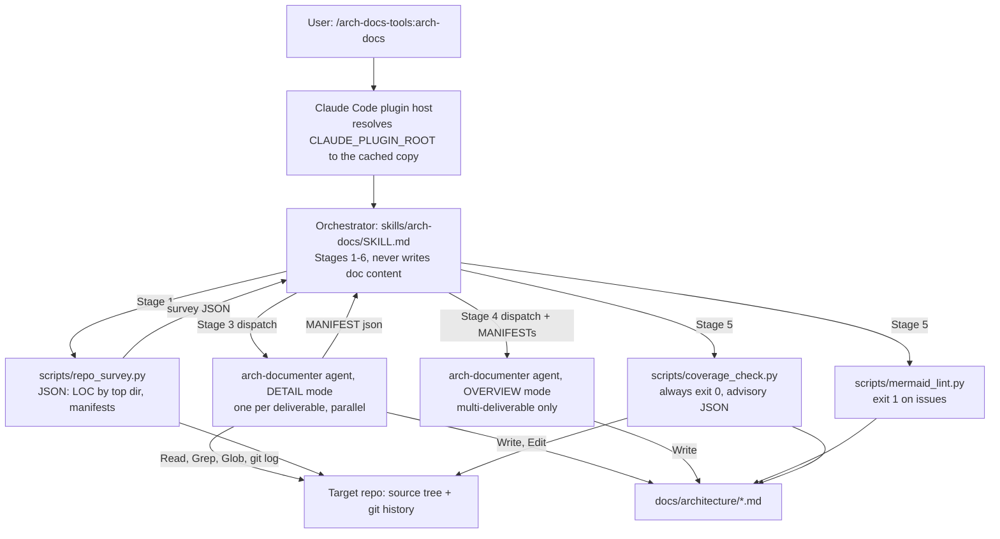
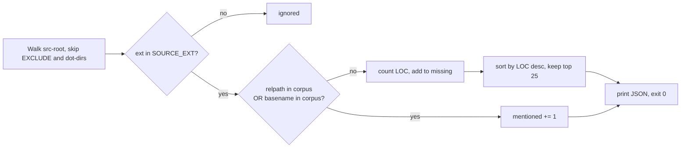
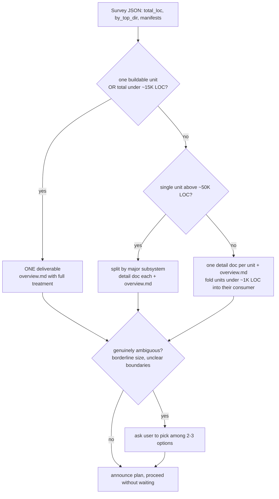
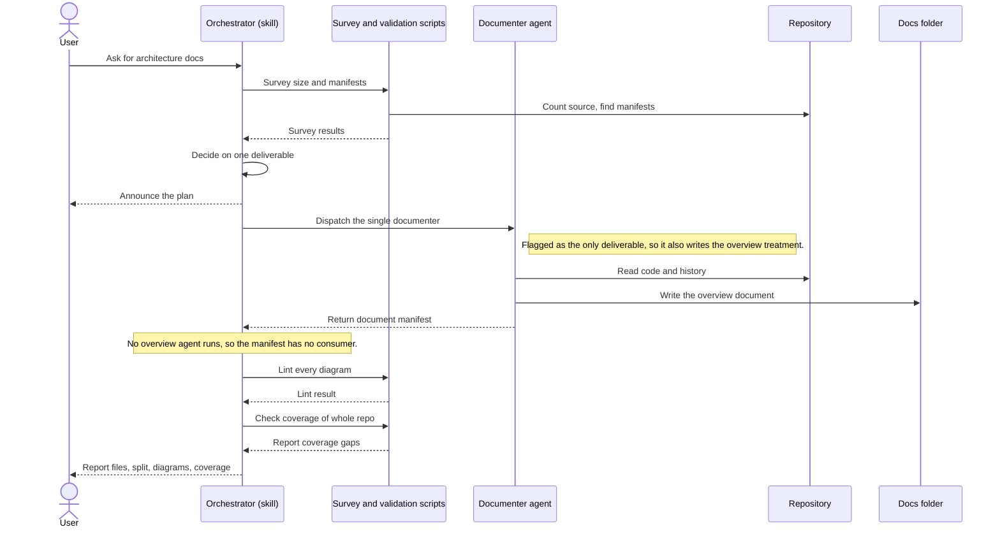
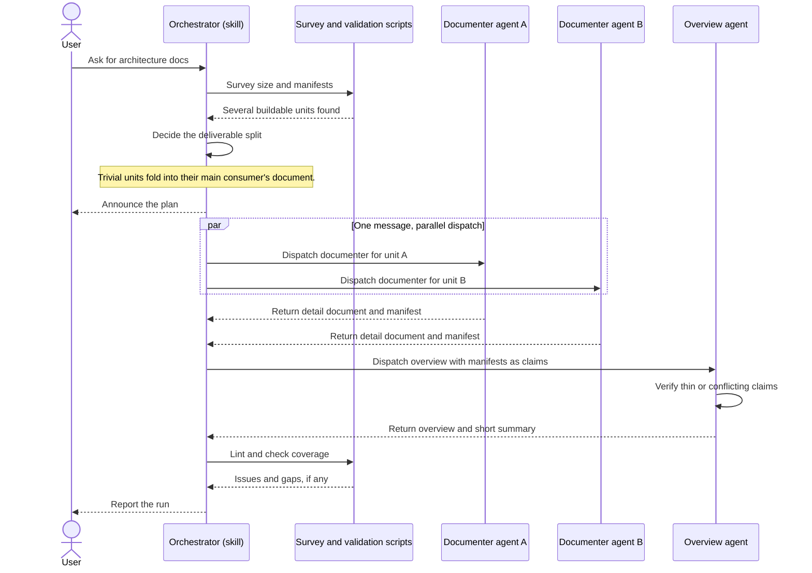
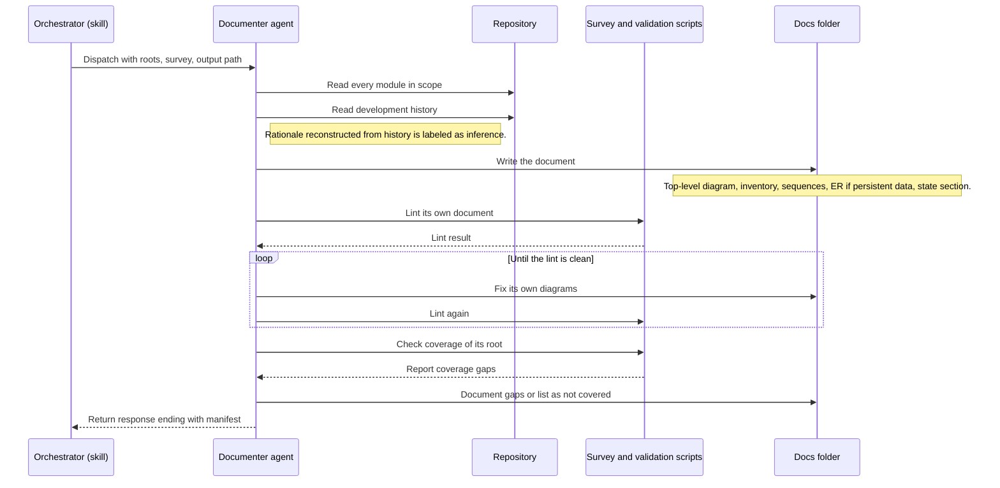
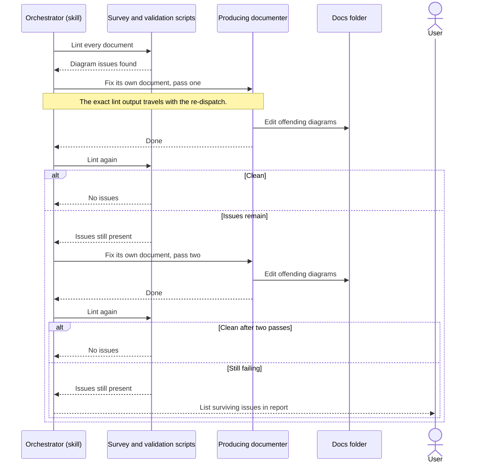
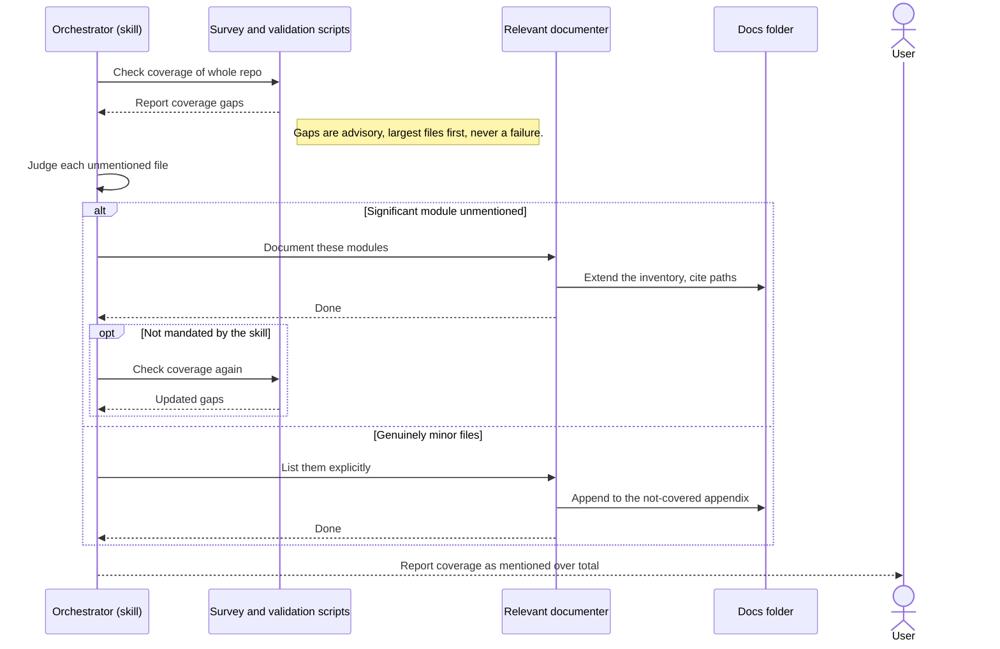
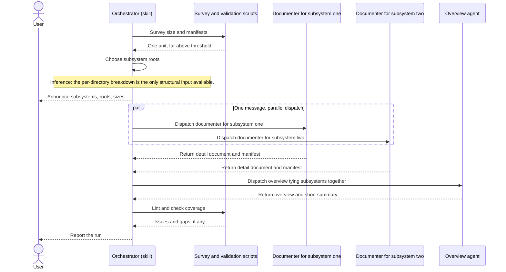
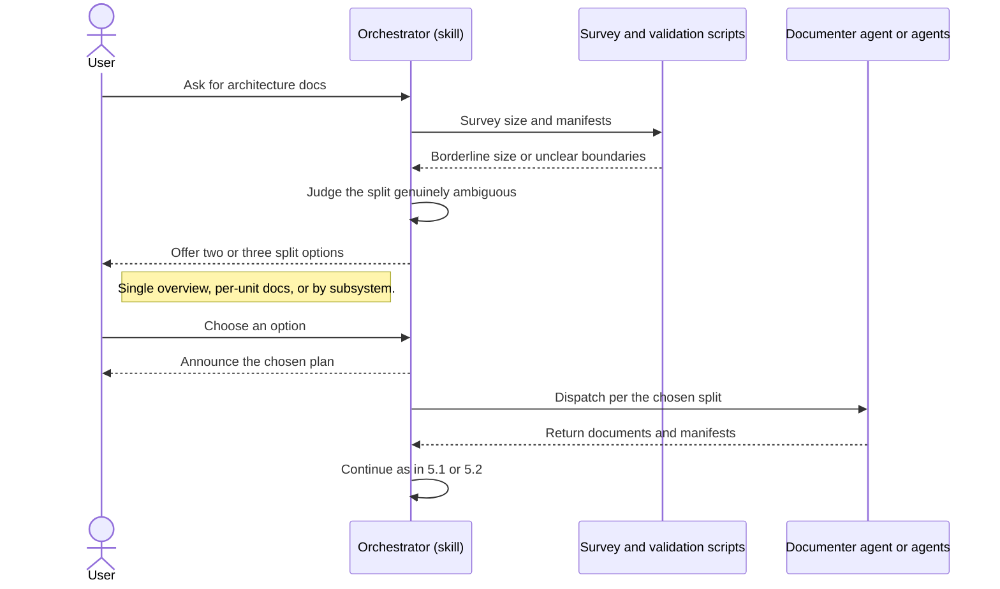

# arch-docs-tools — architecture

Deliverable: `arch-docs-tools` (Claude Code plugin, version `0.1.0`).
Root: `arch-docs-tools/` in the `quiller` marketplace repo. Sibling
deliverables `review-loop-tools` and `qa-loop-tools` are documented
separately; the cross-plugin picture lives in `overview.md`.

Note on provenance: this document was produced by the plugin it describes.
Where that run itself exposed a behavior (for example, how
`${CLAUDE_PLUGIN_ROOT}` resolved), it is cited as observed evidence.

## 1. What it is

`arch-docs-tools` produces architecture documentation for an arbitrary
repository. It is a *prompt-orchestrated* system: the control logic is two
markdown prompt files (a skill and a sub-agent definition) and three
stdlib-only Python scripts that give the prompts deterministic measurements
and checks. There is no server, database, or network dependency; the only
"external" dependencies are the Claude Code plugin host, `python3`, and
`git` (used by the documenter for history).

Files in the deliverable (all seven, from `git ls-files arch-docs-tools`):

| Path | Role | Kind |
|---|---|---|
| `arch-docs-tools/.claude-plugin/plugin.json` | Plugin manifest (name, version, description, keywords, license) | JSON |
| `arch-docs-tools/skills/arch-docs/SKILL.md` | Orchestrator prompt: six-stage pipeline, split rules, validation loop | Prompt (control logic) |
| `arch-docs-tools/agents/arch-documenter.md` | Sub-agent prompt: DETAIL and OVERVIEW modes, accuracy rules, manifest contract | Prompt (control logic) |
| `arch-docs-tools/scripts/repo_survey.py` | Size / language / buildable-unit survey, JSON to stdout | Python (64 lines) |
| `arch-docs-tools/scripts/mermaid_lint.py` | Heuristic linter for ```` ```mermaid ```` blocks in markdown | Python (84 lines) |
| `arch-docs-tools/scripts/coverage_check.py` | Cross-check docs folder against source tree, JSON to stdout | Python (58 lines) |
| `arch-docs-tools/README.md` | User-facing description of the pipeline and accuracy contract | Docs |

Repo-level wiring: `.claude-plugin/marketplace.json` lists the plugin with
`"source": "./arch-docs-tools"`; the repo `README.md` has a one-row table
entry. Both were added in the same commit that created the plugin
(`e8d248f`, 2026-08-15). That is the plugin's *only* commit: `git log --
arch-docs-tools` shows one entry.

## 2. Top-level architecture



Data flow in one sentence: the orchestrator turns a survey JSON into a
deliverable plan, each DETAIL agent turns source plus `git log` into one
markdown doc and a MANIFEST, the OVERVIEW agent turns the MANIFESTs (treated
as claims) into `overview.md`, and the two validators close the loop by
feeding issues and gaps back to the producing agent.

### Runtime resolution

`SKILL.md` references every script as
`${CLAUDE_PLUGIN_ROOT}/scripts/<name>.py` (lines 16, 44-45, 56, 60). In the
run that produced this document, that variable resolved to
`~/.claude/plugins/cache/quiller/arch-docs-tools/0.1.0/`. `diff -r` between
that cache directory and the repo's `arch-docs-tools/` shows a single
difference: a host-managed `.in_use` marker present only in the cache. The
repo copy is therefore exactly what runs.

## 3. Module inventory

### 3.1 Plugin manifest — `arch-docs-tools/.claude-plugin/plugin.json`

- Purpose: declares the plugin to the host. Fields: `name`
  (`arch-docs-tools`), `version` (`0.1.0`), `description`, `author`,
  `keywords`, `license` (`MIT`). No `hooks`, `commands`, or `mcpServers`
  keys — the plugin ships nothing but the skill, the agent, and scripts.
- Interaction: HANDOFF.md ritual 1 states the plugin cache is keyed by this
  `version`; an unbumped version means installed users never receive a
  change. The marketplace entry in `.claude-plugin/marketplace.json` carries
  no version by design (same ritual).

### 3.2 Orchestrator skill — `arch-docs-tools/skills/arch-docs/SKILL.md`

- Purpose: the six-stage pipeline. Frontmatter `name: arch-docs`; the
  description doubles as the invocation trigger ("architecture docs, a
  codebase overview, or system documentation").
- Contract with itself (lines 5-12): dispatches `arch-documenter` subagents
  in the foreground, decides the split, runs the scripts, *never writes
  architecture content itself*, never modifies source, and must not end a
  turn with a promised-but-unmade dispatch. Output goes to
  `docs/architecture/` unless the user names another location.
- Stages, each verified against the file:
  1. **Survey** (l.14-21): run `repo_survey.py`, skim README/docs, identify
     candidate deliverables from `manifests` and `by_top_dir`; ignore
     vendored/generated code.
  2. **Split decision** (l.23-35): rules in section 4 below; announce the
     plan (deliverables, roots, LOC, files to produce); ask the user only
     when "genuinely ambiguous (borderline size, unclear boundaries)",
     offering 2-3 options; otherwise proceed without waiting.
  3. **Detail documents** (l.37-46): one DETAIL dispatch per deliverable,
     *all in a single message* so they run in parallel. Payload: name, slug,
     root path(s), survey JSON, output path, whether it is the only
     deliverable, and both validator script paths. Collect each MANIFEST.
  4. **Overview** (l.48-52, multi-deliverable only): one OVERVIEW dispatch
     with all MANIFESTs labeled as claims, the survey JSON, detail doc paths,
     output `docs/architecture/overview.md`, and the lint script path.
  5. **Validate** (l.54-64): `mermaid_lint.py docs/architecture/*.md` —
     any issue goes back to the producing agent with the exact lint output;
     "Repeat once; if issues survive two fix passes, list them in your
     report rather than looping." Then `coverage_check.py docs/architecture
     <repo-root>` — the orchestrator *judges* gaps: significant modules go
     back to the relevant agent; minor files may stay out but each detail
     doc must carry a "Not covered" appendix.
  6. **Report** (l.66-71): files written, split used and why, diagram
     count, coverage mentioned/total, validation failures, next steps.
- Design patterns: pipeline with explicit stage gates; fan-out/fan-in
  (parallel DETAIL agents, MANIFESTs fanned into OVERVIEW); bounded
  retry (lint, two passes); human-in-the-loop only on an ambiguity
  predicate.
- Dependencies: the three scripts, the `arch-documenter` agent, the host's
  `${CLAUDE_PLUGIN_ROOT}` expansion and subagent dispatch.

### 3.3 Documenter agent — `arch-docs-tools/agents/arch-documenter.md`

- Purpose: writes one document per dispatch. Frontmatter: `tools: Read,
  Grep, Glob, Bash, Write, Edit`; `model: inherit` (the README explains
  there is no adversarial pairing, so no pinned second model).
- Public interface (what a dispatch must supply and what comes back):
  - DETAIL input (l.39-40): name, slug, root path(s), survey stats, output
    file path, script paths, and the "only deliverable" flag.
  - DETAIL output: the doc with the five mandated sections (top-level
    diagram, module inventory, 3-5 sequence diagrams, ER diagram if a
    persistent model exists, "State of the architecture"); the overview
    treatment prepended when it is the only deliverable; and a fenced
    ```` ```json ```` MANIFEST with six fixed keys (`deliverable`,
    `purpose`, `key_modules`, `external_dependencies`, `shared_concepts`,
    `cross_observations`) as the *last* thing in the response (l.60-72).
  - OVERVIEW input (l.76-77): all MANIFESTs, survey stats, detail doc
    paths, output path. Output: the shared doc (relationships, shared
    concepts with source-of-truth owner, system-context diagram,
    cross-deliverable inconsistencies, links) and a 2-3 line prose summary,
    no manifest (l.90-91).
- Accuracy rules (l.13-28) are the agent's hard constraints: source-verified
  claims only, cited paths, `Inference:` labels, self-run coverage check
  against the deliverable root, self-run lint with all issues fixed before
  returning. The write boundary ("only ever WRITE files inside the docs
  output directory") is *prompt-enforced only* — the tool list includes
  `Write` and `Edit` with no path restriction, and the plugin ships no hook.
- Dependencies: `git` (history via `git log -- <paths>`), the two validator
  scripts, the repo under documentation.
- Interaction: the MANIFEST is the only structured channel from DETAIL
  agents to the OVERVIEW agent; the orchestrator relays it verbatim.

### 3.4 `arch-docs-tools/scripts/repo_survey.py`

- Interface: `repo_survey.py [root]` (default `.`). Prints one JSON object:
  `root` (absolute), `total_files`, `total_loc`, `by_top_dir` (per
  top-level directory: `files`, `loc`, `languages` as ext to LOC; root-level
  files key as `"."`), `manifests` (list of `{path, kind}`). Exit 0.
- What it counts (verified l.10-22, 45-58): files whose lowercase extension
  is in `SOURCE_EXT` — 26 extensions including `.h`, `.sql`, `.sh`, `.css`,
  `.scss`, `.html` in addition to the usual application languages. LOC is a
  raw line count of the file opened in binary mode (blank lines and comments
  included). Unreadable files are skipped silently.
- What it skips (l.10-12, 29-30): directories in `EXCLUDE` (`.git`,
  `node_modules`, `Pods`, `Carthage`, `build`, `.build`, `dist`, `out`,
  `vendor`, `DerivedData`, `.next`, `.venv`, `venv`, `__pycache__`,
  `.qa-loop`, `.review-loop`, `coverage`, `target`) plus *any* directory
  whose name starts with `.` — so `.claude-plugin/` and `.github/` are
  invisible. Markdown and JSON are not source extensions, so for a plugin
  repo like this one the survey sees only the Python (it reports this
  deliverable as 3 files / 206 LOC and the prompt files not at all).
- Manifest detection (l.17-22, 34-44): filenames in `MANIFESTS`
  (`package.json`, `pyproject.toml`, `setup.py`, `go.mod`, `Cargo.toml`,
  `Package.swift`, `pom.xml`, `build.gradle`, `build.gradle.kts`,
  `Gemfile`, `composer.json`, `CMakeLists.txt`) when the containing
  directory is at depth ≤ 3 from root. `.xcodeproj` / `.xcworkspace`
  *directories* listed in a directory of depth ≤ 3 are recorded as
  `kind: "xcode"` and pruned from the walk; deeper ones are neither
  recorded nor pruned.
- Patterns: single pass `os.walk` with in-place `dirnames` pruning; pure
  stdlib; no git dependency.
- Consumers: the orchestrator (split decision) and, via the dispatch
  payload, every documenter.

### 3.5 `arch-docs-tools/scripts/mermaid_lint.py`

- Interface: `mermaid_lint.py <file.md> [...]`. Issues one per line to
  stdout; a summary `mermaid_lint: N block(s), M issue(s)` to stderr. Exit
  1 if any issue, 2 on missing arguments, else 0.
- Block extraction (l.64-76): a line whose stripped form starts with
  ```` ```mermaid ```` opens a block; the next line whose stripped form
  starts with ```` ``` ```` closes it. Indented fences are accepted. An
  unclosed fence at EOF is an issue.
- Checks per block (`lint_block`, l.20-54), in order:
  1. Empty block (only blank lines).
  2. Diagram type: the first non-blank line must `startswith` one of 14
     known prefixes (`flowchart`, `graph`, `sequenceDiagram`, `erDiagram`,
     `classDiagram`, `stateDiagram-v2`, `stateDiagram`, `C4Context`,
     `journey`, `gantt`, `pie`, `mindmap`, `timeline`, `quadrantChart`).
     Consequences verified by reading: `architecture-beta`, `gitGraph`,
     `C4Container`, `xychart-beta`, and any block that opens with a
     `%%{init}` directive or YAML frontmatter are reported as unknown.
  3. Bracket balance: after `strip_quoted` replaces every `"..."` with
     `""`, the counts of `()`, `[]`, `{}` are summed across the *whole
     block* regardless of diagram type. A sequence-diagram message with an
     unmatched parenthesis is therefore an issue (observed in a probe run).
  4. Flowcharts only (`flowchart` / `graph`): `subgraph` count must equal
     the count of lines that are exactly `end`; and every `[label]` whose
     content contains any of `( ) ; |` is reported as "needs quotes". The
     regex excludes labels containing `"`, so quoted labels pass. Labels in
     other shapes (`{...}`, `(...)`) and edge labels `|...|` are not checked.
- What it does not do (docstring, l.2-7): it embeds no renderer; it is
  explicitly heuristic.
- Consumers: the orchestrator (Stage 5, all docs) and each documenter
  (self-check on its own file).

### 3.6 `arch-docs-tools/scripts/coverage_check.py`

- Interface: `coverage_check.py <docs-dir> <src-root>`; exactly two args
  or exit 2. Prints JSON `{source_files, mentioned, unmentioned,
  top_unmentioned: [{path, loc}] }`. **Always exits 0** — the docstring
  says the orchestrator judges the gaps.
- Corpus (l.24-30): every `.md` under `docs-dir`, recursively, concatenated
  into one string. Mentions are therefore pooled across *all* docs in the
  folder, not attributed to the doc for a given deliverable.
- Source set (l.11-16, 33-37): same `EXCLUDE` set and dot-directory rule
  as the survey, but a *narrower* `SOURCE_EXT` of 20 extensions — `.h`,
  `.sql`, `.sh`, `.css`, `.scss`, `.html` are absent. Shell scripts that
  the survey counts toward LOC are never reported as unmentioned.
- "Mentioned" decision (l.39-42): a file counts as mentioned if its path
  *relative to `src-root`* appears as a substring of the corpus, **or its
  basename does**. Matching is case-sensitive plain substring. A single
  mention of `index.ts` covers every `index.ts` in the tree; conversely,
  paths cited relative to a different root still match via basename.
- Output ordering (l.50-54): unmentioned files sorted by LOC descending,
  top 25 reported.
- Consumers: orchestrator (Stage 5, with `<repo-root>`) and each DETAIL
  documenter (self-check with its deliverable root).



### 3.7 `arch-docs-tools/README.md`

User-facing narrative of the same five-step pipeline, the accuracy
contract, usage (`/arch-docs-tools:arch-docs`), and the model note. It is
consistent with `SKILL.md` as of `0.1.0`; no behavior is specified here
that the skill lacks.

## 4. Split-decision rules (SKILL.md Stage 2)



All thresholds are prose approximations ("~15K", "~1K", "~50K") in
`SKILL.md` lines 25-31; nothing in the scripts computes or enforces them.
How subsystems are identified in the >50K case is not specified; the only
structural signal the survey provides is `by_top_dir`.

## 5. Sequence diagrams

Participants are roles, not files. `Orchestrator (skill)` is the `arch-docs`
skill running in the main session; `Documenter agent` is an
`arch-documenter` in DETAIL mode; `Overview agent` is one in OVERVIEW mode;
`Survey and validation scripts` stands for the three Python scripts
(`repo_survey.py`, `mermaid_lint.py`, `coverage_check.py`) — which one is
meant follows from the action. `Repository` is the target source tree plus
its git history; `Docs folder` is `docs/architecture/`. Exact commands,
flags, and JSON shapes are in sections 3 and 6.

### 5.1 Single-deliverable run

Sources: path taken when the survey shows one buildable unit or under ~15K
LOC (`SKILL.md` l.25-26). Stage 4 is skipped; the one DETAIL doc is
`overview.md` itself with the overview treatment prepended
(`arch-documenter.md` l.56-58). The MANIFEST is still collected (`SKILL.md`
l.46) but nothing consumes it.



### 5.2 Multi-deliverable run

Sources: path taken when the survey shows several buildable units
(`SKILL.md` l.27-29). All DETAIL dispatches go out in one message (l.39-41)
so they run in parallel; the OVERVIEW dispatch waits for every MANIFEST and
hands them over labeled as claims (l.50-52). Each dispatch also carries the
survey, the output path, and the validator script paths (l.41-45). Detail
documents land in the docs folder as `<slug>.md`; the overview as
`overview.md`.



### 5.3 Inside a DETAIL documenter

Sources: what one agent does between dispatch and return, per
`arch-documenter.md` l.7-72. The self-checks use the script paths carried
in the dispatch, not `${CLAUDE_PLUGIN_ROOT}` (which the agent never
references). The coverage self-check is run against the deliverable root,
not the repo root (l.21-23). The MANIFEST must be the last thing in the
response (l.60-62).



### 5.4 Lint-fix loop, capped at two passes

Sources: `SKILL.md` l.56-59: re-dispatch the producing agent with the exact
lint output; repeat once; if issues survive two fix passes, list them in the
report rather than looping. The lint runs over every markdown file in the
docs folder at once; its issues are `path:line: message` lines and a
non-zero exit code (section 3.5).



### 5.5 Coverage-gap loop and the "Not covered" appendix

Sources: `SKILL.md` l.60-64. The script never fails (always exit 0, section
3.6); the orchestrator classifies each gap. `SKILL.md` does not mandate a
re-run after the fix, and sets no pass cap for this loop (contrast 5.4).
The orchestrator's run uses the repo root, so reported paths are relative
to the repo.



### 5.6 Single unit above ~50K LOC: split by subsystem

Sources: `SKILL.md` l.30-31. The survey's `manifests` shows one buildable
unit but `total_loc` is far above the threshold, so detail docs are cut by
subsystem and `overview.md` ties them together. How the orchestrator picks
subsystems is not specified; `by_top_dir` is the only structural input the
survey offers (Inference: that is what it would use). Each subsystem
dispatch carries that subsystem's directories as its root paths and is not
flagged as the only deliverable.



### 5.7 Ambiguous split: ask the user

Sources: `SKILL.md` l.33-35: only when the split is "genuinely ambiguous
(borderline size, unclear boundaries)" does the orchestrator stop and offer
2-3 options; every other case announces and proceeds. The options are the
three shapes from Stage 2: a single `overview.md`, one doc per unit plus
overview, or docs by subsystem plus overview.



## 6. Data contracts

There is no persistent data model — the plugin keeps no state between
runs, and its only durable output is the markdown in `docs/architecture/`.
No ER diagram is therefore included. Three JSON shapes flow between
components at run time:

| Contract | Producer → Consumer | Shape (verified) |
|---|---|---|
| Survey | `repo_survey.py` → skill → every agent | `{root, total_files, total_loc, by_top_dir: {dir: {files, loc, languages: {ext: loc}}}, manifests: [{path, kind}]}` |
| Coverage | `coverage_check.py` → skill / agent | `{source_files, mentioned, unmentioned, top_unmentioned: [{path, loc}] }` (≤ 25 entries) |
| MANIFEST | DETAIL agent → skill → OVERVIEW agent | `{deliverable, purpose, key_modules[], external_dependencies[], shared_concepts[], cross_observations[]}` in a fenced json block at the end of the agent's response |

The lint script's contract is textual: `path:line: message` lines on
stdout, a count summary on stderr, exit code as the signal.

## 7. State of the architecture

### Design decisions and apparent rationale

- **Prompts are the control plane; scripts are the measurement plane.**
  Everything judgment-shaped (what a deliverable is, which gap matters, how
  to fix a diagram) lives in `SKILL.md` and `arch-documenter.md`; everything
  that must be deterministic (LOC, manifest discovery, bracket balance,
  mention check) is a stdlib Python script. The introducing commit message
  (`e8d248f`) calls the survey "deterministic" and the validators a
  "scripted validation loop", which matches the code. Inference: this
  mirrors the sibling plugins' pattern (prompt loops plus guard/metric
  scripts) and was lifted from it — the commit landed the day after the
  repo was restructured as a multi-plugin marketplace (`b997308`).
- **Orchestrator never writes content.** `SKILL.md` l.7-8. Inference: keeps
  the main-session context small and makes each document attributable to
  one agent, which is what makes "re-dispatch the producing agent" in
  Stage 5 possible.
- **MANIFESTs as claims, not facts.** Both the skill (l.51) and the agent
  (l.77-79) insist the OVERVIEW writer verify manifests against code.
  Inference: a deliberate defense against error compounding across two
  agent hops.
- **`coverage_check.py` always exits 0.** Stated in its docstring as
  intentional: the orchestrator judges. The lint, by contrast, is a hard
  exit-1 gate with a two-pass cap. The asymmetry is consistent with the
  README's framing — Mermaid errors are mechanical, coverage gaps need
  judgment.
- **`model: inherit`.** README section "Model configuration" gives the
  rationale explicitly (no adversarial pairing, so no pinned second model).
- **"Not covered" appendix rather than silence.** Appears in the skill
  (l.62-64), the agent (l.24-25), the README (l.36) and the commit message.
  This is the plugin's one articulated quality principle and it is
  consistently stated across all four places.

### Coupling and accumulated debt

- **Duplicated, diverging constants.** `EXCLUDE` is copied verbatim between
  `repo_survey.py` (l.10-12) and `coverage_check.py` (l.11-13).
  `SOURCE_EXT` is *not* the same: the survey's 26-extension set adds `.h`,
  `.sql`, `.sh`, `.css`, `.scss`, `.html` over the coverage script's 20.
  Effect: survey LOC and coverage totals are not comparable, and shell
  scripts counted toward a deliverable's size are never flagged as
  undocumented (material for `qa-loop-tools`, whose survey LOC includes
  many `.sh` files). The 20-extension set is also byte-identical to
  `review-loop-tools/scripts/hotspots.py` l.12-14 — a third copy. HANDOFF.md
  ritual 2 (shared-script mirroring) does not list any arch-docs script, so
  nothing keeps these in step.
- **Survey blindness to markdown and JSON.** Because `.md` and `.json` are
  not source extensions and dot-directories are pruned, the survey reports
  this plugin as 3 files / 206 LOC and omits `plugin.json`, `SKILL.md`, and
  `agents/*.md` entirely. For prompt-driven repos (this one included) the
  split decision is made on a minority of the logic. The dispatch that
  produced this document had to compensate by instruction. Inference: the
  script was designed for application repos (web + iOS, per README l.16)
  where that blindness is harmless.
- **Lint heuristics vs. agent guidance.** `arch-documenter.md` l.32 says
  "flowchart/architecture", but `architecture-beta` is not in the lint's
  `TYPES` and would be reported as unknown. Any `%%{init}` directive or
  Mermaid frontmatter also fails the type check. Bracket balancing is
  global per block, so ordinary prose with a lone parenthesis in a
  sequence note is a false positive, while a flowchart label using `{}` or
  `()` shapes with special characters is a false negative. These are
  accepted limitations of a renderer-free linter, but they steer authors
  toward a narrow Mermaid subset.
- **Coverage "mentioned" is a basename substring.** Common basenames
  (`index.ts`, `main.py`, `utils.swift`) are covered by any single mention;
  the check is case-sensitive; and because the corpus pools every `.md` in
  the folder, a file mentioned only in a *different* deliverable's doc
  counts as covered for all. The orchestrator's `<repo-root>` run and the
  agent's `<deliverable-root>` run compute different relative paths, but
  basename matching hides the difference.
- **Thresholds live only in prose.** ~15K / ~1K / ~50K appear in `SKILL.md`
  and nowhere in code; they are not configurable and the survey does not
  flag which rule fired. Subsystem identification for the >50K case is
  unspecified.
- **Coverage loop is uncapped and has no mandated re-check** (contrast the
  lint loop's two-pass cap). Termination relies on the orchestrator's
  judgment.
- **Stage 5 hard-codes `docs/architecture`** in its command lines (l.56,
  60) although l.11-12 allows a user-named location; an operator choosing a
  different directory must adapt the commands.
- **No enforcement hooks.** Unlike `review-loop-tools` and `qa-loop-tools`
  (which ship `read_guard.sh`, `subagent_guard.sh`, `loop_guard.sh`, etc.),
  this plugin has no hooks; the write boundary and the "foreground
  dispatch" rule are prompt-only.
- **No tests or smoke fixtures** for the three scripts in the repo. HANDOFF
  ritual 5 (smoke-test in a scratch dir) is a process rule, not an artifact.
- **Untouched since creation.** One commit, no field report, no BACKLOG or
  HANDOFF entries beyond the version line (`HANDOFF.md` l.10). Inference:
  the plugin has not yet been through the measured field-feedback cycle the
  other two plugins are shaped by; this run is among its first real
  exercises, and the survey-blindness point above is the first concrete
  finding.

### Vestigial code

None found. All seven tracked files are referenced by at least one other
file or by the host contract (manifest → host; skill → scripts + agent;
agent → scripts; README → all). The cache-only `.in_use` file is a host
marker, not repo content.

## Not covered

Coverage check for this document (run with `docs/architecture` and the
deliverable root): 3 source files, 3 mentioned, 0 unmentioned. Nothing in
the deliverable is omitted. Items deliberately outside scope:

- Claude Code host behavior (plugin discovery, `${CLAUDE_PLUGIN_ROOT}`
  expansion, subagent scheduling) is described only where this run observed
  it; the host is not part of the repo.
- The repo-level `HANDOFF.md`, `BACKLOG.md`, `CONTROLS.md` are documented
  here only where they reference this plugin (HANDOFF l.10 and rituals 1-2;
  BACKLOG and CONTROLS contain no arch-docs mentions).
