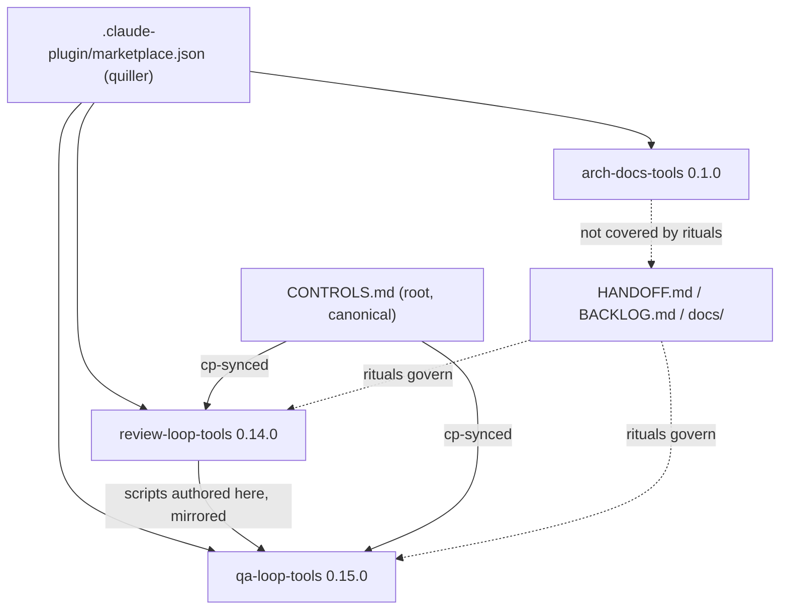
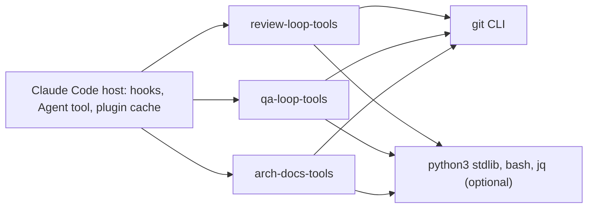
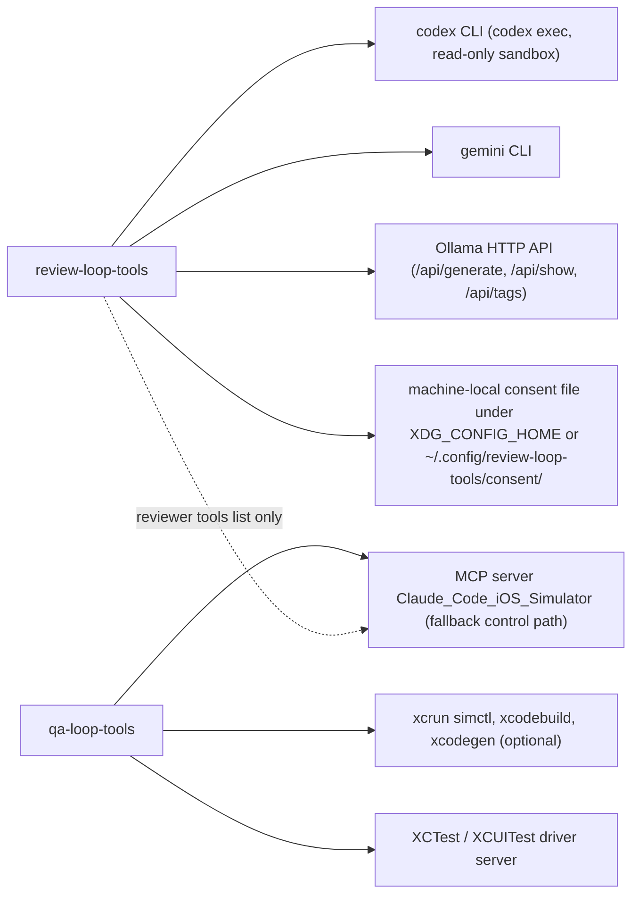
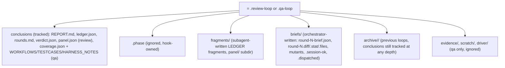
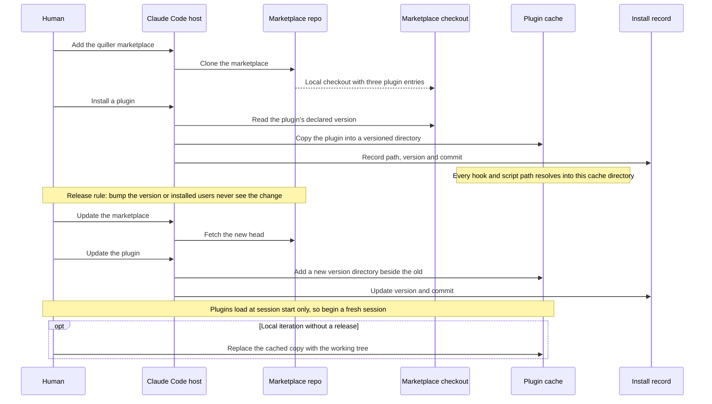
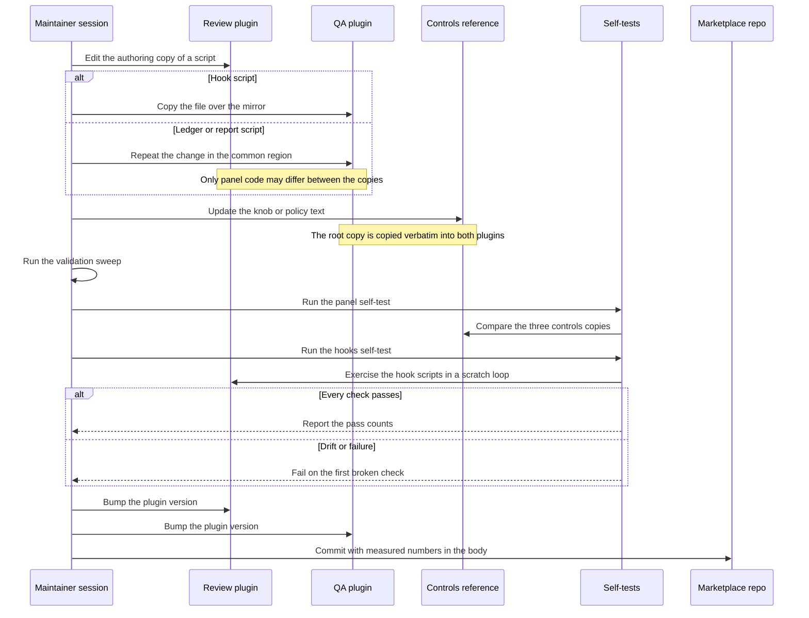
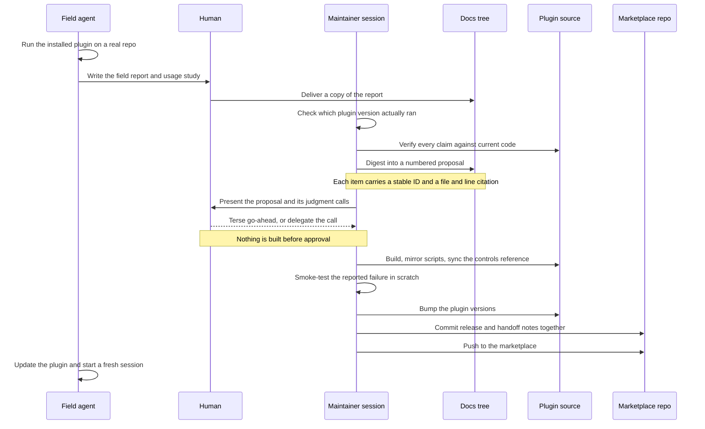
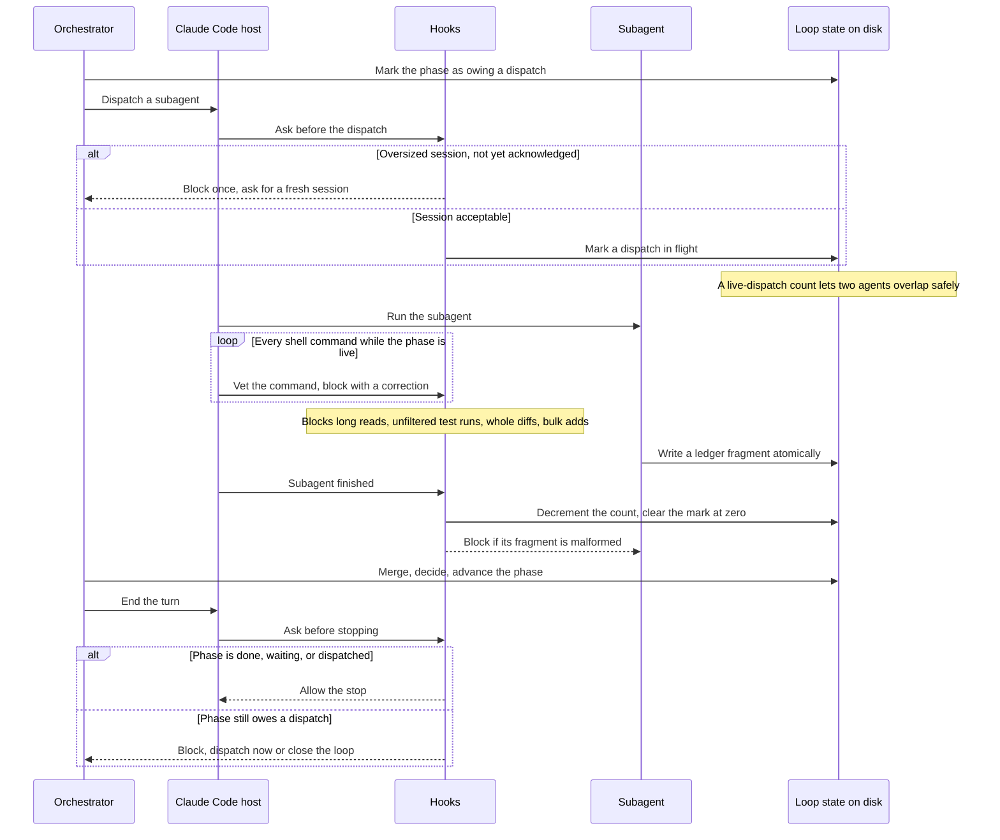
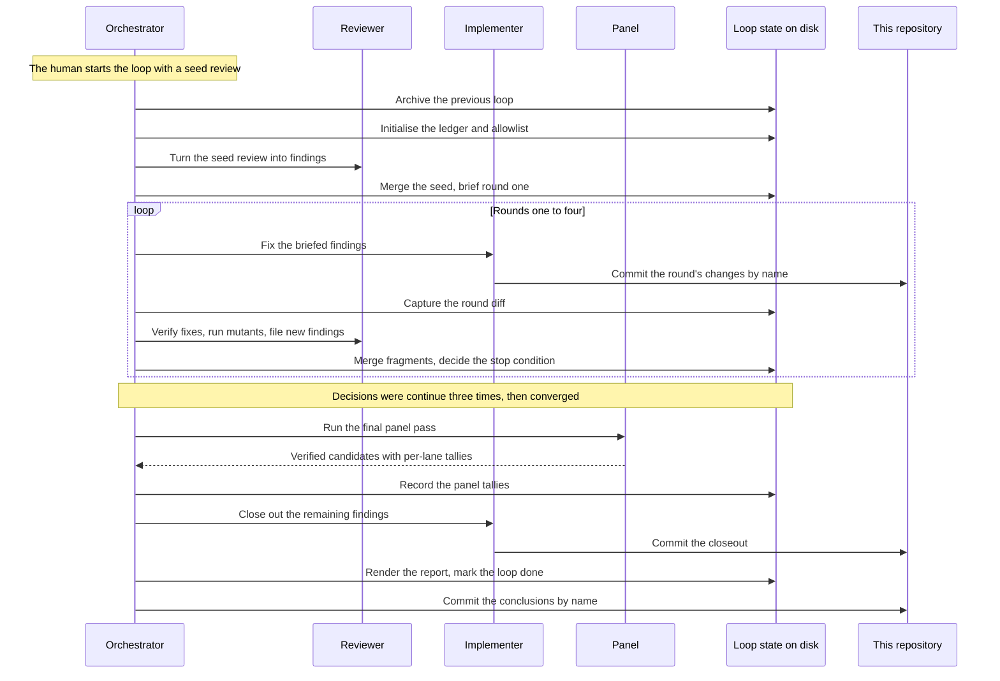
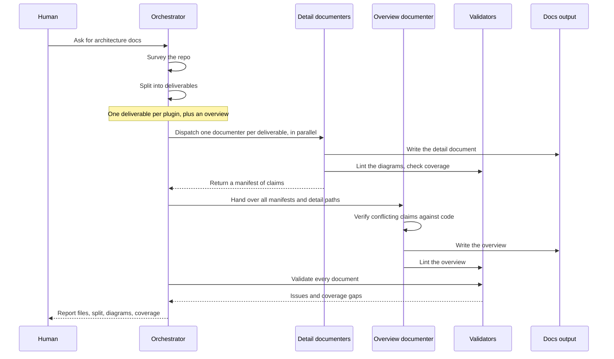

# quiller — architecture overview

*Cross-deliverable overview of the `quiller` Claude Code plugin marketplace
(`/Users/plit/Documents/src/quiller-claude-plugins`). Written 2026-09-13
against `review-loop-tools 0.13.0` / `qa-loop-tools 0.14.0`; revised
2026-09-20 against `review-loop-tools 0.14.0`, `qa-loop-tools 0.15.0`,
`arch-docs-tools 0.1.0` (HEAD `03047f0`). Every claim below was checked
against the working tree or `git log`; inferences are labelled. The three
detail documents linked below were written against the 0.13.0/0.14.0 pair
and have not been revised.*

Detail documents (one per plugin):

- [review-loop-tools](review-loop-tools.md) — adversarial implementer/reviewer convergence loop over code.
- [qa-loop-tools](qa-loop-tools.md) — simulator-driven, persona-based iOS UX/QA convergence loop.
- [arch-docs-tools](arch-docs-tools.md) — survey / split / document / validate pipeline that produced these files.

---

## 1. What the system is

The repo is a **Claude Code plugin marketplace** named `quiller`
(`.claude-plugin/marketplace.json`: three entries, each a relative `source`
directory, no versions). Each plugin is a directory with the same shape:
`.claude-plugin/plugin.json` (name + semver), `skills/<name>/SKILL.md`
(the control program, written as prose for the orchestrating session),
`agents/*.md` (sub-agent prompts with model pins), and `scripts/` (Python
and shell that do the deterministic parts). The two *loop* plugins add
`hooks/hooks.json` (zero-token enforcement of the SKILL's protocol) and a
shipped `CONTROLS.md`; `qa-loop-tools` also ships a driver backend
(`drivers/ios-xcuitest/`).

The architecture pattern is uniform across all three: **prompt as control
plane, scripts as measurement and mutation**. The SKILL decides *what
happens next*; the scripts are the only sanctioned way to change durable
state (HANDOFF.md §3: "All ledger/report/planning mutations go through the
scripts"). The 2026-09-13 survey counted 7,067 LOC of code in 37 files;
re-run at HEAD `03047f0` it counts 8,230 LOC in 38 files (the added file is
`review-loop-tools/tests/hooks_selftest.py`). The ~1,100 lines of
SKILL.md/agent prose are the logic the code serves.



How the deliverables relate:

| Relationship | Evidence |
|---|---|
| `review-loop-tools` is the **authoring source** for eight shared scripts mirrored into `qa-loop-tools/scripts/` | HANDOFF.md §2.2; measured drift in §3.3 below |
| The root `CONTROLS.md` is canonical and copied verbatim into both loop plugins | HANDOFF.md §2.3; `cmp` shows all three byte-identical; `review-loop-tools/tests/panel_selftest.py:1240-1247` md5-checks the three copies |
| Both loop plugins register the **same five hook events** with the same scripts, differing only in the loop-dir argument | `review-loop-tools/hooks/hooks.json` vs `qa-loop-tools/hooks/hooks.json` (identical after substituting the loop dir) |
| Both loops share the **ledger schema**, the `.phase` grammar, the loop-dir allowlist `.gitignore`, and the stop-condition vocabulary | `merge_ledger.py`, `loop_guard.sh`, SKILL.md bootstrap steps in both plugins |
| `arch-docs-tools` shares only the **plugin layout** and the prompt/script split; it has no hooks, no CONTROLS.md, and is absent from HANDOFF rituals 2-3, BACKLOG.md and CONTROLS.md (`grep -c arch-docs` = 0 in both) | `arch-docs-tools/` tree; HANDOFF.md mentions it once (state line) |
| `arch-docs-tools/scripts/coverage_check.py` and `review-loop-tools/scripts/hotspots.py` carry a **byte-identical 20-extension `SOURCE_EXT`** set (verified by parsing both); `repo_survey.py` uses a 26-extension superset adding `.h .sh .css .scss .html .sql` | the three files' `SOURCE_EXT` literals |

---

## 2. System context — external dependencies

Everything below is invoked from scripts or named in prompts; nothing in the
repo talks to a database or a hosted API of its own.





| Dependency | Touched by | Where |
|---|---|---|
| Claude Code hook events `PreToolUse` (matchers `Bash`, `Agent\|Task`), `Stop`, `SubagentStop`, `UserPromptSubmit` | both loop plugins | `*/hooks/hooks.json` |
| `${CLAUDE_PLUGIN_ROOT}` (resolves to the versioned cache dir) | all three | every hook command and SKILL script path |
| git (`diff`, `worktree`, `log`, `ls-files`, `add`, `commit`) | all three | `merge_ledger.py diff`, `mutate.py`, `hotspots.py`, `hygiene_check.sh`, `commit_guard.sh`, `repo_survey.py` |
| codex / gemini CLIs, Ollama HTTP | review only | `review-loop-tools/scripts/panel_review.py` |
| machine-local consent store (XDG) | review only | `panel_review.py consent_path()`; BACKLOG.md 2026-09-12/13 entries |
| `xcrun simctl`, `xcodebuild`, optional `xcodegen`, `ps`/`nettop`/`awk`, `shasum` | qa only | `provision_workers.sh`, `drivers/ios-xcuitest/start.sh`, `nfr_sampler.sh` |
| XCUITest driver (filesystem mailbox server + `qa.py` client) | qa only | `qa-loop-tools/drivers/ios-xcuitest/` |
| MCP simulator server (per-device human grant) | qa fallback path; review's reviewer prompt lists the tool | `qa-loop-tools/skills/qa-loop/SKILL.md` Stage 0; `review-loop-tools/agents/skeptical-reviewer.md` |
| jq | both loop plugins, optional | `commit_guard.sh` (see §6.4 for the fall-through when missing) |

---

## 3. Shared concepts and where the source of truth lives

### 3.1 Ledger schema (`ledger.json`)

The finding record is defined by behaviour in `merge_ledger.py` (both
copies, common region) and policed by `subagent_guard.sh`. Verified live
shape (`.review-loop/ledger.json`, 27 findings): top-level keys `findings`,
`max_rounds`, `panel`, `round`, `round_shas`, `round_start_sha`,
`token_budget`, `usage`; finding keys `id`, `claim`, `evidence`, `severity`,
`region`, `first_seen_round`, `introduced_by_fix`, `status_history`,
`current_status`, `note`, `rejections`, `source`/`sources` (panel-tagged
findings only). Since 0.14.0/0.15.0 `next-round` also records
`round_end_shas` (both copies, `merge_ledger.py:463` review / `:462` qa).
qa adds `build_sha`, `parallel_testers`, `emit_regression_tests`,
`regression_test_arming`, `implemented_rounds`, and the `routing` field
(`auto`/`proposal`) at bootstrap (`qa-loop-tools/skills/qa-loop/SKILL.md`
Stage 1 step 1).

**Source of truth:** `review-loop-tools/scripts/merge_ledger.py` (authoring
copy). The qa copy is identical in every region that touches findings.

### 3.2 `.phase` marker grammar

One file, `<loop-dir>/.phase`, read by every hook. Verified grammar from
`loop_guard.sh`, `dispatch_stamp.sh`, `subagent_guard.sh`, `read_guard.sh`,
`commit_guard.sh`:

| Marker | Meaning | Written by |
|---|---|---|
| `seed-review`, `round-N-implementing`, `round-N-review` (review) / `round-0-testing`, `round-N-testing`, `round-N-fix-review`, `round-N-implementing`, `round-N-regression-tests` (qa) | a dispatch is owed — bare `round*`/`seed*` makes the Stop hook block | orchestrator (SKILL.md) |
| `…:dispatched` | at least one agent is running; since 0.14.0/0.15.0 the number of live agents is a count in `briefs/.dispatched` | `dispatch_stamp.sh` on `PreToolUse(Agent\|Task)` (writes `1`, or increments if already marked); `subagent_guard.sh` on `SubagentStop` decrements and strips the suffix only at zero |
| `…:waiting:<reason>` | orchestrator is honestly waiting on a non-subagent (panel lanes, backoff, human) | orchestrator; hooks leave it alone |
| `awaiting-human`, `done` | stall/read guards stand down; `commit_guard.sh` (0.14.0) stays armed on `awaiting-human` but stands down on `done` (§6.4) | orchestrator |

**Source of truth:** the hook scripts (byte-identical in both plugins since
0.14.0/0.15.0 — see §3.3), documented in `CONTROLS.md` "Files that are
controls → `.phase`".

### 3.3 Mirrored scripts — measured drift

HANDOFF.md §2.2 names eight scripts authored in `review-loop-tools/scripts/`
and mirrored to `qa-loop-tools/scripts/`. Measured with `diff` on the
working tree at `03047f0` (2026-09-20):

| Script | `diff` output lines | changed `+`/`-` lines | Nature of the divergence |
|---|---:|---:|---|
| `merge_ledger.py` | 79 | 72 | review-only and panel-only: the `panel-tally` usage line, `KEEP` entries `panel.json` + `panel-consent.json`, the `panel_tally()` verb (now merging per lane, `--replace`, a `duplicate` column and `kept = confirmed + demoted`) and its registration |
| `render_report.py` | 36 | 34 | review-only and panel-only: the `via <source>` tags on finding lines and the "Panel (multi-provider reviewers)" section with its Duplicate column and kept rate |
| `subagent_guard.sh`, `dispatch_stamp.sh`, `loop_guard.sh`, `read_guard.sh`, `commit_guard.sh`, `session_guard.sh` | 0 | 0 | byte-identical (the 0.13.0-era comment-only drift in `subagent_guard.sh` was resolved in 0.14.0/0.15.0) |
| `hygiene_check.sh` (not in HANDOFF's list) | 0 | 0 | byte-identical — an undocumented ninth mirror |

HANDOFF's rule "diff between the copies must show nothing but panel code"
**holds** at `03047f0`. It was briefly broken: the 0.15.0 release commit
`840db6f` claimed in its body that the qa mirror received the common-region
`render_report.py` changes (round diffs ending at `round_end_shas`, the
closeout-diff watch candidate, the optional `suites` table), but
`qa-loop-tools/scripts/render_report.py` was absent from that commit's file
list; the follow-up `03047f0` (`fix: qa-loop-tools 0.15.0 — mirror
render_report.py changes that the release commit missed`, +33/-3, that one
file) closed the gap without a version bump. The qa copy now reads the
`round_end_shas` its `merge_ledger.py` writes (`render_report.py:324`),
renders the `suites` table (`:219-235`) and the closeout candidate
(`:350`). The converse leak is still real: the review copy of
`merge_ledger.py` carries qa-only behaviour (`is_qa` detection at line 450
by `.qa-loop` basename or the presence of `qa_metrics.py`, `notes-rotate`,
`--pass`, `build_sha`, qa `KEEP` names `WORKFLOWS.md`/`TESTCASES.md`/
`HARNESS_NOTES.md`/`driver`/`tools`), and the qa copy of `read_guard.sh`
carries the review-only `briefs/round-N.diff` check (`read_guard.sh:80`)
that the qa SKILL never produces (no `round-*.diff` reference anywhere in
`qa-loop-tools/skills/`).

### 3.4 `CONTROLS.md`

Verified byte-identical (`cmp`) across `CONTROLS.md`,
`review-loop-tools/CONTROLS.md`, `qa-loop-tools/CONTROLS.md`. Sections:
Starting a loop, Before you start, Loop configuration, Files that are
controls, Review panel, Driver backends (qa), Model pins, Commit guard,
During a run, Reading the report, Playbooks. Entries are tagged `[qa]`,
`[review]`, `[both]`. Both loop plugins expose it via a 10-line
`skills/controls/SKILL.md` ("Read `${CLAUDE_PLUGIN_ROOT}/CONTROLS.md`
… and answer from it") that differs between the plugins only in the
front-matter `description` line.

**Source of truth:** the root copy (HANDOFF §2.3). **Guard:**
`panel_selftest.py:1240-1247` computes md5 of all three from `HERE/../..`
and fails if they differ — which means the selftest only works from a
checkout of this repo, not from the plugin cache.

### 3.5 Loop-dir `.gitignore` allowlist ("conclusions in git, scratch on disk")

Both SKILLs write a default-closed allowlist at bootstrap (`*`, `!*/`,
`!.gitignore`, then one `!name` per conclusion). Review's template
(`review-loop-tools/skills/review-loop/SKILL.md:102-111`) allows `REPORT.md
ledger.json rounds.md verdict.json panel.json`; qa's
(`qa-loop-tools/skills/qa-loop/SKILL.md:163-179`) additionally allows
`coverage.json WORKFLOWS.md TESTCASES.md HARNESS_NOTES.md
harness-notes-*.md tools/** regression-tests/**`. The origin is the field
memo `docs/plugin-feedback-conclusions-in-git.md` (2026-09-08), shipped as
review 0.10.0 / qa 0.12.0 (commit `2ed0b5f`). `commit_guard.sh` enforces
the corollary: whole-tree adds (`-A`/`--all`), forced adds (`-f`), `.`
adds and directory-adds of the loop dir are blocked while `.phase` says
`round*`, `seed*` or `awaiting-human` (0.14.0/0.15.0; before that, while
`.phase` merely existed — §6.4).

Stamps: both templates say `v0.12.0` while the plugins are at 0.14.0 and
0.15.0; the live `.review-loop/.gitignore` says `v0.11.0` with exactly the
same entries as the v0.12.0 template. HANDOFF §2.1 defines the stamp as
"the release that last changed the template", so a lagging stamp is
consistent with the rule as long as the entries did not change.

### 3.6 Stop-condition vocabulary and verdict precedence

`metrics.py` (review) and `qa_metrics.py` (qa) both emit
`{decision, reason, …}`; `merge_ledger.py next-round` picks the engine
via `is_qa`. Shared decisions: `converged`, `thrashing`, `thrashing_soft`,
`stalemate`, `diminishing`, `backstop`, `budget`, `continue`; qa adds
`full_pass_required`. Precedence and the exemptions (converging-series,
`fixed→partial` is refinement) are review-owned in `metrics.py`; see the
review detail doc §6.

### 3.7 Commit-guard and unattended knobs

`REVIEW_LOOP_MAX_DIFF` and `REVIEW_LOOP_TEST_CMD` are read by
`commit_guard.sh` in **both** plugins under the `REVIEW_LOOP_` prefix by
design (CONTROLS.md "Commit guard", tagged `[both]`); the unattended knob is
per-plugin (`REVIEW_LOOP_UNATTENDED` / `QA_LOOP_UNATTENDED`, chosen by
`is_qa` in `merge_ledger.py:493`).

### 3.8 Model pins

Verified `model:` front-matter: `skeptical-reviewer` opus, `ux-tester`
opus, `fix-reviewer` sonnet, `panel-verifier` sonnet, `implementer`,
`qa-implementer`, `regression-test-writer`, `arch-documenter` inherit.
HANDOFF §3 calls the pins settled ("diversity — pinned agents must stay
distinct from each other and from the session model").

### 3.9 Shared loop-dir layout



---

## 4. Cross-deliverable sequence diagrams

These flows span plugins, the marketplace, and the maintainer process; no
single detail doc owns them. Each was reconstructed from files in this repo
plus the local plugin store (`~/.claude/plugins/`), which was inspected
read-only. The diagrams are deliberately high-level: participants are
roles, messages are actions, and the exact commands, paths and script names
live in the "Sources" prose under each one.

### 4.1 Plugin install and cache lifecycle



Sources: `~/.claude/plugins/known_marketplaces.json` (quiller →
`github: peterlit/quiller-claude-plugins`, checkout at
`~/.claude/plugins/marketplaces/quiller`); `installed_plugins.json`
(`installPath` = `~/.claude/plugins/cache/quiller/<plugin>/<version>`, plus
`version` and `gitCommitSha`); the cache tree; HANDOFF §2.1 and §6;
README.md "Install". The "release rule" note is HANDOFF ritual 1; "local
iteration" is HANDOFF §6 (`rm -rf` the cached version and symlink the
working tree, or `claude --plugin-dir`).

Observed state on 2026-09-20: `installed_plugins.json` still records
`review-loop-tools 0.13.0` and `qa-loop-tools 0.14.0` at `gitCommitSha
256dbfd` — six commits behind HEAD `03047f0`, and the cache holds
`review-loop-tools/{0.9.0,0.10.0,0.12.0,0.13.0}` and
`qa-loop-tools/{0.10.0,0.11.0,0.12.0,0.14.0}` with no 0.14.0 / 0.15.0
directories yet. This is consistent with HANDOFF's state line ("committed
locally, push pending"): until the release is pushed and the plugins
updated, every session on this machine — including the one writing this
document — runs the 0.13.0 hooks. The lint script used for this document is
the cache copy `cache/quiller/arch-docs-tools/0.1.0/scripts/mermaid_lint.py`.
A concrete symptom of the lag: on 2026-09-13 a Bash call whose text merely
*contained* `git add -A` inside a heredoc was blocked by the installed
0.13.0 `commit_guard.sh` because `.review-loop/.phase` existed (with
content `done`); 0.14.0 arms only on a live phase (§6.4) and
`tests/hooks_selftest.py` now asserts that `git add -A` passes when
`.phase` says `done`.

### 4.2 Shared-script mirroring, CONTROLS sync, and the self-tests that check it



Sources: HANDOFF §2.1-2.5 (the rituals: mirror, cp-sync `CONTROLS.md`,
validation sweep of `json.tool` / `ast.parse` / `bash -n` / grep for
`/Users/`, smoke-test, bump `plugin.json`), commit `840db6f`
(review 0.14.0 + qa 0.15.0: 32 files, +1,918/-249; the five hook scripts
changed in both plugins, `merge_ledger.py` in both, `render_report.py` in
review only — the qa mirror followed one commit later in `03047f0`, see
§3.3; all three `CONTROLS.md` by +85 each), and the two self-tests. Run at HEAD on 2026-09-20: `review-loop-tools/tests/panel_selftest.py`
prints `ALL 137 CHECKS PASSED` (its last check is the CONTROLS md5
comparison at lines 1240-1247) and `review-loop-tools/tests/hooks_selftest.py`
prints `ALL 19 CHECKS PASSED` (it runs the *review* copies from
`HERE/../scripts` against a tempdir loop with fake hook payloads; its
docstring lists the four 0.14.0 hook fixes it covers). Commit subjects follow
`feat|fix|docs: <plugins+versions> — <driver>`.

Gaps in the ritual, verified: `hygiene_check.sh` is mirrored but not
listed; `arch-docs-tools` is outside rituals 2-3 entirely; nothing checks
that the six "identical" hook scripts are still identical (only CONTROLS has
an automated guard, and `hooks_selftest.py` exercises the review copies
only); and the ritual did not catch the un-mirrored `render_report.py`
common-region changes in `840db6f` — they were mirrored by a separate
fix commit (`03047f0`) rather than by a check (§3.3).

### 4.3 The maintainer feedback cycle (field report → proposal → release → HANDOFF)



Sources: HANDOFF §1 (field agents in `~/Documents/src/weatherapp` and
`~/Documents/src/cardgame`; "first diagnostic: verify which plugin version
actually ran" via `installed_plugins.json`; "never build before the
proposal is approved"), ritual 8 (HANDOFF is updated in the same commit as
the change), and two complete cycles in `git log`:

- **0.13.0 / 0.14.0 cycle** — `1aafadd` (field reports + proposal),
  `2a8efd1` (proposal Part F), `a549687` / `0f21f5a` / `250ba92` (releases),
  `256dbfd` (BACKLOG), `ea3babc` (HANDOFF).
- **0.14.0 / 0.15.0 cycle (2026-09-20)** — `645f0c4`
  (`docs/proposal-agent-feedback-process.md`, a proposal about the cycle
  itself), `9309075` (four inbox reports + `docs/proposal-2026-09-20-panel-field-reports.md`),
  `29f86de` (Part D: ten judgment calls interviewed, all resolved on the
  recommended option), `840db6f` (release). The release commit records a
  variation on the ritual: Peter delegated the build ("incorporate feedback
  autonomously and proceed to build 0.14.0"), and a sixth inbox report
  (`docs/inbox/review-loop-0.13.0-feedback-oct-pool.md`, a 2026-09-20 run of
  the still-installed 0.13.0) was folded in without a separate approval
  round, adding items A14-A15. The item-ID scheme
  (`<plugin>-<version>-<date>-<host>-<n>`) comes from the process proposal.

`docs/inbox/` now holds six reports plus `loop-usage.py`;
`docs/proposal-2026-09-20-panel-field-reports.md` is marked "BUILT and
shipped"; `docs/proposal-agent-feedback-process.md` (written 2026-09-13,
revised 2026-09-20) is still "proposed, not approved, nothing built" per its
own status line and HANDOFF §5. The earlier cycle
`docs/plugin-feedback-conclusions-in-git.md` → `2ed0b5f` follows the same
shape.

Inference: the `docs/inbox/loop-usage.py` script is a delivered copy of a
field-repo tool (its docstring refers to `tools/loop-usage.py` and to
`docs/loop-token-usage.md`, which do not exist here); it is not invoked by
any plugin.

### 4.4 The shared hook-enforcement model (one generic round)

Identical in both loop plugins except for the loop-dir argument. Every
event handler is one of the six hook scripts; the five that read `.phase`
exit 0 as a no-op when the file is absent, so an installed-but-idle plugin
costs nothing.



Sources: `hooks/hooks.json` in both plugins (`PreToolUse` matcher
`Agent|Task` → `dispatch_stamp.sh <dir> 2`; `PreToolUse` matcher `Bash` →
`commit_guard.sh <dir>` then `read_guard.sh <dir>`; `SubagentStop` →
`subagent_guard.sh <dir>`; `Stop` → `loop_guard.sh <dir>`;
`UserPromptSubmit` → `session_guard.sh 2`). The dispatch gate is the 2 MB
transcript threshold in `dispatch_stamp.sh`, acknowledged by
`briefs/.session-ok`; the live-dispatch count is `briefs/.dispatched`
(written `1` on the first dispatch, incremented on a second while the
phase is already `:dispatched`, decremented in `subagent_guard.sh`, which
strips `:dispatched` only at zero and treats a missing count file as one
live dispatch — "pre-0.14 state"). The Bash vetting is `read_guard.sh`
(cat over 200 lines, unfiltered `xcodebuild test` / `swift test`, the whole
`round-N.diff`; since 0.14.0 it strips heredoc bodies and quoted strings
and matches command positions) and `commit_guard.sh` (bulk / forced /
loop-dir `git add` while `.phase` is `round*`/`seed*`/`awaiting-human`).
Fragment validation in `subagent_guard.sh` applies only while the phase
contains `review` or `testing`, with a 10 s write grace. The stop decision
is `loop_guard.sh`: exit 0 on `stop_hook_active`, `:waiting:`,
`:dispatched`, `done`, `awaiting-human`; exit 2 on bare `round*`/`seed*`.
The merge-and-advance step is `merge_ledger.py next-round`.

Not shown: `session_guard.sh 2` on `UserPromptSubmit` warns when a prompt
mentioning `review-loop` or `qa-loop` arrives in a transcript over 2 MB,
and since 0.14.0/0.15.0 stands down entirely once `briefs/.session-ok`
exists in either default loop dir. Because both plugins register it
without a loop-dir argument and its regex matches both loop names, a host
with both plugins installed runs it twice per prompt (a consequence of the
two `hooks.json` files, not of the script).

### 4.5 A review loop run on this repo itself



Sources: `.review-loop/` holds the conclusions of two real runs of
`review-loop-tools` (0.13.0-era) **against this repo**, both tracked in git
under the allowlist: `archive/panel-feature-loop-2026-09-09/` (scope
pre-multi-provider-panel..HEAD, stopped `backstop` after round 2, 18
findings) and the live state (REVIEW.md seed, 4 rounds + closeout, stopped
`converged`, 27 findings, 757,618 reported subagent tokens, panel lanes
codex + gemini on `seed+final`; `.phase` is `done`, `briefs/.session-ok`
exists). The steps map to `merge_ledger.py archive` / `init` /
`hygiene_check.sh` / the allowlist template; `.phase = seed-review` and the
`skeptical-reviewer` (opus) converting REVIEW.md into `fragments/seed.json`;
`merge_ledger.py diff` producing `briefs/round-N.diff` / `.stat`;
`mutate.py` manifests; `merge_ledger.py next-round` with `--usage`
figures; `panel_review.py run final` (codex 4 filed / 3 confirmed, gemini
8 filed / 3 confirmed + 2 demoted) and `merge_ledger.py panel-tally`; the
closeout (`open ledger.json closeout`, one implementer + one reviewer
with `--no-escalate`); `render_report.py`. Round commits `5f8b1a6`,
`47fe2a7`, `0c4258c`, `15c45f1`, closeout `a29a48a`, and the converge
commit `46594dc` (REPORT, ledger, rounds, verdict, panel.json, BACKLOG,
plus the archive of the previous loop) are the implementer's and the
orchestrator's footprints. Two findings left partial/open at closeout were
fixed afterwards outside the loop (`907074b`, `9baf5ae`) and marked FIXED
post-closeout in BACKLOG.md.

Verified consequences of running the loop on its own source: the round
commits obey the mirroring ritual mid-loop (e.g. `15c45f1` touches all
three `CONTROLS.md` and bumps `review-loop-tools/.claude-plugin/plugin.json`),
and the live ledger exhibits the `union_evidence()` defect described in §6.1
(18 of 27 findings have `evidence: {}`).

### 4.6 arch-docs-tools generating these documents



Sources: `arch-docs-tools/skills/arch-docs/SKILL.md` (six stages: Survey,
Split decision, Detail documents, Overview, Validate, Report) and
`agents/arch-documenter.md` (DETAIL / OVERVIEW modes, MANIFEST contract).
The survey is `scripts/repo_survey.py` (JSON: LOC per top dir, languages,
manifests); the validators are `scripts/mermaid_lint.py` and
`scripts/coverage_check.py`. The 2026-09-13 run reported 37 files / 7,067
LOC and exactly one manifest
(`qa-loop-tools/drivers/ios-xcuitest/QADriver.xcodeproj`); the per-plugin
split was the orchestrator's judgment under the "independently built or
deployed units" rule, since `plugin.json` is not a manifest type
`repo_survey.py` detects. Stage 5 coverage on that run: 19 source files, 19
mentioned (`.sh` not counted — §6.7). The "verify conflicting claims" step
is what produced the drift counts, `union_evidence`, `commit_guard`,
phase-filter and CONTROLS-identity findings in this file. A re-run of the
survey at `03047f0` reports 38 files / 8,230 LOC.

---

## 5. Where each shared thing is owned

| Concept | Owner (source of truth) | Consumers |
|---|---|---|
| Ledger finding schema and all mutations | `review-loop-tools/scripts/merge_ledger.py` | qa mirror, `render_report.py` (both), `metrics.py`, `qa_metrics.py`, `plan_round.py`, `merge_coverage.py`, `subagent_guard.sh` |
| `.phase` grammar and the `briefs/.dispatched` count | the six hook scripts (review authoring copies) | both SKILLs, `CONTROLS.md` |
| Hook wiring | each plugin's `hooks/hooks.json` (identical modulo dir) | Claude Code host |
| Operator reference | root `CONTROLS.md` | both `skills/controls/SKILL.md`, humans |
| Maintenance rituals, settled decisions, roadmap | `HANDOFF.md` | maintainer sessions |
| Deferred work | `BACKLOG.md` (loop punts land here via `briefs/closeout-punts.md`) | maintainer sessions |
| Field evidence | `docs/inbox/`, `docs/proposal-*.md`, `docs/plugin-feedback-*.md` | proposals, commit bodies |
| Driver verb contract | `CONTROLS.md` "Driver backends" + `qa-loop-tools/drivers/ios-xcuitest/README.md` | `ux-tester.md`, qa SKILL Stage 0 |
| Stop-condition precedence | `review-loop-tools/scripts/metrics.py` | `qa_metrics.py` (parallel implementation with a coverage gate), `render_report.py` |
| `SOURCE_EXT` / `EXCLUDE` sets | duplicated: `hotspots.py`, `coverage_check.py`, `repo_survey.py` | each script independently |

---

## 6. Inconsistencies and cross-cutting debt (verified)

### 6.1 `union_evidence()` discards list-shaped evidence on every update — in both copies

`review-loop-tools/scripts/merge_ledger.py:86-97` (identical in the qa
copy at `:85-96`; unchanged by 0.14.0/0.15.0):

```python
def union_evidence(old, new):
    if not isinstance(old, dict):
        old = {}
    if not isinstance(new, dict):
        return old
    ...
```

`subagent_guard.sh` requires a *new* finding's evidence to be either a
non-empty list of `file:line` strings **or** a dict with
`screenshots`/`repro`/`measurements` — so the review loop's reviewers
legitimately write lists. On first insertion the fragment is stored as-is;
on any later update of that finding the merge (review `:800`, qa `:732`)
calls `union_evidence(list, list)` or `union_evidence(list, None)`, both of
which return `{}`. Every status change therefore erases list evidence.
Measured in the tracked ledgers: 18/27 findings in `.review-loop/ledger.json`
and 16/18 in the archived loop have `evidence: {}`; the survivors are the
ones never updated after insertion. qa's dict-shaped evidence is unioned
correctly. The fix belongs in the review authoring copy and must be
mirrored.

### 6.2 `subagent_guard.sh` phase filter misses a qa phase that writes fragments

The validation gate is `case … in *review*|*testing*)`. The qa SKILL
(`qa-loop-tools/skills/qa-loop/SKILL.md:379-386`) sets
`round-N-regression-tests` and tells `regression-test-writer` to write
`fragments/round-N-regression.json` for missing-identifier findings — that
fragment is never validated at `SubagentStop`. The `:dispatched`
count/strip still happens (it runs before the filter). Inference: the
review closeout has the same shape — SKILL.md names `round-N-implementing`
for the closeout implementer and no phase for the closeout reviewer, so
`round-N-closeout.json` is validated only if the orchestrator happens to
set a `*review*` phase first.

### 6.3 One shared file, two audiences

Because `merge_ledger.py`, `render_report.py` and `read_guard.sh` are
single files serving both loops, each copy carries the other loop's dead
paths (§3.3). HANDOFF §2.2 and BACKLOG.md both call the panel divergence a
standing item ("port the panel to qa or add per-plugin section filtering").
The same applies to `CONTROLS.md`: the `[review]`-tagged panel section
ships inside `qa-loop-tools`, which has no `panel_review.py` and whose
`merge_ledger.py` lacks `panel-tally` (BACKLOG.md 2026-09-09). The
0.15.0 release commit briefly left the qa `render_report.py` behind in
non-panel features; `03047f0` restored the panel-only diff (§3.3).

### 6.4 `commit_guard.sh`: what 0.14.0 fixed and what remains

1. **Staging discipline used to be keyed on `.phase` existing, not on a
   live round.** Through 0.13.0 the check was `[ -f "$loopdir/.phase" ]`,
   so a finished loop whose marker said `done` still armed it (verified
   live on 2026-09-13 with the installed 0.13.0 hook; the commit body of
   `840db6f` says it "fired on done for weeks"). Since 0.14.0/0.15.0 the
   guard arms only while `.phase` says `round*`, `seed*` or
   `awaiting-human`, and `hooks_selftest.py` asserts both directions.
   CONTROLS.md's escape hatch ("write `done` into it and the guard stands
   down", line 191) is therefore now true for the staging guard as well as
   the stall guard. Two things did not change: the match is still a
   textual grep over the whole command (`*"git add"*` then the
   `-A`/`-f`/`.`/loop-dir patterns) — unlike `read_guard.sh`, it does not
   strip heredoc bodies or quoted strings — and `awaiting-human` keeps it
   armed, so a loop parked on the human still blocks bulk adds.
2. **Without `jq` it is not simply "fail open".** `cmd` stays empty; the
   staging block is skipped, but the later `case "$cmd"` has an explicit
   `"" ) : ;;` arm that *falls through* to the `REVIEW_LOOP_MAX_DIFF` and
   `REVIEW_LOOP_TEST_CMD` checks — so with `REVIEW_LOOP_TEST_CMD` set and
   jq missing, the test command runs on **every** Bash call, not just
   commits. Same in both plugins (byte-identical script). CONTROLS.md
   documents jq as optional without this caveat.

### 6.5 Hook defaults vs. hooks.json

Every guard except `commit_guard.sh` (whose loop dir defaults to empty)
defaults to guarding both `.review-loop` and `.qa-loop` when called without
arguments, but both `hooks.json` files pass their own dir, so the plugins
do not police each other. `dispatch_stamp.sh` defaults to `.review-loop`
only. `session_guard.sh` accepts loop dirs after its threshold argument
since 0.14.0, but neither `hooks.json` passes any, so it checks both
default dirs for `briefs/.session-ok` and fires for either loop name from
either plugin (§4.4).

### 6.6 Documentation drift

- Allowlist stamps `v0.12.0` in both SKILLs vs plugin versions 0.14.0 /
  0.15.0 (§3.5 — consistent with the stamp rule if the entries are unchanged).
- `qa-loop-tools/README.md` is reported stale on hook count, MCP requirement
  and worker naming by the qa detail doc (§6.4 there); not re-verified here.
- The release commit `840db6f` states that the qa `render_report.py` common
  regions were mirrored; the file was not in that commit. Resolved by
  `03047f0` the same day, so the commit log (HANDOFF's "decision log")
  is accurate only when the two commits are read together (§3.3).
- `arch-docs-tools/README.md` and the plugin itself have a single commit
  (`e8d248f`, 2026-08-15) and no field-feedback cycle behind them.
- The three per-plugin detail documents in this directory describe
  0.13.0/0.14.0 and predate the changes listed in §3.2-3.3 and §6.4.

### 6.7 arch-docs-tools measurement blind spots (relevant to these docs)

- `coverage_check.py` `SOURCE_EXT` has no `.sh`, so the 12 shell scripts in
  the loop plugins never appear in coverage numbers; the detail docs cover
  them anyway.
- `repo_survey.py` skips dot-directories and `.md`/`.json`, so the
  SKILL/agent prose and `hooks.json` — the control logic — are invisible to
  the split decision.
- `mermaid_lint.py` counts `{`/`}` globally per block after stripping
  double-quoted strings, so erDiagram crow's-foot notation (`||--o{`) fails
  lint; the detail docs work around it and this overview uses no erDiagram.

### 6.8 Conventions that are consistent (worth preserving)

- Commit subjects `feat|fix|docs: <plugins+versions> — <driver>` with
  measured numbers in the body, across all 62 commits.
- "(measured: …)" rationale in prompts and script comments (HANDOFF §2.6);
  the hook scripts' headers each cite the incident they exist for.
- Explicit-path staging, allowlist `.gitignore`, and `${CLAUDE_PLUGIN_ROOT}`
  routing (no absolute `/Users/` paths in shipped code — HANDOFF §2.4).

---

## 7. Not covered here

This overview does not repeat per-plugin module inventories, per-script
verb tables, the qa driver protocol, or the panel lane internals — see the
detail docs. Files outside the three plugins that are not documented
anywhere: `.claude/settings.local.json` (two allowed git commands for the
maintaining session), `.obsidian/` (editor state, gitignored), and the
tracked `.review-loop/archive/panel-feature-loop-2026-09-09/` conclusions
beyond what §4.5 cites.
