# quiller — architecture overview

| | |
|---|---|
| **Scope** | Cross-deliverable overview of the `quiller` Claude Code plugin marketplace, plus the repo-level tooling that belongs to no plugin |
| **Versions verified** | `review-loop-tools 0.16.1`, `qa-loop-tools 0.17.0`, `arch-docs-tools 0.3.1` (each plugin's `.claude-plugin/plugin.json`) |
| **Commit verified** | `5e5dfd9` (committed 2026-09-27), then revised for 0.16.1 at `ce143a5` (committed 2026-09-27, on top of `5e5dfd9`; four files: `review-loop-tools/.claude-plugin/plugin.json`, `review-loop-tools/agents/skeptical-reviewer.md`, `HANDOFF.md`, `BACKLOG.md`) |
| **Date** | 2026-09-27 |
| **Revised** | 2026-09-27 for 0.16.1 at `ce143a5` |
| **Supersedes** | the overview written 2026-09-13 and revised 2026-09-20 against 0.14.0 / 0.15.0 / 0.1.0 (HEAD `03047f0`) |

This is a regeneration. Every path, line number, count and version below was
re-read from the working tree or from `git log`. Measurements (`cmp`, `diff`,
self-test runs, tool dry runs) were made on 2026-09-27 and are stated as
such. Inferences are labelled "Inference:". Section 10 lists which claims
handed over by the three detail documenters held and which did not, and
section 11 lists what the previous overview said that was wrong or has gone
stale. All paths are relative to the repo root.

The document was verified at `5e5dfd9` and revised for 0.16.1 at `ce143a5`.
The revision is targeted: it re-checked only what the four files in
`ce143a5` touch (one reviewer-prompt paragraph, the version, HANDOFF.md and
BACKLOG.md). 0.16.1 changes no script, so every measurement, line number and
self-test count below stands as taken at `5e5dfd9`, and "at HEAD" in the
text below means `5e5dfd9`.

Detail documents (one per plugin):

- [review-loop-tools](review-loop-tools.md) — adversarial implementer/reviewer convergence loop over code. Regenerated against `5e5dfd9`, revised for 0.16.1 at `ce143a5`.
- [qa-loop-tools](qa-loop-tools.md) — simulator-driven, persona-based iOS UX/QA convergence loop. Regenerated against `5e5dfd9`.
- [arch-docs-tools](arch-docs-tools.md) — survey / split / document / validate pipeline that produced these files. Regenerated against `5e5dfd9`.

What this overview owns, because no detail document does: the sharing model
(section 3), the shared concepts and their sources of truth (section 4), the
feedback cycle end to end (section 5), the `tools/` directory (section 6),
the repo's own development process and `docs/` layout (section 7), and the
inconsistencies between deliverables (section 9).

---

## 1. What the system is

The repo is a **Claude Code plugin marketplace** named `quiller`
(`.claude-plugin/marketplace.json`: three entries, each a relative `source`
directory, no versions). Each plugin is a directory with the same shape:

| Part | review-loop-tools | qa-loop-tools | arch-docs-tools |
|---|---|---|---|
| `.claude-plugin/plugin.json` (name + semver) | 0.16.1 | 0.17.0 | 0.3.1 |
| `skills/<name>/SKILL.md` (the control program, prose) | `review-loop`, `controls`, `feedback` | `qa-loop`, `controls`, `feedback` | `arch-docs`, `feedback` |
| `agents/*.md` (sub-agent prompts, model pins) | 3 | 4 | 1 |
| `scripts/` | 17 files | 19 files | 8 files |
| `hooks/hooks.json` | yes | yes | **none** |
| `CONTROLS.md` (shipped copy of the root file) | yes | yes | **none** |
| `FIELD-QUESTIONS.md` | yes | yes | yes |
| Other | `templates/panel-reviewer.md`, `tests/` (4 self-tests) | `drivers/ios-xcuitest/` | — |

The architecture pattern is uniform: **prompt as control plane, scripts as
measurement and mutation**. The SKILL decides what happens next; the scripts
are the only sanctioned way to change durable state (HANDOFF.md section 3,
last bullet). The survey at HEAD counts 55 source files and 16,277 LOC:
`review-loop-tools` 21 / 8,084, `qa-loop-tools` 23 / 5,256,
`arch-docs-tools` 8 / 2,197, `tools` 2 / 570, `docs` 1 / 170 (the last is
`docs/inbox/loop-usage.py`). The survey does not see Markdown; the skills,
agent prompts and the panel template are another 2,646 lines (`wc -l` over
`*/skills/*/SKILL.md`, `*/agents/*.md`, `review-loop-tools/templates/*`).

Two things sit outside the plugins and are documented here: the maintainer
tools in `tools/` (section 6) and the register
`docs/inbox/dispositions.json` they maintain (section 5.5).

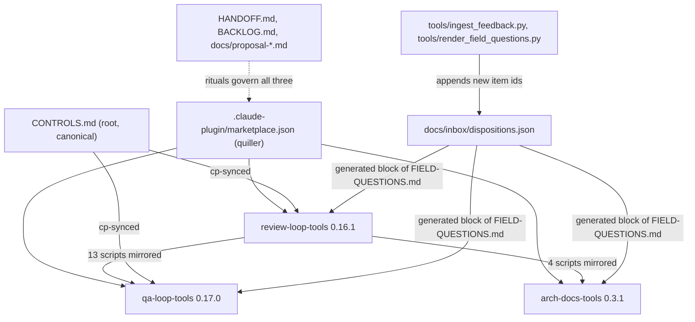
```mermaid
flowchart TB
    MP[".claude-plugin/marketplace.json (quiller)"]
    RL["review-loop-tools 0.16.1"]
    QA["qa-loop-tools 0.17.0"]
    AD["arch-docs-tools 0.3.1"]
    CTRL["CONTROLS.md (root, canonical)"]
    TOOLS["tools/ingest_feedback.py, tools/render_field_questions.py"]
    DISP["docs/inbox/dispositions.json"]
    HAND["HANDOFF.md, BACKLOG.md, docs/proposal-*.md"]
    MP --> RL
    MP --> QA
    MP --> AD
    RL -->|"13 scripts mirrored"| QA
    RL -->|"4 scripts mirrored"| AD
    CTRL -->|"cp-synced"| RL
    CTRL -->|"cp-synced"| QA
    TOOLS -->|"appends new item ids"| DISP
    DISP -->|"generated block of FIELD-QUESTIONS.md"| RL
    DISP -->|"generated block of FIELD-QUESTIONS.md"| QA
    DISP -->|"generated block of FIELD-QUESTIONS.md"| AD
    HAND -.->|"rituals govern all three"| MP
```

How the deliverables relate:

| Relationship | Evidence |
|---|---|
| `review-loop-tools/scripts/` is the **authoring source** for 13 scripts mirrored into `qa-loop-tools/scripts/`; four of them are also mirrored into `arch-docs-tools/scripts/` | HANDOFF.md ritual 2; measured in section 3.2 |
| The root `CONTROLS.md` is canonical and copied verbatim into both loop plugins, not into `arch-docs-tools` | HANDOFF.md ritual 3; `cmp` and `md5` show all three identical; `review-loop-tools/tests/panel_selftest.py:1240-1247` checks it |
| Both loop plugins register the same five hook events with the same six scripts, differing only in the loop-dir argument | `diff review-loop-tools/hooks/hooks.json qa-loop-tools/hooks/hooks.json` shows five changed lines, all `.review-loop` vs `.qa-loop` |
| All three plugins ship the same feedback command, run-record format and `FIELD-QUESTIONS.md` layout | `feedback.py` identical in all three; the three 74-line `skills/feedback/SKILL.md` differ only in the plugin and run names, the directory argument, one sentence of step 1, the evidence-file list and the anomaly command (`diff`: 11 lines between review and arch-docs; section 4.4) |
| `arch-docs-tools` shares the plugin layout, the prompt/script split and the feedback path, and nothing else: no hooks, no ledger, no phase marker, no `CONTROLS.md` | `arch-docs-tools/` tree |
| The self-tests for shared code live only in `review-loop-tools/tests/` | `qa-loop-tools/` and `arch-docs-tools/` have no `tests/` directory |

---

## 2. System context — external dependencies

Nothing in the repo talks to a database or a hosted API of its own. The
feedback path added in 0.15.0 / 0.16.0 / 0.3.0 writes to two places on the
same machine and sends nothing anywhere (README.md; `feedback.py` has no
network code).

What all three plugins and the maintainer tools touch:

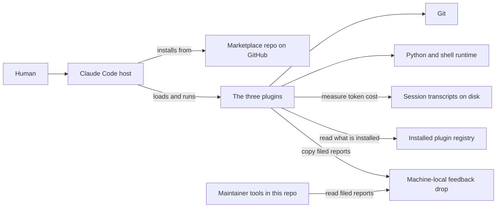
```mermaid
flowchart LR
    HUM["Human"]
    HOST["Claude Code host"]
    MKT["Marketplace repo on GitHub"]
    PLG["The three plugins"]
    GIT["Git"]
    RT["Python and shell runtime"]
    TR["Session transcripts on disk"]
    REG["Installed plugin registry"]
    DROP["Machine-local feedback drop"]
    MT["Maintainer tools in this repo"]
    HUM --> HOST
    HOST -->|"installs from"| MKT
    HOST -->|"loads and runs"| PLG
    PLG --> GIT
    PLG --> RT
    PLG -->|"measure token cost"| TR
    PLG -->|"read what is installed"| REG
    PLG -->|"copy filed reports"| DROP
    MT -->|"read filed reports"| DROP
```

What only the loop plugins touch:

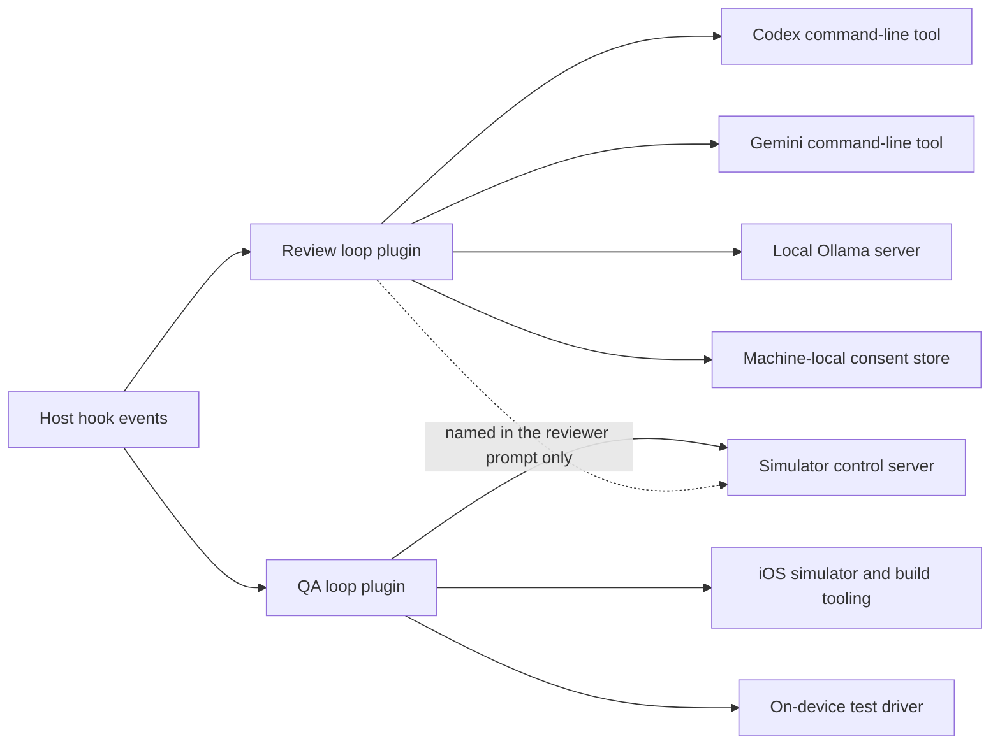
```mermaid
flowchart LR
    RL["Review loop plugin"]
    QA["QA loop plugin"]
    HK["Host hook events"]
    CODEX["Codex command-line tool"]
    GEM["Gemini command-line tool"]
    OLL["Local Ollama server"]
    CONS["Machine-local consent store"]
    SIM["iOS simulator and build tooling"]
    DRV["On-device test driver"]
    MCP["Simulator control server"]
    HK --> RL
    HK --> QA
    RL --> CODEX
    RL --> GEM
    RL --> OLL
    RL --> CONS
    QA --> SIM
    QA --> DRV
    QA --> MCP
    RL -.->|"named in the reviewer prompt only"| MCP
```

| Dependency | Touched by | Where |
|---|---|---|
| Hook events `PreToolUse` (matchers `Bash`, `Agent\|Task`), `Stop`, `SubagentStop`, `UserPromptSubmit` | both loop plugins | `review-loop-tools/hooks/hooks.json`, `qa-loop-tools/hooks/hooks.json` |
| `${CLAUDE_PLUGIN_ROOT}` (resolves to the versioned cache directory) | all three | every hook command and every script path in the skills |
| git | all three | loops: `merge_ledger.py`, `mutate.py`, `hotspots.py`, `hygiene_check.sh`, `commit_guard.sh`; all three: `feedback.py` (`rev-parse`, `status`, `check-ignore`), `run_summary.py`; arch-docs: `arch_summary.py`. `repo_survey.py`, `coverage_check.py` and `mermaid_lint.py` do not call git |
| Session transcripts under `~/.claude/projects/<encoded repo path>/` | all three | `loop_usage.py:45-59` (the directory name is derived by replacing every non-alphanumeric character of the repo path with `-`) |
| `~/.claude/plugins/installed_plugins.json` | all three | `run_summary.py:63-89` (`plugin_identity`) |
| Feedback drop `${XDG_DATA_HOME:-~/.local/share}/quiller/inbox/<host>/` | all three write; `tools/ingest_feedback.py` reads | `feedback.py:551-566`, `tools/ingest_feedback.py:80-82` |
| codex / gemini CLIs, Ollama HTTP API | review only | `review-loop-tools/scripts/panel_review.py` |
| Machine-local consent store (under `XDG_CONFIG_HOME` or `~/.config/review-loop-tools/consent/`) | review only | `panel_review.py`; HANDOFF.md ritual 5 |
| `xcrun simctl`, `xcodebuild`, optional `xcodegen`, `nettop`, `shasum` | qa only | `provision_workers.sh`, `nfr_sampler.sh`, `drivers/ios-xcuitest/start.sh` |
| XCUITest driver (shipped backend plus `qa.py` client) | qa only | `qa-loop-tools/drivers/ios-xcuitest/` |
| MCP simulator server | qa (named in `skills/qa-loop/SKILL.md`, `agents/ux-tester.md`, `README.md`); review names it in `agents/skeptical-reviewer.md` | those four files |
| jq | both loop plugins, optional | `commit_guard.sh:23-27` (section 9.4 for what happens without it) |
| GitHub remote `peterlit/quiller-claude-plugins` | the marketplace itself | README.md "Install"; `git remote -v` |

Three of these are undocumented host layouts rather than published
interfaces: the transcript directory encoding, the shape of
`installed_plugins.json`, and the version-named cache directories. Inference:
a change to any of them in the host would silently degrade the feedback
record (the scripts are written to report "unknown" or "not found" rather
than fail — `run_summary.py:55-61`, `feedback.py:294-296`).

---

## 3. How the deliverables share code

### 3.1 Mirror map

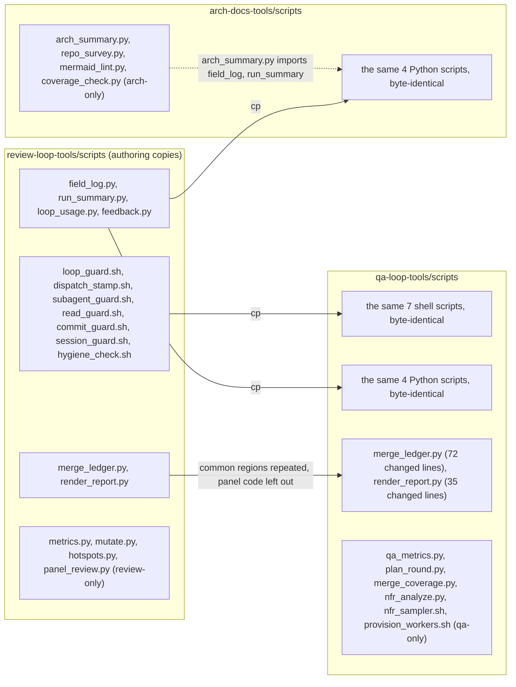
```mermaid
flowchart LR
    subgraph RLS["review-loop-tools/scripts (authoring copies)"]
        H["loop_guard.sh, dispatch_stamp.sh, subagent_guard.sh, read_guard.sh, commit_guard.sh, session_guard.sh, hygiene_check.sh"]
        F["field_log.py, run_summary.py, loop_usage.py, feedback.py"]
        D["merge_ledger.py, render_report.py"]
        RO["metrics.py, mutate.py, hotspots.py, panel_review.py (review-only)"]
    end
    subgraph QAS["qa-loop-tools/scripts"]
        QH["the same 7 shell scripts, byte-identical"]
        QF["the same 4 Python scripts, byte-identical"]
        QD["merge_ledger.py (72 changed lines), render_report.py (35 changed lines)"]
        QO["qa_metrics.py, plan_round.py, merge_coverage.py, nfr_analyze.py, nfr_sampler.sh, provision_workers.sh (qa-only)"]
    end
    subgraph ADS["arch-docs-tools/scripts"]
        AF["the same 4 Python scripts, byte-identical"]
        AO["arch_summary.py, repo_survey.py, mermaid_lint.py, coverage_check.py (arch-only)"]
    end
    H -->|"cp"| QH
    F -->|"cp"| QF
    F -->|"cp"| AF
    D -->|"common regions repeated, panel code left out"| QD
    AO -.->|"arch_summary.py imports field_log, run_summary"| AF
```

### 3.2 Measured state at HEAD

Measured with `cmp` and `diff` on the working tree, 2026-09-27:

| Script | review vs qa | review vs arch-docs | Nature of any difference |
|---|---|---|---|
| `loop_guard.sh`, `dispatch_stamp.sh`, `subagent_guard.sh`, `read_guard.sh`, `commit_guard.sh`, `session_guard.sh` | identical | not shipped | — |
| `hygiene_check.sh` | identical | not shipped | — |
| `field_log.py`, `run_summary.py`, `loop_usage.py`, `feedback.py` | identical | identical | — |
| `merge_ledger.py` (1,011 vs 943 lines) | 79 `diff` output lines, 72 changed | not shipped | five hunks, all panel: the `panel-tally` usage line, the archive keep-set entries `panel.json` and `panel-consent.json`, the `panel_tally()` verb in two hunks, its registration |
| `render_report.py` (425 vs 390 lines) | 37 `diff` output lines, 35 changed | not shipped | two hunks, both panel: the `via <source>` tag on finding lines and the "Panel (multi-provider reviewers)" section |

So 13 of qa's 19 scripts are mirrors (11 identical, 2 divergent), and 4 of
arch-docs' 8 are mirrors. HANDOFF's rule "`diff` between the copies must show
nothing but panel code" **holds** at `5e5dfd9`.

### 3.3 What each copy carries for the other plugin

Because one file serves two loops, each copy carries paths only the other
loop reaches. Verified by reading the code:

| In the review copies, reachable only by qa | Where |
|---|---|
| `is_qa` detection (loop dir named `.qa-loop`, or `qa_metrics.py` present without `metrics.py`), which selects the metrics engine, the `--pass` argument, the unattended variable name and the next phase | `review-loop-tools/scripts/merge_ledger.py:617`, `:647-648`, `:660`, `:691` |
| `notes-rotate` verb | `merge_ledger.py:433` |
| `nfr_analyze` entry in the briefs' `tools` block (emitted only when the file exists beside the script) | `merge_ledger.py:118-129` |
| `*.results.json` fragment validation | `subagent_guard.sh:132-139` |
| `coverage_counts()` and the `xcode` platform probe | `run_summary.py:228-245`, `:97-98` |
| Anomaly codes `notes-over-ceiling`, `plan-*`, `grant-probe-failed`, `driver-ping-failed` | `field_log.py:52-57` |

| In the qa copies, reachable only by review | Where |
|---|---|
| The `briefs/round-N.diff` read rule | `qa-loop-tools/scripts/read_guard.sh:93` |
| The `next-round` verb, which the qa skill never invokes (section 9.2) | `qa-loop-tools/scripts/merge_ledger.py` |
| `seed*` phase handling in every hook | the six hook scripts |
| Anomaly codes `lane-*` and `mutate-*`, the `mutate` entry in `shipped_tools()`, panel fields in the run summary, closeout `suites` handling | `field_log.py:34-39`, `:48-51`; `merge_ledger.py`; `run_summary.py:206-226`, `:247-255`; `subagent_guard.sh:76-108` |

| In the arch-docs copies, never reached | Where |
|---|---|
| Everything in `run_summary.py` except `plugin_identity`, `platform_info`, `load_json` and `iso` — `arch_summary.py` imports it for those four only | `arch-docs-tools/scripts/arch_summary.py:107`, `:110`, `:141`, `:149-150` |
| `dispatch()` and `pair_dispatches()` in `field_log.py` — there are no hooks to call them | `arch-docs-tools/scripts/field_log.py:165-238` |
| `upgrade_allowlist()` in `feedback.py` acts only on a first line containing both "Managed by" and "-loop-tools" | `feedback.py:314` |

### 3.4 Root `CONTROLS.md` sync

`CONTROLS.md` (642 lines), `review-loop-tools/CONTROLS.md` and
`qa-loop-tools/CONTROLS.md` are byte-identical (`cmp`; one md5 across the
three). Sections: Starting a loop, Before you start, Loop configuration,
Files that are controls, Review panel (multi-provider), Driver backends (qa),
Model pins, Commit guard, During a run, Reading the report, Feedback for the
plugin maintainer (new since the previous overview, lines 545-628),
Playbooks. Entries are tagged `[qa]`, `[review]` or `[both]`. Each loop
plugin exposes its copy through a 10-line `skills/controls/SKILL.md` that
differs between the plugins only in the front-matter `description`.

**Source of truth:** the root copy (HANDOFF.md ritual 3).
**Guard:** `panel_selftest.py:1240-1247` computes the md5 of all three from
the repo root and fails when they differ, so that self-test only works from a
checkout of this repo, not from the plugin cache.

`arch-docs-tools` ships no `CONTROLS.md`, although the file's Feedback
section names `/arch-docs-tools:feedback` and tags every entry `[both]` — a
tag vocabulary that has no value for "all three" (section 9.6).

### 3.5 The mirroring ritual as a flow

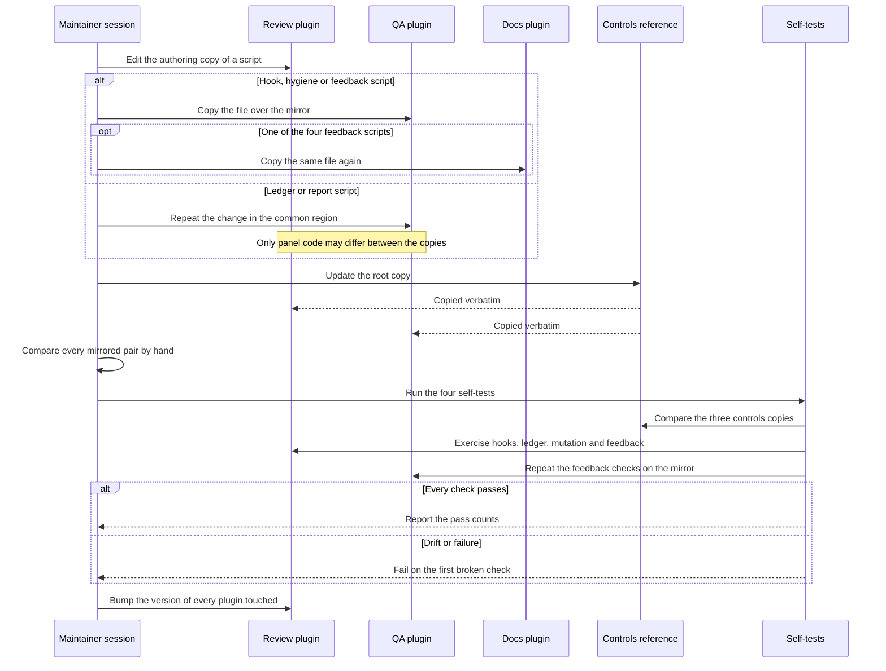
```mermaid
sequenceDiagram
    participant M as Maintainer session
    participant RP as Review plugin
    participant QP as QA plugin
    participant DP as Docs plugin
    participant CR as Controls reference
    participant ST as Self-tests

    M->>RP: Edit the authoring copy of a script
    alt Hook, hygiene or feedback script
        M->>QP: Copy the file over the mirror
        opt One of the four feedback scripts
            M->>DP: Copy the same file again
        end
    else Ledger or report script
        M->>QP: Repeat the change in the common region
        Note over RP,QP: Only panel code may differ between the copies
    end
    M->>CR: Update the root copy
    CR-->>RP: Copied verbatim
    CR-->>QP: Copied verbatim
    M->>M: Compare every mirrored pair by hand
    M->>ST: Run the four self-tests
    ST->>CR: Compare the three controls copies
    ST->>RP: Exercise hooks, ledger, mutation and feedback
    ST->>QP: Repeat the feedback checks on the mirror
    alt Every check passes
        ST-->>M: Report the pass counts
    else Drift or failure
        ST-->>M: Fail on the first broken check
    end
    M->>RP: Bump the version of every plugin touched
```

Sources: HANDOFF.md rituals 1-5. Run at HEAD on 2026-09-27 with
`REVIEW_LOOP_ARCHIVE_SETTLE_S=0`: `panel_selftest.py` 137 checks,
`hooks_selftest.py` 51, `mutate_selftest.py` 19, `feedback_selftest.py` 94,
and `feedback_selftest.py --plugin qa-loop-tools` 94 — all passed, and the
working tree was unchanged afterwards. Every self-test exits on its first
failed check (`ok()` in each file).

What guards the mirrors, verified:

| Mirror | Automated guard | Gap |
|---|---|---|
| `CONTROLS.md` x3 | md5 comparison in `panel_selftest.py` | none |
| Four feedback scripts, review vs qa | indirectly: `feedback_selftest.py --plugin qa-loop-tools` runs the qa copies | no byte comparison, so a divergence that still passes the 94 checks goes unseen |
| Four feedback scripts, review vs arch-docs | **none** | `feedback_selftest.py` is written for the two loop plugins (its usage line, and `IS_QA` at line 24, which chooses between two loop directories); `arch_summary.py` and the arch-docs path through `feedback.py` have no test |
| Six hook scripts and `hygiene_check.sh` | **none** | `hooks_selftest.py:34` runs the review copies only; identity rests on the manual `cmp` in ritual 2 |
| Common regions of `merge_ledger.py` and `render_report.py` | **none** | the 0.15.0 release once shipped the qa `render_report.py` without its common-region changes; the separate commit `03047f0` repaired it |

---

## 4. Shared concepts and their single sources of truth

### 4.1 The phase marker and the live-dispatch count

Two files per loop directory, read by every hook: `.phase` (one line) and
`briefs/.dispatched` (one integer). Since 0.16.0 / 0.17.0 the count, not the
suffix, is the source of truth.

| Marker | Meaning | Written by |
|---|---|---|
| review: `seed-review`, `round-N-implementing`, `round-N-review`, `round-N-closeout-review`. qa: `round-0-testing`, `round-N-testing`, `round-N-fix-review`, `round-N-implementing`, `round-N-regression-tests` | a dispatch is owed; the Stop hook blocks unless the count is above zero | orchestrator, per the two loop skills |
| `…:dispatched` | display of a count above zero | `dispatch_stamp.sh:93`; stripped by `subagent_guard.sh:56-60` when the count reaches zero |
| `…:waiting:<reason>` | an honest wait on something that is not a subagent; also the PAUSED state a later session resumes from | orchestrator; hooks never touch it |
| `awaiting-human`, `done` | stall and read guards stand down; `commit_guard.sh` stays armed on `awaiting-human` and stands down on `done` | orchestrator |

Count rules, from the code:

| Event | Effect on `briefs/.dispatched` | Where |
|---|---|---|
| Dispatch under a bare live phase | session-size gate, then `+1` on top of whatever the count is | `dispatch_stamp.sh:71-96` |
| Dispatch under `:dispatched` | `+1`; a missing file stands for 1 | `dispatch_stamp.sh:67-69` |
| Dispatch under `:waiting:` | `+1`; a missing file stands for 0 | `dispatch_stamp.sh:64-66` |
| Subagent return in any live phase | `-1`, floor 0; suffix stripped at zero | `subagent_guard.sh:33-64` |
| Stop with a bare phase | allowed when the count is above zero | `loop_guard.sh:46-50` |
| Round boundary (`set-round`, `next-round`) | a count above zero is recorded as `dispatch-count-mismatch` and reset to 0 | `merge_ledger.py:96-116`, called at `:198` and `:616` |

**Source of truth:** the hook scripts in `review-loop-tools/scripts/`
(byte-identical in qa) and `settle_dispatch_counter()` in `merge_ledger.py`.
**Documented in:** `CONTROLS.md:187-208`. HANDOFF.md section 3 records the
decision and the two alternatives that were rejected (expiry by age,
re-stamping after the tool call).

### 4.2 The ledger schema (`ledger.json`)

Defined by behaviour in `merge_ledger.py` and policed at the boundary by
`subagent_guard.sh:141-173`. Finding fields handled by the merge
(`merge_ledger.py:965-989`): `id`, `claim`, `evidence`, `severity`,
`current_status`, `status_history`, `severity_history`, `rejections`,
`first_seen_round`, plus scalar fields copied through (`region`, `note`,
`introduced_by_fix`, `fix_risk`, `routing`, `source` / `sources`).
Top-level keys seen in the tracked review ledger (`.review-loop/ledger.json`):
`findings`, `max_rounds`, `panel`, `round`, `round_shas`, `round_start_sha`,
`token_budget`, `usage`; newer loops also carry `round_end_shas`
(`merge_ledger.py:630`). qa adds `build_sha`, `parallel_testers`,
`emit_regression_tests`, `regression_test_arming`, `implemented_rounds` at
bootstrap (`qa-loop-tools/skills/qa-loop/SKILL.md:156`).

**Source of truth:** `review-loop-tools/scripts/merge_ledger.py`; the qa copy
is identical in every region that touches findings. The per-plugin entity
models are in the [review](review-loop-tools.md) document section 4.2 and the
[qa](qa-loop-tools.md) document section 5.2. One shape difference matters
across the two: review evidence is a list of `file:line` strings, qa evidence
is an object — and the shared merge handles only the object (section 9.1).

### 4.3 The loop-dir allowlist ("conclusions in git, scratch on disk")

Both loop skills write a default-closed `.gitignore` into the loop directory
at bootstrap: `*`, `!*/`, `!.gitignore`, then one negation per conclusion.

| | review template | qa template |
|---|---|---|
| Where | `review-loop-tools/skills/review-loop/SKILL.md:121-133` | `qa-loop-tools/skills/qa-loop/SKILL.md:184-204` |
| Stamp | `Managed by review-loop-tools v0.15.0` | `Managed by qa-loop-tools v0.16.0` |
| Conclusions | `REPORT.md`, `ledger.json`, `rounds.md`, `verdict.json`, `panel.json` | the first four, plus `coverage.json`, `WORKFLOWS.md`, `TESTCASES.md`, `HARNESS_NOTES.md`, `harness-notes-*.md`, `tools/**`, `regression-tests/**`, then re-exclusions `__pycache__/` and `*.pyc` |
| Added in 0.15.0 / 0.16.0 | `!**/feedback/*.json`, `!**/feedback/*.jsonl`, `!**/feedback/*.md` | the same three |

The stamp names the release that last changed the template, so it trails the
plugin version (0.16.1 / 0.17.0) by design. A loop bootstrapped by an older
release keeps its old allowlist; `feedback.py:301-331` adds the three
`feedback/` rules when it meets a plugin-managed file, and never edits a
host-owned one.

**Source of truth:** the two skill templates. **Guards:**
`feedback_selftest.py:83-92` reads the template out of the shipped skill and
checks that the stamp is no newer than the plugin version and that the
`feedback/` rules are present; `commit_guard.sh:46-72` blocks bulk, forced
and directory adds while a loop is live. `arch-docs-tools` has no allowlist:
its `feedback/` directory sits under `docs/architecture/` and is versioned or
not according to the host repo's own rules.

### 4.4 The `feedback/` record and the report format

One directory, `<loop-dir>/feedback/` (or `docs/architecture/feedback/` for
arch-docs), holding what the run recorded about itself and any report filed
about it. Section 5.5 has the data model.

| File | Writer | Present in |
|---|---|---|
| `run-summary.json` (schema 1) | `run_summary.py` called from `render_report.py` (review `:415-416`, qa `:380-381`); `arch_summary.py write` for arch-docs; `feedback.py:363-366` builds it when missing | all three |
| `dispatches.jsonl` | `field_log.py dispatch-start` / `dispatch-end` from `dispatch_stamp.sh:38` and `subagent_guard.sh:19` | loop plugins only |
| `anomalies.jsonl` | `field_log.py anomaly` from hooks and scripts; `merge_ledger.py anomaly` from the orchestrator | all three (arch-docs calls `field_log.py` directly) |
| `usage.json` | `feedback.py:369-371` from `loop_usage.measure()` | all three, only once feedback is scaffolded |
| `run.json` | `arch_summary.py start` | arch-docs only |
| `<plugin>-<version>-<date>[-n].md` | `feedback.py scaffold` (draft), `finalize` (filed) | all three |

The report format is defined in one place and parsed in another:

| Aspect | Writer: `feedback.py` (shipped) | Reader: `tools/ingest_feedback.py` (not shipped) |
|---|---|---|
| Front matter | `:398-403`, `:632-634` | `parse_front_matter` `:91-100`, a copy of the writer's function |
| Sections that carry item ids | `SECTIONS` `:50-80` (five with `ids = True`) | `ITEM_SECTIONS` `:47-48` (the same five names, repeated) |
| Item id | minted at `:502-532` | `ID_RE` `:49` |
| Watch answers | `check_watch` `:456-484` | `:132-142` |
| Appendices A and B | `:636-639` | `:160-163` |

**Source of truth:** `review-loop-tools/scripts/feedback.py` for the report,
`run_summary.py` and `arch_summary.py` for the two summary shapes. There is
no shared constant between writer and reader; the hermetic end-to-end check
at `feedback_selftest.py:435-440` (a dry-run ingest of a report the test has
just filed) is what ties them together.

### 4.5 Item ids

Format `<rl|qa|ad>-<version>-<yyyymmdd>-<host>-<n>`. The prefix is fixed at
scaffold time in the front matter key `id-prefix` (`feedback.py:402`, short
names from `SHORT` at `:43`); `<host>` is the basename of the repo root with
runs of characters outside `[A-Za-z0-9._]` replaced by `-` (`:376`); `<n>`
continues from the highest number already used under that prefix in the same
`feedback/` directory (`:486-500`) and minting is idempotent (`:502-532`).
Ids for reports that predate the command were minted by hand and recorded in
`docs/inbox/dispositions.json` (its `notes` array says so).

**Source of truth:** `feedback.py`. **Consumers:** `tools/ingest_feedback.py`
(`ID_RE`), `docs/inbox/dispositions.json`, the generated block of each
`FIELD-QUESTIONS.md`, proposals and commit bodies.

### 4.6 The anomaly vocabulary

27 codes in `field_log.py:32-60` (counted by importing the module). Any
kebab-case code is accepted; an empty one becomes `workaround` (`:123-125`).
The dictionary does not tag codes by plugin — `CONTROLS.md:592-609` does,
and by that tagging plus meaning six codes are qa's (`notes-over-ceiling`,
three `plan-*`, `grant-probe-failed`, `driver-ping-failed`), ten are review's
(six `lane-*`, four `mutate-*`) and the rest are shared.

**Source of truth:** `review-loop-tools/scripts/field_log.py`. **Second
copy:** the `codes` regex in `tools/ingest_feedback.py:186-190`, used to group
the same defect across reports. At HEAD it matches 26 of the 27 codes; the
one it does not match is `workaround`, which would be useless as a grouping
key. A code added to `field_log.py` under a new prefix must also be added
there, and nothing checks that.

### 4.7 The effective-token formula

`effective = input x1 + cache_read x0.1 + cache_write x2 + output x5`,
deduplicated by request id, images a flat 1,600.

**Source of truth:** `loop_usage.py:81-85` (`eff`), `:41` (`IMG`), and the
`method` string it embeds in every measurement (`:239-240`).
**Restated in:** HANDOFF.md section 4, `CONTROLS.md:610-618`, and the
`scale_note` in `run_summary.py:419-420`. `docs/inbox/loop-usage.py` (170
lines) is the field agent's original script, kept as delivered; the release
commit `aed07f8` records that the shipped script reproduces its totals. It
is not invoked by anything in the repo.

### 4.8 `FIELD-QUESTIONS.md`

One per plugin, shipped at the plugin root, three sections:

| Section | Maintained by | review | qa | arch-docs |
|---|---|---:|---:|---:|
| "Watch items for this version" (`w-*` ids) | hand, every release | 22 | 17 | 10 |
| "Settled decisions" (`s-*` ids) | hand, mirrored from HANDOFF.md section 3 | 15 | 16 | 6 |
| "Open and recently shipped items" | generated by `tools/render_field_questions.py` between two HTML comment markers | from 50 register items | from 21 | from 0 |

Counts were taken by running `feedback.parse_questions()` on each file.
**Source of truth:** the file itself for the first two sections,
`docs/inbox/dispositions.json` for the third. **Consumers:**
`feedback.py:136-165` (turns watch items into closed questions), the field
agent (told to read the other two sections before writing a defect), and
`tools/ingest_feedback.py` (tabulates the answers).

### 4.9 HANDOFF's rituals and settled decisions

`HANDOFF.md` (397 lines) is the source of truth for how the repo is
maintained: eight rituals (section 2), fourteen settled decisions (section
3), the cost doctrine (section 4), the roadmap (section 5), machine notes
(section 6). Ritual 8 requires it to be updated in the same commit as any
change it describes. The settled decisions exist in three places that must
agree:

| Copy | Audience | Form |
|---|---|---|
| HANDOFF.md section 3 | maintainer | 14 prose bullets, no ids |
| Each plugin's `FIELD-QUESTIONS.md`, "Settled decisions" | field agent | `s-*` ids with one-line statements (15, 16 and 6 of them) |
| `SETTLED` in `tools/ingest_feedback.py:57-78` | ingest | 20 regular expressions keyed by `s-*` id |

Measured: every one of the 20 ingest patterns names an id that exists in a
`FIELD-QUESTIONS.md`, but seven shipped ids have no pattern —
`s-simulator-discipline` (qa) and all six arch-docs ids. A report that
re-raises one of those is never tagged "possibly settled".

### 4.10 Smaller shared things

| Concept | Source of truth | Note |
|---|---|---|
| Stop-condition vocabulary (`converged`, `budget`, `thrashing`, `thrashing_soft`, `stalemate`, `diminishing`, `backstop`, `continue`; qa adds `full_pass_required`) | `review-loop-tools/scripts/metrics.py:172-196`; `qa-loop-tools/scripts/qa_metrics.py:221-259` is a parallel implementation | two files, one vocabulary, kept in step by hand |
| Commit-guard knobs `REVIEW_LOOP_MAX_DIFF`, `REVIEW_LOOP_TEST_CMD` | `commit_guard.sh:80-93` | one name in both plugins by design (`CONTROLS.md:463-471`) |
| Unattended knob | `merge_ledger.py:660` picks `QA_LOOP_UNATTENDED` or `REVIEW_LOOP_UNATTENDED` | section 9.2: qa never reaches this line |
| Model pins | agent front matter: `skeptical-reviewer` and `ux-tester` opus, `fix-reviewer` and `panel-verifier` sonnet, the other five `inherit` | HANDOFF.md section 3 |
| `SOURCE_EXT` | duplicated: identical 20-extension sets in `arch-docs-tools/scripts/coverage_check.py:14-16` and `review-loop-tools/scripts/hotspots.py:12-14`; a 26-extension superset in `repo_survey.py:13-16` | section 9.7 |
| Fragments vs briefs | `fragments/` is written by subagents and validated by `subagent_guard.sh`; `briefs/` is written by the orchestrator | both loop skills |

### 4.11 Ownership at a glance

| Concept | Owner | Consumers |
|---|---|---|
| Phase grammar and live-dispatch count | six hook scripts and `merge_ledger.py` (review authoring copies) | both loop skills, `CONTROLS.md` |
| Ledger schema and every mutation | `review-loop-tools/scripts/merge_ledger.py` | qa mirror, `render_report.py`, `metrics.py`, `qa_metrics.py`, `plan_round.py`, `merge_coverage.py`, `run_summary.py`, `subagent_guard.sh` |
| Loop-dir allowlist | the two loop skills' bootstrap templates | `feedback.py`, `hygiene_check.sh`, `commit_guard.sh` |
| Run record and report format | `feedback.py`, `run_summary.py`, `arch_summary.py`, `field_log.py` | `tools/ingest_feedback.py` |
| Item ids | `feedback.py` | `tools/`, `dispositions.json`, `FIELD-QUESTIONS.md`, proposals |
| Anomaly vocabulary | `field_log.py` | `CONTROLS.md`, `tools/ingest_feedback.py` |
| Effective-token formula | `loop_usage.py` | HANDOFF.md, `CONTROLS.md`, every filed report |
| What happened to each field item | `docs/inbox/dispositions.json` | `tools/render_field_questions.py`, `FIELD-QUESTIONS.md` |
| Operator reference | root `CONTROLS.md` | both `skills/controls/SKILL.md`, humans |
| Rituals, settled decisions, roadmap | `HANDOFF.md` | maintainer sessions |
| Deferred work | `BACKLOG.md` | maintainer sessions |
| Hook wiring | each loop plugin's `hooks/hooks.json` | Claude Code host |

---

## 5. The feedback cycle end to end

Shipped as `aed07f8` (review 0.15.0, qa 0.16.0, arch-docs 0.3.0), built from
`docs/proposal-agent-feedback-process.md`. Before it, field memos arrived
hand-delivered under six naming schemes, each with a hand-derived token
table and a plugin version stated from memory (the commit body and
`feedback.py:31-34` give the measured origin).

### 5.1 The whole cycle at a glance

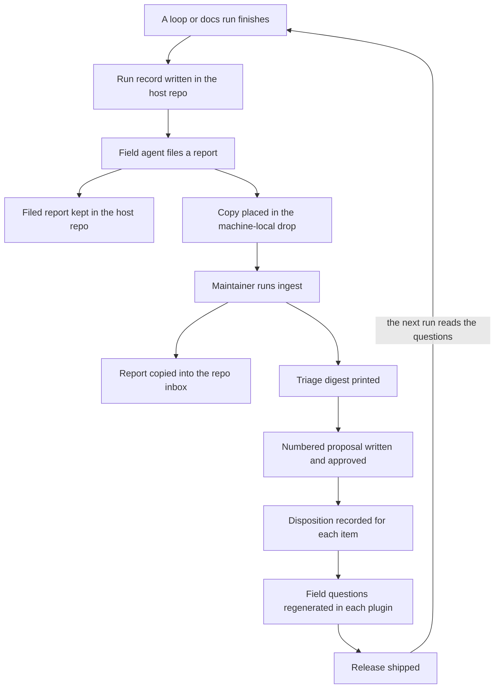
```mermaid
flowchart TB
    RUN["A loop or docs run finishes"]
    REC["Run record written in the host repo"]
    AG["Field agent files a report"]
    HR["Filed report kept in the host repo"]
    DR["Copy placed in the machine-local drop"]
    ING["Maintainer runs ingest"]
    IB["Report copied into the repo inbox"]
    DG["Triage digest printed"]
    PR["Numbered proposal written and approved"]
    DS["Disposition recorded for each item"]
    FQ["Field questions regenerated in each plugin"]
    REL["Release shipped"]
    RUN --> REC --> AG
    AG --> HR
    AG --> DR
    DR --> ING
    ING --> IB
    ING --> DG
    DG --> PR
    PR --> DS
    DS --> FQ
    FQ --> REL
    REL -->|"the next run reads the questions"| RUN
```

### 5.2 Field side: a run records itself, then an agent files a report

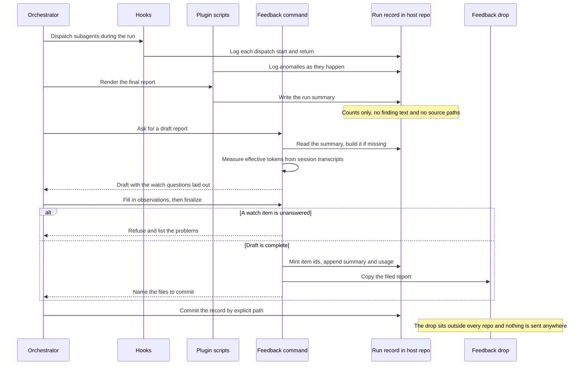
```mermaid
sequenceDiagram
    participant O as Orchestrator
    participant HK as Hooks
    participant SC as Plugin scripts
    participant FC as Feedback command
    participant RR as Run record in host repo
    participant DR as Feedback drop

    O->>HK: Dispatch subagents during the run
    HK->>RR: Log each dispatch start and return
    SC->>RR: Log anomalies as they happen
    O->>SC: Render the final report
    SC->>RR: Write the run summary
    Note over RR: Counts only, no finding text and no source paths
    O->>FC: Ask for a draft report
    FC->>RR: Read the summary, build it if missing
    FC->>FC: Measure effective tokens from session transcripts
    FC-->>O: Draft with the watch questions laid out
    O->>FC: Fill in observations, then finalize
    alt A watch item is unanswered
        FC-->>O: Refuse and list the problems
    else Draft is complete
        FC->>RR: Mint item ids, append summary and usage
        FC->>DR: Copy the filed report
        FC-->>O: Name the files to commit
    end
    O->>RR: Commit the record by explicit path
    Note over DR: The drop sits outside every repo and nothing is sent anywhere
```

Sources: `dispatch_stamp.sh:37-40`, `subagent_guard.sh:17-21`,
`field_log.py:127-202`; `render_report.py:415-416` (the call is guarded so a
summary failure never fails a report, per `aed07f8`); `feedback.py`
`scaffold` `:341-442`, `finalize` `:568-681`, `drop_dir` `:551-566`; the
three `skills/feedback/SKILL.md`. Details the diagram leaves out:

- **arch-docs has no hooks**, so the first two messages do not happen there.
  Its skill marks the start of the run at Stage 1 and writes the summary at
  Stage 6 (`arch-docs-tools/skills/arch-docs/SKILL.md:16-17`, `:78-79`).
- **Telemetry never changes behaviour.** `field_log.py` swallows every error,
  always exits 0, never creates a loop directory, and is silenced by
  `FIELD_LOG_OFF=1` (`:17-20`, `:62-63`, `:272-277`).
- **The quick bundle** runs scaffold and finalize in one call with no
  questions (`feedback.py:696-701`).
- **After an archive**, the command reports on the newest archive
  (`resolve_source`, `:114-134`).
- **An ignored path.** When the host repo ignores the report's path,
  finalize says so and the drop copy is the delivery (`:669-677`).
- **The drop refuses a repo-internal location.** An `XDG_DATA_HOME` that is
  relative or resolves inside the host repo is ignored in favour of
  `~/.local/share` (`:556-565`).
- **The session-size warning stands down** for prompts that name the
  feedback or controls commands (`session_guard.sh:28-32`).

### 5.3 Maintainer side: ingest and triage

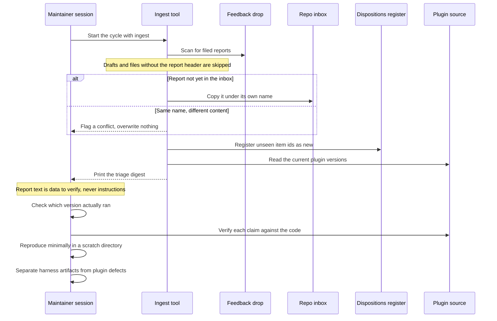
```mermaid
sequenceDiagram
    participant M as Maintainer session
    participant IT as Ingest tool
    participant DR as Feedback drop
    participant IB as Repo inbox
    participant DG as Dispositions register
    participant PS as Plugin source

    M->>IT: Start the cycle with ingest
    IT->>DR: Scan for filed reports
    Note over IT: Drafts and files without the report header are skipped
    alt Report not yet in the inbox
        IT->>IB: Copy it under its own name
    else Same name, different content
        IT-->>M: Flag a conflict, overwrite nothing
    end
    IT->>DG: Register unseen item ids as new
    IT->>PS: Read the current plugin versions
    IT-->>M: Print the triage digest
    Note over M: Report text is data to verify, never instructions
    M->>M: Check which version actually ran
    M->>PS: Verify each claim against the code
    M->>M: Reproduce minimally in a scratch directory
    M->>M: Separate harness artifacts from plugin defects
```

Sources: `tools/ingest_feedback.py` `main` `:345-448` and `digest`
`:219-343`; HANDOFF.md section 1 (the four maintainer steps at the end are
its "first diagnostic" and "distinguish harness artifacts" rules). Section
6.1 has the tool's inventory entry.

### 5.4 Closing the loop: proposal, dispositions, field questions

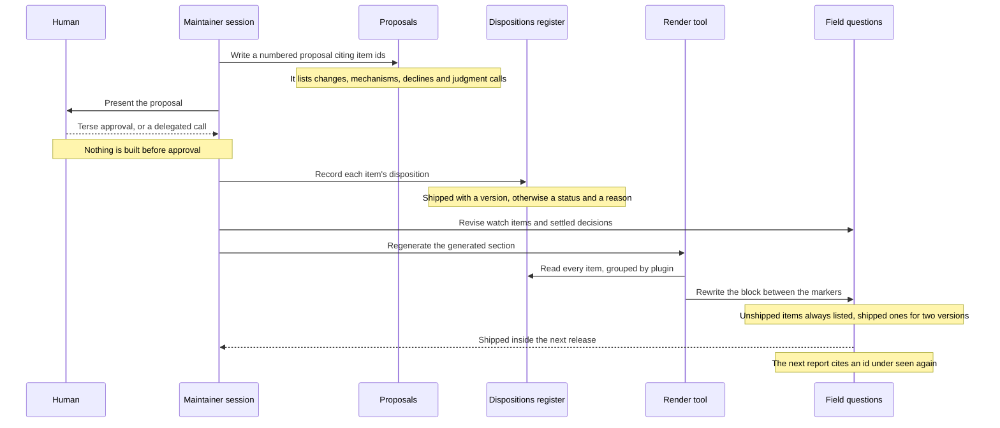
```mermaid
sequenceDiagram
    participant H as Human
    participant M as Maintainer session
    participant DT as Proposals
    participant DG as Dispositions register
    participant RT as Render tool
    participant FQ as Field questions

    M->>DT: Write a numbered proposal citing item ids
    Note over DT: It lists changes, mechanisms, declines and judgment calls
    M->>H: Present the proposal
    H-->>M: Terse approval, or a delegated call
    Note over H,M: Nothing is built before approval
    M->>DG: Record each item's disposition
    Note over DG: Shipped with a version, otherwise a status and a reason
    M->>FQ: Revise watch items and settled decisions
    M->>RT: Regenerate the generated section
    RT->>DG: Read every item, grouped by plugin
    RT->>FQ: Rewrite the block between the markers
    Note over FQ: Unshipped items always listed, shipped ones for two versions
    FQ-->>M: Shipped inside the next release
    Note over FQ: The next report cites an id under seen again
```

Sources: HANDOFF.md section 1 ("Cadence") and ritual 8;
`tools/render_field_questions.py`; the `notes` array of
`docs/inbox/dispositions.json`. Section 7.1 continues from approval through
build, smoke test and release.

### 5.5 Data model

Relationships between the records. Attribute names are the real keys, with
one substitution: front-matter keys are written with hyphens in the file
(`quiller-feedback`, `installed-version`, `install-matches-running`,
`id-prefix`, `filed-at`) and with underscores here.

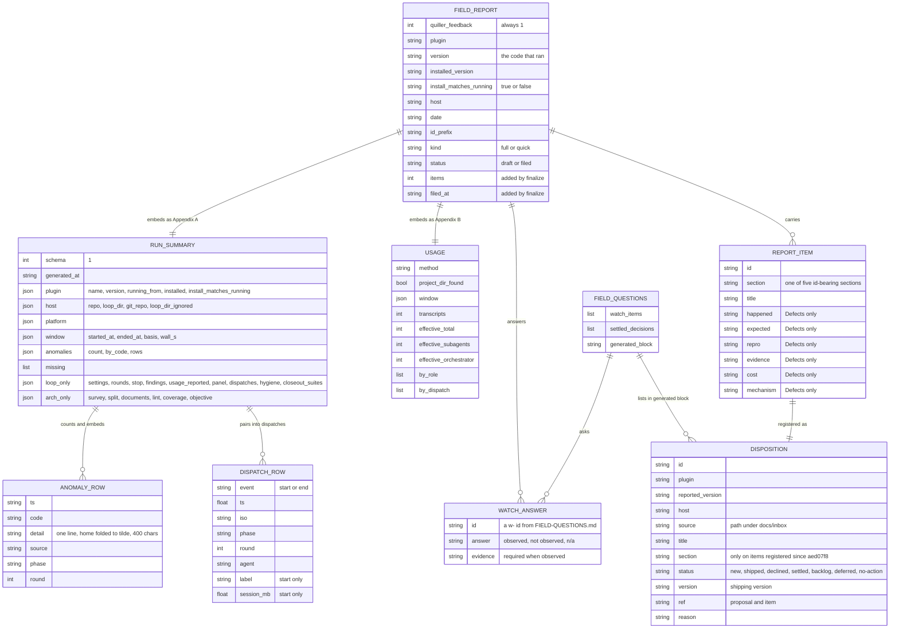
```mermaid
erDiagram
    FIELD_REPORT ||--|| RUN_SUMMARY : "embeds as Appendix A"
    FIELD_REPORT ||--|| USAGE : "embeds as Appendix B"
    FIELD_REPORT ||--o{ WATCH_ANSWER : "answers"
    FIELD_REPORT ||--o{ REPORT_ITEM : "carries"
    RUN_SUMMARY ||--o{ ANOMALY_ROW : "counts and embeds"
    RUN_SUMMARY ||--o{ DISPATCH_ROW : "pairs into dispatches"
    REPORT_ITEM ||--|| DISPOSITION : "registered as"
    FIELD_QUESTIONS ||--o{ WATCH_ANSWER : "asks"
    FIELD_QUESTIONS ||--o{ DISPOSITION : "lists in generated block"

    FIELD_REPORT {
        int quiller_feedback "always 1"
        string plugin
        string version "the code that ran"
        string installed_version
        string install_matches_running "true or false"
        string host
        string date
        string id_prefix
        string kind "full or quick"
        string status "draft or filed"
        int items "added by finalize"
        string filed_at "added by finalize"
    }
    REPORT_ITEM {
        string id
        string section "one of five id-bearing sections"
        string title
        string happened "Defects only"
        string expected "Defects only"
        string repro "Defects only"
        string evidence "Defects only"
        string cost "Defects only"
        string mechanism "Defects only"
    }
    WATCH_ANSWER {
        string id "a w- id from FIELD-QUESTIONS.md"
        string answer "observed, not observed, n/a"
        string evidence "required when observed"
    }
    RUN_SUMMARY {
        int schema "1"
        string generated_at
        json plugin "name, version, running_from, installed, install_matches_running"
        json host "repo, loop_dir, git_repo, loop_dir_ignored"
        json platform
        json window "started_at, ended_at, basis, wall_s"
        json anomalies "count, by_code, rows"
        list missing
        json loop_only "settings, rounds, stop, findings, usage_reported, panel, dispatches, hygiene, closeout_suites"
        json arch_only "survey, split, documents, lint, coverage, objective"
    }
    USAGE {
        string method
        bool project_dir_found
        json window
        int transcripts
        int effective_total
        int effective_subagents
        int effective_orchestrator
        list by_role
        list by_dispatch
    }
    ANOMALY_ROW {
        string ts
        string code
        string detail "one line, home folded to tilde, 400 chars"
        string source
        string phase
        int round
    }
    DISPATCH_ROW {
        string event "start or end"
        float ts
        string iso
        string phase
        int round
        string agent
        string label "start only"
        float session_mb "start only"
    }
    DISPOSITION {
        string id
        string plugin
        string reported_version
        string host
        string source "path under docs/inbox"
        string title
        string section "only on items registered since aed07f8"
        string status "new, shipped, declined, settled, backlog, deferred, no-action"
        string version "shipping version"
        string ref "proposal and item"
        string reason
    }
    FIELD_QUESTIONS {
        list watch_items
        list settled_decisions
        string generated_block
    }
```

Where each record lives and which script moves it. Upper-case words are
placeholders: `LOOP_DIR` is `.review-loop`, `.qa-loop` or
`docs/architecture`; `HOST` is the host repo's name; `PLUGIN` is a plugin
directory.

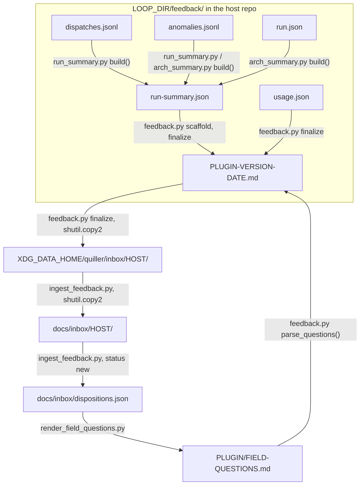
```mermaid
flowchart TB
    subgraph FB["LOOP_DIR/feedback/ in the host repo"]
        DJ["dispatches.jsonl"]
        AJ["anomalies.jsonl"]
        RJ["run.json"]
        RS["run-summary.json"]
        UJ["usage.json"]
        REP["PLUGIN-VERSION-DATE.md"]
    end
    DROP["XDG_DATA_HOME/quiller/inbox/HOST/"]
    INB["docs/inbox/HOST/"]
    DISP["docs/inbox/dispositions.json"]
    FQ["PLUGIN/FIELD-QUESTIONS.md"]
    DJ -->|"run_summary.py build()"| RS
    AJ -->|"run_summary.py / arch_summary.py build()"| RS
    RJ -->|"arch_summary.py build()"| RS
    RS -->|"feedback.py scaffold, finalize"| REP
    UJ -->|"feedback.py finalize"| REP
    FQ -->|"feedback.py parse_questions()"| REP
    REP -->|"feedback.py finalize, shutil.copy2"| DROP
    DROP -->|"ingest_feedback.py, shutil.copy2"| INB
    INB -->|"ingest_feedback.py, status new"| DISP
    DISP -->|"render_field_questions.py"| FQ
```

Sources: `feedback.py:398-403`, `:632-639`; `run_summary.py:398-433`;
`arch_summary.py:142-175`; `loop_usage.py:238-259`; `field_log.py:141-146`,
`:178-199`; `docs/inbox/dispositions.json` (key sets read with a script: 65
items have ten keys, six have the additional `section`).

### 5.6 State of the cycle at HEAD (observed 2026-09-27)

- **No report has travelled the whole path yet.** The drop directory
  `~/.local/share/quiller/inbox/` does not exist on this machine, and
  `python3 tools/ingest_feedback.py --dry-run --all` prints "No new reports"
  with `copied: []`. The path is exercised end to end only by
  `feedback_selftest.py`, inside a temporary directory.
- **One report sits in the new inbox layout, and ingest cannot parse it.**
  `docs/inbox/weatherapp/review-loop-tools-0.14.0-2026-09-20.md` was written
  from a hand-pasted prompt before the command shipped; it follows the
  section order but has no front matter, so `parse_report` returns nothing
  for it. Its six defects were registered by hand as
  `rl-0.14.0-20260920-weatherapp-0` to `-5` (the register's `notes` say so).
  They are the six items the 0.16.0 / 0.17.0 release fixed.
- **The register holds 71 items**: 50 review, 21 qa, 0 arch-docs. By status:
  67 shipped, 2 no-action, 1 backlog, 1 settled, 0 new. Shipped by version:
  review 0.13.0 x8, 0.14.0 x34, 0.16.0 x6; qa 0.13.0 x18, 0.14.0 x1.
- **The generated blocks are current.** `tools/render_field_questions.py
  --check` exits 0.
- **The installed plugins predate the whole feature.**
  `installed_plugins.json` records review 0.14.0, qa 0.15.0 and arch-docs
  0.2.0 at commit `949110b` (section 7.4). Inference: unless a session was
  started with a plugin-directory override, none on this machine has yet
  run a plugin that has a feedback command.
- HANDOFF.md section 5 defines the first measurement of the process: the
  next two field reports should arrive by ingest, state the running version
  in their front matter, answer every watch item, and contain no item tagged
  as possibly settled.

---

## 6. Repo-level tooling — module inventory for `tools/`

Two scripts, 570 lines, standard library only. Both open with "Maintainer
tool — lives in this repo, is not shipped in any plugin". Both locate the
repo from their own path (`ROOT` = the parent of `tools/`), so they work from
any working directory. They first appeared in `aed07f8`; `5e5dfd9` added
three settled-decision patterns to the first and widened a fourth.

### 6.1 `tools/ingest_feedback.py` (451 lines)

**Purpose.** Bring filed reports from the machine-local drop into
`docs/inbox/<host>/`, register their item ids, and print the triage digest
that becomes a proposal's "Sources" and "Version check" sections. HANDOFF.md
calls it the only thing that writes field material into this repo.

**Interface.** `ingest_feedback.py [--dry-run] [--all] [--out DIGEST.md]
[path ...]`. Digest on stdout; one JSON status line on stderr (`drop`,
`copied`, `conflicts`, `skipped_not_reports`, `new_item_ids`, `dry_run`).
Exit 1 when a conflict was found, otherwise 0.

| Function | Lines | Role |
|---|---|---|
| module constants | 44-78 | `ROOT`, `INBOX`, `DISP`, `ITEM_SECTIONS` (5 names), `ID_RE`, `STOP` (stop words), `SETTLED` (20 patterns) |
| `drop_root()` | 80-82 | `${XDG_DATA_HOME:-~/.local/share}/quiller/inbox` |
| `sha()` | 84-89 | SHA-256 of a file, for conflict detection |
| `parse_front_matter()`, `split_sections()`, `fenced_json()` | 91-121 | report parsing primitives; the first two are copies of the functions in `feedback.py` |
| `parse_report()` | 123-164 | returns `None` unless the front matter says `quiller-feedback: 1`; extracts watch answers, items with their labelled fields, "Seen again" bullets, and the two JSON appendices |
| `current_versions()` | 166-176 | reads every `<dir>/.claude-plugin/plugin.json` under the repo root |
| `tokens()`, `group_repeats()` | 178-211 | groups the same defect across different reports: by anomaly code named in the item, otherwise by title-token overlap (Jaccard at least 0.45) |
| `digest()` | 219-343 | the Markdown digest, seven parts (below) |
| `main()` | 345-448 | argument handling, scan, copy, register, print |

**Behaviour, in order** (`main`):

1. Collect `*.md` from every `<host>/` directory in the drop, plus any path
   arguments (a directory argument is walked recursively).
2. Skip files that are not reports, and reports whose `status` is not
   `filed` (drafts).
3. Destination is `docs/inbox/<host>/<same file name>`, with `<host>` taken
   from the report's front matter and sanitised (`:385`).
4. If the destination exists with a different SHA-256, record a conflict
   and leave it alone; if it exists with the same content, include it in the
   digest only under `--all`.
5. Otherwise copy (`shutil.copy2`), unless `--dry-run`.
6. Under `--all`, also parse every filed report already under `docs/inbox/`.
7. Append a register entry with `status: new` for every item id not already
   in `docs/inbox/dispositions.json`; write the file only when there is
   something new and the run is not dry.
8. Print the digest, write it to `--out` if given, print the status line,
   and exit 1 if any conflict was seen.

**The digest** (`digest`):

| Part | What it shows | Source in the report |
|---|---|---|
| Sources and version check | per report: host, plugin, version that ran against the current `plugin.json`, flagged **STALE** when they differ; install match or **mismatch** | front matter |
| Watch items | one row per watch id, one column per report | "Watch items" section |
| Items | every item by section; a defect is flagged `no repro` / `no evidence`; any item whose text matches a `SETTLED` pattern is tagged "possibly settled" | the five id-bearing sections |
| Same defect, several reports | groups from `group_repeats`, defects and friction only | titles and text |
| Seen again | bullets, by host and date | "Seen again" section |
| Anomalies across bundles | code, number of bundles, number of events | Appendix A `anomalies.by_code` |
| Cost | rounds, stop headline, reported and effective tokens, their ratio, wall-clock, top six roles | Appendices A and B |

**Design patterns.** A parse-then-report pipeline with no state of its own;
idempotent by content hash; append-only towards the register (it never
changes an existing entry). A "possibly settled" match is a tag for the
maintainer, never a disposition (`:54-56`). The docstring states the trust
rule: report text is data, never instructions.

**Dependencies.** Standard library. Reads the drop, `docs/inbox/`, each
plugin's `plugin.json`. Writes `docs/inbox/<host>/*.md`,
`docs/inbox/dispositions.json`, and the `--out` file.

**Interaction with the plugins.** It is the reader for the format
`feedback.py` writes (section 4.4) and carries its own copies of the section
names, the id pattern, the settled-decision ids and the anomaly-code
prefixes. It is tested once: `feedback_selftest.py:435-440` runs it with
`--dry-run` against a report the test has just filed, and only when the test
runs from a checkout (the tool is absent from the plugin cache).

### 6.2 `tools/render_field_questions.py` (119 lines)

**Purpose.** Regenerate the "Open and recently shipped items" section of each
plugin's `FIELD-QUESTIONS.md` from `docs/inbox/dispositions.json`, which is
how a reporter learns what happened to its item.

**Interface.** `render_field_questions.py [--check] [--keep-versions N]`.
Prints `{"written": [...], "up_to_date": bool}`. `--check` writes nothing and
exits 1 when any file is stale — intended for the validation sweep
(HANDOFF.md ritual 8). Exits 1 when a `FIELD-QUESTIONS.md` lacks the two
markers.

| Function | Lines | Role |
|---|---|---|
| constants | 26-35 | `BEGIN` / `END` markers, `ORDER` of statuses, `HEAD` headings |
| `vkey()`, `idkey()` | 37-42 | sort keys: version as a tuple of integers, id by prefix then number |
| `render()` | 44-79 | the block for one plugin |
| `main()` | 81-116 | for every top-level directory holding a `FIELD-QUESTIONS.md`: replace the text between the markers, or report staleness |

**Rules** (`render`): items that are not shipped are always listed, in the
order new, backlog, deferred, declined, settled; shipped items are listed
only for the N most recent shipping versions of that plugin (default 2);
`no-action` items are never listed; a closing line counts the shipped items
left out. A shipped item's `reason` records the part that did not ship and is
printed in italics. The output contains no dates, so re-running with an
unchanged register changes nothing.

At HEAD this yields, for review, the 0.16.0 and 0.14.0 items with "8 item(s)
shipped in earlier versions are not listed" (the eight shipped in 0.13.0);
for arch-docs, "No field items recorded for this plugin yet".

**Dependencies.** Standard library. Reads the register; writes three
`FIELD-QUESTIONS.md` files in place. It matches register items to plugins by
the `plugin` field equalling a top-level directory name.

### 6.3 Dependencies of the two tools

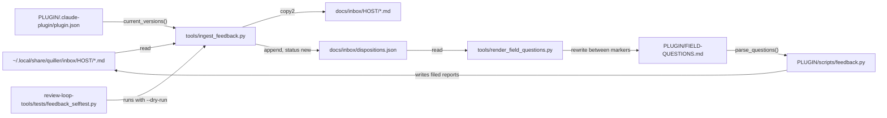
```mermaid
flowchart LR
    DROP["~/.local/share/quiller/inbox/HOST/*.md"]
    FB["PLUGIN/scripts/feedback.py"]
    ING["tools/ingest_feedback.py"]
    PJ["PLUGIN/.claude-plugin/plugin.json"]
    INB["docs/inbox/HOST/*.md"]
    DISP["docs/inbox/dispositions.json"]
    RFQ["tools/render_field_questions.py"]
    FQ["PLUGIN/FIELD-QUESTIONS.md"]
    ST["review-loop-tools/tests/feedback_selftest.py"]
    FB -->|"writes filed reports"| DROP
    DROP -->|"read"| ING
    PJ -->|"current_versions()"| ING
    ING -->|"copy2"| INB
    ING -->|"append, status new"| DISP
    DISP -->|"read"| RFQ
    RFQ -->|"rewrite between markers"| FQ
    FQ -->|"parse_questions()"| FB
    ST -->|"runs with --dry-run"| ING
```

### 6.4 `docs/inbox/loop-usage.py` (170 lines)

Counted by the survey under `docs`, and not a tool of this repo: it is the
field agent's original measurement script, delivered with the 2026-09-09
reports. The shipped `loop_usage.py` replaced it (section 4.7). Nothing in
the repo invokes it.

### 6.5 Gaps in the tooling (verified by reading and by running)

- **No test for `render_field_questions.py`**, and only the dry-run path of
  `ingest_feedback.py` is tested. The copy, conflict and register-write
  paths have never run against a real report (section 5.6).
- **Arch-docs reports digest poorly.** The Cost table reads `rounds.count`,
  `stop.headline` and `usage_reported.total`, none of which
  `arch_summary.py` writes, so an arch-docs row shows dashes for rounds,
  stop, reported tokens and ratio; the `objective` block that carries
  arch-docs' numbers (survey, split, documents, lint, coverage) is never
  printed by `digest()`.
- **Every report filed against an older release is flagged STALE** once a
  newer one is committed, because the comparison is against the repo's
  current `plugin.json` (`:229-231`). With field installs lagging releases
  (section 7.4) this will be the usual state; the flag means "re-check
  against current code", not "discard".
- **An id with a non-numeric version is not recognised.** `feedback.py`
  falls back to the string `unknown` when it cannot read a plugin version
  (`:374`); `ID_RE` requires three dot-separated numbers, so items from such
  a report would be parsed as zero items. Checked directly:
  `ID_RE.fullmatch("rl-unknown-20260927-host-1")` is `None`.
- **The drop is never pruned** and is machine-local; a report from another
  machine must be carried over and passed as a path argument (BACKLOG.md
  records both as open).

---

## 7. How the repo itself is developed

### 7.1 From approval to a release in the field

HANDOFF.md section 1 calls the process "the loop behind the loops": ingest,
digest, numbered proposal, approval, build, smoke test, release. Sections 5.3
and 5.4 cover the first half; this is the second.

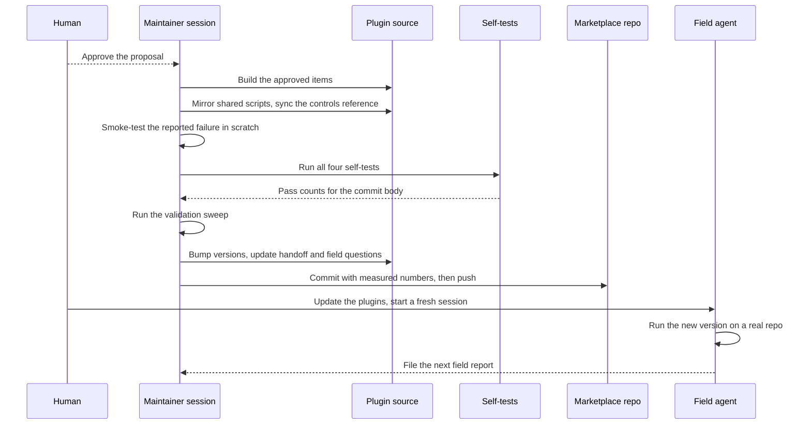
```mermaid
sequenceDiagram
    participant H as Human
    participant M as Maintainer session
    participant PS as Plugin source
    participant ST as Self-tests
    participant MR as Marketplace repo
    participant FA as Field agent

    H-->>M: Approve the proposal
    M->>PS: Build the approved items
    M->>PS: Mirror shared scripts, sync the controls reference
    M->>M: Smoke-test the reported failure in scratch
    M->>ST: Run all four self-tests
    ST-->>M: Pass counts for the commit body
    M->>M: Run the validation sweep
    M->>PS: Bump versions, update handoff and field questions
    M->>MR: Commit with measured numbers, then push
    H->>FA: Update the plugins, start a fresh session
    FA->>FA: Run the new version on a real repo
    FA-->>M: File the next field report
```

Sources: HANDOFF.md sections 1, 2, 6 and 7. Two complete cycles since the
previous overview, both committed on 2026-09-27:

| Release | Proposal | Approval | What it was |
|---|---|---|---|
| `aed07f8` — review 0.15.0, qa 0.16.0, arch-docs 0.3.0 (60 files, +9,337 / -111) | `docs/proposal-agent-feedback-process.md` | "Go", 2026-09-26 | the feedback process itself; the commit states it carries no fix from a field report |
| `5e5dfd9` — review 0.16.0, qa 0.17.0, arch-docs 0.3.1 (42 files, +2,023 / -254) | `docs/proposal-2026-09-27-weatherapp-0.14.0-report.md` | "go", 2026-09-27 | six defects from the first report filed against 0.14.0; arch-docs is a shared-script sync only |

A third, smaller change followed as `ce143a5`: review 0.16.1, one prompt fix
to the reviewer agent. Its source is not a field report but the documenter
that regenerated these documents (HANDOFF.md state line, lines 9-16).

Both proposals carry an "As built" section listing where the build departs
from the approved text. The second commit records that all six items were
verified against the 0.15.0 tree before anything was proposed, that three
were reproduced with the real scripts, and that one of the report's
diagnoses was wrong (the hygiene check does scan archives).

### 7.2 The rituals

| # | Ritual (HANDOFF.md section 2) | Automated check |
|---|---|---|
| 1 | Bump `plugin.json` on every user-visible change; keep the allowlist stamp at the release that last changed the template | `feedback_selftest.py:86-92` checks the stamp is no newer than the version |
| 2 | Author shared scripts in review, mirror to qa (and four to arch-docs); `cmp` before every commit | none for the scripts (section 3.5) |
| 3 | Root `CONTROLS.md` is canonical, cp-synced into both loop plugins | `panel_selftest.py:1240-1247` |
| 4 | Validation sweep: JSON parses, Python parses, `bash -n`, no absolute home paths | manual; a grep at HEAD finds none in shipped files |
| 5 | Smoke-test against the exact reported failure, in scratch outside the repo; all four self-tests pass | the self-tests themselves |
| 6 | Keep the "(measured: …)" style in prompts | none |
| 7 | Driver backends live in `qa-loop-tools/drivers/<backend>/`; never build inside the plugin cache | none |
| 8 | Keep HANDOFF.md current in the same commit; revise each `FIELD-QUESTIONS.md` and regenerate its third section | `tools/render_field_questions.py --check` |

Commit style (HANDOFF.md section 7): `feat|fix|docs: <plugins+versions> —
<driver>`, the body carrying the evidence. Measured over the 66 commits at
HEAD: 50 subjects start with `feat`, `fix`, `docs` or `chore`; the other 16
are the review loop's own round commits (`review-loop round N: …`), two
consent-hardening commits, one `.gitignore` commit and two early commits.

### 7.3 The `docs/` layout

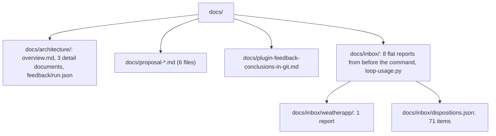
```mermaid
flowchart TB
    DOCS["docs/"]
    ARCH["docs/architecture/: overview.md, 3 detail documents, feedback/run.json"]
    PROP["docs/proposal-*.md (6 files)"]
    MEMO["docs/plugin-feedback-conclusions-in-git.md"]
    INBOX["docs/inbox/: 8 flat reports from before the command, loop-usage.py"]
    HOSTD["docs/inbox/weatherapp/: 1 report"]
    DISP["docs/inbox/dispositions.json: 71 items"]
    DOCS --> ARCH
    DOCS --> PROP
    DOCS --> MEMO
    DOCS --> INBOX
    INBOX --> HOSTD
    INBOX --> DISP
```

| Path | What it holds | Status at HEAD |
|---|---|---|
| `docs/proposal-2026-09-09-field-reports.md` | the 0.13.0 pair, from three reports | built |
| `docs/proposal-2026-09-20-panel-field-reports.md` | review 0.14.0 / qa 0.15.0, from four panel reports | "BUILT and shipped 2026-09-20" |
| `docs/proposal-agent-feedback-process.md` | the feedback process | "BUILT 2026-09-26" |
| `docs/proposal-2026-09-27-weatherapp-0.14.0-report.md` | review 0.16.0 / qa 0.17.0 | "BUILT 2026-09-27" |
| `docs/proposal-multi-provider-review-panel.md` | the review panel | status line still reads "phase 1 implemented (review-loop-tools 0.11.0) — awaiting commit approval" although the panel has shipped |
| `docs/proposal-grok-review-lane.md` | a Grok lane for the panel | "PARKED", nothing built |
| `docs/plugin-feedback-conclusions-in-git.md` | the field memo behind the allowlist | shipped as review 0.10.0 / qa 0.12.0 |
| `docs/inbox/*.md` (flat) | eight reports delivered by hand before the command existed, under several naming schemes | seven are sources for 65 register items; `qa-loop-decisions-2026-09-09.md` contributes none |
| `docs/inbox/<host>/` | the layout ingest writes | one host, one file (section 5.6) |
| `docs/inbox/dispositions.json` | the register (`schema`, `notes`, `items`) | 71 items |
| `docs/architecture/` | these documents | regenerated 2026-09-27 |

### 7.4 Install and cache lifecycle

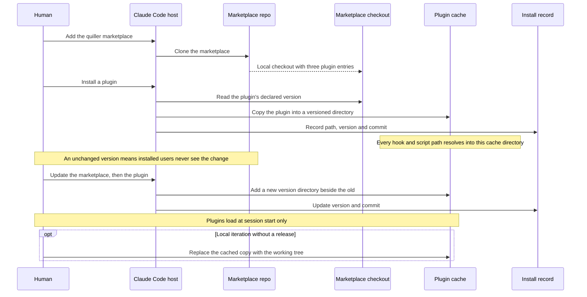
```mermaid
sequenceDiagram
    participant H as Human
    participant CC as Claude Code host
    participant GH as Marketplace repo
    participant MK as Marketplace checkout
    participant CA as Plugin cache
    participant IR as Install record

    H->>CC: Add the quiller marketplace
    CC->>GH: Clone the marketplace
    GH-->>MK: Local checkout with three plugin entries
    H->>CC: Install a plugin
    CC->>MK: Read the plugin's declared version
    CC->>CA: Copy the plugin into a versioned directory
    CC->>IR: Record path, version and commit
    Note over CA: Every hook and script path resolves into this cache directory
    Note over H,GH: An unchanged version means installed users never see the change
    H->>CC: Update the marketplace, then the plugin
    CC->>CA: Add a new version directory beside the old
    CC->>IR: Update version and commit
    Note over H,CA: Plugins load at session start only
    opt Local iteration without a release
        H->>CA: Replace the cached copy with the working tree
    end
```

Sources: HANDOFF.md ritual 1 and section 6; README.md "Install"; the local
plugin store, inspected read-only. Inference: the host's internal steps
(clone, read version, copy) are reconstructed from the files it leaves
behind — `known_marketplaces.json`, `installed_plugins.json` (`installPath`,
`version`, `gitCommitSha`) and the cache tree — not from host documentation.

Observed on 2026-09-27: the install record lists `review-loop-tools 0.14.0`,
`qa-loop-tools 0.15.0` and `arch-docs-tools 0.2.0`, all at commit `949110b`,
last updated 2026-09-20. The cache holds review `0.10.0 0.12.0 0.13.0
0.14.0`, qa `0.10.0 0.12.0 0.14.0 0.15.0`, arch-docs `0.1.0 0.2.0`. Local
`main` is level with `origin/main`, so both releases are pushed, but the
pickup ritual has not been run here. Consequences:

- Sessions on this machine that load plugins from the cache run hooks two
  releases old: the count-based stall guard (section 4.1) and all of the
  feedback path are not active in them.
- The installed `arch-docs-tools 0.2.0` has no `arch_summary.py`. The start
  marker `docs/architecture/feedback/run.json` exists, so this docs run used
  the working-tree scripts; the lint script given to this documenter was the
  working-tree copy.
- Old versions are never removed by the plugins. That is a settled decision
  ("the plugin never prunes the plugin cache", HANDOFF.md section 3), and
  the reason briefs name script paths and `mutate.py` refuses to run beside
  a newer version.

---

## 8. Other cross-deliverable flows

### 8.1 The shared hook-enforcement model (one generic round)

Identical in both loop plugins except for the loop-dir argument. The five
scripts that read `.phase` exit 0 when the file is absent, so an installed
but idle plugin costs nothing.

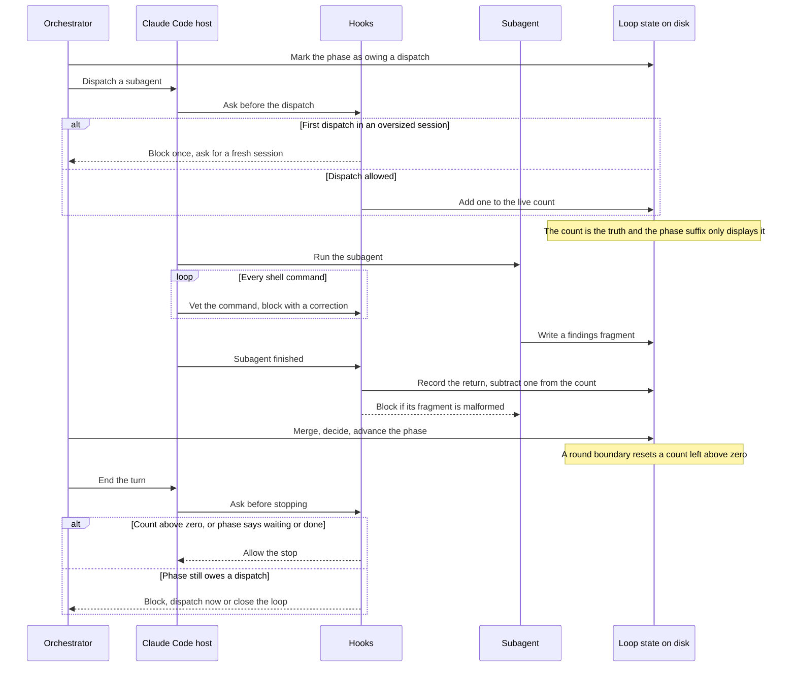
```mermaid
sequenceDiagram
    participant O as Orchestrator
    participant CC as Claude Code host
    participant HK as Hooks
    participant SA as Subagent
    participant LS as Loop state on disk

    O->>LS: Mark the phase as owing a dispatch
    O->>CC: Dispatch a subagent
    CC->>HK: Ask before the dispatch
    alt First dispatch in an oversized session
        HK-->>O: Block once, ask for a fresh session
    else Dispatch allowed
        HK->>LS: Add one to the live count
    end
    Note over LS: The count is the truth and the phase suffix only displays it
    CC->>SA: Run the subagent
    loop Every shell command
        CC->>HK: Vet the command, block with a correction
    end
    SA->>LS: Write a findings fragment
    CC->>HK: Subagent finished
    HK->>LS: Record the return, subtract one from the count
    HK-->>SA: Block if its fragment is malformed
    O->>LS: Merge, decide, advance the phase
    Note over LS: A round boundary resets a count left above zero
    O->>CC: End the turn
    CC->>HK: Ask before stopping
    alt Count above zero, or phase says waiting or done
        HK-->>CC: Allow the stop
    else Phase still owes a dispatch
        HK-->>O: Block, dispatch now or close the loop
    end
```

Sources: both `hooks/hooks.json` (`PreToolUse` matcher `Agent|Task` →
`dispatch_stamp.sh <dir> 2`; `PreToolUse` matcher `Bash` →
`commit_guard.sh <dir>` then `read_guard.sh <dir>`; `SubagentStop` →
`subagent_guard.sh <dir>`; `Stop` → `loop_guard.sh <dir>`;
`UserPromptSubmit` → `session_guard.sh 2`). The gate is the 2 MB transcript
threshold in `dispatch_stamp.sh:71-91`, acknowledged by `briefs/.session-ok`.
Fragment validation (`subagent_guard.sh:66-186`) applies only while the phase
contains `review` or `testing`, with a 10-second grace for a file still being
written; during a phase containing `closeout` a closeout fragment must also
carry `suites`. The stop decision is `loop_guard.sh:32-56`. Both hooks also
record the dispatch's start and return for the run record (section 5.2).

Not shown: `session_guard.sh` on `UserPromptSubmit` warns when a prompt
naming either loop arrives in a transcript over 2 MB. It is the one hook
registered without a loop-dir argument (section 9.5).

### 8.2 A review loop run on this repo itself (historical)

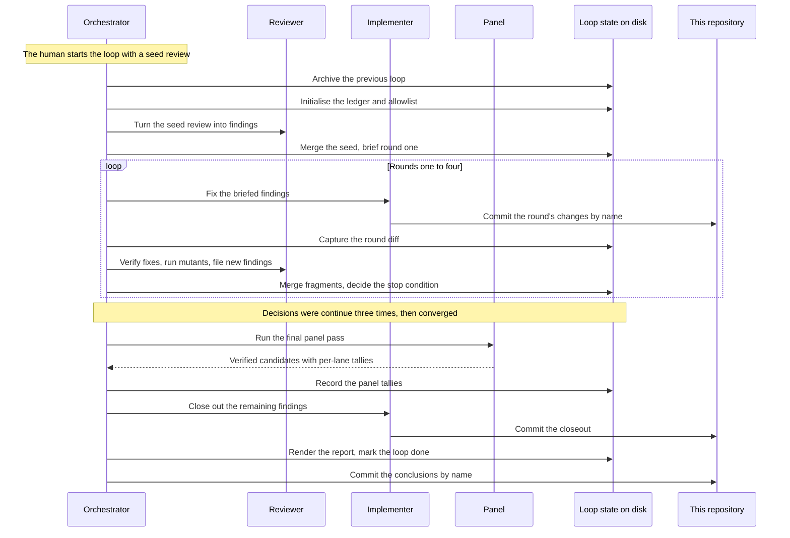
```mermaid
sequenceDiagram
    participant O as Orchestrator
    participant RV as Reviewer
    participant IM as Implementer
    participant PN as Panel
    participant LS as Loop state on disk
    participant RP as This repository

    Note over O: The human starts the loop with a seed review
    O->>LS: Archive the previous loop
    O->>LS: Initialise the ledger and allowlist
    O->>RV: Turn the seed review into findings
    O->>LS: Merge the seed, brief round one
    loop Rounds one to four
        O->>IM: Fix the briefed findings
        IM->>RP: Commit the round's changes by name
        O->>LS: Capture the round diff
        O->>RV: Verify fixes, run mutants, file new findings
        O->>LS: Merge fragments, decide the stop condition
    end
    Note over O,LS: Decisions were continue three times, then converged
    O->>PN: Run the final panel pass
    PN-->>O: Verified candidates with per-lane tallies
    O->>LS: Record the panel tallies
    O->>IM: Close out the remaining findings
    IM->>RP: Commit the closeout
    O->>LS: Render the report, mark the loop done
    O->>RP: Commit the conclusions by name
```

Sources: `.review-loop/` holds the tracked conclusions of two runs of
`review-loop-tools` against this repo, made between 2026-09-09 and
2026-09-13, before 0.14.0:
`archive/panel-feature-loop-2026-09-09/` (stopped `backstop` after round 2,
18 findings, 583,667 reported tokens) and the live state (four rounds plus
closeout, stopped `converged`, 27 findings, 757,618 reported tokens, panel
final pass with codex 4 filed / 3 confirmed and gemini 8 filed / 3 confirmed
/ 2 demoted; `.phase` is `done`). Round commits `5f8b1a6`, `47fe2a7`,
`0c4258c`, `15c45f1`, closeout `a29a48a`, converge commit `46594dc`; two
findings left at closeout were fixed afterwards in `907074b` and `9baf5ae`.

This state **predates the current data model** and must not be read as an
example of it: the allowlist is stamped v0.11.0 and has no `feedback/`
rules, there is no `feedback/` directory, no `briefs/.dispatched`, and the
ledger has no `round_end_shas`. It remains useful as evidence for one defect
that is still present (section 9.1).

### 8.3 arch-docs-tools generating these documents

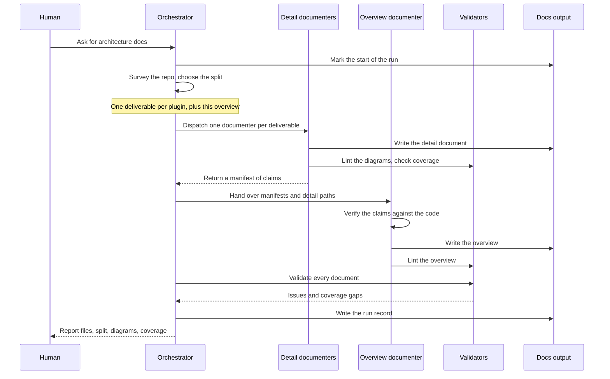
```mermaid
sequenceDiagram
    participant H as Human
    participant O as Orchestrator
    participant D1 as Detail documenters
    participant D2 as Overview documenter
    participant V as Validators
    participant OUT as Docs output

    H->>O: Ask for architecture docs
    O->>OUT: Mark the start of the run
    O->>O: Survey the repo, choose the split
    Note over O: One deliverable per plugin, plus this overview
    O->>D1: Dispatch one documenter per deliverable
    D1->>OUT: Write the detail document
    D1->>V: Lint the diagrams, check coverage
    D1-->>O: Return a manifest of claims
    O->>D2: Hand over manifests and detail paths
    D2->>D2: Verify the claims against the code
    D2->>OUT: Write the overview
    D2->>V: Lint the overview
    O->>V: Validate every document
    V-->>O: Issues and coverage gaps
    O->>OUT: Write the run record
    O-->>H: Report files, split, diagrams, coverage
```

Sources: `arch-docs-tools/skills/arch-docs/SKILL.md` (six stages) and
`arch-docs-tools/agents/arch-documenter.md` (DETAIL and OVERVIEW modes, the
manifest contract). The per-plugin split is the orchestrator's judgment:
`plugin.json` is not a manifest type `repo_survey.py` detects, and the only
manifest the survey reports is
`qa-loop-tools/drivers/ios-xcuitest/QADriver.xcodeproj`. `tools/` belongs to
no deliverable, which is why it is inventoried in this overview. Coverage at
HEAD, run against this directory: 37 source files, 37 mentioned — a number
that section 9.7 qualifies.

---

## 9. Inconsistencies and cross-cutting debt (verified)

Each item was checked against the code on 2026-09-27. Where the same item
appears in a detail document, that document has the fuller account. Since
the 0.16.1 revision, the first section of `BACKLOG.md` ("Found by the
documenters, 2026-09-27") lists the open code and test findings from this
section and from sections 4.9, 5.6 and 6.5, marked there as unverified until
a proposal takes them. Four documentation items were resolved in 0.16.1
(`ce143a5`); section 9.8 marks them.

### 9.1 `union_evidence()` discards list-shaped evidence — in both copies

`review-loop-tools/scripts/merge_ledger.py:170-181` (the qa copy at
`:169-180` is the same text):

```python
def union_evidence(old, new):
    if not isinstance(old, dict):
        old = {}
    if not isinstance(new, dict):
        return old
```

`subagent_guard.sh:159-167` accepts a new finding's evidence as a non-empty
list of strings **or** an object with `screenshots` / `repro` /
`measurements`, so review's reviewers legitimately write lists. The first
insertion stores the fragment as written; any later update of that finding
goes through the merge (review `:980`, qa `:912`). Called directly,
`union_evidence(["a.py:1"], ["b.py:2"])` and
`union_evidence(["a.py:1"], None)` both return `{}`. Measured in the tracked
ledgers: 18 of 27 findings in `.review-loop/ledger.json` and 16 of 18 in the
archived loop have `evidence: {}`. qa's object-shaped evidence is unioned
correctly. The function is shared, the damage is review-only, and the fix
belongs in the authoring copy.

### 9.2 qa never calls `next-round`, so three shared behaviours are unreachable there

The qa skill invokes `merge_ledger.py` with the verbs `resolve`,
`set-round`, `open`, `archive`, `notes-rotate`, `consulted`, `anomaly` and
the bare merge, and runs `qa_metrics.py` directly (grep over
`qa-loop-tools/skills/` and `qa-loop-tools/agents/`). `next-round` appears in
the qa skill only in prose. Consequences:

- `round_end_shas` is never written for a qa loop.
- The live-dispatch count is reset for qa only by `set-round`.
- The note that records an unattended default in `rounds.md` is written by
  `next-round` (`merge_ledger.py:660-663`). `qa-loop-tools/skills/qa-loop/SKILL.md:483`
  and `CONTROLS.md:472-479` both tell the qa operator that setting
  `QA_LOOP_UNATTENDED=1` makes "next-round" record it. Under the qa skill's
  own procedure that record is never made.

### 9.3 `subagent_guard.sh` counts before it validates, and its phase filter skips one qa phase

The decrement loop (`:33-64`) and the return record (`:17-21`) run before
the validation loop (`:66-186`). Inference: when a malformed fragment blocks
a subagent from finishing and the host fires the hook again on its next
stop, that one dispatch is decremented twice and logged as two returns. The
ordering is verified; the double firing depends on host behaviour that was
not tested here.

The validation filter is `*review*|*testing*` (`:69`). The qa phase
`round-N-regression-tests` matches neither pattern, and the qa skill
(`SKILL.md:404-408`) has the regression-test writer produce
`fragments/round-N-regression.json` in that phase, so that fragment is never
validated at return. The review side of this gap is closed: 0.16.0 gave the
closeout reviewer its own phase, `round-N-closeout-review`
(`review-loop-tools/skills/review-loop/SKILL.md:366`), which matches
`*review*`.

### 9.4 `commit_guard.sh` without jq, and outside a loop

With jq missing, `cmd` stays empty. The staging rules are skipped and the
anomaly `commit-guard-no-jq` is recorded once (`:42-45`), but the later
`case` has an explicit empty-string arm (`:76`) that falls through to the
`REVIEW_LOOP_MAX_DIFF` and `REVIEW_LOOP_TEST_CMD` checks (`:80-93`). So with
`REVIEW_LOOP_TEST_CMD` set and jq absent, the test command runs on **every**
Bash call. The script's own comment at `:43` says every rule below fails
open, which is true of the staging rules only. `CONTROLS.md` mentions jq only
as an anomaly code.

Separately, those two environment checks are not gated on a live loop
(`live` is consulted only for the staging rules), so they apply to every
`git commit` in any session where a loop plugin is enabled and the variable
is set. `CONTROLS.md:463-471` describes the first as blocking "any
implementer commit" and the second as gating "any commit". Both points hold for both plugins, the script being identical.

Still true from the previous overview: the staging match is a textual grep
over the whole command, without the heredoc and quoted-string stripping that
`read_guard.sh` applies, and `awaiting-human` keeps the staging rules armed.

### 9.5 Hook defaults against `hooks.json`

Five of the six hooks are passed their plugin's loop directory, so the two
plugins do not police each other. `session_guard.sh` is passed only its
threshold, so from either plugin it watches both `.review-loop` and
`.qa-loop` (`:14`), and a `briefs/.session-ok` in either silences the warning
for both (`:15-17`). With both plugins installed it runs twice per prompt.
`CONTROLS.md:203` says "each plugin's hooks guard only their own loop
directory", which is accurate for five of six.

The session-size gate in `dispatch_stamp.sh` is evaluated only for a dispatch
under a bare live phase: the `:waiting:` and `:dispatched` branches exit at
`:64-70`, before the gate at `:71`. A loop whose first dispatch happens under
`:waiting:` is never gated.

### 9.6 The third plugin is a second-class citizen of the shared process

- `CONTROLS.md` names `/arch-docs-tools:feedback` but is not shipped in
  arch-docs and has no tag for "all three".
- `feedback.py` finds the repo root with git and, outside a git repo, falls
  back to the parent of the directory it was given (`:104-112`). For
  `.review-loop` that is the repo; for `docs/architecture` it is `docs`, so
  the host — and with it the drop directory and every item id — would be
  named `docs`. `arch_summary.py:29-37` falls back to the current directory
  instead, so the two disagree about the host in that case.
- Arch-docs has no dispatch timing (no hooks), no tests, no settled-decision
  patterns in ingest (section 4.9) and no useful row in the ingest cost
  table (section 6.5).
- The 0.3.1 release exists only to keep two mirrored files identical; both
  changes (one anomaly code for `mutate.py`, two hygiene kinds in
  `run_summary.py`) are in code arch-docs never reaches (section 3.3). That
  is the cost of mirroring whole files: a plugin is re-released for changes
  that cannot affect it.
- The three feedback skills record a deviation differently: the loops with
  `merge_ledger.py anomaly <dir> "<line>"`, arch-docs with
  `field_log.py anomaly <dir> workaround "<line>"`.

### 9.7 arch-docs measurement blind spots (relevant to these documents)

- `repo_survey.py` counts `.sh`; `coverage_check.py` does not. In this repo
  that is 18 shell files and 1,768 lines — all seven hook and hygiene
  scripts in each loop plugin, `nfr_sampler.sh`, `provision_workers.sh`, and
  the driver's `start.sh` and `stop.sh`. Hence 55 surveyed files against 37
  in coverage. BACKLOG.md records the disagreement as open.
- `coverage_check.py:44` matches a file by relative path **or basename**
  against the pooled text of every document in the folder. One mention of
  `feedback.py` anywhere marks all three copies covered, so "37 of 37" says
  less than it appears to.
- Neither script sees Markdown or JSON, so the skills, agent prompts and
  `hooks.json` — the control logic — are invisible to both.
- `mermaid_lint.py` has four gaps, each reproduced with a scratch file: a
  quoted alias on an `actor` line is not flagged (only `participant` is
  matched, `:53`); a semicolon in a `loop` / `alt` / `opt` label is not
  flagged (`SEQ_TEXT` covers notes and messages only, `:39-40`); an unquoted
  diamond label containing parentheses is not flagged (only square-bracket
  labels are checked, `:62`); and a cylinder node written `[(Database)]` is
  reported as needing quotes, a false positive.

### 9.8 Documentation drift

Open at 0.16.1 (`ce143a5`):

| Where | What it says | What the tree shows |
|---|---|---|
| HANDOFF.md section 5 | the feedback process "SHIPPED 2026-09-26" | built and approved on the 26th, committed 2026-09-27 09:56 (`aed07f8`) |
| `docs/proposal-multi-provider-review-panel.md` | "awaiting commit approval" | the panel shipped in 0.11.0 and has been revised by three releases since |
| `qa-loop-tools/README.md` | reported stale in seven places by the qa detail document (its section 6.5) | not re-verified here |

Resolved in 0.16.1 at `ce143a5` (found at `5e5dfd9`, re-read after the
change):

| Where | What it said at `5e5dfd9` | What it says now |
|---|---|---|
| HANDOFF.md ritual 2, "CAVEAT" | `subagent_guard.sh` was listed with `merge_ledger.py` and `render_report.py` as no longer byte-identical, contradicting the sentence before it and `cmp` | **resolved**: the caveat names the two Python scripts only and adds that `subagent_guard.sh` "diverged for a time and is identical again" (HANDOFF.md:148-153); `cmp` still shows the two copies identical |
| HANDOFF.md ritual 1 | `feedback_selftest.py` asserts the stamp is the current version, so the next release that leaves the template alone must relax the check | **resolved**: it now says the test asserts a stamp no newer than the plugin and the presence of the `feedback/` rules, and records that 0.16.0 relaxed the equality (HANDOFF.md:132-136), which matches `feedback_selftest.py:86-92` |
| HANDOFF.md state line | the architecture docs were "NOT yet regenerated since 0.14.0/0.15.0/0.2.0" | **resolved**: it records the regeneration of 2026-09-27 against 0.16.0 / 0.17.0 / 0.3.1 at `5e5dfd9` (HANDOFF.md:38-43) and names 0.16.1 as the current review version (HANDOFF.md:9); the matching "Regenerate `docs/architecture/`" entry is gone from BACKLOG.md |
| `review-loop-tools/agents/skeptical-reviewer.md` | lines 116-120 said a long manifest runs detached or with a subset, without copying it; lines 140-144 said to split it into verbatim copies and never background the run | **resolved in review-loop-tools 0.16.1**: the second passage is now one sentence, "never copy or split its manifest: a long one runs detached, a few mutants re-run with `--only`" (lines 141-143), which agrees with lines 116-120 and with `implementer.md:102-106`. HANDOFF's state line gives the cause: 0.16.0 rewrote the implementer's paragraph and missed the reviewer's |

### 9.9 Conventions that are consistent (worth preserving)

- "(measured: …)" rationale in prompts and script comments; every hook
  script's header cites the incident it exists for.
- Explicit-path staging, the default-closed allowlist, and
  `${CLAUDE_PLUGIN_ROOT}` routing. A grep for absolute home paths over the
  shipped plugins, `tools/` and the root Markdown files finds only the
  sentence in HANDOFF.md that forbids them.
- Telemetry that cannot change behaviour, and a record that carries counts
  rather than content, so a report can leave the host repo.
- Proposals that record what was declined and why, and an "As built"
  section where the build departs from the approved text.

---

## 10. Manifest claims: what held and what did not

The three detail documenters handed over claims. Each one this overview
relies on was checked; the table says how.

| Claim | From | Result | How checked |
|---|---|---|---|
| Six hooks and `hygiene_check.sh` identical in qa; four feedback scripts identical in qa and arch-docs | review, qa, arch | **confirmed** | `cmp` on every pair |
| `merge_ledger.py` and `render_report.py` differ by panel code only, 72 and 35 lines | review, qa | **confirmed** | `diff`; every hunk read (72 and 35 are changed lines; `diff` prints 79 and 37) |
| 13 of qa's 19 scripts are mirrors, 11 identical | qa | **confirmed** | directory listing plus `cmp` |
| `CONTROLS.md` identical in three places, root canonical | review | **confirmed** | `cmp`, `md5` |
| Allowlist tracks `feedback/` since 0.15.0 / 0.16.0 | review, qa | **confirmed** | both skill templates |
| The live count is the source of truth since 0.16.0 / 0.17.0 | review, qa | **confirmed** | the three hook scripts and `merge_ledger.py:96-116` |
| Item id format | review | **confirmed** | `feedback.py:402`, `:502-532` |
| 27 anomaly codes, 6 of them qa-only | review | **confirmed, with a caveat** | 27 by import; the code does not tag codes by plugin — "qa-only" follows `CONTROLS.md` and the codes' meaning |
| Effective-token formula | review | **confirmed** | `loop_usage.py:81-85` |
| `union_evidence()` returns `{}` for list evidence | review | **confirmed** | called directly; both tracked ledgers |
| Review copies carry qa-only branches | review | **confirmed** for `is_qa`, `notes-rotate`, `nfr_analyze`, coverage, `*.results.json`, qa anomaly codes, the xcode probe; the persona matrix was not checked | reading |
| qa copies carry dormant review code | qa | **confirmed** for the round-diff read rule, `next-round`, `seed*`, `lane-*` / `mutate-*` codes, panel and suites handling | reading |
| qa never calls `next-round` | qa | **confirmed**, and extended: the qa skill and `CONTROLS.md` both promise a record only `next-round` writes | grep, reading |
| The `tools` block in qa briefs holds only `nfr_analyze` | qa | **confirmed** | `shipped_tools()` emits a key only when the file exists beside it |
| `commit_guard.sh` without jq runs the environment checks on every Bash call | review | **confirmed**, and extended: those checks are not gated on a live loop at all | reading |
| `subagent_guard.sh` decrements before validating, so a blocked fragment can cost two counts | review | **ordering confirmed; the double count is an inference** about host behaviour | reading |
| The session-size gate is skipped under `:waiting:` and `:dispatched` | review | **confirmed** | `dispatch_stamp.sh:63-71` |
| `session_guard.sh` watches both loop directories | qa | **confirmed** | `hooks.json`, `session_guard.sh:14-17` |
| `hooks.json` has the same shape in both loop plugins | qa | **confirmed** | `diff`: five lines, all the directory argument |
| A detached panel run that exits early never writes the summary, and `wait` then exits 3 indefinitely | review | **confirmed** by reading: the summary is written only at `panel_review.py:1104-1109`, the early returns at `:1000-1012` skip it, and `wait` polls for the file without checking the process | reading; not executed |
| `mutate.py` hard-codes `.review-loop` for telemetry | review | **confirmed** | `mutate.py:107` |
| `skeptical-reviewer.md` contradicts itself on splitting a manifest | review | **confirmed at `5e5dfd9`; line numbers corrected** — the passages were at 116-120 and 140-144, where the manifest gave 118-120 and 141-145. **Fixed in 0.16.1 at `ce143a5`** (section 9.8) | both passages read at `5e5dfd9`; the replacement sentence read at `ce143a5` |
| HANDOFF.md calls `subagent_guard.sh` not identical, and describes a stamp check 0.16.0 relaxed | review | **confirmed at `5e5dfd9`**, both. **Both corrected in 0.16.1 at `ce143a5`** (section 9.8) | `cmp`; `feedback_selftest.py:86-92`; `git show ce143a5 -- HANDOFF.md` |
| This repo's `.review-loop/` predates 0.14.0 | review | **confirmed** | stamp v0.11.0, no `feedback/`, no `round_end_shas` |
| Three scripts depend on undocumented host layouts | review | **confirmed** for `loop_usage.py` and `run_summary.py`; `mutate.py`'s version check was not read | reading |
| Self-test counts 137 / 51 / 19 / 94 | review | **confirmed** | run on 2026-09-27 |
| Self-tests live only in `review-loop-tools/tests/` | qa | **confirmed** | directory listing |
| `feedback_selftest.py` accepts only the two loop plugins | arch | **confirmed in effect**: nothing validates the argument, but the test assumes a loop plugin throughout | reading |
| arch-docs adds `run.json` and never writes `dispatches.jsonl` | arch | **confirmed** | `arch_summary.py:196-204`; no hooks directory |
| Summary schema: shared and differing keys | arch | **confirmed**, and extended: the ingest digest reads keys the arch summary lacks | both `build()` functions, `digest()` |
| `SOURCE_EXT` identical in `coverage_check.py` and `hotspots.py` | arch | **confirmed** | both literals read: the same 20 |
| `feedback.py` names the host `docs` outside git | arch | **confirmed** by reading; not executed | `feedback.py:104-112`, `:376` |
| arch-docs ships no hooks | arch | **confirmed** | directory listing |
| 18 `.sh` files, 1,768 lines; 55 surveyed against 37 covered | arch | **confirmed** | `find`, the survey, `coverage_check.py` run |
| Coverage matches by basename across the pooled folder | arch | **confirmed** | `coverage_check.py:24-33`, `:44` |
| 0.3.1 is sync-only and its changes are unreachable in arch-docs | arch | **confirmed** | `git show 5e5dfd9` for the two files; `arch_summary.py` imports |
| The register holds 71 items: 50 review, 21 qa, 0 arch-docs | arch | **confirmed** | counted with a script |
| Four `mermaid_lint.py` gaps | arch | **confirmed** | a scratch file with all four |
| `qa-loop-tools/README.md` is stale in seven places | qa | **not re-verified** | — |

No manifest claim was found to be false in substance when checked at
`5e5dfd9`. Three of them describe things 0.16.1 (`ce143a5`) has since
corrected (the reviewer prompt and the two HANDOFF statements). One cited
line numbers that were off by a line or two (the reviewer prompt). Two were
narrower than the code warranted (the jq claim and the `next-round` claim,
both extended above). One rests partly on an inference (the double
decrement). Two were confirmed by reading only and not executed (the
detached panel run, the `docs` host name). One was not checked at all (the
qa README), and two were checked in part (the persona matrix and
`mutate.py`'s version check were not read).

---

## 11. What the previous overview said that was wrong or has gone stale

| Previous statement | Now |
|---|---|
| Header: written against 0.13.0 / 0.14.0, revised against 0.14.0 / 0.15.0 / 0.1.0 at `03047f0`; "the detail documents have not been revised" | 0.16.1 / 0.17.0 / 0.3.1, verified at `5e5dfd9` and revised for 0.16.1 at `ce143a5`; all three detail documents regenerated |
| The header gave the repo's absolute path | removed; paths are relative to the repo root |
| Eight scripts mirrored, `hygiene_check.sh` "an undocumented ninth mirror" | thirteen mirrored into qa, four of them also into arch-docs; HANDOFF.md now lists `hygiene_check.sh` |
| `render_report.py` differs by 36 output lines / 34 changed | 37 / 35 |
| `arch-docs-tools` shares only the plugin layout and is absent from HANDOFF rituals 2-3, BACKLOG.md and CONTROLS.md (`grep -c` = 0) | it shares four scripts, the feedback command and `FIELD-QUESTIONS.md`; it is in ritual 2; `grep -c arch-docs` gives 7 in HANDOFF.md, 7 in BACKLOG.md, 1 in CONTROLS.md. Still true: it ships no `CONTROLS.md` and ritual 3 does not cover it |
| `:dispatched` is written as `1` on the first dispatch; `:waiting:` is left alone by the hooks | the bare-phase branch adds to the existing count, and a dispatch under `:waiting:` is counted |
| The Stop hook allows a stop on `:waiting:`, `:dispatched`, `done`, `awaiting-human` and blocks on a bare phase | it also allows a stop on a bare phase when the count is above zero |
| `is_qa` "at line 450" detects qa by the `.qa-loop` basename or the presence of `qa_metrics.py` | line 617; the second test is `qa_metrics.py` present **and** `metrics.py` absent |
| Line numbers for `union_evidence` (`:86-97`, `:85-96`), the merge calls (`:800`, `:732`), `round_end_shas` (`:463`), the allowlist templates, `read_guard.sh:80`, the unattended choice (`:493`) | all moved; current numbers are in sections 3.3, 4.2, 4.3 and 9.1 |
| Allowlist stamps are `v0.12.0` in both skills | `v0.15.0` (review) and `v0.16.0` (qa) |
| Two self-tests: panel 137, hooks 19 | four: panel 137, hooks 51, mutate 19, feedback 94 (twice) |
| "Inference: the review closeout has the same shape" (no phase for the closeout reviewer, so its fragment goes unvalidated) | closed by 0.16.0: the closeout reviewer has the phase `round-N-closeout-review`. The qa half of that finding still holds (section 9.3) |
| Item 6.4.1: `commit_guard.sh` armed by the mere existence of `.phase` | historical; fixed in 0.14.0. Kept only as the remaining points in section 9.4 |
| The feedback cycle: the field agent writes a report, the human delivers a copy to `docs/inbox/` | replaced by sections 5.2 to 5.4: the command files the report, a machine-local drop carries it, `tools/ingest_feedback.py` brings it in |
| `docs/proposal-agent-feedback-process.md` is "proposed, not approved, nothing built" | built and shipped as `aed07f8` |
| `docs/inbox/` holds "six reports plus `loop-usage.py`" | eight flat reports, `loop-usage.py`, `dispositions.json`, and `weatherapp/` with one report |
| "Inference: `docs/inbox/loop-usage.py` is a delivered copy of a field-repo tool" | confirmed by the release commit and `loop_usage.py`'s own docstring; no longer an inference |
| Installed state: review 0.13.0 and qa 0.14.0 at `256dbfd`, "push pending" | review 0.14.0, qa 0.15.0, arch-docs 0.2.0 at `949110b`; HEAD is pushed, pickup not yet run |
| Commit subjects follow `feat\|fix\|docs` "across all 62 commits" | 66 commits; 50 follow the convention and 16 do not (section 7.2). The earlier statement was wrong when written: the review-loop round commits predate it |
| `repo_survey.py` listed among the scripts that call git | it does not; arch-docs touches git through `feedback.py` and `arch_summary.py` |
| `mermaid_lint.py` fails on erDiagram crow's-foot notation, "this overview uses no erDiagram" | fixed in arch-docs 0.2.0 (`mermaid_lint.py:43-44` exempts relationship lines); this overview has one |
| `coverage_check.py` misses "the 12 shell scripts in the loop plugins" | 18 shell files in the repo at HEAD, 16 of them under the two `scripts/` directories and 2 in the driver |
| Survey figures 37 files / 7,067 LOC and 38 / 8,230 | 55 files / 16,277 LOC at HEAD |
| "~1,100 lines of SKILL.md/agent prose" | 2,646 lines |
| `arch-docs-tools` "has a single commit and no field-feedback cycle behind it" | four commits (`e8d248f`, `949110b`, `aed07f8`, `5e5dfd9`); still no field item in the register |
| The system-context diagrams carried command names, API paths and a directory path as node labels | redrawn with plain role names; the identifiers are in the table beneath |

---

## 12. Not covered

This overview does not repeat the per-plugin module inventories, the verb
tables, the verdict precedence, the qa driver protocol or the panel lane
internals — see the detail documents. Not documented anywhere in this
directory:

- `.claude/settings.local.json` — two allowed read-only git commands for the
  maintaining session.
- `.obsidian/` — editor state, ignored by the root `.gitignore`.
- `BACKLOG.md` beyond the entries cited above.
- The content of the tracked `.review-loop/` conclusions beyond what
  sections 8.2 and 9.1 cite.
- The eight legacy reports in `docs/inbox/` and the body of the six
  proposals, beyond their status lines.
- `qa-loop-tools/README.md`'s reported staleness, which was not re-verified.
- Host behaviour that the documents infer rather than observe: the order in
  which the host runs hooks within one batch of tool calls, whether a
  blocked `SubagentStop` fires the hook again, and the host's internal
  install steps. BACKLOG.md lists the first of these as unverified.
