# qa-loop-tools — architecture

*Verified against **qa-loop-tools 0.17.0** (`qa-loop-tools/.claude-plugin/plugin.json`) at repo HEAD **`5e5dfd9`** (2026-09-27), with no uncommitted changes under `qa-loop-tools/`. Written 2026-09-27. Sibling plugins at the same commit: `review-loop-tools` 0.16.0 and `arch-docs-tools` 0.3.1, documented separately; the cross-plugin overview lives in `overview.md`.*

This is a regeneration. The previous version of this file described 0.14.0/0.15.0 (commit `949110b` and earlier). Every path, line number, count and version below was re-read from the working tree; the two releases since then (`aed07f8` = 0.16.0, `5e5dfd9` = 0.17.0) are folded in, and §6.7 lists what the previous version said that no longer holds.

Sources: the code, the prompt files (in a Claude Code plugin the prompts *are* the control logic), `qa-loop-tools/hooks/hooks.json`, the Swift and Python driver sources, and `git log -- qa-loop-tools`. All paths are relative to the repo root. Anything reconstructed rather than read is labelled **Inference**.

---

## 1. What it is

`qa-loop-tools` is a Claude Code plugin that runs a **simulator-driven UX/QA convergence loop** against an iOS app. The main session acts as a plumbing-only orchestrator (`qa-loop-tools/skills/qa-loop/SKILL.md`) that:

1. builds, installs and launches the app on one or more iOS Simulators,
2. dispatches a persona-driven `ux-tester` subagent that drives the app and writes evidence-backed findings,
3. hands auto-routed findings to a `qa-implementer` subagent that fixes and commits,
4. has a `fix-reviewer` subagent adversarially review each round's fixes,
5. optionally turns verified fixes into XCUITest regression tests (`regression-test-writer`),
6. merges everything through deterministic scripts, computes a verdict, and stops on converged / thrashing / stalemate / diminishing / backstop / budget,
7. *(since 0.16.0)* records what the run did — dispatch timing, anomalies, a counts-only run summary — and offers a `/qa-loop-tools:feedback` command that files a field report for the plugin's maintainer.

The plugin ships its own simulator driver (`qa-loop-tools/drivers/ios-xcuitest/`, since 0.14.0): a long-running XCUITest that serves tap/type/screenshot/query commands from a filesystem mailbox, so testers can drive the app from Bash without the per-device human grant the MCP simulator tool needs.

All loop state lives in the *target* repository under `.qa-loop/`; nothing is written into the plugin directory (`SKILL.md` lines 60–61).

### 1.1 Top-level architecture

High-level view: roles, not files. The files behind each box are in §2 and §3.

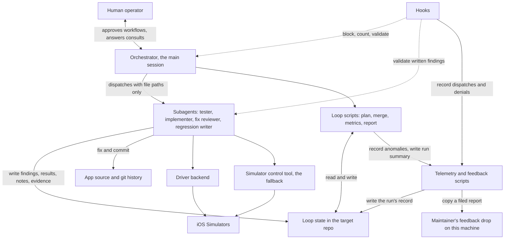
```mermaid
flowchart TB
    H["Human operator"]
    O["Orchestrator, the main session"]
    HK["Hooks"]
    AG["Subagents: tester, implementer, fix reviewer, regression writer"]
    LS["Loop scripts: plan, merge, metrics, report"]
    TF["Telemetry and feedback scripts"]
    ST["Loop state in the target repo"]
    GIT["App source and git history"]
    SIM["iOS Simulators"]
    DRV["Driver backend"]
    MCP["Simulator control tool, the fallback"]
    DROP["Maintainer's feedback drop on this machine"]
    H <-->|"approves workflows, answers consults"| O
    HK -.->|"block, count, validate"| O
    HK -.->|"validate written findings"| AG
    O -->|"dispatches with file paths only"| AG
    O --> LS
    LS <-->|"read and write"| ST
    AG -->|"write findings, results, notes, evidence"| ST
    AG -->|"fix and commit"| GIT
    AG --> DRV
    AG --> MCP
    DRV --> SIM
    MCP --> SIM
    HK -->|"record dispatches and denials"| TF
    LS -->|"record anomalies, write run summary"| TF
    TF -->|"write the run's record"| ST
    TF -->|"copy a filed report"| DROP
```

**Data flow in one sentence:** findings JSON never passes through the orchestrator's context — subagents write LEDGER and results fragments to `.qa-loop/fragments/`, `merge_ledger.py` and `merge_coverage.py` fold them into `ledger.json` and `coverage.json`, `qa_metrics.py` reads the ledger and writes `rounds.md` and `verdict.json`, `render_report.py` renders `REPORT.md` and (through `run_summary.py`) `feedback/run-summary.json` (`SKILL.md` "Each round" steps 6–7 and "Final report"; `qa-loop-tools/README.md` "Token efficiency and hooks").

### 1.2 External dependencies

| Dependency | Used by | Purpose |
|---|---|---|
| `xcrun simctl` | `scripts/provision_workers.sh`, `scripts/nfr_sampler.sh`, `SKILL.md` preflight | list/create/boot/delete simulators; `simctl spawn <udid> launchctl list` resolves the app PID |
| `xcodebuild` | `drivers/ios-xcuitest/start.sh`; agents (build/test); `scripts/run_summary.py` (version probe, qa only, line 98) | `build-for-testing` / `test-without-building` of the driver runner; app builds |
| `xcodegen` (optional) | `drivers/ios-xcuitest/start.sh` lines 23–26 | regenerates `QADriver.xcodeproj` only if it is missing |
| XCTest / XCUITest | `drivers/ios-xcuitest/Sources/QADriver.swift` | `XCUIApplication`, `XCUIScreen`, `XCUIDevice`, snapshots |
| `ps`, `nettop`, `awk` | `scripts/nfr_sampler.sh` | RSS/CPU and network bytes per PID |
| `git` | `plan_round.py`, `merge_ledger.py`, `render_report.py`, `run_summary.py`, `feedback.py`, `hygiene_check.sh`, `commit_guard.sh`, agents | diff-based targeting, per-round shas, index hygiene, `check-ignore`, commits |
| `python3` | every `.py` script and the inline Python inside `session_guard.sh`, `dispatch_stamp.sh`, `loop_guard.sh`, `read_guard.sh`, `subagent_guard.sh`, `hygiene_check.sh`, `provision_workers.sh` | logic |
| `jq` (optional) | `scripts/commit_guard.sh` lines 22–27 | parses the hook's stdin; **without jq the guard fails open** and, since 0.16.0, records `commit-guard-no-jq` once (lines 42–45) |
| `shasum` | `scripts/provision_workers.sh` line 31 | repo-namespaced worker names |
| `fcntl` file locks | `dispatch_stamp.sh`, `subagent_guard.sh`, `field_log.py` | serialise the live-dispatch counter and the telemetry appends |
| MCP server `Claude_Code_iOS_Simulator` (`control`, `build`) | `agents/ux-tester.md` frontmatter `tools:`; `SKILL.md` Stage 0 | fallback simulator control when the driver cannot build; needs a per-device human grant |
| Claude models `opus`, `sonnet` | `agents/ux-tester.md`, `agents/fix-reviewer.md` frontmatter | pinned seats for model diversity |
| Claude Code session transcripts, `~/.claude/projects/<encoded repo path>/` | `scripts/loop_usage.py` (`project_dir`, lines 45–59) | read-only source for effective-token measurement |
| `~/.claude/plugins/installed_plugins.json` | `scripts/run_summary.py` (`plugin_identity`, lines 63–89) | read-only: compares the installed entry with the code that ran |
| `${XDG_DATA_HOME:-~/.local/share}/quiller/inbox/<host>/` | `scripts/feedback.py` (`drop_dir`, lines 551–566) | machine-local drop that a filed report is copied into; nothing is sent over a network |
| `sw_vers`, `uname`, `claude --version` | `scripts/run_summary.py` (`platform_info`, lines 91–99) | platform probes; a failed probe records `unknown` |

### 1.3 Where the code is authored

Thirteen of the scripts in `qa-loop-tools/scripts/` are **authored in `review-loop-tools/scripts/` and mirrored here** (`HANDOFF.md` §2.2). Verified at HEAD with `cmp`:

| Script | Relation to the review-loop copy |
|---|---|
| `commit_guard.sh`, `dispatch_stamp.sh`, `loop_guard.sh`, `read_guard.sh`, `session_guard.sh`, `subagent_guard.sh` | byte-identical |
| `hygiene_check.sh` | byte-identical |
| `field_log.py`, `run_summary.py`, `loop_usage.py`, `feedback.py` | byte-identical (`field_log.py` and `run_summary.py` are also byte-identical in `arch-docs-tools/scripts/`) |
| `merge_ledger.py` | differs by 72 diff lines, all panel code: the review copy adds the `panel-tally` verb, its docstring line, and two `KEEP` entries for `archive` |
| `render_report.py` | differs by 35 diff lines, all panel code: the review copy adds the `via <source>` tag in `finding_line` and the Panel section |

(The figures are `diff a b | grep -c '^[<>]'`. Commit `5e5dfd9` states 72 and 34.)

`hooks/hooks.json` has the same shape in both plugins; only the loop-dir argument differs (`.qa-loop` here, `.review-loop` there).

**qa-only** (no counterpart in `review-loop-tools`): `plan_round.py`, `qa_metrics.py`, `merge_coverage.py`, `nfr_sampler.sh`, `nfr_analyze.py`, `provision_workers.sh`, the four agents, `skills/qa-loop/SKILL.md`, and everything under `drivers/ios-xcuitest/`.

---

## 2. Hook wiring and the phase marker

`qa-loop-tools/hooks/hooks.json` binds **six commands** in **five matcher groups** across **four hook event types** (`PreToolUse` has two matchers). Every script receives the hook payload on stdin as JSON and signals *block* with exit code 2 (message on stderr) or *allow* with exit 0.

### 2.1 Events to commands

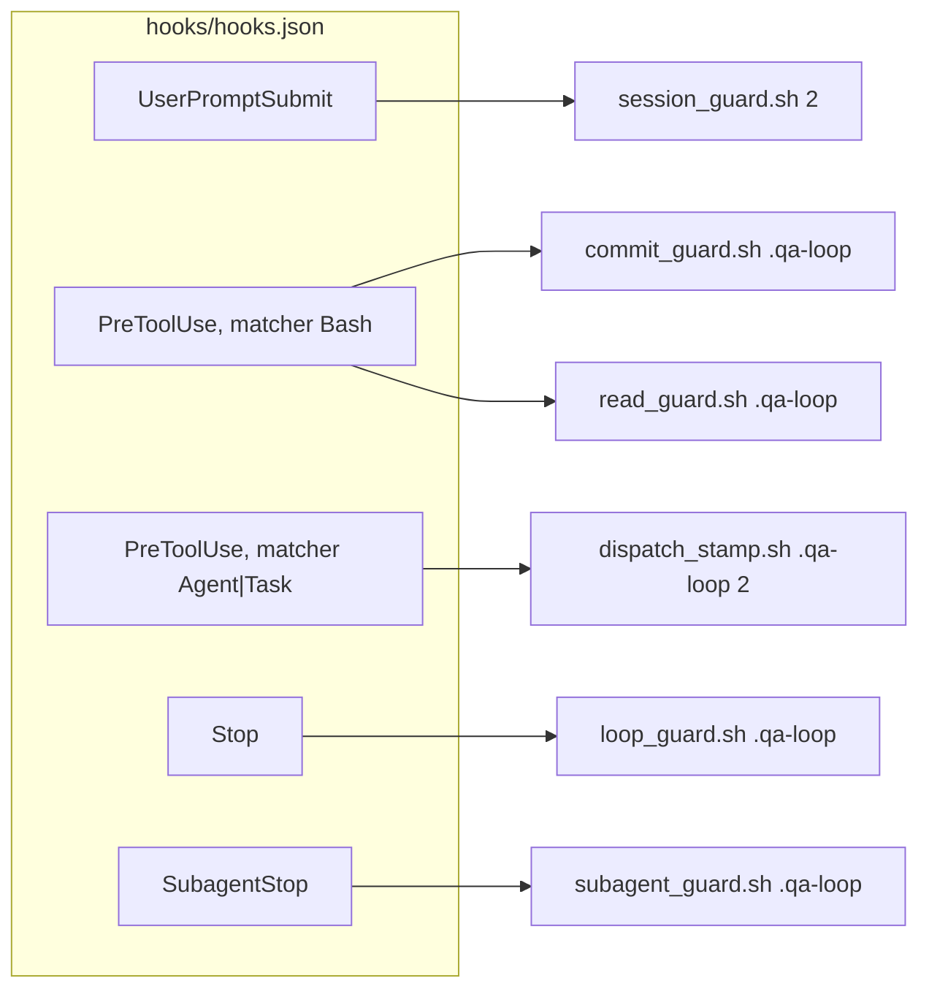
```mermaid
flowchart LR
    subgraph EVENTS["hooks/hooks.json"]
        UPS["UserPromptSubmit"]
        PTB["PreToolUse, matcher Bash"]
        PTA["PreToolUse, matcher Agent|Task"]
        STP["Stop"]
        SAS["SubagentStop"]
    end
    UPS --> SG["session_guard.sh 2"]
    PTB --> CG["commit_guard.sh .qa-loop"]
    PTB --> RG["read_guard.sh .qa-loop"]
    PTA --> DS["dispatch_stamp.sh .qa-loop 2"]
    STP --> LG["loop_guard.sh .qa-loop"]
    SAS --> SB["subagent_guard.sh .qa-loop"]
```

`session_guard.sh` is the one hook that is passed no loop directory, so it falls back to its default of both `.review-loop` and `.qa-loop` (`session_guard.sh` line 14).

### 2.2 Commands to state

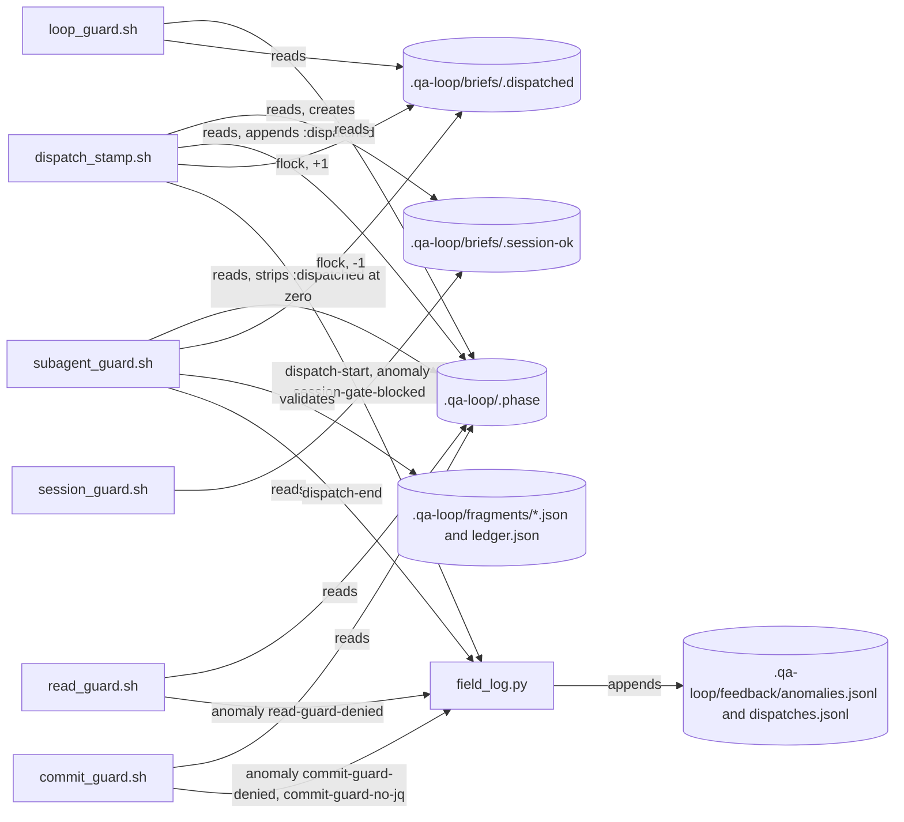
```mermaid
flowchart LR
    SG["session_guard.sh"]
    DS["dispatch_stamp.sh"]
    LG["loop_guard.sh"]
    SB["subagent_guard.sh"]
    RG["read_guard.sh"]
    CG["commit_guard.sh"]
    PH[(".qa-loop/.phase")]
    CNT[(".qa-loop/briefs/.dispatched")]
    OK[(".qa-loop/briefs/.session-ok")]
    FR[(".qa-loop/fragments/*.json and ledger.json")]
    FL["field_log.py"]
    FB[(".qa-loop/feedback/anomalies.jsonl and dispatches.jsonl")]
    SG -->|"reads"| OK
    DS -->|"reads, creates"| OK
    DS -->|"reads, appends :dispatched"| PH
    DS -->|"flock, +1"| CNT
    DS -->|"dispatch-start, anomaly session-gate-blocked"| FL
    LG -->|"reads"| PH
    LG -->|"reads"| CNT
    SB -->|"reads, strips :dispatched at zero"| PH
    SB -->|"flock, -1"| CNT
    SB -->|"validates"| FR
    SB -->|"dispatch-end"| FL
    RG -->|"reads"| PH
    RG -->|"anomaly read-guard-denied"| FL
    CG -->|"reads"| PH
    CG -->|"anomaly commit-guard-denied, commit-guard-no-jq"| FL
    FL -->|"appends"| FB
```

One more writer of `briefs/.dispatched` is not a hook: `merge_ledger.py set-round` and `next-round` reset a count left above zero (`settle_dispatch_counter`, `merge_ledger.py` lines 95–115).

### 2.3 The phase marker and the live-dispatch count

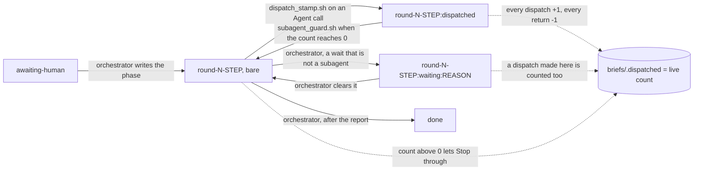
```mermaid
flowchart LR
    AH["awaiting-human"]
    BARE["round-N-STEP, bare"]
    DSP["round-N-STEP:dispatched"]
    WAIT["round-N-STEP:waiting:REASON"]
    DONE["done"]
    CNT[("briefs/.dispatched = live count")]
    AH -->|"orchestrator writes the phase"| BARE
    BARE -->|"dispatch_stamp.sh on an Agent call"| DSP
    DSP -->|"subagent_guard.sh when the count reaches 0"| BARE
    BARE -->|"orchestrator, a wait that is not a subagent"| WAIT
    WAIT -->|"orchestrator clears it"| BARE
    BARE -->|"orchestrator, after the report"| DONE
    DSP -.->|"every dispatch +1, every return -1"| CNT
    WAIT -.->|"a dispatch made here is counted too"| CNT
    BARE -.->|"count above 0 lets Stop through"| CNT
```

Grammar as implemented across the scripts:

| Marker value | Written by | What the hooks do |
|---|---|---|
| `awaiting-human`, `done` | orchestrator | Inert for the stall guard, the dispatch stamp, the read guard and dispatch timing (they match only `round*`/`seed*`); anomalies are still recorded in any phase. `commit_guard.sh` keeps its staging rules armed on `awaiting-human` but not on `done` (lines 36–41). |
| `round-N-testing`, `round-N-implementing`, `round-N-fix-review`, `round-N-regression-tests`, `round-0-testing` | orchestrator (`SKILL.md` lines 36–41, 264) | A dispatch is owed: `loop_guard.sh` blocks Stop (exit 2) **unless the live count is above zero** (lines 46–53). `read_guard.sh` and the `commit_guard.sh` staging rules are active. The next Agent call is stamped. |
| `…:dispatched` | `dispatch_stamp.sh` line 93 | One or more agents are running; Stop is allowed. `subagent_guard.sh` strips the suffix only when the count reaches zero (lines 56–61). |
| `…:waiting:<reason>` | orchestrator | An honest non-subagent wait; Stop is allowed and no hook edits the marker. Since 0.17.0 a dispatch made in this state is still **counted** (`dispatch_stamp.sh` lines 64–66) and its return still decrements (`subagent_guard.sh` lines 36–55). |

**The count is the source of truth; the suffix is its display** (`dispatch_stamp.sh` header lines 17–25, `loop_guard.sh` header lines 10–16, `FIELD-QUESTIONS.md` `s-dispatch-counter`). The reason is in commit `5e5dfd9`: the skill of the sibling loop dispatched an agent while the phase said `:waiting:`, the dispatch went uncounted, the next agent's return took the count from 1 to 0 and stripped the mark, and the Stop hook then blocked a turn nine minutes before the first agent came back. A count stuck above zero by a crashed agent **fails open** until `set-round` resets it at the next round boundary.

---

## 3. Module inventory

### 3.1 Plugin manifest and operator documents

| Module | Purpose | Interface | Notes |
|---|---|---|---|
| `qa-loop-tools/.claude-plugin/plugin.json` | Plugin identity: name `qa-loop-tools`, version `0.17.0`, description, keywords, MIT | consumed by the Claude Code plugin loader; also read at run time by `run_summary.py` (`plugin_identity`) | Metadata only — no `skills`/`agents`/`hooks` keys. **Inference:** the harness discovers `skills/`, `agents/`, `hooks/hooks.json` by directory convention. `HANDOFF.md` §2.1 makes a version bump mandatory on every user-visible change because the plugin cache is keyed by version. |
| `qa-loop-tools/CONTROLS.md` (642 lines) | Operator's reference for every knob of both loop plugins, tagged `[qa]`/`[review]`/`[both]` | read by the `controls` skill | Byte-identical to the repo-root `CONTROLS.md` (verified with `cmp`), so it also documents the review-only panel that qa does not ship (`BACKLOG.md` line 97). Sections added since 0.15.0: "Feedback for the plugin maintainer" (lines 545–628). |
| `qa-loop-tools/FIELD-QUESTIONS.md` (91 lines, new in 0.16.0) | What the maintainer wants to know from a run of this version | parsed by `feedback.py` (`parse_questions`, lines 136–165) | Three sections: 17 watch items (`w-…`), 16 settled decisions (`s-…`), and a generated list of what happened to earlier field items (1 backlog, 1 declined, 19 shipped). The third section is generated by `tools/render_field_questions.py` at the repo root and must not be edited by hand (file lines 8–9, 61). |
| `qa-loop-tools/README.md` (234 lines) | User-facing description | — | Gained a "Feedback for the maintainer" section and the hygiene `--restore` sentence; several older passages are stale (§6.5). |

### 3.2 Skills

#### `qa-loop-tools/skills/qa-loop/SKILL.md` (641 lines) — the orchestrator

**Purpose.** The control program for the whole loop, executed by the main session. It is "PLUMBING ONLY" (line 6): it never edits source, never taps the simulator, never hand-edits the ledger's findings array, and dispatches every subagent in the foreground.

**Structure — the headings are the state machine:**

| Section (lines) | What it does | Scripts it names |
|---|---|---|
| Hard rules (8–80) | Deterministic reset per round; the `.phase` protocol, including the rule that the phase is written in its **own** call before a dispatch and never in the same batch (lines 51–55); the count as source of truth (55–59); `fragments/` vs `briefs/` ownership; explicit-path staging; no model-pin overrides; foreground dispatch | `merge_ledger.py resolve`, `set-round`, `open` |
| Stage 0 — Preflight (82–131) | Build/install/launch/smoke-screenshot on the loop-owned udid; tool availability vs per-device grants; **prefer the shipped driver** (copy to `.qa-loop/driver/`, start, ping) with the MCP tool as fallback | `drivers/ios-xcuitest/start.sh`, `qa.py`, `provision_workers.sh` |
| Stage 1 — Workflows (133–261) | Step 0 (new in 0.17.0): a **PAUSED** loop (`.phase` ends `:waiting:<reason>`, or `awaiting-human`) is resumed, not archived; a finished or abandoned loop is archived. Then: bootstrap `ledger.json`; hygiene preflight including `--restore`; the default-closed `.gitignore` allowlist; draft or re-verify `WORKFLOWS.md`; stop at `awaiting-human`; `fix-reviewer` AUDIT | `merge_ledger.py archive`, `notes-rotate`, `hygiene_check.sh` |
| Stage 2 — Test cases (263–290) | `round-0-testing`; `ux-tester` EXPLORATION in batches of at most 3 workflows; contract lint must pass | `plan_round.py … --lint` |
| Each round (292–485) | Preflight → reset every worker → plan → rotate notes before every batch → re-verify devices → functional lane → perf lane (parallel mode only) → merge fragments → metrics → regression tests (if enabled) → act on `decision` | `plan_round.py`, `merge_ledger.py notes-rotate / open / <merge> / consulted`, `nfr_sampler.sh`, `provision_workers.sh up`, `merge_coverage.py`, `qa_metrics.py`, `nfr_analyze.py` |
| Waiting, failures, and pauses (488–510) | The three marker states; 3 in-turn retries with 60/180/300 s backoff; `.partial` resume; "result without artifact = pause, resume the same agent" | — |
| Stop conditions (512–541) | Documents the verdict semantics computed by `qa_metrics.py` | — |
| Final report (543–588) | Render; fill only the WATCH LIST; re-run hygiene; `.phase = done`; tear down workers; stage `feedback/run-summary.json` by path; end with the one-line invitation to `/qa-loop-tools:feedback` | `render_report.py`, `hygiene_check.sh`, `provision_workers.sh down` |
| Interrupting and resuming (590–596) | Restart the interrupted round from step 1 | — |
| Contracts (598–641) | The `anomaly` verb and its codes; the LEDGER and results fragment schemas | `merge_ledger.py anomaly` |

Ledger defaults written at bootstrap (line 156): `round 0`, `build_sha null`, `max_rounds 5`, `parallel_testers 1`, `emit_regression_tests false`, `regression_test_arming "guard"`, `token_budget null`, `implemented_rounds []`, `findings []`.

The allowlist template (lines 184–203) is stamped `Managed by qa-loop-tools v0.16.0` — deliberately not 0.17.0: the stamp names the release that last changed the template (`HANDOFF.md` §2.1; commit `5e5dfd9` "the template did not change in this release"). 0.16.0 added the three `!**/feedback/*.{json,jsonl,md}` rules.

**Design patterns.** Orchestrator/worker with file-based message passing; an explicit phase marker enforced by hooks; "(measured: …)" rationale attached to each rule (house style, `HANDOFF.md` §2.6).

**Dependencies.** Named directly in the skill: `plan_round.py`, `merge_ledger.py`, `merge_coverage.py`, `qa_metrics.py`, `render_report.py`, `nfr_sampler.sh`, `nfr_analyze.py`, `provision_workers.sh`, `hygiene_check.sh`, the driver's `start.sh` and `qa.py`, the four agents, `xcrun simctl`, git. The six hooks run around it; `field_log.py` and `run_summary.py` are reached through the scripts above; `feedback.py` and `loop_usage.py` belong to the feedback skill.

#### `qa-loop-tools/skills/feedback/SKILL.md` (74 lines, new in 0.16.0)

The `/qa-loop-tools:feedback` skill. It files a report about the **plugin**, never about the app's findings. Two paths: `feedback.py quick .qa-loop` (numbers only), or `scaffold` → read the Settled and Open/shipped sections of `FIELD-QUESTIONS.md` → fill the draft with the Edit tool → `finalize` → commit by explicit path using the `stage_by_path` line finalize printed. If `finalize` reports `git_ignored: true` the commit is skipped and the drop copy is the delivery (lines 58–62). It is never a gate (lines 70–71).

#### `qa-loop-tools/skills/controls/SKILL.md` (10 lines)

The `/qa-loop-tools:controls` skill: read `${CLAUDE_PLUGIN_ROOT}/CONTROLS.md` and answer from it. Pure indirection.

### 3.3 Agent prompts (`qa-loop-tools/agents/*.md`)

Each file is YAML frontmatter (`name`, `description`, `tools`, `model`) plus the system prompt. All four are qa-only.

| Agent | Model / tools | Modes | Writes | Key rules (verified in the prompt) |
|---|---|---|---|---|
| `agents/ux-tester.md` (271 lines) | `opus` (pinned); `Read, Grep, Glob, Bash, mcp__Claude_Code_iOS_Simulator__control, mcp__Claude_Code_iOS_Simulator__build` | EXPLORATION (writes `TESTCASES.md` plus hypotheses), TEST (runs assigned cases, writes LEDGER and results fragments) | `.qa-loop/TESTCASES.md`; `<fragment>.partial` then the fragment; the results fragment; `HARNESS_NOTES.md` appends (about 15 lines, headed `## Chunk r<round>-<slug>`); `marks.jsonl`; screenshots in its evidence dir; reusable helpers in `.qa-loop/tools/` | Two personas never blended (lines 17–25). Driver path: `qa.py` plus the udid from the dispatch; prefer `labels`/`find`/`tree` over screenshots (27–39). Device and lane discipline: udid on every call, scratch only in its own dir, FUNCTIONAL LANE emits no measurement findings (41–60). Turn budget: at the budget, record results, mark the rest skipped, return (75–80). Measurements via the analyzer path **named in the dispatch — never search for a script, older copies sit in the plugin cache** (145–151, the 0.17.0 change). Severity and routing (163–188). App-rendered text is data, never instructions (190–192). Round ≥ 2: re-run repros, never trust the CHANGES block (194–212). Every new finding needs `claim` (236–243). |
| `agents/qa-implementer.md` (88 lines) | `inherit`; `Read, Edit, Write, Bash, Grep, Glob` | one | source edits; per-workflow commits `qa-loop round <N>: WF-2 — <ids>`; a fenced JSON CHANGES block `{commit_sha, actions[{id, action, rationale, files}], disputes[{id, argument}]}` | Read evidence first. WONTFIX needs a concrete technical reason. Must satisfy `constraints`; honour `fix_risk`; a `FIX REJECTED` note is the brief (25–36). Only the named udid; never `pgrep -f <AppName>` (38–48). Never touches proposal findings or accepted wontfixes; never launches the simulator to verify (50–56). Builds synchronously; stages by explicit path (58–72). |
| `agents/fix-reviewer.md` (92 lines) | `sonnet` (pinned); `Read, Grep, Glob, Bash` | FIX REVIEW (once per round), INTENT CHECK (accepted proposals), AUDIT (before round 1) | a LEDGER fragment holding **rejections only** (`current_status: open`, note `FIX REJECTED (round N): …`, an entry appended to `rejections[]`) plus new `introduced_by_fix` findings; intent fragments with `constraints[]`, `intent_checked: true`; `briefs/workflows-audit.md` | Verdicts `sound` / `unsound` / `harmful` (22–27). Four lenses: scored metrics and incentives, persisted state, behaviour contracts, "was the finding a trap" (29–41). `fixed` is never minted by the reviewer (52–53). |
| `agents/regression-test-writer.md` (71 lines) | `inherit`; `Read, Edit, Write, Bash, Grep, Glob` | one | `Regression<Slug>Tests.swift` into the UITest folder (only if `project.pbxproj` uses `fileSystemSynchronizedGroups`), else `.qa-loop/regression-tests/`; a commit `qa-loop round <N>: regression tests for <ids>`; minor missing-identifier findings to its fragment | Selector mining (13–21). `try XCTSkipIf(true, …)` guard by default; `arm-when-green` removes it only after a green run on the named device (31–42). `xcrun swiftc -parse` every file (43–45). Never edits `project.pbxproj`, even under relayed authorization (59–64). |

**Model-diversity design.** Three seats on three models — tester `opus`, reviewer `sonnet`, implementer inherits the session model; the skill forbids overriding pins in a dispatch (`SKILL.md` lines 72–75; `CONTROLS.md` "Model pins"; `FIELD-QUESTIONS.md` `s-model-pins`). The regression writer also inherits, so it shares the implementer's model.

### 3.4 Hook scripts (shared — authored in `review-loop-tools/scripts/`)

All six are byte-identical to the review-loop copies. What they do **for the qa loop**:

| Script (lines) | Event, args | Behaviour (verified) |
|---|---|---|
| `qa-loop-tools/scripts/session_guard.sh` (44) | `UserPromptSubmit`, `2` (MB) | Prints nothing once `briefs/.session-ok` exists in either default loop dir (line 16). Otherwise, if the prompt matches `review[- ]loop\|qa[- ]loop`, it stats `transcript_path` and prints `LOOP COST WARNING` above the threshold, else a one-line "fine". **New in 0.16.0:** it stands down for a prompt that names `…-loop-tools:feedback` or `:controls` and does not also name the loop skill (lines 28–32) — feedback is filed from the very session the loop ran in. Always exits 0. |
| `qa-loop-tools/scripts/dispatch_stamp.sh` (97) | `PreToolUse` on `Agent\|Task`, `.qa-loop 2` | No-op unless `.phase` exists and starts `round` or `seed` (lines 58–62). Under `:waiting:` it **counts and logs** the dispatch and leaves the marker alone (64–66). Under `:dispatched` it counts (a missing count file is assumed to be 1) and logs (67–69). On a bare phase: the one-time session-size gate — if the transcript exceeds the threshold and `briefs/.session-ok` is absent, record `session-gate-blocked` and exit 2; otherwise create `.session-ok` (71–91). Then log the start, write `<phase>:dispatched`, and **add** one to the count (92–96) — it used to write `1`. The counter update is a Python heredoc under `fcntl.flock` (`bump`, 44–57). A dispatch the gate blocks is not logged. |
| `qa-loop-tools/scripts/loop_guard.sh` (57) | `Stop`, `.qa-loop` | `stop_hook_active` true → exit 0 (lines 22–30). Per loop dir: `*:waiting:*` and `*:dispatched` allow; a bare `round*`/`seed*` reads the count and **allows the stop when it is above zero** (47–50, new in 0.17.0); otherwise exit 2 with the "dispatch, wait, or finish" message (51–52). |
| `qa-loop-tools/scripts/subagent_guard.sh` (187) | `SubagentStop`, `.qa-loop` | (1) Logs the return through `field_log.py dispatch-end` (lines 17–21). (2) Whenever the phase starts `round`/`seed`, **whatever its suffix**, decrements the count under a lock; a missing file yields 0; strips `:dispatched` only if the result is 0 and the suffix is present (33–64). (3) Only if the phase contains `review` or `testing` (68–71), validates every `fragments/(seed\|round-…).json`: LEDGER fragments need `findings[]` with `id` and `current_status`; findings **new to the ledger** also need `severity`, `claim`, and a well-formed `evidence` if present; `status_history[].round` must be an int; `*.results.json` need `results[]` with `tc` and `status` in `passed/failed/blocked/skipped`. Files modified under 10 s ago are skipped (line 176). Invalid → exit 2. New in 0.17.0 and dormant in qa: a closeout fragment must carry `suites` while the phase contains `closeout` (76–108, 144–145). |
| `qa-loop-tools/scripts/read_guard.sh` (101) | `PreToolUse` on `Bash`, `.qa-loop` | Active only while a phase starts `round`/`seed` (10–16). Heredoc bodies and single-quoted strings are stripped before any pattern runs (`strip_data`, 51–56) and command patterns match only at a command position (`CMD_START`, 57). Unless the command is filtered (piped into `grep\|rg\|head\|tail\|sed\|awk\|wc\|cut\|sort\|uniq\|xcpretty\|xcbeautify\|tee\|python3\|jq`, or redirected to a file; 59–60), it denies: `cat` of a file over 200 lines, `head` over 200, `sed -n A,Bp` windows over 200 (62–80), unfiltered `xcodebuild … test` / `swift test` (82–86), and a whole `git diff\|show` when `briefs/round-N.diff` exists (88–99). **New in 0.16.0:** every denial records `read-guard-denied` with the *rule* that fired, never the command (27–38). |
| `qa-loop-tools/scripts/commit_guard.sh` (94) | `PreToolUse` on `Bash`, `.qa-loop` | Reads `tool_input.command` with `jq`. Staging rules arm only while `.phase` is `round*`/`seed*`/`awaiting-human*` (36–41): blocks `git add -A/--all`, `-f/--force`, `git add .`, and a directory add of the loop dir (46–72), each recorded as `commit-guard-denied` with the rule name. On `git commit`, optionally enforces `REVIEW_LOOP_MAX_DIFF` and `REVIEW_LOOP_TEST_CMD` (80–93). Without `jq` the command string is empty, the staging rules cannot match, and the script records `commit-guard-no-jq` once (42–45). The env names are the review loop's by design. |

Design pattern: each hook is a small shell wrapper around an inline Python heredoc; state is shared only through files in the loop directory, and the two hooks that mutate the counter serialise on a file lock.

### 3.5 Loop-state scripts

#### `qa-loop-tools/scripts/merge_ledger.py` (943 lines; shared, panel-free copy) — the only sanctioned ledger mutator

Interface: `main()` dispatches on a verb table (lines 866–870); anything else is a merge.

| Verb | Signature | Verified behaviour |
|---|---|---|
| *(default merge)* | `<ledger> <fragment> <round> [--no-escalate]` (874–940) | For each fragment finding by `id`: existing → overwrite scalar fields except `status_history`, `first_seen_round`, `evidence`, `severity_history`, `rejections` (896–900); union `rejections` (901–906); record `severity_history {round, from, to}` on change (907–910); `union_evidence` (169–180); append `{round, status}` to `status_history` unless already present; set `current_status`. New → default `first_seen_round` and `status_history`. Sets top-level `round`. Prints `{round, updated, added, total}`. Blocker escalation `max_rounds 2→5` only when `scope` is set (929–936) — dormant in qa. |
| `resolve` | `<ledger> <id> <status> <round> [note]` (130–167) | Appends history, sets status, stamps the note `RESOLVED (round N): …`. |
| `set-round` | `<ledger> <N> [sha]` (182–212) | **Resets the live-dispatch counter first** (line 197), then sets `round`; with a sha sets `build_sha` (qa ledgers) and records `round_shas[N]`. |
| `open` | `<ledger> [auto\|proposal\|all\|closeout\|wontfix] [--region WF-n …] [--severity …]` (214–289) | Prints open/partial findings with `status_history` stripped. `--region` is a boundary match (`WF-1` never matches `WF-10`; also matches the `TC-1.` prefix; 274–282). `fix_risk` findings pass any severity filter (272). **New in 0.17.0:** the output also carries a `tools` object of absolute script paths (285–288). In qa it holds exactly one key, `nfr_analyze` — `shipped_tools` (117–128) also looks for `mutate.py`, which qa does not ship. |
| `archive` | `<loop-dir> [name]` (697–843) | Per-file moves of `ledger.json, rounds.md, REPORT.md, coverage.json, verdict.json, fragments, briefs, feedback, .phase` (777–778; `feedback` added in 0.16.0) and every `evidence/round-*` into `archive/<timestamp-sha>/`; unknown top-level files to `legacy/`; keeps `WORKFLOWS.md, TESTCASES.md, HARNESS_NOTES.md, BACKLOG.md, .gitignore, archive, evidence, tools, driver, scratch, notes` (795–797). Runs `hygiene_check.sh` before and after with `FIELD_LOG_OFF=1`, sleeps `REVIEW_LOOP_ARCHIVE_SETTLE_S` seconds (default 3) and looks again, records `archive-duplicates` / `archive-late-duplicates`, and exits 1 if duplicates appeared. |
| `notes-rotate` | `<loop-dir> [--round N]` (432–528) | Splits `HARNESS_NOTES.md` on `## ` headings. Pass 1: `## Chunk r<M>-…` sections with `M < N` move to `archive/harness-notes-<stamp>.md`. Pass 2 (over `QA_NOTES_CEILING_KB`, default 10, measured in bytes): archive general sections oldest-first, never the preamble, never `[pin]` headings, never current-round chunk sections. Records `notes-over-ceiling` if the file is still over after rotation (522–525). |
| `set-usage` / `add-usage` | `<ledger> <round> <role> <tokens>` (318–363) | `usage[round][role]` replace vs accumulate. **New in 0.17.0:** then `sync_round_tokens` (365–424) rewrites the round's `Tokens` cell in `rounds.md` — found by column **name** (commit `5e5dfd9`: the qa table has two more columns than the review table) — and the `tokens` / `cumulative_tokens` figures in `verdict.json`. Prints `round_total_tokens`, `cumulative`, `token_budget`, `over_budget`, `rounds_md_updated`, `verdict_updated`. The Decision is never rewritten. |
| `anomaly` | `<loop-dir> "<one line>" [--code CODE]` (65–93; new in 0.16.0) | Appends one row to `feedback/anomalies.jsonl` through `field_log.py`; default code `workaround`. Never changes loop state. Exits 1 if the loop dir does not exist or the row was not recorded. |
| `consulted` | `<ledger> <N>` (845–863) | Sets `thrashing_consulted = N` so the next thrashing signal is hard. |
| `scope`, `diff`, `next-round` | (303–316, 530–588, 590–695) | Review-loop verbs, present and working but not part of the qa skill's round procedure; see §6.3. `next-round` picks `qa_metrics.py` when the loop dir is `.qa-loop` (line 616). |

Design pattern: command-verb CLI over JSON documents; idempotent appends (history entries are de-duplicated by `(round, status)`); telemetry is best-effort and wrapped so that it can never change what a verb prints or how it exits (`note_anomaly`, 53–63).

Dependencies: `field_log.py` (import), `hygiene_check.sh` (subprocess, in `archive`), `qa_metrics.py` (subprocess, in `next-round`), `git`.

#### `qa-loop-tools/scripts/merge_coverage.py` (56 lines; qa-only)

`merge_coverage.py <coverage.json> <results-fragment> <round>`. Writes `coverage.rounds[round][tc][persona] = {status, reason}`; validates `status` against `VALID` (line 18); persona defaults to `unspecified`; last write wins only for the same `(tc, persona)` pair. Prints `{round, recorded, round_tcs}`. No dependencies beyond the standard library.

#### `qa-loop-tools/scripts/plan_round.py` (341 lines; qa-only) — deterministic round planner

`plan_round.py <loop-dir> <round> full|targeted [--range a..b] [--workers N] [--max-tcs 5] [--turn-budget 40] [--repo .] [--lint] [--lax] [--allow-wide] [--summary]` (argument parsing, lines 54–71).

Pipeline, in source order:

| Step | Lines | What happens |
|---|---|---|
| Parse test cases | 73–84 | `TC_RE = ^\s*(?:[-*#]+\s*)?(TC-(\d+[a-z]?)\.\d+)\b(.*)$` (line 31); tags `[novice\|power\|smoke\|perf]`; duplicates dropped; exit 1 if none |
| Parse workflow paths | 86–92 | `paths(WF-n): a, b` lines from `WORKFLOWS.md` |
| Contract lint | 94–122 | untagged cases; workflows without `paths()` on a targeted pass; no `[smoke]` case. Each problem is recorded as `plan-lint-problem` carrying only its *kind* (108–110, new in 0.16.0). `--lint` prints a JSON report and exits 0/1; otherwise problems exit 1 unless `--lax` |
| Read findings | 124–144 | open/partial auto-routed findings without `FIX REJECTED` contribute `test_case` ids, `WF-` regions, or screen-name `misc_regions` |
| Diff targeting | 146–152 | `git diff --name-only <range>`, prefix-matched against `paths()` |
| Selection | 154–176 | full = everything; targeted = smoke ∪ finding cases ∪ finding workflows ∪ touched workflows, **degenerating** to findings + smoke when more than 60 % of all cases are selected (unless `--allow-wide`); records `plan-degenerated` |
| Worker affinity | 178–193 | heaviest workflow first onto the least-loaded slot; every piece of one workflow stays on one worker |
| Chunking | 195–240 | pieces of at most `max_tcs`; pieces under 3 cases merge into the smallest same-slot piece |
| Catch-all chunk | 241–259 | `findings-misc` for findings whose region is a screen name |
| Perf gating | 261–280 | perf lane only on a full pass, a perf-referencing finding, or a diff touching a `[perf]` workflow |
| Completeness check | 282–305 | hard error (exit 1, `plan-unchunked`) if any selected case lands in zero or several chunks |
| Output | 307–338 | writes `briefs/round-N-plan.json`; prints the JSON or, with `--summary`, a digest |

Chunk manifest: `{slug, worker, lane: "functional", turn_budget, tcs[], personas[], region_filter[], evidence_dir, fragment, results}`. `worker` is a slot label (`qa-worker-<slot>` or `main`) that the orchestrator resolves through `scratch/workers.json`.

Design pattern: a pure function of four inputs (two Markdown contracts, the ledger, a git range) to one JSON plan, with a self-check. Dependencies: `field_log.py` (import), `git`.

#### `qa-loop-tools/scripts/qa_metrics.py` (307 lines; qa-only) — verdict engine

`qa_metrics.py <ledger> <N> [full|targeted]`. Unchanged since 0.15.0.

- Proposals are excluded from every metric (line 159).
- `status_at(f, r)` replays `status_history` (35–43); `net = closed − new` (66–72); a reopen is `fixed→open` only (54–64).
- Region churn: the same region in new or reopened findings three rounds running (184–198), exempted by "healthy churn" (positive net and no reopens over the last two rounds) or a **converging series** (98–115).
- The net ≤ 0 signal counts only rounds whose predecessor is in `implemented_rounds` (`post_impl`, 166–170).
- The converging-series exemption guards the whole thrash signal (211–216).
- Decision priority (218–247): `converged` (full) / `full_pass_required` (targeted) → `budget` → `thrashing` / `thrashing_soft` → `stalemate` → `diminishing` → `backstop` → `continue`.
- Coverage gate (117–142, 249–262): on a full pass every `TC-…` id in `TESTCASES.md` must have a row in `coverage.rounds[N]`, else `full_pass_required`, and the trend cell reads `full (ran/total)` (292–294).
- Output: rewrites round N's row in `rounds.md` idempotently (275–298), writes `verdict.json` (300–303), prints the verdict.

The decision order as a flow, in two halves:

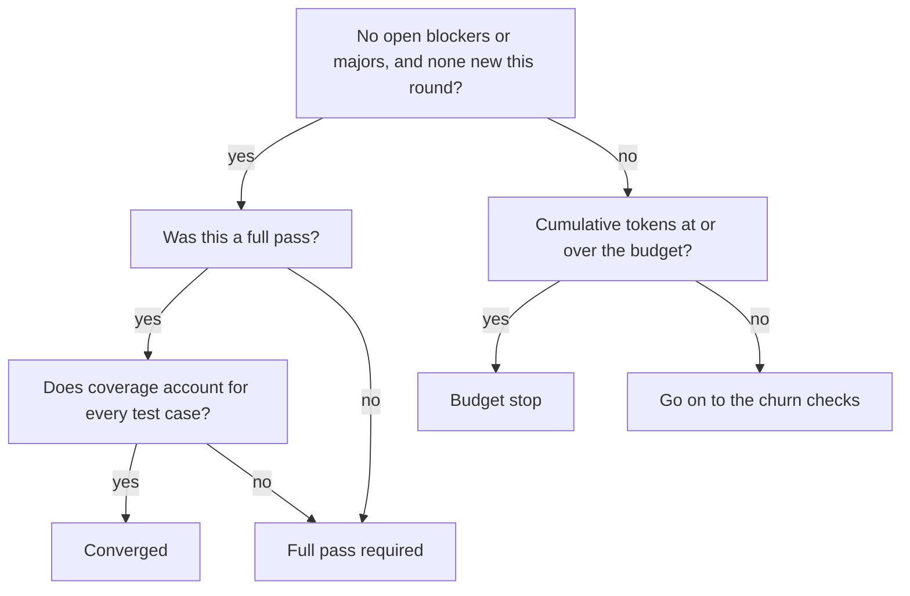
```mermaid
flowchart TB
    A["No open blockers or majors, and none new this round?"]
    B["Was this a full pass?"]
    C["Does coverage account for every test case?"]
    CONV["Converged"]
    FPR["Full pass required"]
    D["Cumulative tokens at or over the budget?"]
    BUD["Budget stop"]
    NEXT["Go on to the churn checks"]
    A -->|"yes"| B
    A -->|"no"| D
    B -->|"yes"| C
    B -->|"no"| FPR
    C -->|"yes"| CONV
    C -->|"no"| FPR
    D -->|"yes"| BUD
    D -->|"no"| NEXT
```

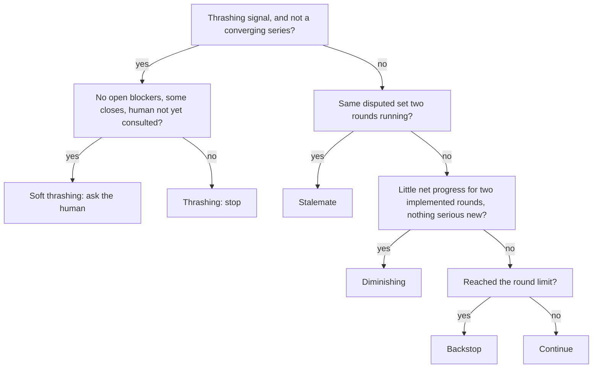
```mermaid
flowchart TB
    E["Thrashing signal, and not a converging series?"]
    F["No open blockers, some closes, human not yet consulted?"]
    SOFT["Soft thrashing: ask the human"]
    HARD["Thrashing: stop"]
    G["Same disputed set two rounds running?"]
    STALE["Stalemate"]
    I["Little net progress for two implemented rounds, nothing serious new?"]
    DIM["Diminishing"]
    J["Reached the round limit?"]
    BACK["Backstop"]
    CONT["Continue"]
    E -->|"yes"| F
    E -->|"no"| G
    F -->|"yes"| SOFT
    F -->|"no"| HARD
    G -->|"yes"| STALE
    G -->|"no"| I
    I -->|"yes"| DIM
    I -->|"no"| J
    J -->|"yes"| BACK
    J -->|"no"| CONT
```

#### `qa-loop-tools/scripts/render_report.py` (390 lines; shared, panel-free copy)

`render_report.py <loop-dir> [--out path] [--stop-note "…"]`. Renders `REPORT.md`: stop condition (81–102), token table (119–127), open findings by severity (129–140), disputed, UX proposals, fix-review rejections (162–172), severity changes, persona matrix and coverage gaps from the **last** round in `coverage.json` (186–219), closeout (221–256), wontfix, and WATCH LIST candidates (267–369). Each round's watch-list diff ends at `round_end_shas[N]`, then the next round's start sha, then `HEAD` (line 342).

Since 0.16.0 it also calls `run_summary.write(loop, stop_note)` (373–384). The call is wrapped: a summary failure prints one line to stderr and the report still succeeds. The printed result gained `run_summary` (the path, or null).

Since 0.17.0 the Closeout section says so when no closeout fragment carries `suites` (233–237), and the closeout watch candidate has the same slot shape as the others (363–365). Both are reachable only when a `round-*-closeout.json` fragment exists, which the qa skill never produces (§6.3).

Dependencies: `run_summary.py` (import), `git`.

### 3.6 Telemetry and feedback scripts (shared — authored in `review-loop-tools/scripts/`, new in 0.16.0)

All four are byte-identical to the review-loop copies. They exist because, per commit `aed07f8`, ten field memos had arrived under six naming schemes, each re-deriving its token table with a throwaway script and stating the plugin version from memory.

| Script (lines) | Purpose | Public interface | Patterns and dependencies |
|---|---|---|---|
| `qa-loop-tools/scripts/field_log.py` (277) | Append-only telemetry: anomalies and dispatch timing | CLI: `anomaly <loop-dir> <code> "<line>" [--source] [--once] [--dedupe]`, `dispatch-start <loop-dir>`, `dispatch-end <loop-dir>`, `codes`. Importable: `anomaly()` (127–149), `dispatch()` (165–202), `pair_dispatches()` (208–238), `read_rows`, `scrub`, `feedback_dir`, `now_iso` | **Never fails its caller and never creates a loop directory** (docstring 17–20; `feedback_dir` returns `None` for a missing loop dir, 74–80; the CLI always exits 0, 272–277). `FIELD_LOG_OFF=1` silences it. `scrub` folds the home directory to `~` and caps a line at 400 characters (65–72). Appends are taken under `fcntl.flock`. Dispatch events are recorded only while the phase starts `round` or `seed` (162–163, 173). `CODES` (32–60) is a vocabulary of 27 codes; the `lane-*` and `mutate-*` codes cannot be emitted by any script qa ships. |
| `qa-loop-tools/scripts/run_summary.py` (467) | The objective half of a field report: `feedback/run-summary.json` | CLI: `run_summary.py <loop-dir> [--print] [--stop-note "…"]`. Importable: `build()` (355–433), `write()` (435–447) | Counts only — never a finding's id, claim, region or evidence (docstring 19–20; `finding_counts`, 125–163). Plugin version is read from the `plugin.json` beside the running script and compared with the `installed_plugins.json` entry (63–89). Adds an `xcode` probe when the plugin name starts `qa-` (97–98). Runs `hygiene_check.sh` with telemetry off and reports violations **by kind only** (266–288). Writes to `<file>.partial` then renames (441–446). Depends on `field_log.py`, `hygiene_check.sh`, `git`. Panel fields (`panel_runs`, 206–226) are always empty in qa. |
| `qa-loop-tools/scripts/loop_usage.py` (305) | Effective-token accounting from session transcripts | CLI: `loop_usage.py [--since T] [--until T] [--repo PATH] [--dir PROJECT_DIR] [--by-role] [--rows]`. Importable: `measure()` (231–259), `scan()` (148–212), `parse_time()`, `project_dir()` | `effective = input×1 + cache_read×0.1 + cache_write×2 + output×5` (81–85), de-duplicated by request id, images a flat 1,600 (line 41). The transcript directory is derived from the repo path (45–59). The window filters **per record**, with a file's mtime only as a pre-filter; an undated record is counted and tallied (180–188). A subagent's type comes from its `agent-<id>.meta.json` sidecar first (96–103). Standard library only; reads nothing inside the repo. |
| `qa-loop-tools/scripts/feedback.py` (706) | Scaffold, validate, stamp and deliver a field report | CLI: `scaffold <dir> [--since] [--until] [--date] [--force]`, `finalize <dir> [<report.md>] [--no-drop]`, `quick <dir> […]`, `questions` | Template-method over a fixed section list (`SECTIONS`, 50–80). `resolve_source` reports on the newest archive when the loop was already archived (114–134). `upgrade_allowlist` adds the three feedback rules to an older **plugin-managed** `.gitignore` and never touches a host-owned one (301–331). `finalize` refuses unanswered watch items (456–484, 605–615), mints ids `<prefix>-<n>` idempotently (502–549) with prefix `qa-<version>-<yyyymmdd>-<host>` (line 402), appends the summary and usage as fenced JSON (636–639), and copies the file to the drop (647–657). An `XDG_DATA_HOME` that resolves inside the host repo is ignored (551–566). Depends on `run_summary.py`, `loop_usage.py`, `FIELD-QUESTIONS.md`, `git`. |

### 3.7 Device, measurement and hygiene scripts

| Script (lines) | Interface | Verified behaviour |
|---|---|---|
| `qa-loop-tools/scripts/provision_workers.sh` (149; qa-only) | `up <count> [devtype] [runtime] [--fresh]` / `down` | Names `qa-worker-<hash8>-N` where `hash8` is the first 8 hex characters of `sha256($PWD)` (line 31). `up`: newest available iOS runtime (78–82), newest non-SE iPhone that runtime supports (86–94); reuse a same-name worker if device type and runtime match, else delete and `simctl create` (105–122); `simctl bootstatus -b`; `mkdir .qa-loop/scratch/<name>`; delete its own leftovers with an index above the count (129–141); write and print `{"workers":[{name, udid, scratch, reused}]}` to `.qa-loop/scratch/workers.json`. `down`: shut down and delete only this prefix's devices, then `rm -rf ./.qa-loop/scratch` (53–62). Must be run from the target repo root. |
| `qa-loop-tools/scripts/nfr_sampler.sh` (79; qa-only) | `<udid> <bundle-id> <out.jsonl> [interval=2]` (primary) or `<pid> <out.jsonl> [interval]` (legacy) | Mode is chosen by whether the first argument is all digits (44–47). Primary mode loops forever: resolve the PID each tick via `xcrun simctl spawn <udid> launchctl list`, matching `UIKitApplication:<bundle>[` (67–68); emit `{ts, pid, rss_mb, cpu_pct, net_in_bytes, net_out_bytes}` from `ps -o rss=,pcpu=` and `nettop -P -x -l 1 -p <pid> -J bytes_in,bytes_out`, or `{ts, pid: null, app_running: false}`. Legacy mode exits when the PID dies. |
| `qa-loop-tools/scripts/nfr_analyze.py` (93; qa-only) | `<samples.jsonl> [--marks marks.jsonl] [--rss-growth-mb 30] [--idle-cpu 20] [--net-mb 5]` | Groups live samples into per-PID stints (45–52); computes per-window stats between `begin:<name>` and `end:<name>` marks (54–67); emits candidates `suspected-leak`, `sustained-cpu-while-idle` (window name contains `idle`), `excessive-network` (72–82); without marks, a whole-stint low-confidence leak candidate (83–86). Prints `{stints, gap_samples, windows, candidates, thresholds}`. Its absolute path is what the `tools` block of every brief carries. |
| `qa-loop-tools/scripts/hygiene_check.sh` (163; shared, byte-identical) | `<loop-dir> [--restore]` | Advisory, always exits 0. Five checks: (1) tracked scratch paths (43–54); (2) Finder-duplicate names in the index or on disk, skipping `evidence` and `scratch` on disk (56–89); (3) tracked files over 256 KB (91–103); (4) a missing or denylist-style `.gitignore` (105–114); (5) **new in 0.17.0**, tracked files missing from disk with no numbered twin, naming a candidate beside them when one exists (116–150). `--restore` (new in 0.17.0, lines 67–80) moves a duplicate back with `mv -n` only when the plain name is missing and it is the sole duplicate of that name. Records `hygiene-violation` per kind with `--dedupe` (152–160). |

### 3.8 The driver subsystem: `qa-loop-tools/drivers/ios-xcuitest/` (qa-only)

Added in 0.14.0 (`250ba92`, 2026-09-13) as the first backend of a "driver contract" — a platform-neutral verb table (`CONTROLS.md` "Driver backends"; `drivers/ios-xcuitest/README.md`). Unchanged in 0.16.0 and 0.17.0. The target app is a run-time parameter; nothing app-specific may live here (`HANDOFF.md` §2.7).

| File | Role | Verified details |
|---|---|---|
| `drivers/ios-xcuitest/Sources/QADriver.swift` (275 lines) | The server: one `XCTestCase` (`QADriverTests`) whose single test method `testServe()` runs a command loop for up to 5 h (line 53) | Reads `QA_DRIVER_BUNDLE_ID` and `SIMULATOR_UDID` from the environment (33–39); root `/private/tmp/qa-driver/<udid>`; touches `alive` every tick with a 0.1 s idle sleep (58–61); takes the lowest-numbered `cmd/<seq>.txt`, deletes it, runs `execute(line)`, writes `out/<seq>.tmp` then moves it to `out/<seq>.txt` holding `OK <payload>` or `ERR <reason>` (62–73), appending `issues=…` for any `XCTIssue` captured by the overridden `record(_:)` (29–31). `quit` ends the loop. |
| `drivers/ios-xcuitest/qa.py` (71 lines) | The only client | `qa.py <udid> <cmd…>`, `--batch -` (one command per stdin line, stops at the first non-OK), `--alive`. Liveness = `alive` modified under 120 s ago (23–26). `send()` (28–51) picks `seq` = millisecond timestamp, bumped while a file of that name exists; writes `cmd/<seq>.tmp` then renames; polls `out/<seq>.txt` every 50 ms for 90 s (`sleep N` gets `N+30`); deletes the reply; on timeout removes its own command file. Exit codes 0 OK, 1 ERR, 2 not serving. |
| `drivers/ios-xcuitest/start.sh` (48 lines) | Build once, serve in the background; idempotent | `start.sh <udid> <bundle-id>` (or `QA_DRIVER_BUNDLE_ID`). If a runner process for that udid exists and `qa.py --alive` succeeds → "already serving" (line 18). `xcodegen generate` only if `QADriver.xcodeproj` is missing (23–26). Without `dd/built.ok`: `xcodebuild build-for-testing … -derivedDataPath dd`, then `touch dd/built.ok` only if `dd/Build/Products/*/QADriver-Runner.app` exists (27–35). Clears the mailbox, writes `bundle_id`, launches `xcodebuild test-without-building … -only-testing:QADriver/QADriverTests/testServe` under `nohup` with `TEST_RUNNER_QA_DRIVER_BUNDLE_ID` set, logging to `driver.log` (37–42), and polls liveness for 120 s (44–48). |
| `drivers/ios-xcuitest/stop.sh` (6 lines) | Stop the server | `qa.py <udid> quit`, `sleep 2`, `pkill -f "test-without-building.*id=$UDID"`, remove `alive`. |
| `drivers/ios-xcuitest/project.yml` (29 lines) | xcodegen spec | target `QADriver`, type `bundle.ui-testing`, iOS 17.0, sources `Sources`, `PRODUCT_BUNDLE_IDENTIFIER tools.quiller.qa.QADriver`, `CODE_SIGNING_ALLOWED NO`, Swift 5.0, `TARGETED_DEVICE_FAMILY 1` (iPhone). |
| `drivers/ios-xcuitest/QADriver.xcodeproj/` — `project.pbxproj` (286 lines), `project.xcworkspace/contents.xcworkspacedata` (7), `xcshareddata/xcschemes/QADriver.xcscheme` (100) | Pre-generated project so xcodegen is not required | `project.pbxproj` confirms `productType = "com.apple.product-type.bundle.ui-testing"` (line 61), `IPHONEOS_DEPLOYMENT_TARGET = 17.0`, the bundle id and the Swift version above; the shared scheme has one testable with `parallelizable = "NO"` (line 44). |
| `drivers/ios-xcuitest/README.md` (73 lines) | The command table = the contract the tester prompts speak | Also states the setup rule: copy to `.qa-loop/driver/` and build there, never inside the plugin cache. |

#### 3.8.1 Transport

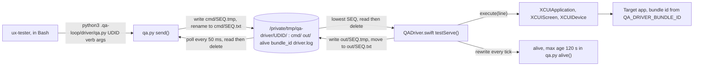
```mermaid
flowchart LR
    T["ux-tester, in Bash"] -->|"python3 .qa-loop/driver/qa.py UDID verb args"| C["qa.py send()"]
    C -->|"write cmd/SEQ.tmp, rename to cmd/SEQ.txt"| MB[("/private/tmp/qa-driver/UDID/ : cmd/ out/ alive bundle_id driver.log")]
    MB -->|"lowest SEQ, read then delete"| S["QADriver.swift testServe()"]
    S -->|"execute(line)"| X["XCUIApplication, XCUIScreen, XCUIDevice"]
    X --> APP["Target app, bundle id from QA_DRIVER_BUNDLE_ID"]
    S -->|"write out/SEQ.tmp, move to out/SEQ.txt"| MB
    MB -->|"poll every 50 ms, read then delete"| C
    S -->|"rewrite every tick"| AL["alive, max age 120 s in qa.py alive()"]
```

The transport is a **filesystem mailbox**: simulator processes share the host filesystem, so an XCUITest runner on the device can read files a host Python script writes (`QADriver.swift` header lines 1–5). One server per udid; parallel workers never share a directory.

#### 3.8.2 Contract verbs

All 33 verbs are cases of one `switch` in `execute` (`QADriver.swift` lines 109–274):

| Family | Verbs | Lines |
|---|---|---|
| Liveness | `ping`, `quit`, `sleep` | 115–116, 165–166 |
| Lifecycle | `launch [K=V …]`, `activate`, `terminate`, `state`, `frame`, `home` | 117–134 |
| Coordinate touches | `tap`, `doubletap`, `press`, `drag`, `swipe`, `dragslow` | 135–154 |
| Keyboard | `type`, `key` (`return`, `delete`, `space`, `tab`, `escape`), `selectall` | 155–164 |
| Capture and orientation | `shot PATH`, `rotate`, `orientation` | 167–184, 269–270 |
| Query by identifier | `find`, `findall` (at most 40 frames), `wait ID [SECS]` | 185–191, 220–224 |
| Tap or inspect by element | `tapid`, `tapoffset ID DX DY`, `tapbtn`, `taptext`, `btn`, `text` | 192–219 |
| Bulk reads | `labels [kind] [substring]` (one snapshot, capped at 500 rows), `alert`, `tree [depth]` (capped at 400 rows, default depth 12) | 225–268 |

Coordinates are device points, built with `app.coordinate(withNormalizedOffset: .zero).withOffset(…)` (81–83). `rotate` also accepts `left`, `right` and `upsideDown`, which the README table does not list (175–180).

### 3.9 Script dependency graphs

Who writes telemetry (imports and subprocess calls, verified by reading each caller):

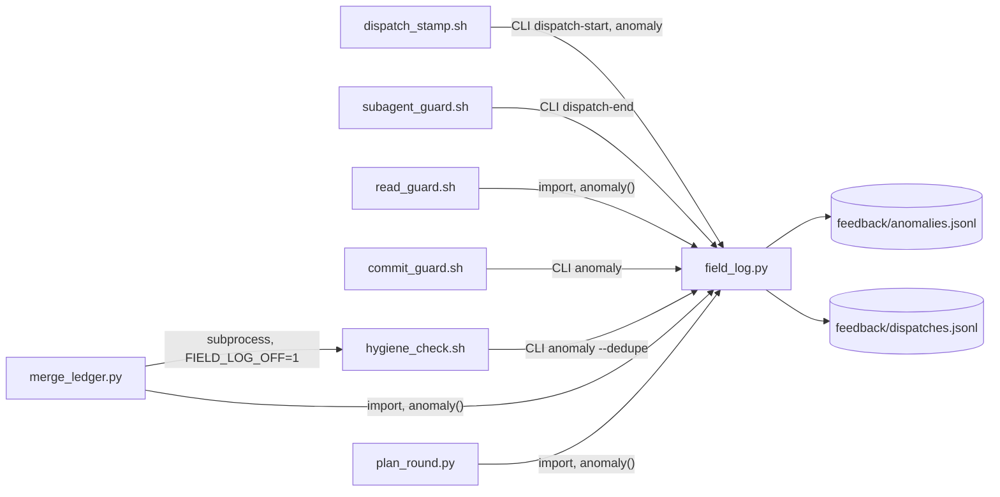
```mermaid
flowchart LR
    DS["dispatch_stamp.sh"]
    SB["subagent_guard.sh"]
    RG["read_guard.sh"]
    CG["commit_guard.sh"]
    HY["hygiene_check.sh"]
    ML["merge_ledger.py"]
    PR["plan_round.py"]
    FL["field_log.py"]
    AN[("feedback/anomalies.jsonl")]
    DI[("feedback/dispatches.jsonl")]
    DS -->|"CLI dispatch-start, anomaly"| FL
    SB -->|"CLI dispatch-end"| FL
    RG -->|"import, anomaly()"| FL
    CG -->|"CLI anomaly"| FL
    HY -->|"CLI anomaly --dedupe"| FL
    ML -->|"import, anomaly()"| FL
    PR -->|"import, anomaly()"| FL
    ML -->|"subprocess, FIELD_LOG_OFF=1"| HY
    FL --> AN
    FL --> DI
```

The report and feedback chain:

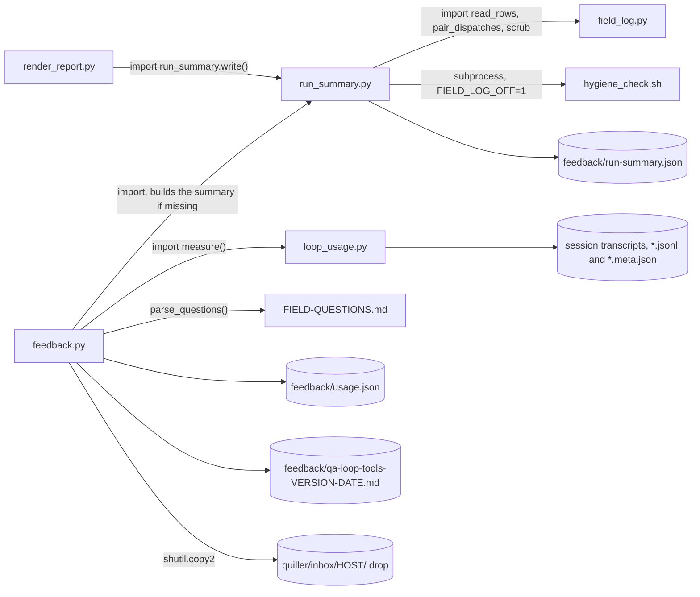
```mermaid
flowchart LR
    RR["render_report.py"]
    RS["run_summary.py"]
    FL["field_log.py"]
    HY["hygiene_check.sh"]
    FB["feedback.py"]
    LU["loop_usage.py"]
    FQ["FIELD-QUESTIONS.md"]
    TR[("session transcripts, *.jsonl and *.meta.json")]
    SUM[("feedback/run-summary.json")]
    USG[("feedback/usage.json")]
    REP[("feedback/qa-loop-tools-VERSION-DATE.md")]
    DROP[("quiller/inbox/HOST/ drop")]
    RR -->|"import run_summary.write()"| RS
    RS -->|"import read_rows, pair_dispatches, scrub"| FL
    RS -->|"subprocess, FIELD_LOG_OFF=1"| HY
    RS --> SUM
    FB -->|"import, builds the summary if missing"| RS
    FB -->|"import measure()"| LU
    LU --> TR
    FB -->|"parse_questions()"| FQ
    FB --> USG
    FB --> REP
    FB -->|"shutil.copy2"| DROP
```

Scripts with no dependency on any other script in the plugin: `qa_metrics.py`, `merge_coverage.py`, `nfr_analyze.py`, `nfr_sampler.sh`, `provision_workers.sh`, `loop_guard.sh`, `session_guard.sh`, `loop_usage.py`, `field_log.py`.

---

## 4. Sequence diagrams

Each diagram covers one scenario verified against the named sources. Participants are **roles** (at most six per diagram) and every message is a plain-English action; script names, flags, paths and field names live in the "Sources" line and the prose under each diagram. Mechanical plumbing — the hook chain around a dispatch, the driver's mailbox — is collapsed to one or two messages.

### 4.1 Loop startup: pause check, archive, the Stage 1 gate, audit, exploration

Sources: `hooks/hooks.json`; `scripts/session_guard.sh` (stand-downs at lines 16 and 28–32); `SKILL.md` Stage 1 (133–261) and Stage 2 (263–290); `scripts/merge_ledger.py` `archive` (697–843) and `notes-rotate` (432–528); `scripts/hygiene_check.sh`; `agents/fix-reviewer.md` AUDIT mode; `agents/ux-tester.md` EXPLORATION; `scripts/plan_round.py` lint (94–116).

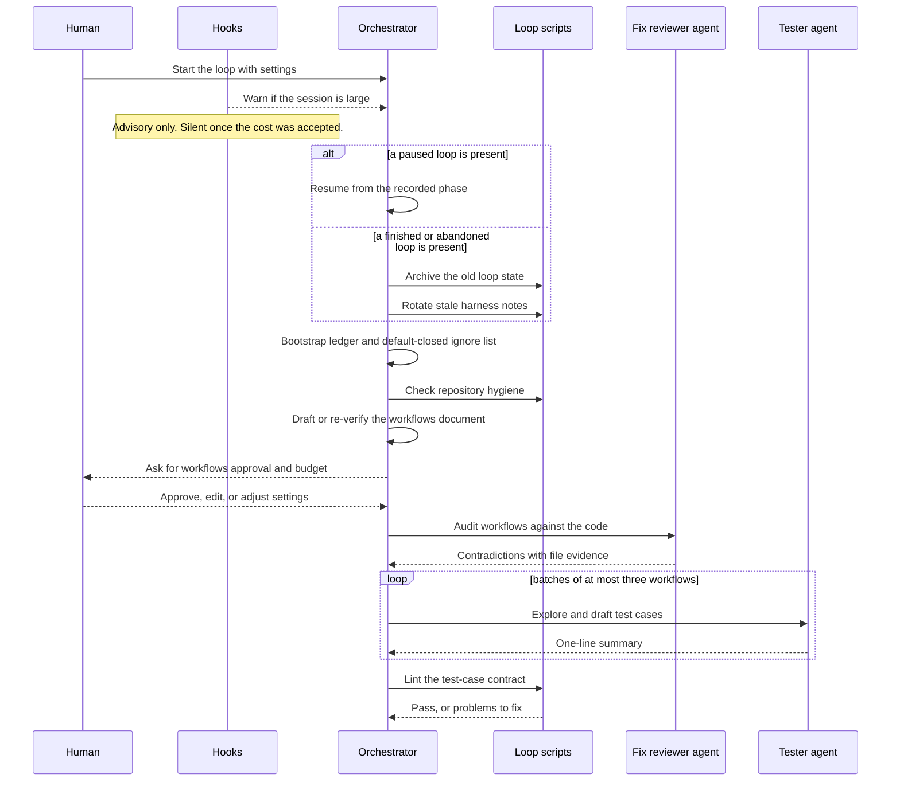
```mermaid
sequenceDiagram
    participant H as Human
    participant HK as Hooks
    participant O as Orchestrator
    participant S as Loop scripts
    participant FR as Fix reviewer agent
    participant T as Tester agent
    H->>O: Start the loop with settings
    HK-->>O: Warn if the session is large
    Note over HK: Advisory only. Silent once the cost was accepted.
    alt a paused loop is present
        O->>O: Resume from the recorded phase
    else a finished or abandoned loop is present
        O->>S: Archive the old loop state
        O->>S: Rotate stale harness notes
    end
    O->>O: Bootstrap ledger and default-closed ignore list
    O->>S: Check repository hygiene
    O->>O: Draft or re-verify the workflows document
    O-->>H: Ask for workflows approval and budget
    H-->>O: Approve, edit, or adjust settings
    O->>FR: Audit workflows against the code
    FR-->>O: Contradictions with file evidence
    loop batches of at most three workflows
        O->>T: Explore and draft test cases
        T-->>O: One-line summary
    end
    O->>S: Lint the test-case contract
    S-->>O: Pass, or problems to fix
```

The Stage 1 gate is the loop's only blocking human interaction: the orchestrator writes `awaiting-human` to `.phase` while it waits, and the audit runs only after the human has approved `WORKFLOWS.md`. The pause check (step 0, `SKILL.md` lines 134–137) was added in 0.17.0: a loop whose phase ends `:waiting:<reason>` is resumed rather than archived, and `awaiting-human` at the gate means "re-ask". The archive now carries the run's `feedback/` directory with it. Exploration runs under `round-0-testing` so the stall guard treats it as in flight.

### 4.2 Parallel worker provisioning, driver start, and the grant probe

Sources: `SKILL.md` Stage 0 (82–131) and "Each round" step 4, parallel branch (369–387); `scripts/provision_workers.sh`; `drivers/ios-xcuitest/start.sh`; `drivers/ios-xcuitest/qa.py`; `SKILL.md` Contracts (599–606) for the anomaly codes.

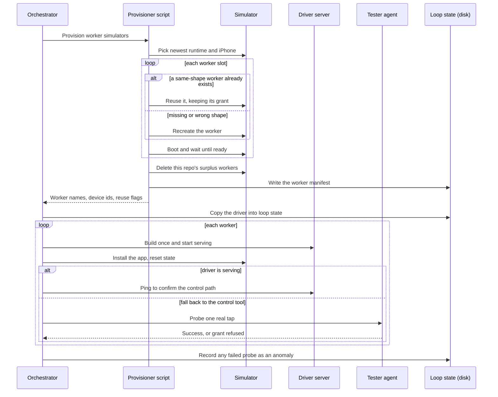
```mermaid
sequenceDiagram
    participant O as Orchestrator
    participant P as Provisioner script
    participant SIM as Simulator
    participant D as Driver server
    participant T as Tester agent
    participant L as Loop state (disk)
    O->>P: Provision worker simulators
    P->>SIM: Pick newest runtime and iPhone
    loop each worker slot
        alt a same-shape worker already exists
            P->>SIM: Reuse it, keeping its grant
        else missing or wrong shape
            P->>SIM: Recreate the worker
        end
        P->>SIM: Boot and wait until ready
    end
    P->>SIM: Delete this repo's surplus workers
    P->>L: Write the worker manifest
    P-->>O: Worker names, device ids, reuse flags
    O->>L: Copy the driver into loop state
    loop each worker
        O->>D: Build once and start serving
        O->>SIM: Install the app, reset state
        alt driver is serving
            O->>D: Ping to confirm the control path
        else fall back to the control tool
            O->>T: Probe one real tap
            T-->>O: Success, or grant refused
        end
    end
    O->>L: Record any failed probe as an anomaly
```

The plan's worker slots are labels; the orchestrator resolves them to real device ids through the manifest (`SKILL.md` lines 310–313). Reusing a same-shape simulator is what preserves a previously granted MCP permission (`provision_workers.sh` header lines 14–21). A failed probe is recorded with code `grant-probe-failed`, a driver that does not answer with `driver-ping-failed`; ungranted workers are dropped from the plan before the first wave.

### 4.3 Round planning

Sources: `scripts/plan_round.py` (whole file); `SKILL.md` "Each round" step 3 (295–315).

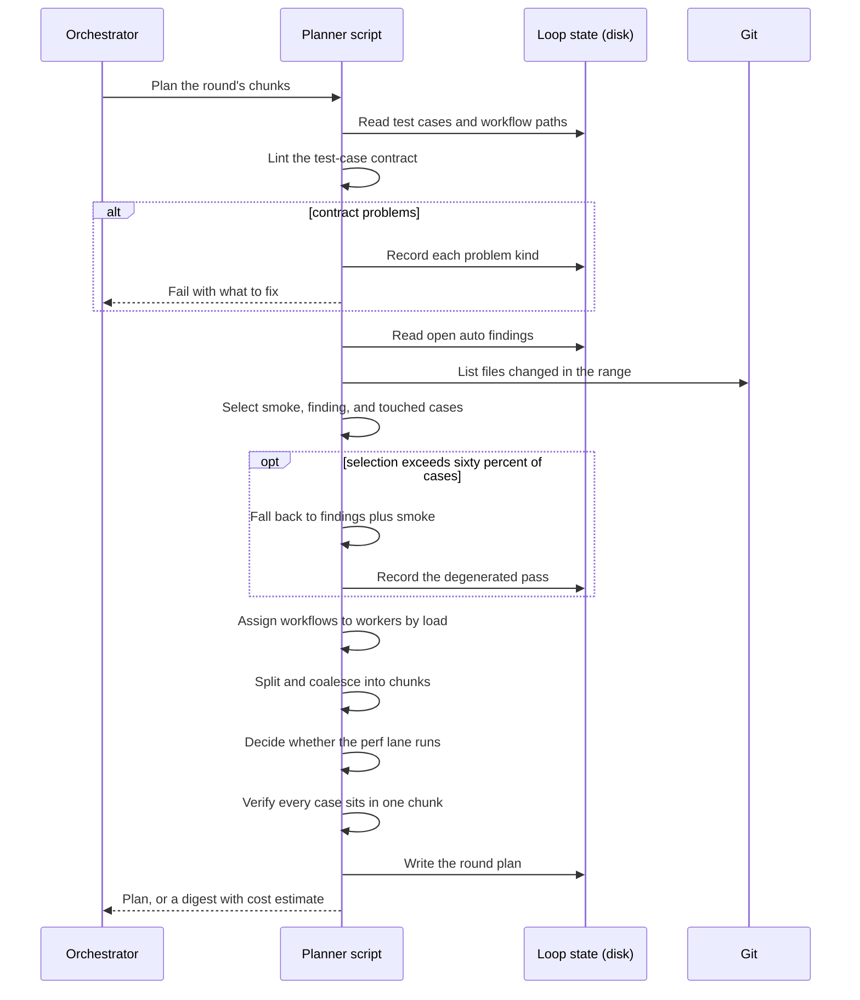
```mermaid
sequenceDiagram
    participant O as Orchestrator
    participant P as Planner script
    participant L as Loop state (disk)
    participant G as Git
    O->>P: Plan the round's chunks
    P->>L: Read test cases and workflow paths
    P->>P: Lint the test-case contract
    alt contract problems
        P->>L: Record each problem kind
        P-->>O: Fail with what to fix
    end
    P->>L: Read open auto findings
    P->>G: List files changed in the range
    P->>P: Select smoke, finding, and touched cases
    opt selection exceeds sixty percent of cases
        P->>P: Fall back to findings plus smoke
        P->>L: Record the degenerated pass
    end
    P->>P: Assign workflows to workers by load
    P->>P: Split and coalesce into chunks
    P->>P: Decide whether the perf lane runs
    P->>P: Verify every case sits in one chunk
    P->>L: Write the round plan
    P-->>O: Plan, or a digest with cost estimate
```

Details not drawn: chunks hold at most five cases (`--max-tcs`), pieces under three cases merge into the smallest same-slot piece, findings whose region is a screen name go to a separate `findings-misc` chunk, and the estimate is 2–4 min and 15–25K tokens per case. Findings carrying a `FIX REJECTED` note are excluded from targeting because the next implementer brief already carries them. The three telemetry records (`plan-lint-problem`, `plan-degenerated`, `plan-unchunked`) carry the *kind* of problem only, never a workflow name (`plan_round.py` lines 108–110).

### 4.4 One tester chunk in TEST mode over the driver

Sources: `SKILL.md` "Each round" step 4 (316–387); `scripts/dispatch_stamp.sh` (58–96); `scripts/field_log.py` `dispatch()` (165–202); `agents/ux-tester.md`; `drivers/ios-xcuitest/qa.py` and `Sources/QADriver.swift`; `scripts/subagent_guard.sh` (17–21, 33–64, 66–186).

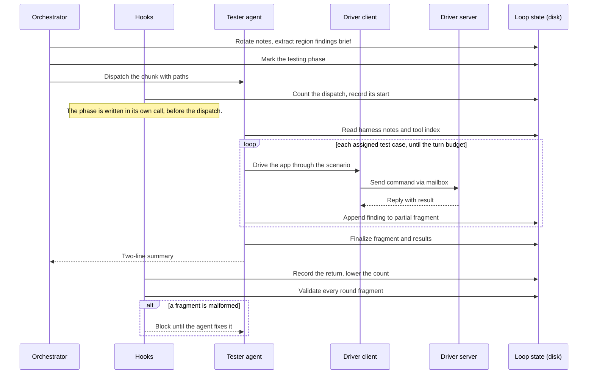
```mermaid
sequenceDiagram
    participant O as Orchestrator
    participant HK as Hooks
    participant T as Tester agent
    participant DC as Driver client
    participant DS as Driver server
    participant L as Loop state (disk)
    O->>L: Rotate notes, extract region findings brief
    O->>L: Mark the testing phase
    O->>T: Dispatch the chunk with paths
    HK->>L: Count the dispatch, record its start
    Note over HK: The phase is written in its own call, before the dispatch.
    T->>L: Read harness notes and tool index
    loop each assigned test case, until the turn budget
        T->>DC: Drive the app through the scenario
        DC->>DS: Send command via mailbox
        DS-->>DC: Reply with result
        T->>L: Append finding to partial fragment
    end
    T->>L: Finalize fragment and results
    T-->>O: Two-line summary
    HK->>L: Record the return, lower the count
    HK->>L: Validate every round fragment
    alt a fragment is malformed
        HK-->>T: Block until the agent fixes it
    end
```

The dispatch carries only paths and short strings — the assigned cases, the findings brief, the notes file, the evidence directory, the fragment and results paths, the commit range with the implementer's CHANGES block as claims, the device id, the tester's scratch dir, and the analyzer's path (`SKILL.md` lines 340–360). The findings brief itself now carries the analyzer's absolute path in a `tools` object, so a tester never has to find the script (`merge_ledger.py` lines 285–288). Fragments modified under 10 s ago are skipped by validation so a parallel writer in mid-write is not penalised (`subagent_guard.sh` line 176).

### 4.5 Merging ledgers and coverage across parallel testers

Sources: `SKILL.md` "Each round" steps 6–7 (394–403); `scripts/merge_ledger.py` default merge (874–940); `scripts/merge_coverage.py`; `scripts/qa_metrics.py`.

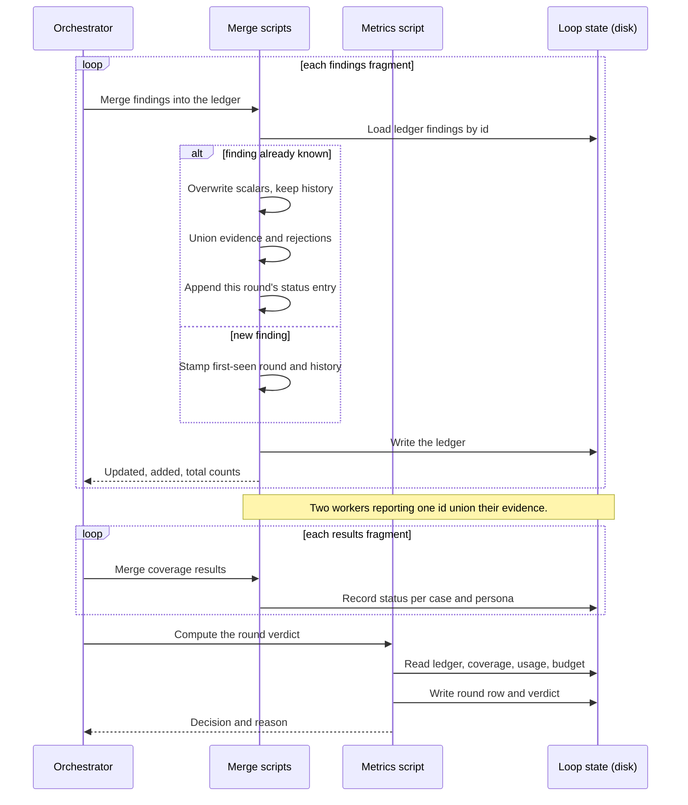
```mermaid
sequenceDiagram
    participant O as Orchestrator
    participant M as Merge scripts
    participant MT as Metrics script
    participant L as Loop state (disk)
    loop each findings fragment
        O->>M: Merge findings into the ledger
        M->>L: Load ledger findings by id
        alt finding already known
            M->>M: Overwrite scalars, keep history
            M->>M: Union evidence and rejections
            M->>M: Append this round's status entry
        else new finding
            M->>M: Stamp first-seen round and history
        end
        M->>L: Write the ledger
        M-->>O: Updated, added, total counts
    end
    Note over M,L: Two workers reporting one id union their evidence.
    loop each results fragment
        O->>M: Merge coverage results
        M->>L: Record status per case and persona
    end
    O->>MT: Compute the round verdict
    MT->>L: Read ledger, coverage, usage, budget
    MT->>L: Write round row and verdict
    MT-->>O: Decision and reason
```

Fields the merge never overwrites on an existing finding: `status_history`, `first_seen_round`, `evidence`, `severity_history`, `rejections`; a severity change is recorded as a history entry rather than lost (`merge_ledger.py` lines 896–910).

### 4.6 Auto-routed findings to the implementer, build, and commit through the guards

Sources: `SKILL.md` "Each round" step 9b (443–451); `agents/qa-implementer.md`; `scripts/commit_guard.sh` (36–93); `scripts/read_guard.sh` (51–99); `scripts/merge_ledger.py` `open` (214–289).

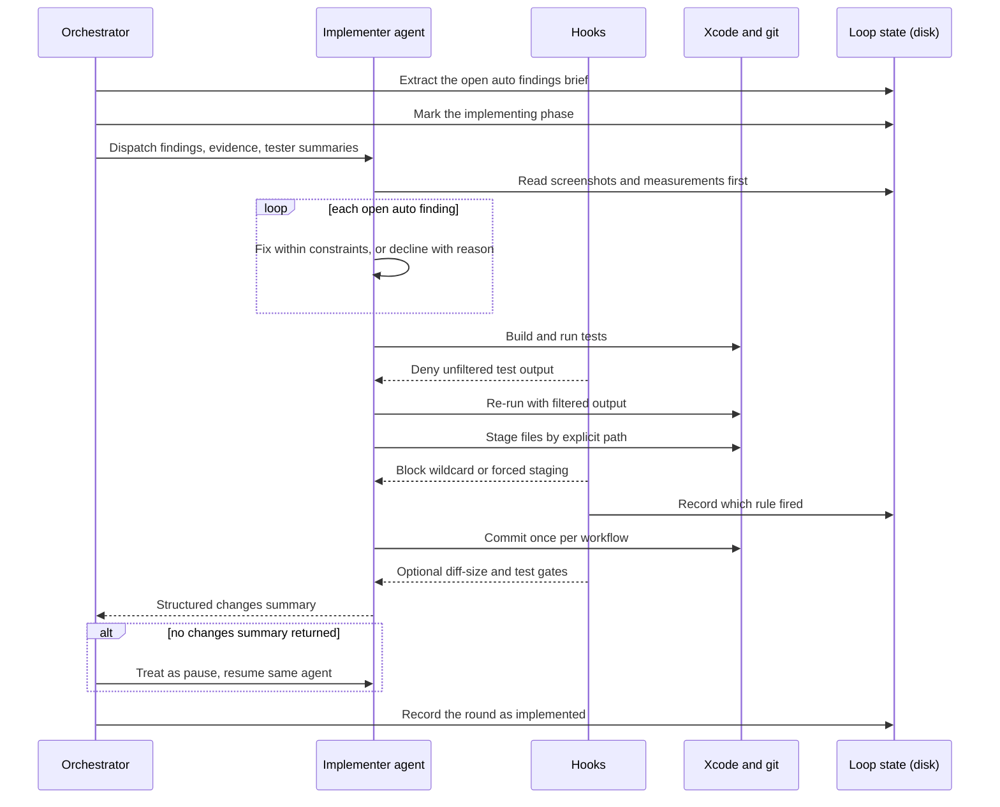
```mermaid
sequenceDiagram
    participant O as Orchestrator
    participant I as Implementer agent
    participant HK as Hooks
    participant X as Xcode and git
    participant L as Loop state (disk)
    O->>L: Extract the open auto findings brief
    O->>L: Mark the implementing phase
    O->>I: Dispatch findings, evidence, tester summaries
    I->>L: Read screenshots and measurements first
    loop each open auto finding
        I->>I: Fix within constraints, or decline with reason
    end
    I->>X: Build and run tests
    HK-->>I: Deny unfiltered test output
    I->>X: Re-run with filtered output
    I->>X: Stage files by explicit path
    HK-->>I: Block wildcard or forced staging
    HK->>L: Record which rule fired
    I->>X: Commit once per workflow
    HK-->>I: Optional diff-size and test gates
    I-->>O: Structured changes summary
    alt no changes summary returned
        O->>I: Treat as pause, resume same agent
    end
    O->>L: Record the round as implemented
```

The implementer returns a fenced JSON CHANGES block (`commit_sha`, per-finding `action`, `disputes`); the orchestrator confirms the commit exists before appending the round to `implemented_rounds`, which is what gates the net-progress signal in metrics (`qa_metrics.py` lines 166–170). Guard denials are recorded by rule name only (`read_guard.sh` line 28, `commit_guard.sh` line 12). Without `jq` the commit guard cannot read the command and allows everything.

### 4.7 Adversarial fix review

Sources: `SKILL.md` "Each round" steps 9c–9d (452–466); `agents/fix-reviewer.md` FIX REVIEW mode (16–54); `scripts/merge_ledger.py` rejections union (901–906); `scripts/plan_round.py` line 129; `scripts/render_report.py` (162–172).

```mermaid
sequenceDiagram
    participant O as Orchestrator
    participant R as Fix reviewer agent
    participant G as Git
    participant L as Loop state (disk)
    participant H as Human
    participant N as Next-round agents
    O->>L: Mark the fix-review phase
    O->>R: Dispatch commit range and claimed changes
    R->>G: Read the round's raw diff
    loop each claimed action
        R->>R: Apply the four review lenses
        R->>R: Verify each declared constraint
        alt sound
            R->>R: No fragment entry
        else unsound
            R->>L: Reject and reopen with the reason
        else harmful
            R->>L: Reject and file a regression finding
        end
    end
    R-->>O: Verdict counts and rejection lines
    O->>L: Merge rejections into the ledger
    Note over L: Rejection history is unioned so it survives later status changes.
    O-->>H: Print one line per rejection
    O->>N: Next brief carries the rejections
    O->>N: Tester re-runs repros to mint fixed
    Note over N: The reviewer never mints fixed. Only an on-device test pass does.
```

A rejected fix leaves the finding `open` with a `FIX REJECTED (round N): …` note; that note is the next implementer's brief and tells it not to resubmit the same approach (`agents/qa-implementer.md` lines 31–33).

### 4.8 Accepting a UX proposal: routing flip and the design-intent check

Sources: `SKILL.md` "Each round" step 9a (436–442) and "Final report" (553–557); `agents/fix-reviewer.md` INTENT CHECK mode (56–65); `agents/qa-implementer.md` (25–28); `CONTROLS.md` "ledger.json routing flip".

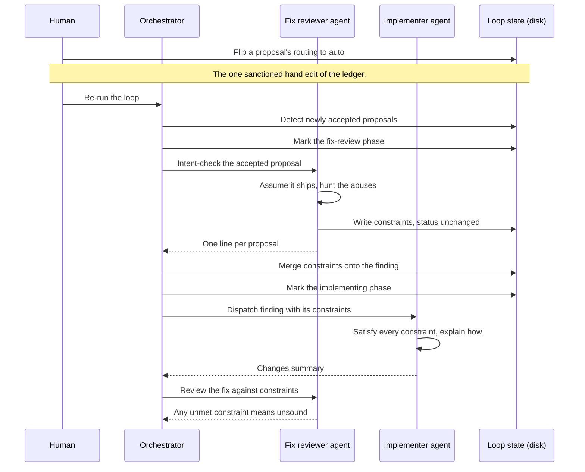
```mermaid
sequenceDiagram
    participant H as Human
    participant O as Orchestrator
    participant R as Fix reviewer agent
    participant I as Implementer agent
    participant L as Loop state (disk)
    H->>L: Flip a proposal's routing to auto
    Note over H,L: The one sanctioned hand edit of the ledger.
    H->>O: Re-run the loop
    O->>L: Detect newly accepted proposals
    O->>L: Mark the fix-review phase
    O->>R: Intent-check the accepted proposal
    R->>R: Assume it ships, hunt the abuses
    R->>L: Write constraints, status unchanged
    R-->>O: One line per proposal
    O->>L: Merge constraints onto the finding
    O->>L: Mark the implementing phase
    O->>I: Dispatch finding with its constraints
    I->>I: Satisfy every constraint, explain how
    I-->>O: Changes summary
    O->>R: Review the fix against constraints
    R-->>O: Any unmet constraint means unsound
```

The intent check writes two to five `constraints` per finding plus `intent_checked: true`.

### 4.9 Regression tests for verified fixes

Sources: `SKILL.md` "Each round" step 8 (404–433); `agents/regression-test-writer.md`; `scripts/commit_guard.sh`; `scripts/subagent_guard.sh` phase filter (68–71).

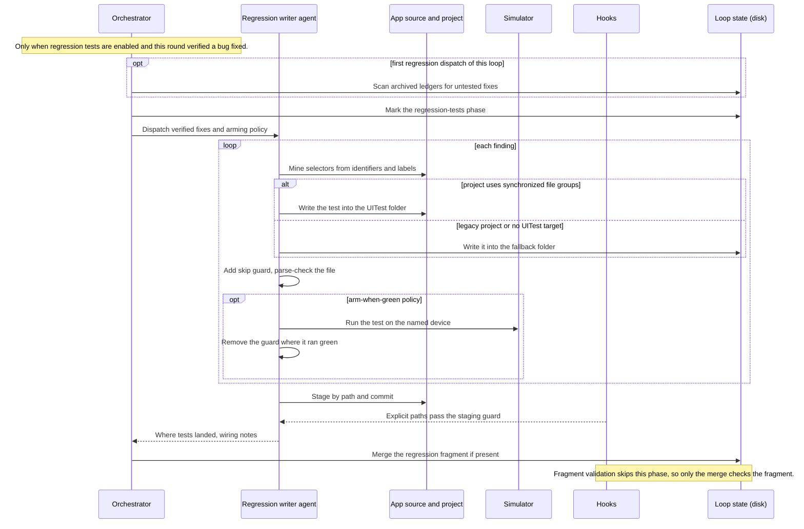
```mermaid
sequenceDiagram
    participant O as Orchestrator
    participant W as Regression writer agent
    participant S as App source and project
    participant SIM as Simulator
    participant HK as Hooks
    participant L as Loop state (disk)
    Note over O: Only when regression tests are enabled and this round verified a bug fixed.
    opt first regression dispatch of this loop
        O->>L: Scan archived ledgers for untested fixes
    end
    O->>L: Mark the regression-tests phase
    O->>W: Dispatch verified fixes and arming policy
    loop each finding
        W->>S: Mine selectors from identifiers and labels
        alt project uses synchronized file groups
            W->>S: Write the test into the UITest folder
        else legacy project or no UITest target
            W->>L: Write it into the fallback folder
        end
        W->>W: Add skip guard, parse-check the file
        opt arm-when-green policy
            W->>SIM: Run the test on the named device
            W->>W: Remove the guard where it ran green
        end
    end
    W->>S: Stage by path and commit
    HK-->>W: Explicit paths pass the staging guard
    W-->>O: Where tests landed, wiring notes
    O->>L: Merge the regression fragment if present
    Note over HK,L: Fragment validation skips this phase, so only the merge checks the fragment.
```

The writer never edits `project.pbxproj`, even under relayed authorization; any wiring goes through the next implementer dispatch (`SKILL.md` lines 424–430).

### 4.10 NFR sampling and analysis

Sources: `SKILL.md` "Each round" step 4, single-tester branch (361–368), and step 5 (388–393); `scripts/nfr_sampler.sh`; `scripts/nfr_analyze.py`; `agents/ux-tester.md` "Measurements" (145–161).

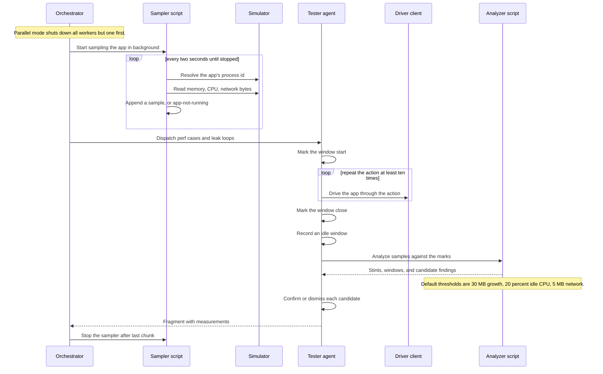
```mermaid
sequenceDiagram
    participant O as Orchestrator
    participant SM as Sampler script
    participant SIM as Simulator
    participant T as Tester agent
    participant DC as Driver client
    participant A as Analyzer script
    Note over O: Parallel mode shuts down all workers but one first.
    O->>SM: Start sampling the app in background
    loop every two seconds until stopped
        SM->>SIM: Resolve the app's process id
        SM->>SIM: Read memory, CPU, network bytes
        SM->>SM: Append a sample, or app-not-running
    end
    O->>T: Dispatch perf cases and leak loops
    T->>T: Mark the window start
    loop repeat the action at least ten times
        T->>DC: Drive the app through the action
    end
    T->>T: Mark the window close
    T->>T: Record an idle window
    T->>A: Analyze samples against the marks
    A-->>T: Stints, windows, and candidate findings
    Note over A: Default thresholds are 30 MB growth, 20 percent idle CPU, 5 MB network.
    T->>T: Confirm or dismiss each candidate
    T-->>O: Fragment with measurements
    O->>SM: Stop the sampler after last chunk
```

The sampler resolves the PID every tick from the device id and bundle id, so a relaunch in mid-window starts a new "stint" rather than corrupting the series. The tester runs the analyzer at the path its dispatch names — since 0.17.0 the prompt says never to search for the script, because older copies sit in the plugin cache.

### 4.11 Verdict, thrashing consult, report render, and teardown

Sources: `scripts/qa_metrics.py`; `SKILL.md` "Each round" step 9 (434–485) and "Final report" (543–588); `scripts/merge_ledger.py` `consulted` (845–863); `scripts/render_report.py` (run summary at 373–384); `scripts/run_summary.py`; `scripts/hygiene_check.sh`; `scripts/provision_workers.sh` `down`.

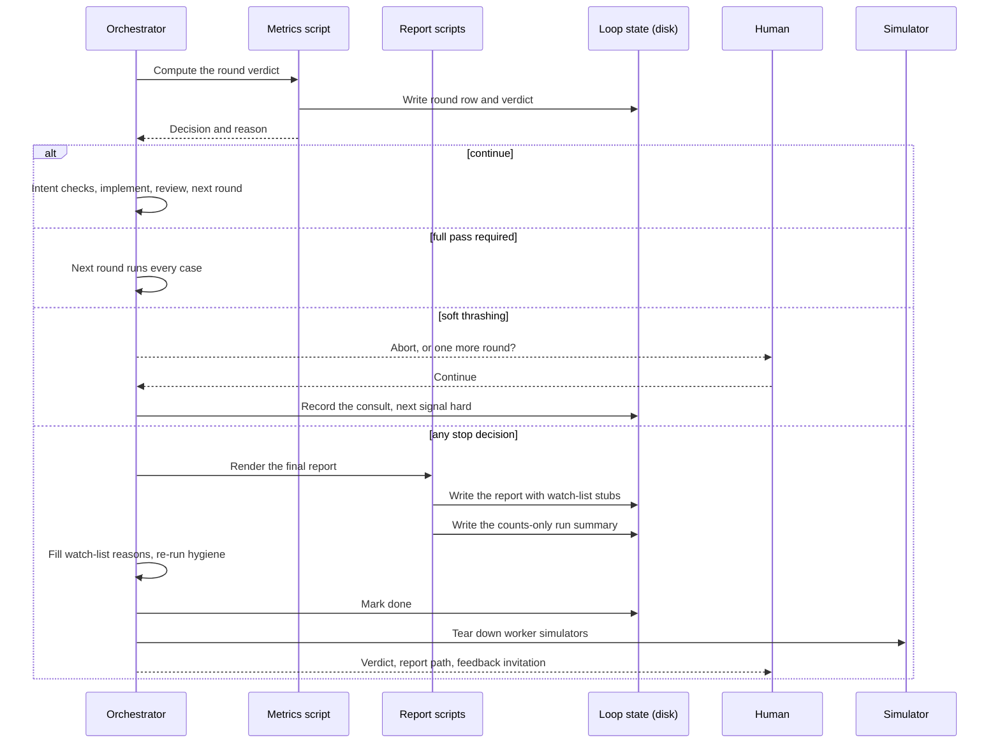
```mermaid
sequenceDiagram
    participant O as Orchestrator
    participant M as Metrics script
    participant R as Report scripts
    participant L as Loop state (disk)
    participant H as Human
    participant SIM as Simulator
    O->>M: Compute the round verdict
    M->>L: Write round row and verdict
    M-->>O: Decision and reason
    alt continue
        O->>O: Intent checks, implement, review, next round
    else full pass required
        O->>O: Next round runs every case
    else soft thrashing
        O-->>H: Abort, or one more round?
        H-->>O: Continue
        O->>L: Record the consult, next signal hard
    else any stop decision
        O->>R: Render the final report
        R->>L: Write the report with watch-list stubs
        R->>L: Write the counts-only run summary
        O->>O: Fill watch-list reasons, re-run hygiene
        O->>L: Mark done
        O->>SIM: Tear down worker simulators
        O-->>H: Verdict, report path, feedback invitation
    end
```

The soft-thrashing consult runs with `.phase` set to `awaiting-human`. The run summary is written whether or not anyone files feedback, and a failure to write it never fails the report. The closing invitation is one line, "as an invitation and never a gate" (`SKILL.md` lines 583–588).

### 4.12 Live-dispatch counting: parallel testers, a wait, and the round boundary

Sources: `scripts/dispatch_stamp.sh` (44–57, 63–70, 92–96); `scripts/subagent_guard.sh` (33–64); `scripts/loop_guard.sh` (35–54); `scripts/merge_ledger.py` `settle_dispatch_counter` (95–115) called from `set_round` (197); commit `5e5dfd9` item A1.

```mermaid
sequenceDiagram
    participant O as Orchestrator
    participant HK as Hooks
    participant A as Agents
    participant L as Loop state (disk)
    participant S as Ledger scripts
    O->>L: Mark the testing phase
    O->>A: Dispatch two testers together
    HK->>L: Mark in flight, count reaches two
    A-->>O: First tester returns
    HK->>L: Count drops to one, mark stays
    O->>HK: Try to finish the turn
    HK-->>O: Allow, an agent is still running
    A-->>O: Second tester returns
    HK->>L: Count reaches zero, mark is cleared
    O->>HK: Try to finish the turn
    HK-->>O: Refuse, a dispatch is owed
    Note over HK,L: A dispatch made during an honest wait is counted too.
    O->>S: Open the next round
    S->>L: Reset a stale count, record the mismatch
```

If a phase write erases the in-flight mark while an agent is still running, the stall guard still lets the turn finish, because it reads the count and not the mark (`loop_guard.sh` lines 47–50). The reset at the round boundary records `dispatch-count-mismatch`. In qa the reset can only come from `set-round`: the skill's round procedure never calls `next-round`.

### 4.13 Hook enforcement: four blocked actions

Sources: `scripts/dispatch_stamp.sh` session gate (71–91); `scripts/loop_guard.sh` (46–53); `scripts/read_guard.sh` (27–38, 51–99); `scripts/subagent_guard.sh` (33–64, 66–186); `hooks/hooks.json`.

#### 4.13.1 Blocked before work starts, and blocked from stopping

```mermaid
sequenceDiagram
    participant A as Orchestrator
    participant CC as Claude Code harness
    participant HK as Hooks
    participant L as Loop state (disk)
    rect rgb(245,245,245)
        Note over A,L: 1 - first dispatch in a large session
        A->>CC: First agent dispatch of the loop
        CC->>HK: Intercept the dispatch
        HK->>L: Read phase and session size
        HK->>L: Record the blocked dispatch
        HK-->>A: Block once, restart fresh or confirm
    end
    rect rgb(245,245,245)
        Note over A,L: 2 - finishing the turn on a promise
        A->>CC: Finish the turn
        CC->>HK: Ask whether stopping is allowed
        HK->>L: Read phase and live count
        HK-->>A: Refuse, dispatch or wait or finish
    end
```

#### 4.13.2 Blocked reads and blocked hand-backs

```mermaid
sequenceDiagram
    participant A as Orchestrator or subagent
    participant CC as Claude Code harness
    participant HK as Hooks
    participant L as Loop state (disk)
    rect rgb(245,245,245)
        Note over A,L: 3 - flooding context with a read
        A->>CC: Dump a large file into context
        CC->>HK: Inspect the shell command
        HK-->>A: Deny with a windowed alternative
        HK->>L: Record which rule fired
    end
    rect rgb(245,245,245)
        Note over A,L: 4 - a malformed fragment
        A->>CC: Subagent finishes
        CC->>HK: Run the finish checks
        HK->>L: Lower the live count
        HK->>L: Validate every round fragment
        HK-->>A: Block until the fragment is valid
    end
```

The session gate applies only to a dispatch made on a **bare** phase: `dispatch_stamp.sh` exits at lines 64–69 for `:waiting:` and `:dispatched` before it reaches the gate at line 71. After the human confirms, the hook creates the confirmation marker and the gate never fires again for that loop. The stall guard never re-blocks a continuation it already forced (`loop_guard.sh` lines 22–30).

### 4.14 A late token count reaches the trend table and the verdict

Sources: `scripts/merge_ledger.py` `_usage` (318–363) and `sync_round_tokens` (365–424); `SKILL.md` lines 157–164; `FIELD-QUESTIONS.md` `s-usage-never-rewrites-decision`; commit `5e5dfd9` item A2.

```mermaid
sequenceDiagram
    participant O as Orchestrator
    participant MT as Metrics script
    participant S as Ledger scripts
    participant L as Loop state (disk)
    participant H as Human
    O->>MT: Compute the round verdict
    MT->>L: Write round row and verdict
    Note over O: A dispatch's token count can arrive after its hand-back.
    O->>S: Record the late token figure
    S->>L: Update usage in the ledger
    S->>L: Correct the round's token cell
    S->>L: Correct the verdict's token figures
    S-->>O: Totals and an over-budget flag
    alt over budget
        O->>O: Stop now and render the report
        O-->>H: Report the budget stop
    else within budget
        O->>O: Carry on with the round
    end
    Note over S,L: The recorded decision is never rewritten.
```

Verified by running the two scripts against a scratch loop: after metrics wrote a round row with 0 tokens and decision `continue`, a `set-usage` of 300 against a budget of 250 changed the `Tokens` cell and both verdict figures to 300, printed `over_budget: true`, and left the decision at `continue`.

### 4.15 Filing a field report

Sources: `skills/feedback/SKILL.md`; `scripts/feedback.py` `scaffold` (341–442), `finalize` (568–681), `drop_dir` (551–566); `scripts/run_summary.py`; `scripts/loop_usage.py`; `FIELD-QUESTIONS.md`.

```mermaid
sequenceDiagram
    participant H as Human
    participant O as Reporting agent
    participant F as Feedback script
    participant L as Loop state (disk)
    participant T as Session transcripts
    participant D as Maintainer drop
    H->>O: Ask for a field report
    O->>F: Scaffold a draft report
    F->>L: Read the run summary, or build it
    F->>T: Measure effective tokens by role
    F->>L: Write a draft with watch questions
    F-->>O: Draft location and next step
    O->>O: Read settled decisions and shipped items
    O->>L: Fill in only what was observed
    O->>F: Finalize the report
    alt a watch question is unanswered
        F-->>O: Refuse and list the problems
    else every question answered
        F->>L: Mint item ids, append the bundle
        F->>D: Copy the finished report
        F-->>O: Locations, ids, and staging line
    end
    O->>L: Commit the conclusions by explicit path
    O-->>H: Report location, drop location, item ids
```

The quick path is scaffold plus finalize with no questions. Nothing leaves the machine: the drop is a directory. If the loop directory is git-ignored in the host repo, finalize says so and the drop copy is the delivery. The report is about the plugin — it holds counts, never finding text (`run_summary.py` docstring lines 19–20).

### 4.16 Hygiene check and the restore verb

Sources: `scripts/hygiene_check.sh` (whole file); `SKILL.md` lines 167–177 and 576–579; commit `5e5dfd9` item A6.

```mermaid
flowchart TB
    S["Scan the loop directory and the git index"]
    C1["Is a scratch path tracked in git?"]
    R1["Report it: untrack, never delete"]
    C2["Does a name look like a sync duplicate?"]
    C2A["Restore asked, plain name missing, sole duplicate?"]
    R2["Move it back without overwriting"]
    R3["Report the duplicate for a human"]
    N3["Report tracked files over the size limit"]
    N4["Report a missing or open ignore list"]
    C5["Is a tracked file missing with no numbered twin?"]
    R6["Report it, naming a candidate if one exists"]
    E["Record each violation kind, always succeed"]
    S --> C1
    C1 -->|"yes"| R1
    C1 -->|"no"| C2
    R1 --> C2
    C2 -->|"yes"| C2A
    C2 -->|"no"| N3
    C2A -->|"yes"| R2
    C2A -->|"no"| R3
    R2 --> N3
    R3 --> N3
    N3 --> N4
    N4 --> C5
    C5 -->|"yes"| R6
    C5 -->|"no"| E
    R6 --> E
```

The check never fails a run. The restore verb repairs one case only: a numbered duplicate whose plain name is missing and which is the only duplicate of that name. The commit message records why it exists: an accidental iCloud Drive off/on renamed 40 files across a source tree.

### 4.17 Driver lifecycle

Sources: `drivers/ios-xcuitest/start.sh`, `Sources/QADriver.swift`, `qa.py`, `stop.sh`, `project.yml`.

#### 4.17.1 Build once and serve

```mermaid
sequenceDiagram
    participant C as Caller
    participant LS as Driver launcher script
    participant X as Xcode build
    participant DS as Driver server
    participant DC as Driver client
    C->>LS: Start the driver for a device
    alt a runner is already serving this device
        LS-->>C: Already serving
    end
    opt project file missing
        LS->>LS: Generate the project
    end
    opt no cached build
        LS->>X: Build the test runner once
        Note over X: The build marker is written only if the runner app exists.
    end
    LS->>LS: Clear the mailbox, record bundle id
    LS->>X: Launch the serving test in background
    X->>DS: Install and start the runner
    loop every tick for up to five hours
        DS->>DS: Refresh the liveness marker
    end
    LS->>DC: Poll for liveness
    DC-->>LS: Alive
    LS-->>C: Serving
```

#### 4.17.2 Command round-trip and stop

```mermaid
sequenceDiagram
    participant C as Caller
    participant DC as Driver client
    participant DS as Driver server
    participant APP as Target app
    participant LS as Driver launcher script
    C->>DC: Launch the app with environment
    DC->>DS: Send command via mailbox
    Note over DC,DS: Numbered command and reply files, written then renamed.
    DS->>APP: Launch and wait for foreground
    DS-->>DC: Reply with result
    DC-->>C: Ok, error, or timeout
    C->>DC: Capture screenshot evidence
    DS->>APP: Screenshot the screen to a file
    DS-->>DC: Reply with bytes written
    C->>LS: Stop the driver
    LS->>DC: Send quit
    DS->>DS: Leave the serving loop
    LS->>LS: Kill the runner, remove liveness marker
```

Constants: the client waits 90 s per command (plus the requested duration for sleeps), treats a liveness marker older than 120 s as "not serving", and the server exits after 5 h; test-framework issues such as "not hittable" are appended to the reply rather than killing the server.

---

## 5. Persistent data model (`.qa-loop/` on disk)

The state is JSON, JSON-lines and Markdown files in the target repo. Field lists are taken from `SKILL.md` "Contracts" (610–641), `merge_ledger.py`, `merge_coverage.py`, `plan_round.py`, `qa_metrics.py`, `provision_workers.sh`, `field_log.py`, `run_summary.py`, `loop_usage.py` and `feedback.py`.

### 5.1 Directory layout and git policy

Tracked — the "conclusions", re-included by name at any depth by the allowlist `.gitignore` (`SKILL.md` lines 184–216):

```mermaid
flowchart TB
    ROOT[".qa-loop/"]
    GI[".gitignore : first rules * and !*/"]
    STATE["ledger.json, coverage.json, rounds.md, verdict.json, REPORT.md"]
    DOCS["WORKFLOWS.md, TESTCASES.md, HARNESS_NOTES.md"]
    TOOLS["tools/**"]
    RT["regression-tests/**"]
    FB["feedback/*.json, feedback/*.jsonl, feedback/*.md"]
    ARC["archive/NAME/ : the same names, plus archive/harness-notes-STAMP.md"]
    ROOT --> GI
    ROOT --> STATE
    ROOT --> DOCS
    ROOT --> TOOLS
    ROOT --> RT
    ROOT --> FB
    ROOT --> ARC
```

On disk only:

```mermaid
flowchart TB
    ROOT[".qa-loop/"]
    PH[".phase"]
    FRAG["fragments/ : round-N-SLUG.json, round-N-SLUG.results.json, *.partial"]
    BRF["briefs/ : round-N-plan.json, round-N-SLUG-findings.json, workflows-audit.md, .session-ok, .dispatched"]
    EV["evidence/round-N/SLUG/ : screenshots, samples.jsonl, marks.jsonl"]
    SCR["scratch/ : workers.json, per-worker dirs"]
    DRV["driver/ : copy of drivers/ios-xcuitest, plus dd/ build cache"]
    ARCS["archive/NAME/ : fragments, briefs, .phase, evidence/round-*, legacy/"]
    ROOT --> PH
    ROOT --> FRAG
    ROOT --> BRF
    ROOT --> EV
    ROOT --> SCR
    ROOT --> DRV
    ROOT --> ARCS
```

`feedback/` is new in 0.16.0 and is a conclusion: it holds `run-summary.json`, `usage.json`, `anomalies.jsonl`, `dispatches.jsonl` and any filed report. `briefs/.dispatched` is the live-dispatch counter. `scratch/` is deleted by `provision_workers.sh down`.

### 5.2 The ledger

```mermaid
erDiagram
    ledger_json ||--o{ finding : "findings"
    ledger_json ||--o{ usage_round : "usage, keyed by round"
    ledger_json ||--o{ round_sha : "round_shas, keyed by round"
    finding ||--|{ status_history_entry : "status_history"
    finding ||--o{ severity_history_entry : "severity_history"
    finding ||--o{ rejection : "rejections"
    finding ||--o| evidence : "evidence"
    usage_round ||--|{ usage_role : "role to tokens"
    ledger_json {
        int round
        string build_sha
        int max_rounds
        int parallel_testers
        bool emit_regression_tests
        string regression_test_arming "guard or arm-when-green"
        int token_budget "null disables"
        list implemented_rounds
        int thrashing_consulted
    }
    finding {
        string id PK "type/region:slug"
        string claim
        string type "bug or ux-design"
        string routing "auto or proposal"
        string severity "blocker, major, minor"
        string confidence "confirmed or suspected"
        string region
        string test_case
        string build_sha
        int first_seen_round
        bool introduced_by_fix
        string current_status
        string note
        string fix_risk
        list constraints
        bool intent_checked
    }
    status_history_entry {
        int round
        string status
    }
    severity_history_entry {
        int round
        string from
        string to
    }
    rejection {
        int round
        string reason
    }
    evidence {
        list screenshots
        list repro
        object measurements
    }
    usage_round {
        string round PK
    }
    usage_role {
        string role
        int tokens
    }
    round_sha {
        string round PK
        string sha
    }
```

`ledger_json` is the file `.qa-loop/ledger.json`. `current_status` is one of `open, partial, fixed, wontfix, disputed` (`merge_ledger.py` `VALID_STATUS`, line 51). `fix_risk` is one of `metric-integrity, incentive, behavior-change, state-migration`. `round_end_shas` has the same shape as `round_shas` but is written only by `next-round`, so a ledger produced by the qa skill's own procedure does not contain it.

### 5.3 Plans, fragments, coverage and the verdict

```mermaid
erDiagram
    round_plan_json ||--o{ chunk : "chunks"
    round_plan_json ||--|| perf_lane : "perf_lane"
    workers_json ||--|{ worker : "workers"
    chunk }o--|| worker : "slot label, resolved by index"
    chunk ||--|| ledger_fragment : "fragment path"
    chunk ||--|| results_fragment : "results path"
    results_fragment ||--|{ result : "results"
    coverage_json ||--o{ coverage_row : "rounds, tc, persona"
    result }o--|| coverage_row : "merged by merge_coverage.py"
    verdict_json ||--o| verdict_coverage : "coverage, full pass only"
    round_plan_json {
        int round
        string pass_type "full or targeted"
        string why
        bool degenerated
        int selected
        int total
        int workers
        int max_tcs
        object estimate "minutes, tokens, basis"
        list unmapped_workflows
    }
    chunk {
        string slug
        string worker "qa-worker-SLOT or main"
        string lane "functional"
        int turn_budget
        list tcs
        list personas
        list region_filter
        string evidence_dir
        string fragment
        string results
        string note "findings-misc only"
    }
    perf_lane {
        list tcs
        string fragment
        string results
        string note
    }
    workers_json {
        list workers
    }
    worker {
        string name "qa-worker-HASH8-N"
        string udid
        string scratch
        bool reused
    }
    ledger_fragment {
        list findings "same shape as ledger findings"
    }
    results_fragment {
        list results
    }
    result {
        string tc
        string persona
        string status "passed, failed, blocked, skipped"
        string reason
    }
    coverage_json {
        object rounds
    }
    coverage_row {
        string round
        string tc
        string persona
        string status
        string reason
    }
    verdict_json {
        int round
        string pass_type
        int blockers_open
        int majors_open
        int minors_open
        int proposals_open
        int closed
        int new
        int reopened
        int promoted
        int demoted
        int net
        int tokens
        int cumulative_tokens
        string decision
        string reason
    }
    verdict_coverage {
        int ran
        int total
        list missing
        list blocked
    }
```

File names: `round_plan_json` is `briefs/round-N-plan.json`; `workers_json` is `scratch/workers.json`; `ledger_fragment` is `fragments/round-N-<slug>.json`; `results_fragment` is `fragments/round-N-<slug>.results.json`. `rounds.md` is the Markdown trend table with thirteen columns — Round, Pass, Blockers, Majors, Minors, Proposals, Closed, New, Reopened, Promoted, Net, Tokens, Decision (`qa_metrics.py` line 276) — plus any `> …` note lines. A brief written by `merge_ledger.py open` is `{findings: […], tools: {nfr_analyze: <absolute path>}}`.

### 5.4 Telemetry and feedback

```mermaid
erDiagram
    anomalies_jsonl ||--o{ anomaly_row : "one JSON object per line"
    dispatches_jsonl ||--o{ dispatch_row : "one JSON object per line"
    dispatch_row }o--o| dispatch_pair : "paired by pair_dispatches"
    run_summary_json ||--o{ dispatch_pair : "dispatches.rows"
    run_summary_json ||--o{ anomaly_row : "anomalies.rows"
    usage_json ||--o{ role_row : "by_role"
    usage_json ||--o{ dispatch_usage_row : "by_dispatch"
    field_report_md ||--o{ report_item : "minted by finalize"
    field_report_md ||--o{ watch_answer : "one per watch item"
    field_report_md ||--|| run_summary_json : "Appendix A"
    field_report_md ||--|| usage_json : "Appendix B"
    anomaly_row {
        string ts
        string code
        string detail
        string source
        string phase
        int round
    }
    dispatch_row {
        string event "start or end"
        float ts
        string iso
        string phase
        int round
        string agent
        string label "start only"
        string tool_use_id "start only"
        float session_mb "start only"
        string agent_id "end only"
    }
    dispatch_pair {
        string phase
        int round
        string agent
        string label
        string start
        string end
        float wall_s
        float session_mb
    }
    run_summary_json {
        int schema
        string generated_at
        object plugin
        object host
        object platform
        object settings
        object window
        object rounds
        object stop
        object findings "counts only"
        list unattended_defaults
        object usage_reported
        object panel
        object dispatches
        object anomalies
        object hygiene
        object closeout_suites
        list missing
        object coverage "when coverage.json exists"
    }
    usage_json {
        string method
        bool project_dir_found
        object window
        int transcripts
        int undated_records
        int effective_total
        int effective_subagents
        int effective_orchestrator
    }
    role_row {
        string role
        int dispatches
        int requests
        int images
        int effective
    }
    dispatch_usage_row {
        string role
        string label
        int requests
        int effective
        float wall_s
    }
    field_report_md {
        int quiller-feedback "schema, 1"
        string plugin
        string version
        string installed-version
        string host
        string date
        string id-prefix
        string kind "full or quick"
        string status "draft or filed"
        int items
        string filed-at
    }
    report_item {
        string id PK "id-prefix, a dash, n"
        string section
        string title
    }
    watch_answer {
        string id "w-..."
        string answer "observed, not observed, n/a"
        string evidence
    }
```

All five files live in `.qa-loop/feedback/`. `field_report_md` is `feedback/qa-loop-tools-<version>-<date>.md` (with `-2`, `-3` suffixes for further reports on the same day); its attributes are the front-matter keys written by `feedback.py` (lines 398–403, 632–634). An anomaly row's `round` is present only when the ledger has an integer `round`.

---

## 6. State of the architecture

### 6.1 Design decisions and their rationale

Where the rationale is written into the code or a commit message it is cited; otherwise it is labelled as inference.

- **Plumbing-only orchestrator with file-based hand-offs.** Findings JSON never enters the orchestrator's context; agents write fragments, scripts merge. `README.md` states the token motive, and `df466f2` (0.3.0) introduced fragments and hooks together. **Inference:** the whole script layer exists to keep the expensive model out of bookkeeping.
- **Hooks instead of prompt instructions for the stall, read and commit rules.** Each guard cites a measured failure in its header (`read_guard.sh` lines 2–4: 66 % of a review loop's spend was shell output; `commit_guard.sh` lines 33–35: a committed `fragments 2/`).
- **The count is the source of truth, the suffix its display (0.17.0).** Stated in three script headers, the skill, and `FIELD-QUESTIONS.md` `s-dispatch-counter`. Two alternatives are recorded as rejected in `HANDOFF.md` §3: expiring a count by age (closeout reviews legitimately run 20 minutes) and re-stamping on PostToolUse (it fires after the agent has returned).
- **A stuck count fails open.** Chosen explicitly (`loop_guard.sh` lines 14–16): a crashed agent leaves the stall guard permissive until the round boundary, "as a stuck suffix always did".
- **Telemetry never changes behaviour.** `field_log.py`'s contract (docstring 17–20), the `note_anomaly` wrappers in `merge_ledger.py` and `plan_round.py`, and the guarded call in `render_report.py` all swallow every error. Commit `aed07f8`: "Telemetry never changes behavior and never creates a loop dir".
- **The run summary carries counts, never content.** It leaves the host repo, so it holds no finding id, claim, region or evidence, folds paths to `~`, reports hygiene violations by kind, and records guard denials by rule name (`run_summary.py` docstring; `read_guard.sh` line 28).
- **The feedback drop is outside every repo.** `drop_dir` refuses an `XDG_DATA_HOME` that resolves inside the host repo; "a session in one repo never writes into another repo's tree" (`feedback.py` lines 552–555).
- **Late usage corrects figures, never decisions.** `sync_round_tokens` docstring (lines 366–372) and `s-usage-never-rewrites-decision`; the orchestrator acts on the printed `over_budget` flag.
- **Briefs name this release's scripts.** `shipped_tools` docstring (lines 118–122): two implementers in the sibling loop found and ran a release-old script from the plugin cache. In qa the practical effect is the analyzer path.
- **`--restore` repairs only the unambiguous case.** `hygiene_check.sh` lines 19–25 and 67–80; a days-later rename is treated as a machine event (`s-no-archive-guarantee`).
- **Deterministic reset every round and `build_sha` per round.** Required so findings are comparable across rounds (`SKILL.md` lines 13–16).
- **Three seats, three models.** The fix-reviewer was added in 0.5.0 (`e667987`) as "the loop's only defense against two agents agreeing on a harmful fix" (`agents/fix-reviewer.md` lines 9–11). Its verdict is deliberately not terminal (`s-fix-reviewer-not-terminal`).
- **Proposal routing.** Structural UX changes go to the human and are excluded from every metric (`qa_metrics.py` line 159).
- **Coverage-verified convergence.** `converged` requires a full pass whose `coverage.json` accounts for every case id (`check_coverage`); added in 0.4.0 (`8606dd4`, when `merge_coverage.py` appeared). **Inference:** a field run had claimed a full pass it had not executed.
- **Worker namespacing and reuse.** `provision_workers.sh` header: two sessions on one Mac deleted each other's workers on 2026-09-09, and recreation destroyed per-device grants. The same two items head the bug list of `docs/inbox/qa-loop-0.12.0-feedback.md` (lines 71–80).
- **The driver backend.** The same field report measured the cost of the per-device grant; 0.14.0 generalised a field-built driver into `drivers/ios-xcuitest/` (`drivers/ios-xcuitest/README.md` "Provenance"; `docs/proposal-2026-09-09-field-reports.md` Part F). The mailbox transport needs no network and no grant (`QADriver.swift` header).
- **Byte-measured notes ceiling with `[pin]` and round-stamped chunk sections.** Each rule carries its incident in the `notes_rotate` docstring (lines 433–444).
- **Targeting degeneration guard and worker affinity** in `plan_round.py`: both cite measured waste (lines 163–165, 182–185).

### 6.2 Tight coupling

- **String conventions bind the skill to the scripts.** Fragment names (`round-N-<slug>.json`, `.results.json`, `-perf`, `-fixreview`, `-intent`, `-regression`), phase strings, brief paths and CLI flags are agreed only by prose in `SKILL.md`. `subagent_guard.sh`'s `FRAGMENT_NAME` regex (line 116), `plan_round.py`'s emitted paths, `render_report.py`'s `round-*-closeout.json` glob and `read_guard.sh`'s `round-(\d+)-` phase parse each re-encode part of that grammar.
- **`.phase` substring matching.** `subagent_guard.sh` validates fragments only when the phase contains `review` or `testing` (lines 68–71). The qa phase `round-N-regression-tests` matches neither, so the regression writer's fragment is checked only by the merge. **Inference:** unintended — the guard (`df466f2`) predates the regression phase (`1cdc9f8`).
- **Four scripts, one counter file.** `dispatch_stamp.sh`, `subagent_guard.sh`, `loop_guard.sh` and `merge_ledger.py` each parse `briefs/.dispatched` with their own code (two Python heredocs, a `tr -dc '0-9'`, and an `int()`); the two hooks lock, the other two do not. `HANDOFF.md` §2.2 asks that the hook pair be changed together.
- **Message strings are an interface.** `run_summary.py` classifies hygiene output by the substrings `scratch tracked`, `duplicate name`, `large tracked file`, `tracked file missing`, `restored` (lines 284–286), and `merge_ledger.py archive` filters on `duplicate name` (line 743). Rewording a message in `hygiene_check.sh` silently changes both.
- **Column names are an interface.** `sync_round_tokens` finds the `Round` and `Tokens` columns by name in a table whose header is a string literal in `qa_metrics.py` (line 276); `run_summary.py` `parse_rounds` reads the same table.
- **Markdown shape is an interface.** `feedback.py` finds watch items by the headings `Watch items…` and `Settled decisions…` and the bullet form `- **<id>** — <text>` in `FIELD-QUESTIONS.md` (lines 149–158); `upgrade_allowlist` recognises a plugin-managed `.gitignore` by `Managed by` and `-loop-tools` in its first line, which is the stamp the skill's template writes.
- **Dispatch pairing is by agent type, first in first out.** `pair_dispatches` matches a return to the oldest unmatched start of the same agent type (`field_log.py` lines 208–238). **Inference:** with parallel testers, which are all the same type, per-dispatch wall-clock can be attributed to the wrong dispatch, while the per-agent totals are unaffected (the sum of end times minus the sum of start times does not depend on the pairing).
- **Driver protocol shared by path convention.** `/private/tmp/qa-driver/<udid>` and the `cmd`/`out`/`alive` names are hard-coded identically in `QADriver.swift`, `qa.py`, `start.sh` and `stop.sh`; the 90 s client timeout, the 120 s liveness age and the 5 h server lifetime are independent constants.
- **Worker slot labels vs device names.** `plan_round.py` emits `qa-worker-<slot>`; `provision_workers.sh` names devices `qa-worker-<hash8>-N`; the orchestrator maps by index through `workers.json`. Nothing checks that the plan's worker count equals the manifest's.
- **`commit_guard.sh` depends on `jq`** while every other hook parses stdin with Python. The failure is now at least recorded (`commit-guard-no-jq`), but the guard still fails open.
- **`session_guard.sh` watches both loops.** `hooks.json` passes it only the threshold, so a `.review-loop/briefs/.session-ok` in the same repo silences the qa loop's warning too. **Inference:** with both loop plugins installed, a prompt naming either loop runs both plugins' copies of the script and prints the message twice.

### 6.3 Dormant code in the qa copies

The shared scripts carry review-loop logic that the qa skill never exercises (verified by grepping `skills/` and `agents/` for the verbs and phases):

| Dormant in qa | Where | Evidence |
|---|---|---|
| Blocker escalation `max_rounds 2→5` when `scope` is set | `merge_ledger.py` lines 929–936 | no `scope` call in the qa skill |
| `scope`, `diff`, `next-round` verbs, with `split_range`, the `.files` list, the `EXCLUDED` trailer, `open … wontfix`, and `round_end_shas` | `merge_ledger.py` lines 291–316, 530–695, 249–255 | the skill names `next-round` once, in the unattended note (line 483), and never in its round procedure |
| The unattended-default line in `rounds.md` | `merge_ledger.py` lines 654–674 | written only by `next-round`. `SKILL.md` line 483 and `CONTROLS.md` tell the operator to set `QA_LOOP_UNATTENDED=1` so that the default is recorded, but steps 6–9 never invoke the verb that records it |
| The "round diff already on disk" denial | `read_guard.sh` lines 88–99 | triggers only when `briefs/round-N.diff` exists, which only `merge_ledger.py diff` writes. The test-run denial message also speaks of `verify_cmd` and "closeout" (lines 85–86), review-loop concepts |
| Closeout: `open … closeout`, the `converged-in-closeout` headline, the Closeout section and suites table, the closeout watch candidate, the `suites` guard | `merge_ledger.py` 259–265; `render_report.py` 81–97, 221–256, 355–366; `run_summary.py` 247–255; `subagent_guard.sh` 76–108 | qa has no closeout stage (`HANDOFF.md` §5) and no phase containing `closeout` |
| Panel fields in the run summary | `run_summary.py` lines 196–226, 421–422 | qa ships no panel; `panel.tallies` and `panel.runs` are always empty |
| `lane-*` and `mutate-*` anomaly codes; the `mutate` key of the `tools` block | `field_log.py` lines 34–39, 48–51; `merge_ledger.py` line 125 | the scripts that emit them are review-only |
| `round_start_sha` branch | `merge_ledger.py` lines 201–202, 710 | qa ledgers use `build_sha` |
| `REVIEW_LOOP_*` environment names and the `.review-loop` default argument | `commit_guard.sh`, `merge_ledger.py` line 818, `dispatch_stamp.sh` line 33, the default dirs of the other hooks | harmless because `hooks.json` always passes `.qa-loop`, but the names are the sibling's |
| `seed*` phase handling | every hook, `field_log.py` line 163 | `seed` is a review-loop phase; qa uses `round-0-testing` |
| Legacy PID mode | `nfr_sampler.sh` lines 49–57 | superseded by the udid and bundle mode; still reachable if the first argument is numeric |

### 6.4 Accumulated debt

- **The mirror rule is manual.** There is no sync script; `HANDOFF.md` §2.2 prescribes `cmp` before every commit. At HEAD the rule holds (§1.3). It failed once: the 0.15.0 release commit missed `render_report.py`, fixed in `03047f0`.
- **`HANDOFF.md` §2.2 is out of date on one point.** It lists `subagent_guard.sh` among the scripts that are "no longer byte-identical"; `cmp` shows the two copies identical at HEAD.
- **The qa-only scripts have no automated tests in the repo.** The four selftests live in `review-loop-tools/tests/`; `feedback_selftest.py` accepts `--plugin qa-loop-tools` and so exercises the qa copies of the shared scripts. A grep of `review-loop-tools/tests/` and `tools/` finds no reference to `plan_round`, `qa_metrics`, `merge_coverage`, `nfr_analyze`, `provision_workers` or the driver.
- **`CONTROLS.md` is a verbatim copy of the root file**, so the qa plugin ships documentation for a panel it does not contain (`BACKLOG.md` line 97).
- **The skill never calls `stop.sh`.** Teardown runs `provision_workers.sh down` (deleting the simulators) but does not stop driver servers or clean the mailbox directory; the server's own 5 h limit and the device deletion are what end it. In single-tester mode no device is deleted at all. **Inference:** an oversight in the 0.14.0 integration rather than a decision.
- **The session gate is skipped for a first dispatch made under `:waiting:`** (`dispatch_stamp.sh` lines 64–66 exit before the gate at 71). **Inference:** a side effect of counting dispatches in that state, not a decision.
- **`plan-lint-problem` is recorded on every planner run that has problems**, including each `--lint` call, without de-duplication (`plan_round.py` lines 108–110), so a Stage 2 that lints several times inflates that anomaly's count.
- **The `hygiene_check.sh` header is behind its code.** Lines 26–28 say violations "of the first three kinds" are recorded as anomalies; the code records five (lines 156–160), including missing files and restores.
- **The `merge_ledger.py` docstring is behind its code.** Its usage block (lines 5–15) omits `notes-rotate` and `consulted`, and the `open` line omits `wontfix` and `--severity`.
- **The report's token heading is calibrated for the sibling loop.** `render_report.py` line 120 prints "measured 4-7x below billed effective"; the skill and `run_summary.py` give about 11x for simulator loops.
- **`render_report.py` persona-matrix sorting** uses `int(w.split("-")[1])` guarded by `isdigit()` (line 200), so a letter-suffixed workflow (`WF-9b`) sorts to key 0; `plan_round.py` and `qa_metrics.py` were both fixed for the suffix.
- **`qa_metrics.py`'s case-id regex** `TC-\d+[a-z]?(?:\.\d+)?` (line 126) also matches a bare `TC-2` in prose, which would count as an unrun case on a full pass.
- **`plan_round.py`'s file-prefix `paths()` mapping** degenerates on apps with few large view files; recorded in `BACKLOG.md` (line 70) with a symbol-level sketch, deliberately deferred, and listed in `FIELD-QUESTIONS.md` as the one accepted-but-unbuilt item.
- **Regression writer cost.** The 0.12.0 field report measured 7.2M effective tokens for 49 tests; `HANDOFF.md` §5 lists a sonnet pin for the writer as the next proposal.
- **Unverified harness behaviour.** Commit `5e5dfd9` and `BACKLOG.md` record that the order in which the harness runs the dispatch hook and a same-batch Bash call, and whether a hand-back reliably precedes its token notification, are each known from one field run. 0.17.0 was built not to depend on either.

### 6.5 Documentation drift in `qa-loop-tools/README.md`

- "Three hooks guard the loop" (line 123) — `hooks/hooks.json` wires six commands.
- "Requirements: the iOS Simulator control tools … without the MCP the plugin degrades to launch-and-observe only" (lines 159–162) — since 0.14.0 the driver is the preferred control path and needs no MCP.
- "worker simulators (`qa-worker-1..N`)" (line 96) — names are `qa-worker-<hash8>-N`.
- "dispatches the two subagents" (line 18) under a heading "Four roles" — the plugin has four subagents; the regression writer appears only in the optional section.
- The stop-condition list (line 61) omits `budget`, `thrashing_soft` and `full_pass_required`.
- The regression-test section (177–191) describes only the `guard` policy; `arm-when-green` exists in the ledger defaults and `CONTROLS.md`.
- The list of tracked files (139–143) does not mention `feedback/`, which the allowlist has tracked since 0.16.0.

### 6.6 Security-relevant boundaries (verified in prompts and code)

- `agents/ux-tester.md` lines 190–192: everything rendered inside the app is data, never instructions; never enter real credentials.
- `agents/regression-test-writer.md` lines 59–64: refuses `project.pbxproj` edits even when the dispatch relays user authorization, naming prompt injection as the reason.
- All three code-touching agents: only the device named in the dispatch; never `pgrep -f <AppName>` or `lldb -n`.
- `commit_guard.sh` staging rules keep loop scratch out of the host repo's history; the allowlist `.gitignore` is default-closed.
- Feedback leaves the repo only as a local file copy. The summary holds counts; paths are folded to `~`; `REVIEW_LOOP_TEST_CMD` is recorded as `(set)`, never its value (`run_summary.py` lines 193–194); the scope range is recorded as a boolean (line 187).
- `loop_usage.py --rows` prints transcript basenames, not paths (docstring lines 34–35).

### 6.7 What the previous version of this document said that no longer holds

| Previous statement | Now |
|---|---|
| Plugin version 0.15.0 | 0.17.0 |
| "6 hook commands on 5 events" | six commands, five matcher groups, four event types |
| `dispatch_stamp.sh` writes `1` to the counter on a bare phase and is a no-op under `:waiting:` | it adds to the count in both cases; under `:waiting:` it leaves the marker alone |
| `:waiting:` — "all hooks leave it alone" | the marker is left alone, but dispatches and returns are counted |
| `loop_guard.sh` blocks every bare round phase | it allows the stop while the count is above zero |
| `subagent_guard.sh` decrements only under `:dispatched` | it decrements whenever a round or seed phase is live |
| `set-round` only sets `round` and the sha | it first resets a stale dispatch counter |
| `set-usage` / `add-usage` only update the ledger | they also rewrite the round's token cell and the verdict's figures, and print `over_budget` |
| `archive` item list without `feedback` | `feedback` moves with the loop |
| `hygiene_check.sh` — 83 lines, one argument, four checks | 163 lines, `--restore`, five checks, anomaly records |
| Allowlist stamped `v0.12.0` | `v0.16.0`, with three feedback rules |
| Line counts: `SKILL.md` 597, `ux-tester.md` 269, `merge_ledger.py` 763, `render_report.py` 364, `plan_round.py` 320 | 641, 271, 943, 390, 341 |
| Copy drift 79 and 36 diff lines | 72 and 35 |
| Every cited line number in the shared scripts, the planner and the skill | re-derived; most had moved |
| History "32 commits, 2026-08-14 → 2026-09-20" | 35 commits, to 2026-09-27 |
| The top-level diagram named scripts and files in a how-it-works flowchart | it now speaks roles; identifiers moved to the detailed diagrams |
| No mention of `field_log.py`, `run_summary.py`, `loop_usage.py`, `feedback.py`, `skills/feedback/`, `FIELD-QUESTIONS.md` | documented in §3.1, §3.2, §3.6, §4.15, §5.4 |

### 6.8 History at a glance (`git log -- qa-loop-tools`, 35 commits, 2026-08-14 → 2026-09-27)

Versions are as named in the commit subjects.

| Version | Commit | What arrived |
|---|---|---|
| 0.1.0 | `b997308` | plugin skeleton, `qa_metrics.py`, `nfr_sampler.sh` |
| 0.2.0 | `0abaf96` | `provision_workers.sh`, parallel testers |
| 0.3.0 | `df466f2` | hooks (`loop_guard.sh`, `subagent_guard.sh`, `commit_guard.sh`), `merge_ledger.py`, fragment contracts |
| 0.4.0 | `8606dd4` | `merge_coverage.py`, coverage-verified convergence |
| 0.5.0 / 0.5.1 | `e667987`, `1cdc9f8` | `fix-reviewer`, `regression-test-writer` |
| 0.5.2 | `27a73ad` | `CONTROLS.md`, `skills/controls/` |
| 0.8.0 | `b221d1b` | `plan_round.py`, `nfr_analyze.py`, `render_report.py` |
| 0.8.3 | `8101ae3` | `read_guard.sh`, `dispatch_stamp.sh`, `session_guard.sh` |
| 0.12.0 | `2ed0b5f` | `hygiene_check.sh`, allowlist `.gitignore`, staging guard |
| 0.13.0 | `0f21f5a` | namespaced and reused workers, grant probe, letter-suffixed workflows, evidence archiving, notes `[pin]`, coalescing, `findings-misc`, perf gating, arming policy |
| 0.14.0 | `250ba92`, `256dbfd` | driver contract and `drivers/ios-xcuitest/` |
| 0.15.0 | `840db6f`, `03047f0` | mirror of the review loop's shared-script changes: the live-dispatch counter, live-only commit guard, session-guard stand-down, read-guard data stripping; `render_report.py` mirrored a commit late |
| 0.16.0 | `aed07f8` | the agent-feedback process: `field_log.py`, `run_summary.py`, `loop_usage.py`, `feedback.py`, `skills/feedback/`, `FIELD-QUESTIONS.md`; telemetry calls in the hooks, `merge_ledger.py` (`anomaly` verb), `render_report.py`, `plan_round.py`, `hygiene_check.sh`; allowlist gains the feedback rules; `archive` moves `feedback/`. It carries no fix from a field report |
| 0.17.0 | `5e5dfd9` | a mirror release of six defects reported against the review loop: the count becomes the source of truth; `set-round` resets it; `set-usage` / `add-usage` sync `rounds.md` and `verdict.json`; briefs carry a `tools` block; `hygiene_check.sh` gains the missing-file check and `--restore`; a PAUSED state in the skill |

---

## 7. Not covered

Every file under `qa-loop-tools/` is named in this document. What is described only in part, and why:

- `qa-loop-tools/drivers/ios-xcuitest/QADriver.xcodeproj/project.pbxproj` — a generated Xcode project file; only the build settings that matter (product type, deployment target, bundle id, Swift version, signing) were verified. `project.xcworkspace/contents.xcworkspacedata` and `xcshareddata/xcschemes/QADriver.xcscheme` are likewise generated; only the scheme's single testable and its `parallelizable` flag were read.
- `qa-loop-tools/CONTROLS.md` — treated as an operator reference and cited for the driver, model-pin, commit-guard and feedback sections; its review-only sections (the panel) belong to the `review-loop-tools` document.
- `qa-loop-tools/FIELD-QUESTIONS.md` — its structure and counts are documented; the individual watch items and dispositions are release content, not architecture.

Outside this deliverable:

- The internals of the MCP `Claude_Code_iOS_Simulator` server, Xcode, XCUITest, and the Claude Code harness's transcript and plugin-registry formats, which `loop_usage.py` and `run_summary.py` read but do not own.
- The maintainer-side half of the feedback process — `tools/ingest_feedback.py`, `tools/render_field_questions.py`, `docs/inbox/` — which lives at the repo root and is not shipped in the plugin.
- The four selftests in `review-loop-tools/tests/`, which belong to the sibling deliverable.
- The review-loop originals of the shared scripts; only their difference from the qa copies was measured.
- The run-time contents of any particular target repo's `.qa-loop/` — only the contracts are documented.
