# review-loop-tools — architecture

| | |
|---|---|
| **Deliverable** | `review-loop-tools`, a Claude Code plugin |
| **Version verified** | `0.16.1` (`review-loop-tools/.claude-plugin/plugin.json`) |
| **Commit verified** | `5e5dfd9` (2026-09-27, which is 0.16.0) |
| **Date of verification** | 2026-09-27 |
| **Revised** | 2026-09-27 for 0.16.1 at commit `ce143a5` (on top of `5e5dfd9`) |
| **Supersedes** | the edition written against 0.13.0/0.14.0 (commit `949110b` and earlier) |
| **Siblings (documented separately)** | `qa-loop-tools` 0.17.0, `arch-docs-tools` 0.3.1 |

All paths are relative to the repo root. Inside a module's own subsection in
§3, bare function names and line numbers refer to that module's primary file.

**How this document was produced.** Every script, prompt, hook and test under
`review-loop-tools/` was read in full at `5e5dfd9`. History came from
`git log -- review-loop-tools` (41 commits, 2026-08-14 to 2026-09-27) and, for
the two releases since the previous edition, the commit messages of `aed07f8`
(0.15.0) and `5e5dfd9` (0.16.0). The four self-tests were run and passed
(51 + 19 + 94 + 137 checks). Five of the six items in §7.2 were reproduced
by running the real scripts in a scratch directory; the sixth was a
contradiction between prompt files, read rather than run, and 0.16.1 fixed
it. The document was verified at `5e5dfd9` and revised for 0.16.1 at
`ce143a5`. The revision re-verified only what that release touched: the
version, `review-loop-tools/agents/skeptical-reviewer.md`, and the two
`HANDOFF.md` statements this document had reported as wrong. The generated state
directory `.review-loop/` at the repo root was used only as evidence of file
shapes, and it predates 0.14.0 (it has no `round_end_shas` and no `feedback/`
directory), so the 0.15.0 data model in §4.3 is verified from code and from
`review-loop-tools/tests/feedback_selftest.py`, not from a live run.
Statements reconstructed from history or reasoning rather than read from code
are labelled **Inference**.

---

## 1. What it is

`review-loop-tools` runs an **adversarial implementer/reviewer convergence
loop** inside a Claude Code session against the user's target repository. A
`skeptical-reviewer` subagent files structured findings; an `implementer`
subagent fixes or argues against them and commits; a deterministic script
computes a verdict each round (`converged`, `budget`, `thrashing`,
`thrashing_soft`, `stalemate`, `diminishing`, `backstop`, `continue`); the
loop stops, runs an optional cross-provider "panel" pass and a "closeout"
mop-up, and renders `REPORT.md`
(`review-loop-tools/README.md`, `review-loop-tools/skills/review-loop/SKILL.md`,
`review-loop-tools/scripts/metrics.py` lines 171-196).

Since 0.15.0 every run also leaves a **record for the plugin's maintainer**
(a run summary, dispatch timing, anomalies) and the plugin ships a second
workflow, `/review-loop-tools:feedback`, that files a field report from that
record (`review-loop-tools/skills/feedback/SKILL.md`).

Four things make the design unusual, and they drive most of the code:

1. **The control logic is prose.** The orchestrator is the main Claude
   session executing `review-loop-tools/skills/review-loop/SKILL.md`
   (549 lines); the three subagents are `review-loop-tools/agents/*.md`
   prompt files. The Python and shell scripts are deliberately judgment-free
   plumbing that the prose invokes by exact command line.
2. **Hooks enforce the protocol at zero token cost.** Six shell hooks wired
   in `review-loop-tools/hooks/hooks.json` block stalls, malformed findings
   files, expensive reads, sloppy staging, and oversized-session starts.
3. **All loop state lives in the target repo** under `.review-loop/`, never
   in the plugin directory. A default-closed `.gitignore` allowlist decides
   which state files are "conclusions" (tracked) and which are "scratch"
   (`SKILL.md` lines 95-144).
4. **Two readers, two outputs.** `REPORT.md` is for the owner of the reviewed
   repo; `feedback/` is for the plugin's maintainer and carries counts only
   (`review-loop-tools/scripts/render_report.py` lines 14-17,
   `review-loop-tools/scripts/run_summary.py` lines 19-24).

### 1.1 Top-level architecture

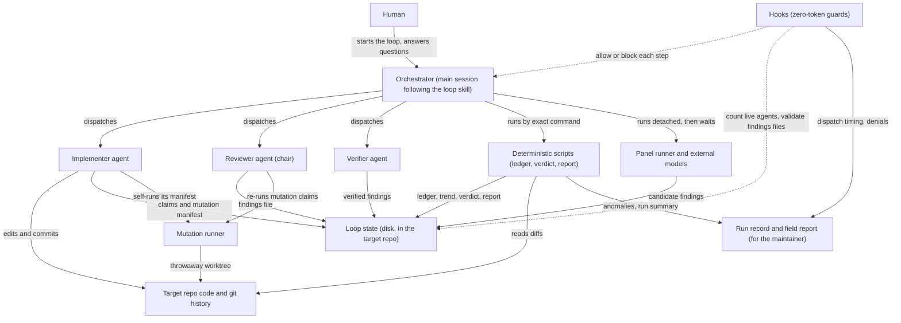
```mermaid
flowchart TB
    H["Human"]
    O["Orchestrator (main session following the loop skill)"]
    K["Hooks (zero-token guards)"]
    I["Implementer agent"]
    R["Reviewer agent (chair)"]
    V["Verifier agent"]
    D["Deterministic scripts (ledger, verdict, report)"]
    P["Panel runner and external models"]
    M["Mutation runner"]
    S["Loop state (disk, in the target repo)"]
    G["Target repo code and git history"]
    T["Run record and field report (for the maintainer)"]
    H -->|"starts the loop, answers questions"| O
    O -->|"dispatches"| I
    O -->|"dispatches"| R
    O -->|"dispatches"| V
    O -->|"runs by exact command"| D
    O -->|"runs detached, then waits"| P
    K -.->|"allow or block each step"| O
    K -.->|"count live agents, validate findings files"| S
    I -->|"edits and commits"| G
    I -->|"claims and mutation manifest"| S
    I -->|"self-runs its manifest"| M
    R -->|"findings file"| S
    R -->|"re-runs mutation claims"| M
    M -->|"throwaway worktree"| G
    P -->|"candidate findings"| S
    V -->|"verified findings"| S
    D -->|"ledger, trend, verdict, report"| S
    D -->|"reads diffs"| G
    K -->|"dispatch timing, denials"| T
    D -->|"anomalies, run summary"| T
```

Sources: `review-loop-tools/skills/review-loop/SKILL.md` (hard rules, lines
8-64), `review-loop-tools/hooks/hooks.json`, `review-loop-tools/agents/*.md`
frontmatter, and the script inventory in §3. The precise file-level wiring is
in §2.

### 1.2 External dependencies touched by this plugin

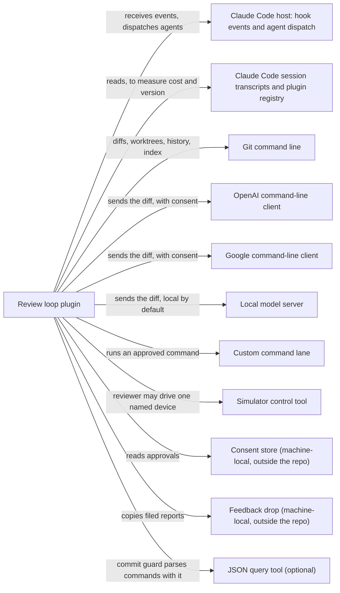
```mermaid
flowchart LR
    PLUG["Review loop plugin"]
    CC["Claude Code host: hook events and agent dispatch"]
    TR["Claude Code session transcripts and plugin registry"]
    GITX["Git command line"]
    OAI["OpenAI command-line client"]
    GEM["Google command-line client"]
    OLL["Local model server"]
    CMD["Custom command lane"]
    SIM["Simulator control tool"]
    CONS["Consent store (machine-local, outside the repo)"]
    DROP["Feedback drop (machine-local, outside the repo)"]
    JQ["JSON query tool (optional)"]
    PLUG -->|"receives events, dispatches agents"| CC
    PLUG -->|"reads, to measure cost and version"| TR
    PLUG -->|"diffs, worktrees, history, index"| GITX
    PLUG -->|"sends the diff, with consent"| OAI
    PLUG -->|"sends the diff, with consent"| GEM
    PLUG -->|"sends the diff, local by default"| OLL
    PLUG -->|"runs an approved command"| CMD
    PLUG -->|"reviewer may drive one named device"| SIM
    PLUG -->|"reads approvals"| CONS
    PLUG -->|"copies filed reports"| DROP
    PLUG -->|"commit guard parses commands with it"| JQ
```

Sources, by dependency:

| Dependency | Where it is used |
|---|---|
| Hook events, Agent tool | `review-loop-tools/hooks/hooks.json`; `SKILL.md` throughout |
| Session transcripts under `~/.claude/projects/` | `review-loop-tools/scripts/loop_usage.py` `project_dir()` lines 45-59, `scan()` lines 148-212 |
| Plugin registry `~/.claude/plugins/installed_plugins.json` | `review-loop-tools/scripts/run_summary.py` `plugin_identity()` lines 63-89 |
| `git` | `merge_ledger.py` `write_diff()` and `next_round()`; `render_report.py` `numstat()`; `mutate.py` (`git worktree`); `hotspots.py` (`git log`); `hygiene_check.sh` (`git ls-files`); `feedback.py` and `run_summary.py` (`check-ignore`, `rev-parse`) |
| `codex` CLI, `gemini` CLI, Ollama HTTP API (`/api/generate`, `/api/show`, `/api/tags`), `cmd` lane | `review-loop-tools/scripts/panel_review.py` `RUNNERS` lines 819-820 and the four `run_*` functions, lines 662-817 |
| MCP tool `mcp__Claude_Code_iOS_Simulator__control` | `review-loop-tools/agents/skeptical-reviewer.md` frontmatter `tools:` (line 4) |
| Consent file under `$XDG_CONFIG_HOME` or `~/.config` | `panel_review.py` `consent_path()` lines 184-237 |
| Drop under `$XDG_DATA_HOME` or `~/.local/share` | `review-loop-tools/scripts/feedback.py` `drop_dir()` lines 551-566 |
| `jq` | `review-loop-tools/scripts/commit_guard.sh` lines 19-27 (see §7.2.4) |
| `sw_vers`, `uname`, `claude --version` | `run_summary.py` `platform_info()` lines 91-99 (each probe degrades to `"unknown"`) |

### 1.3 What changed since the previous edition

| Release | Commit | What changed in this plugin |
|---|---|---|
| 0.15.0 | `aed07f8` | New scripts `field_log.py`, `run_summary.py`, `loop_usage.py`, `feedback.py`; new skill `skills/feedback/`; new `FIELD-QUESTIONS.md`; new verb `merge_ledger.py anomaly`; telemetry calls in all hooks except `loop_guard.sh` and `session_guard.sh`, and in `merge_ledger.py`, `render_report.py`, `panel_review.py`, `mutate.py`, `hygiene_check.sh`; allowlist gains three `feedback/` rules; `archive` moves `feedback/`; `session_guard.sh` stands down for `:feedback` and `:controls` prompts; new `tests/feedback_selftest.py` |
| 0.16.0 | `5e5dfd9` | The live-dispatch count became the source of truth (`dispatch_stamp.sh`, `subagent_guard.sh`, `loop_guard.sh`, `merge_ledger.py settle_dispatch_counter`); `set-usage`/`add-usage` sync `rounds.md` and `verdict.json` and print `over_budget`; briefs carry a `tools` block; `mutate.py` gained `--only`, `--detach`/`wait`, per-result `elapsed_s` and a stale-copy refusal; `subagent_guard.sh` requires `suites` in closeout fragments during the closeout review; `hygiene_check.sh` gained the missing-tracked-file check and `--restore`; `SKILL.md` gained the PAUSED state; new `tests/mutate_selftest.py`; `tests/hooks_selftest.py` grew from 19 to 51 checks |

| 0.16.1 | `ce143a5` | One prompt fix: `agents/skeptical-reviewer.md` no longer tells the reviewer to split a long manifest into copies (§7.2.6); the file went from 204 to 203 lines. `plugin.json` version bump. No script, hook, skill or test changed |

`review-loop-tools/scripts/metrics.py`, `hotspots.py`,
`review-loop-tools/agents/panel-verifier.md`,
`review-loop-tools/templates/panel-reviewer.md`,
`review-loop-tools/hooks/hooks.json` and
`review-loop-tools/tests/panel_selftest.py` did not change in any of the
three releases (`git diff --stat 949110b..HEAD -- review-loop-tools`, and
`git show --stat ce143a5` for 0.16.1).

---

## 2. Wiring (detailed diagrams)

### 2.1 Hook events to hook scripts

`review-loop-tools/hooks/hooks.json` registers six hook commands. Every one
receives the loop directory `.review-loop` as an argument except
`session_guard.sh`, which takes only a threshold. All hooks read the host's
JSON payload on stdin.

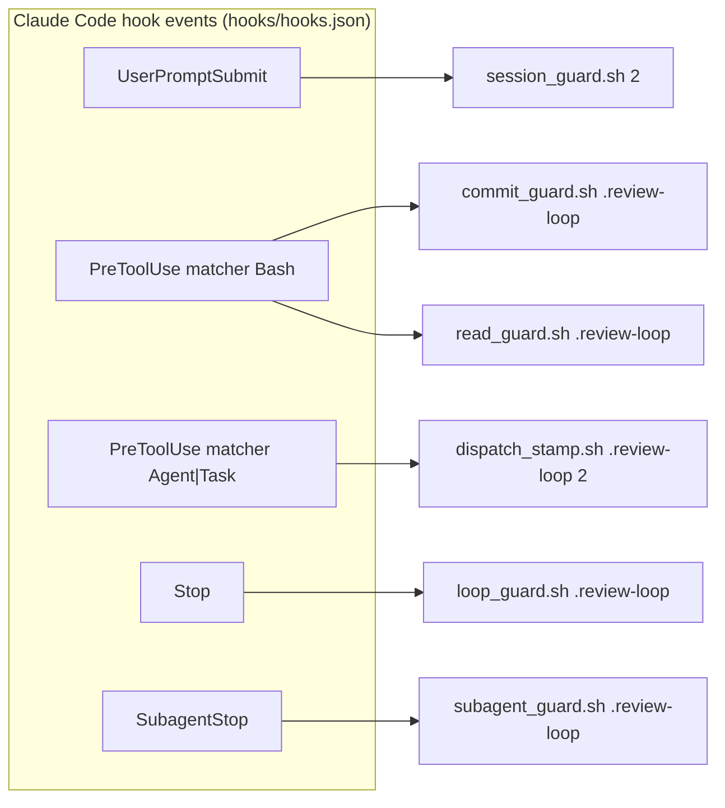
```mermaid
flowchart LR
    subgraph EVENTS["Claude Code hook events (hooks/hooks.json)"]
        UPS["UserPromptSubmit"]
        PTB["PreToolUse matcher Bash"]
        PTA["PreToolUse matcher Agent|Task"]
        STOP["Stop"]
        SSTOP["SubagentStop"]
    end
    SG["session_guard.sh 2"]
    CG["commit_guard.sh .review-loop"]
    RG["read_guard.sh .review-loop"]
    DS["dispatch_stamp.sh .review-loop 2"]
    LG["loop_guard.sh .review-loop"]
    SUB["subagent_guard.sh .review-loop"]
    UPS --> SG
    PTB --> CG
    PTB --> RG
    PTA --> DS
    STOP --> LG
    SSTOP --> SUB
```

Exit-code contract (verified in each script): exit `0` allows; exit `2`
blocks the action and the message on stderr is shown to the agent.

| Script | Blocking exits |
|---|---|
| `dispatch_stamp.sh` | line 87 (session gate) |
| `loop_guard.sh` | line 52 |
| `commit_guard.sh` | lines 53, 58, 63, 68 (staging rules), 84 (`REVIEW_LOOP_MAX_DIFF`), 91 (`REVIEW_LOOP_TEST_CMD`) |
| `read_guard.sh` | line 19, through `\|\| exit 2` on the embedded Python |
| `subagent_guard.sh` | line 73, through `\|\| exit 2` on the embedded Python |
| `session_guard.sh`, `hygiene_check.sh`, `field_log.py` | never block: always exit 0 (lines 44, 163 and 277) |

### 2.2 Hook scripts to the state they read and write

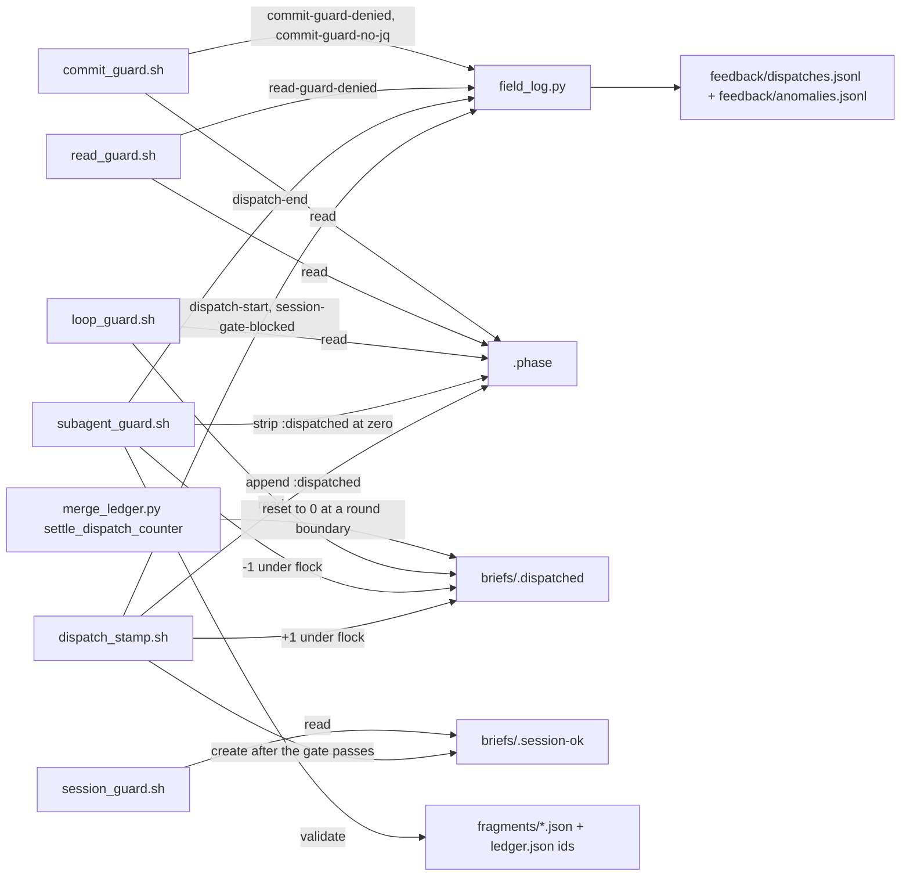
```mermaid
flowchart LR
    DS["dispatch_stamp.sh"]
    SUB["subagent_guard.sh"]
    LG["loop_guard.sh"]
    RG["read_guard.sh"]
    CG["commit_guard.sh"]
    SG["session_guard.sh"]
    ML["merge_ledger.py settle_dispatch_counter"]
    FL["field_log.py"]
    PH[".phase"]
    CNT["briefs/.dispatched"]
    OK["briefs/.session-ok"]
    FR["fragments/*.json + ledger.json ids"]
    FB["feedback/dispatches.jsonl + feedback/anomalies.jsonl"]
    DS -->|"append :dispatched"| PH
    DS -->|"+1 under flock"| CNT
    DS -->|"create after the gate passes"| OK
    DS -->|"dispatch-start, session-gate-blocked"| FL
    SUB -->|"strip :dispatched at zero"| PH
    SUB -->|"-1 under flock"| CNT
    SUB -->|"validate"| FR
    SUB -->|"dispatch-end"| FL
    LG -->|"read"| PH
    LG -->|"read"| CNT
    RG -->|"read"| PH
    RG -->|"read-guard-denied"| FL
    CG -->|"read"| PH
    CG -->|"commit-guard-denied, commit-guard-no-jq"| FL
    SG -->|"read"| OK
    ML -->|"reset to 0 at a round boundary"| CNT
    FL --> FB
```

Sources: `dispatch_stamp.sh` lines 37-57 and 63-96; `subagent_guard.sh` lines
14-64; `loop_guard.sh` lines 32-56; `read_guard.sh` lines 10-16 and 27-38;
`commit_guard.sh` lines 13-17 and 36-45; `session_guard.sh` lines 15-17;
`merge_ledger.py` lines 96-116.

**The live-dispatch counter (0.16.0).** The integer in `briefs/.dispatched`
is the source of truth and the `:dispatched` suffix on `.phase` is its
display. The rules, each verified in code and replayed in
`review-loop-tools/tests/hooks_selftest.py` lines 65-141:

| Phase when the hook fires | `dispatch_stamp.sh` (a dispatch) | `subagent_guard.sh` (a return) |
|---|---|---|
| not `round*`/`seed*` (`done`, `awaiting-human`) | nothing (lines 59-62) | nothing (line 37) |
| `…:waiting:<reason>` | count +1, marker untouched (lines 64-66) | count -1, marker untouched |
| `…:dispatched` | count +1, on top of 1 when the count file is missing or unreadable (lines 67-69) | count -1, suffix stripped at zero; a missing count file stands for one live agent, so the first return strips the suffix (lines 38-61) |
| bare `round…`/`seed…` | session gate, then suffix appended, count +1 on top of whatever it holds (lines 71-96) | count -1, no suffix to strip |

`loop_guard.sh` allows a stop on `:waiting:`, on `:dispatched`, and on a bare
phase whose count is above zero (lines 36-50); it blocks only a bare phase
with a count of zero. `merge_ledger.py set-round` and `next-round` reset a
count left above zero and record `dispatch-count-mismatch` (lines 96-116,
called at 198 and 616).

### 2.3 Script dependency graph

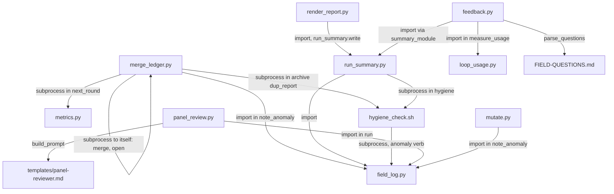
```mermaid
flowchart TB
    ML["merge_ledger.py"]
    MET["metrics.py"]
    HY["hygiene_check.sh"]
    RR["render_report.py"]
    RS["run_summary.py"]
    FL["field_log.py"]
    FB["feedback.py"]
    LU["loop_usage.py"]
    FQ["FIELD-QUESTIONS.md"]
    PR["panel_review.py"]
    TP["templates/panel-reviewer.md"]
    MU["mutate.py"]
    ML -->|"subprocess in next_round"| MET
    ML -->|"subprocess to itself: merge, open"| ML
    ML -->|"subprocess in archive dup_report"| HY
    ML -->|"import in note_anomaly"| FL
    RR -->|"import, run_summary.write"| RS
    RS -->|"import"| FL
    RS -->|"subprocess in hygiene"| HY
    HY -->|"subprocess, anomaly verb"| FL
    FB -->|"import via summary_module"| RS
    FB -->|"import in measure_usage"| LU
    FB -->|"parse_questions"| FQ
    PR -->|"import in run"| FL
    PR -->|"build_prompt"| TP
    MU -->|"import in note_anomaly"| FL
```

Sources: `merge_ledger.py` lines 54-64, 642-648, 687-688, 733-744;
`render_report.py` lines 408-419; `run_summary.py` lines 28-30 and 266-288;
`hygiene_check.sh` lines 152-160; `feedback.py` lines 96-102, 136-165 and
282-297; `panel_review.py` lines 148-150, 479-481 and 1080-1098; `mutate.py`
lines 103-114. `hotspots.py` and `metrics.py` import nothing from the plugin.
The hook scripts reach `field_log.py` as shown in §2.2; `read_guard.sh` is
the only one that imports it in-process (lines 31-36), the others shell out.

---

## 3. Module inventory

Because this is a prompt-driven plugin, the `.md` prompt files are
inventoried as first-class modules alongside the scripts. 33 files,
10,214 lines (`wc -l`); 21 of them are `.py`/`.sh` (8,084 lines), matching
the survey.

| Module | Kind | Lines | Primary path | Since |
|---|---|---:|---|---|
| Plugin manifest | JSON | 15 | `review-loop-tools/.claude-plugin/plugin.json` | |
| Orchestrator skill | prompt (control logic) | 549 | `review-loop-tools/skills/review-loop/SKILL.md` | |
| Feedback skill | prompt | 74 | `review-loop-tools/skills/feedback/SKILL.md` | 0.15.0 |
| Controls skill | prompt | 10 | `review-loop-tools/skills/controls/SKILL.md` | |
| Operator reference | doc, read by the controls skill | 642 | `review-loop-tools/CONTROLS.md` | |
| Field questions | doc, parsed by `feedback.py` | 110 | `review-loop-tools/FIELD-QUESTIONS.md` | 0.15.0 |
| README | doc | 190 | `review-loop-tools/README.md` | |
| implementer | agent prompt | 133 | `review-loop-tools/agents/implementer.md` | |
| skeptical-reviewer | agent prompt | 203 | `review-loop-tools/agents/skeptical-reviewer.md` | |
| panel-verifier | agent prompt | 103 | `review-loop-tools/agents/panel-verifier.md` | |
| Panel seat template | prompt template | 43 | `review-loop-tools/templates/panel-reviewer.md` | |
| Hook wiring | JSON | 58 | `review-loop-tools/hooks/hooks.json` | |
| session_guard | hook script | 44 | `review-loop-tools/scripts/session_guard.sh` | |
| dispatch_stamp | hook script | 97 | `review-loop-tools/scripts/dispatch_stamp.sh` | |
| loop_guard | hook script | 57 | `review-loop-tools/scripts/loop_guard.sh` | |
| subagent_guard | hook script | 187 | `review-loop-tools/scripts/subagent_guard.sh` | |
| read_guard | hook script | 101 | `review-loop-tools/scripts/read_guard.sh` | |
| commit_guard | hook script | 94 | `review-loop-tools/scripts/commit_guard.sh` | |
| hygiene_check | advisory script | 163 | `review-loop-tools/scripts/hygiene_check.sh` | |
| merge_ledger | state-mutation CLI | 1011 | `review-loop-tools/scripts/merge_ledger.py` | |
| metrics | verdict computation | 231 | `review-loop-tools/scripts/metrics.py` | |
| render_report | report generator | 425 | `review-loop-tools/scripts/render_report.py` | |
| hotspots | churn map | 67 | `review-loop-tools/scripts/hotspots.py` | |
| mutate | mutation runner | 443 | `review-loop-tools/scripts/mutate.py` | |
| panel_review | multi-provider lanes | 1153 | `review-loop-tools/scripts/panel_review.py` | |
| field_log | telemetry library and CLI | 277 | `review-loop-tools/scripts/field_log.py` | 0.15.0 |
| run_summary | run-record builder | 467 | `review-loop-tools/scripts/run_summary.py` | 0.15.0 |
| loop_usage | token measurement | 305 | `review-loop-tools/scripts/loop_usage.py` | 0.15.0 |
| feedback | field-report CLI | 706 | `review-loop-tools/scripts/feedback.py` | 0.15.0 |
| panel_selftest | test, 137 checks | 1255 | `review-loop-tools/tests/panel_selftest.py` | |
| hooks_selftest | test, 51 checks | 336 | `review-loop-tools/tests/hooks_selftest.py` | 0.14.0 |
| mutate_selftest | test, 19 checks | 162 | `review-loop-tools/tests/mutate_selftest.py` | 0.16.0 |
| feedback_selftest | test, 94 checks | 503 | `review-loop-tools/tests/feedback_selftest.py` | 0.15.0 |

### 3.0 Shared and mirrored scripts

This plugin is where the shared scripts are **authored**; the other plugins
carry copies (`HANDOFF.md` §2 item 2). Verified with `cmp` and `diff` at HEAD:

| Script | `qa-loop-tools/scripts/` | `arch-docs-tools/scripts/` |
|---|---|---|
| `commit_guard.sh`, `dispatch_stamp.sh`, `loop_guard.sh`, `read_guard.sh`, `session_guard.sh`, `subagent_guard.sh` | byte-identical | absent |
| `hygiene_check.sh` | byte-identical | absent |
| `field_log.py`, `run_summary.py`, `loop_usage.py`, `feedback.py` | byte-identical | byte-identical |
| `merge_ledger.py` | differs by 72 lines, panel code only (`panel_tally`, its verb entry and usage line, two `KEEP` entries) | absent |
| `render_report.py` | differs by 35 lines, panel code only (the `via` source tag in `finding_line`, the Panel section) | absent |
| `mutate.py`, `hotspots.py`, `metrics.py`, `panel_review.py` | absent (review-only) | absent |

Line counts are `diff a b | grep -c '^[<>]'`. The commit message of `5e5dfd9`
reports the same 72 for `merge_ledger.py` and 34 for `render_report.py`.
**Inference:** the difference of one is the blank line that closes the Panel
section, which this counting method includes.
`review-loop-tools/CONTROLS.md` is byte-identical to the repo-root
`CONTROLS.md` and to `qa-loop-tools/CONTROLS.md`.

These scripts are documented in full here. The qa-only branches they carry
are called out where they occur and collected in §7.3.

### 3.1 Plugin manifest — `review-loop-tools/.claude-plugin/plugin.json`

Name, version `0.16.1`, description, author, keywords, license. No
`hooks`/`agents`/`skills` keys: the host discovers `hooks/hooks.json`,
`agents/*.md` and `skills/*/SKILL.md` by directory convention. The
marketplace entry lives at the repo root (`.claude-plugin/marketplace.json`,
name `quiller`) and carries no version. `HANDOFF.md` §2 item 1 makes bumping
this file mandatory on every user-visible change because the plugin cache is
keyed by it. One script reads this file at run time: `run_summary.py`
`plugin_identity()` (lines 63-68), for the version that actually ran.
`mutate.py` does not read it; it compares the version-named directories of
the plugin cache instead (`newer_sibling()`, lines 66-86).

### 3.2 Orchestrator skill — `review-loop-tools/skills/review-loop/SKILL.md`

**Purpose.** The loop's control program. The main agent reads it when the
user invokes `/review-loop-tools:review-loop` and follows it turn by turn.

**Interface.** Consumes user arguments (max rounds, a scope range, a token
budget, "a panel"); produces subagent dispatches and exact script
invocations. It owns the `.phase` marker and the WATCH LIST section of the
final report.

**Structure (section headings and their lines).**

| Section | Lines |
|---|---|
| Hard rules | 8-64 |
| Setup: 0 precondition, 1 paused/finished/abandoned, 2 ledger + hygiene + allowlist, 2b panel, 3 seed | 66-242 |
| Each round (three plumbing turns) | 244-303 |
| Panel final pass | 305-335 |
| Closeout | 337-388 |
| Waiting, failures, and pauses | 391-412 |
| Stop conditions | 414-440 |
| Final report | 442-469 |
| Contracts (canonical fields and verbs) | 471-549 |

**Key rules it encodes (each verified in the file).**

- The orchestrator never edits source, never hand-edits ledger findings,
  never overrides a pinned model, stages loop files by explicit path only
  (lines 9-21, 49-53, 59-61).
- `.review-loop/fragments/` is exclusively for subagent-written files;
  orchestrator-composed material goes to `.review-loop/briefs/` (lines 22-25).
- Phase marker protocol: `seed-review`, `round-<N>-implementing`,
  `round-<N>-review`, `round-<N>-closeout-review` (new in 0.16.0, line 366),
  `awaiting-human`, `done`, with suffixes `:dispatched` and
  `:waiting:<reason>`. The phase is written **in its own call before the
  dispatch**, never in the same batch as an Agent call; the count in
  `briefs/.dispatched` is the source of truth (lines 26-46).
- **PAUSED state (0.16.0).** A loop whose `.phase` ends `:waiting:<reason>` or
  reads `awaiting-human` is resumed from the step the phase names, not
  archived (lines 75-81).
- Seed is merged as **round 0**; scope mode defaults `max_rounds` to 2 with
  automatic escalation to 5 on an open blocker (lines 95-102, enforced in
  `merge_ledger.py` lines 997-1004).
- The `.gitignore` allowlist template, stamped `v0.15.0`, with the three
  `feedback/` re-includes (lines 120-133).
- Hygiene `--restore` and the `tracked file missing` line (lines 104-114).
- Implementer dispatches name `${CLAUDE_PLUGIN_ROOT}/scripts/mutate.py` as
  the mutation runner, in rounds and in closeout (lines 253-257, 356-358).
- A dispatch's tokens are recorded from its first completion notification
  only; a late figure is recorded with `set-usage`, and an `over_budget: true`
  reply sends the loop down the BUDGET path at once (lines 259-262, 279-286).
- The closeout fragment must carry `suites` (lines 365-379).
- Panel runs are detached and waited on, and the probe's `gate_issues` list
  is the go/no-go for a panel (lines 145-157, 216-236, 305-316).
- Transport failure policy: retry the same dispatch up to 3 times with
  in-turn `sleep 60/180/300`; `.partial` files carry resumable work
  (lines 398-408).
- The final report step ends with a one-line invitation to file feedback,
  "as an invitation and never a gate" (lines 463-469).

**Dependencies.** Every script in `scripts/`, the three agents, the hooks.

**Pattern.** A hand-written state machine in prose, with the invariant that
every state transition is either a script verb or a `.phase` write.

### 3.3 Feedback skill — `review-loop-tools/skills/feedback/SKILL.md` (0.15.0)

**Purpose.** Files a field report about the plugin for its maintainer. It is
explicitly not about the reviewed app and never quotes source code or
finding claims (lines 5-11).

**Flow.** Quick bundle: one `feedback.py quick .review-loop` call (lines
13-19). Full report: scaffold, read two sections of `FIELD-QUESTIONS.md`,
fill the draft with the Edit tool, finalize, commit by explicit path using
the `stage_by_path` line `finalize` printed, tell the user the report path,
the drop path and the item ids (lines 21-65).

**Rules.** Report only what the run showed; never a gate; record deviations
when they happen with `merge_ledger.py anomaly` (lines 67-74).

**Dependencies.** `feedback.py`, `FIELD-QUESTIONS.md`, `merge_ledger.py`.

### 3.4 Controls skill and reference — `review-loop-tools/skills/controls/SKILL.md`, `review-loop-tools/CONTROLS.md`

The `controls` skill is ten lines: read `${CLAUDE_PLUGIN_ROOT}/CONTROLS.md`
and answer from it. `CONTROLS.md` is the operator reference for **both** loop
plugins (tags `[qa]`, `[review]`, `[both]`), 642 lines, with a "Feedback for
the plugin maintainer" section added in 0.15.0 (lines 545-628).
`review-loop-tools/tests/panel_selftest.py` lines 1240-1247 enforce the
byte-identity of the three copies; `HANDOFF.md` §2 item 3 names the root copy
canonical.

### 3.5 Field questions — `review-loop-tools/FIELD-QUESTIONS.md` (0.15.0)

Three sections, the first two parsed by `feedback.py parse_questions()`
(lines 136-165) from `- **<id>** — <text>` bullets:

| Section | Content at 0.16.1 (the file is unchanged since 0.16.0) |
|---|---|
| "Watch items for this version" (lines 11-38) | 22 items, ids `w-…` |
| "Settled decisions — report only NEW evidence" (lines 40-61) | 15 items, ids `s-…` |
| "Open and recently shipped items" (lines 63-110) | generated between `BEGIN`/`END` markers by `tools/render_field_questions.py`, which is repo tooling and not part of the plugin |

### 3.6 `review-loop-tools/agents/implementer.md`

- **Frontmatter:** `tools: Read, Edit, Write, Bash`, `model: inherit`.
- **Contract in:** the open-findings brief (`briefs/round-N-brief.json`, now
  carrying `tools.mutate`) plus the reviewer's latest summary; optionally a
  simulator udid.
- **Contract out:** a fenced `json CHANGES` block with `commit_sha`,
  `actions[]` (`fixed|partial|wontfix` with rationale and files),
  `disputes[]`, `mutations` (manifest path or null), `verify_cmd`,
  `touched_files[]` (lines 116-133); and a git commit titled
  `review-loop round <N>: …`.
- **Rules:** fix/partial/wontfix with a concrete technical reason; scoped
  test runs with filtered output; new tests verified by class name; a
  mutation manifest the implementer must self-run before returning,
  committing first, with one control mutant and optionally a per-mutant
  `test_cmd`, and with call-site mutants (lines 70-95); `mutate.py` is the
  path the dispatch names, **never searched for** (lines 58-63); long
  manifests run with `--detach` then `wait`, reruns use `--only`, and the
  manifest is never copied or split (lines 102-109); never edits
  `BACKLOG.md` (lines 96-101); stage by explicit path; never background a
  long command other than through `mutate.py --detach` (lines 53-57).

### 3.7 `review-loop-tools/agents/skeptical-reviewer.md`

- **Frontmatter:** `tools: Read, Grep, Glob, Bash, mcp__Claude_Code_iOS_Simulator__control`, `model: opus`.
- **Contract in:** ledger path, `briefs/round-N.stat` and `.diff` paths, the
  CHANGES block including `verify_cmd`, the mutation manifest path plus the
  path to `mutate.py`, a fragment output path, optionally a hotspot table
  (cold seed) or a verified panel file.
- **Contract out:** a LEDGER fragment `{"findings":[…]}` written
  incrementally to `<fragment>.partial` then `mv`'d; a 2-3 line prose
  summary; never the JSON pasted into the response (lines 170-177). A
  **closeout** fragment also carries top-level `suites`, or `"suites": {}`
  with a `suites_note` (lines 73-80).
- **Status vocabulary:** `fixed | partial | open | wontfix | disputed`; on a
  rejected fix append `{"round", "reason"}` to the finding's `rejections`
  (lines 99-109).
- **Finding ID convention:** `<area>/<file>:<slug>` (lines 167-168).
- **Discipline sections:** reading windows of at most 120 lines, diff-first,
  scoped tests, collateral-damage sweep over `touched_files`, simulator
  discipline (one named udid only), mutation re-run with the
  `errors > 0` means unverified rule and the `baseline_red` rule, one or two
  call-site mutants of its own, `--detach`/`wait`/`--only` for long
  manifests (lines 116-131); panel findings folded in with
  `source`/`sources` kept (lines 132-137).
- **Long manifests (fixed in 0.16.1):** the prompt now says one thing. It
  never rewrites an implementer's mutants and never copies or splits its
  manifest; a long one runs detached and a few mutants re-run with `--only`
  (lines 141-144, pointing back to lines 118-120). See §7.2.6.

### 3.8 `review-loop-tools/agents/panel-verifier.md`

Unchanged since 0.14.0.

- **Frontmatter:** `tools: Read, Grep, Glob, Bash`, `model: sonnet`.
- **Contract in:** `fragments/panel/round-<N>-<lane>.candidates.json` paths,
  the round `.stat`/`.diff` paths, repo root, an output path
  `fragments/panel/round-<N>-panel.verified.json`; on the final pass also
  the open-findings and wontfix extracts (lines 46-52).
- **Contract out:** `{"verified_findings":[…], "notes_for_chair":[…], "lane_tallies":{lane:{filed,confirmed,demoted,duplicate,rejected}}}`.
  Each verified finding carries `source`, `sources` and `duplicate_of`.
  Duplicates stay in `verified_findings` but tally only under `duplicate`;
  "kept" is confirmed + demoted. Rejected candidates appear only as counts
  (lines 92-99). The verifier reads the stat's EXCLUDED trailer before
  judging any "X was not updated" claim (lines 53-56) and adds no findings
  of its own (lines 57-61).

### 3.9 `review-loop-tools/templates/panel-reviewer.md`

The stance prompt fed to every external lane by `panel_review.py
build_prompt()`. Diff-only ("You see ONLY the diff stat and the diff"), at
most 10 findings, JSON-only response with `claim`, `evidence[]`, `severity`,
`confidence` (0-1), `area`. Unchanged since 0.14.0.

### 3.10 Hook scripts — `review-loop-tools/scripts/*_guard.sh`, `dispatch_stamp.sh`

All six are byte-identical in `qa-loop-tools/scripts/`.

| Script | Trigger | Reads | Blocks when | Side effects |
|---|---|---|---|---|
| `session_guard.sh [thr] [dirs…]` | UserPromptSubmit | `prompt`, `transcript_path`, `briefs/.session-ok` | never. Prints a warning when the prompt matches `review[- ]loop\|qa[- ]loop` and the transcript is over `thr` MB (lines 26, 33-42) | none. Prints nothing once `briefs/.session-ok` exists (lines 15-17), and nothing for a `…-loop-tools:feedback` or `:controls` prompt that does not also name the loop skill (lines 28-32, new in 0.15.0) |
| `dispatch_stamp.sh <dir> [thr]` | PreToolUse Agent/Task | `.phase`, `transcript_path`, `briefs/.dispatched`, `briefs/.session-ok` | the phase is bare `round*`/`seed*`, no `briefs/.session-ok` exists, and the transcript is over `thr` MB (lines 71-88) | counts the dispatch (§2.2); creates `briefs/.session-ok`; appends `:dispatched`; records `dispatch-start`, and `session-gate-blocked` when it blocks. A blocked dispatch is not recorded as a start (line 30 and the ordering of lines 87 and 92) |
| `loop_guard.sh [dirs…]` | Stop | `stop_hook_active`, `.phase`, `briefs/.dispatched` | the phase is bare `round*`/`seed*` and the count is zero or unreadable (lines 46-52) | none. Never re-blocks a continuation it forced (lines 20-30) |
| `subagent_guard.sh [dirs…]` | SubagentStop | `.phase`, `briefs/.dispatched`, `fragments/*.json`, `ledger.json` ids | the phase matches `*review*`/`*testing*` and a flat fragment matching `(seed\|round-…)\.json` is invalid and older than 10 s (lines 66-186) | records `dispatch-end`; decrements the count; strips `:dispatched` at zero (macOS `sed -i ''` with a GNU fallback, lines 58-59) |
| `read_guard.sh [dirs…]` | PreToolUse Bash | `.phase`, `tool_input.command`, `briefs/round-N.diff` | unfiltered `cat` of a file over 200 lines, `head -n` over 200, a `sed -n A,Bp` window over 200, an unfiltered `xcodebuild … test` or `swift test`, an unfiltered whole-range `git diff`/`git show` while `briefs/round-N.diff` exists; all after stripping heredoc bodies and single-quoted strings and only at command positions (`strip_data` lines 51-56, `CMD_START` line 57, rules lines 59-99) | records `read-guard-denied` with the **rule name**, never the command (lines 27-38) |
| `commit_guard.sh [dir]` | PreToolUse Bash | `tool_input.command` via `jq`, `.phase`, env knobs | `git add -A/--all`, `-f/--force`, `git add .`, a directory add of the loop dir, only while `.phase` is `round*`/`seed*`/`awaiting-human*` (lines 36-72); on `git commit`: staged lines over `REVIEW_LOOP_MAX_DIFF`, or `REVIEW_LOOP_TEST_CMD` fails (lines 74-93) | runs the test command; records `commit-guard-denied` with the rule name, and `commit-guard-no-jq` once per loop (lines 42-45) |

Defaults: `loop_guard.sh`, `subagent_guard.sh`, `read_guard.sh` and
`session_guard.sh` guard **both** `.review-loop` and `.qa-loop` when invoked
without directory arguments (`dirs=(.review-loop .qa-loop)`, at lines 18, 11,
9 and 14 respectively); `hooks.json` passes one directory to the first three
and none to `session_guard.sh`.

**Fragment validation rules** (`subagent_guard.sh` lines 125-173): every
finding needs `id` and `current_status`; a finding whose id is not already in
`ledger.json` additionally needs `severity`, `claim`, and, if present,
`evidence` that is either a non-empty list of strings or an object with
non-empty `screenshots`/`repro`/`measurements`; `status_history[].round` must
be an integer. `*.results.json` fragments (a qa shape) need `results[]` of
`{tc, status}`. The name regex (line 116) is matched with `fullmatch` against
the flat `fragments/` directory only, so `fragments/panel/*` and `*.partial`
files are never policed.

**Closeout suites rule (0.16.0)** (`check_suites`, lines 82-108): while the
phase contains `closeout` (line 79), a fragment whose name matches
`round-…closeout….json` (line 80) must carry top-level `suites`, an object
of target to `{executed, failed, skipped}` non-negative integers; an empty
`suites` needs a non-empty string `suites_note`. Outside the closeout review
the rule is off, so a closeout fragment left by an earlier pass never blocks
a later reviewer.

### 3.11 `review-loop-tools/scripts/hygiene_check.sh <loop-dir> [--restore]`

Advisory git-hygiene report, always exit 0 (line 163). Byte-identical in
`qa-loop-tools`. Five checks:

| # | Check | Lines |
|---|---|---|
| 1 | tracked scratch paths (`evidence\|fragments\|briefs\|scratch\|__pycache__`, optionally ` N`-suffixed, `.phase`, `*.pyc`) | 43-54 |
| 2 | Finder/iCloud duplicate names (`X 2.json`) in the index or on disk, `evidence` and `scratch` pruned on disk | 56-89 |
| 3 | tracked files over 256 KB | 91-103 |
| 4 | a missing or denylist-style `.gitignore` (first rule must be `*`) | 105-114 |
| 5 | **(0.16.0)** tracked files missing from disk (`git ls-files --deleted`) that no ` N` twin explains; names a differently named candidate beside it when one exists | 116-150 |

`--restore` (0.16.0, lines 67-80) moves a duplicate back to its plain name
only when the plain name is missing **and** it is the sole duplicate of that
name, using `mv -n`; it never overwrites, deletes, or picks between rivals.
Violations of kinds 1, 2, 3 and 5, and restores, are recorded as
`hygiene-violation` anomalies by **count and kind only**, deduplicated (lines
152-160). Invoked at Setup, before the report, by `run_summary.py`, and
internally by `merge_ledger.py archive`; the last two set `FIELD_LOG_OFF=1`
so their scans record nothing.

### 3.12 `review-loop-tools/scripts/merge_ledger.py` — the only sanctioned ledger mutator

Dispatch is by first argument (`main()`, lines 933-941); anything not a verb
name is the positional **merge** form. 13 named verbs plus merge.

| Verb | Signature | What it does (verified) |
|---|---|---|
| merge (default) | `<ledger> <fragment> <round> [--no-escalate]` | For each fragment finding: existing id overwrites scalars except `status_history`, `first_seen_round`, `evidence`, `severity_history`, `rejections`; unions `rejections`; records a severity change in `severity_history`; passes `evidence` through `union_evidence()` (see §7.2.1); appends `{round,status}` to `status_history`; sets `current_status`. A new id gets `first_seen_round` and a seeded `status_history`. Sets `ledger.round`. If `scope` is set, `max_rounds == 2`, and any open/partial blocker exists, `max_rounds = 5` and the output carries `escalated_max_rounds` (lines 942-1008) |
| `resolve` | `<ledger> <id> <status> <round> [note]` | Human/orchestrator decision: appends to `status_history`, sets `current_status`, appends `RESOLVED (round N):` to `note` (lines 131-168) |
| `set-round` | `<ledger> <N> [sha]` | **Resets a stale live-dispatch count first** (line 198). Sets `round`; with a sha sets `round_start_sha` (or `build_sha` when that key exists and `round_start_sha` does not) and `round_shas[N]` (lines 183-213) |
| `consulted` | `<ledger> <N>` | Sets `thrashing_consulted = N`; metrics then makes the next thrashing signal hard (lines 913-931) |
| `open` | `<ledger> [auto\|proposal\|all\|closeout\|wontfix] [--region X…] [--severity S]` | Prints open/partial findings minus `status_history`. `closeout` = auto-routed AND (`introduced_by_fix` OR minor). `wontfix` prints the accepted-disagreement set. `--severity` is bypassed by `fix_risk` findings. Region matching is boundary-safe. **Since 0.16.0 the output also carries `tools`**, the absolute paths of this release's agent-facing scripts, from `shipped_tools()` (lines 118-129, 215-290) |
| `archive` | `<loop-dir> [name]` | Per-file `os.replace` move of `ledger.json, rounds.md, REPORT.md, coverage.json, verdict.json, fragments/, briefs/, feedback/, .phase` and `evidence/round-*` into `archive/<name>/`; unknown top-level files go to `archive/<name>/legacy/`; the `KEEP` set survives. Default name = timestamp + scope-start sha (or `round_start_sha`). Runs `hygiene_check.sh` before and after, sleeps `REVIEW_LOOP_ARCHIVE_SETTLE_S` (default 3 s) and re-checks; any new duplicate-name line is recorded (`archive-duplicates`, `archive-late-duplicates`) and the call exits 1 (lines 698-848) |
| `scope` | `<ledger> <a..b> [pathspecs]` | Stores the range plus pathspecs in `ledger.scope`, parsed by `split_range` (lines 292-317), the one parser shared with `diff` |
| `set-usage` / `add-usage` | `<ledger> <N> <role> <tokens>` | Replace / accumulate `usage[N][role]`. **Since 0.16.0 both call `sync_round_tokens()`**, which rewrites round N's Tokens cell in `rounds.md` (the column is found by name, so the wider qa table works) and the `tokens`/`cumulative_tokens` figures in `verdict.json`, and both print `over_budget`, `rounds_md_updated`, `verdict_updated`. The Decision is never rewritten (lines 319-431) |
| `diff` | `<loop-dir> <N\|final\|label> <range> [pathspecs]` | Writes `briefs/round-<N>.diff`, `.stat` and `.files` via `git diff`, always appending `:(exclude)<loop-dir-basename>`; the `.stat` gets an `EXCLUDED (changed in range; not shown in this view)` trailer for paths hidden by pathspecs; on any git failure all three files are removed before exit 1 (lines 531-589) |
| `next-round` | `<loop-dir> <N> [--fragment F] [--usage role=tokens…] [--sha S] [--pass …] [--phase-next NAME] [--brief-severity major\|minor]` | **Resets a stale live-dispatch count** (line 616), records `round_end_shas[N] = HEAD` (lines 619-633), applies usages; with `--fragment`: re-invokes itself in merge mode, runs `metrics.py` (or `qa_metrics.py` when `is_qa`), and stops if `decision != continue`, recording the unattended default line in `rounds.md` when the env knob is set and the decision is `thrashing_soft`. Otherwise: `set-round N+1 <HEAD>`, writes `briefs/round-<N+1>-brief.json` from `open auto --severity major`, writes `.phase = round-<N+1>-implementing` (lines 591-696) |
| `panel-tally` | `<ledger> <N\|final> <verified.json> [--replace]` | Validates the `lane_tallies` shape before writing; merges per lane into `ledger.panel[key]`, `--replace` restores whole-round replacement; prints per lane `filed`, `kept`, `duplicate` (lines 850-911). Review-only: absent from the qa copy |
| `anomaly` | `<loop-dir> "<one line>" [--code CODE]` | **(0.15.0)** Appends one row to `feedback/anomalies.jsonl` through `field_log.anomaly()`; default code `workaround`; exits 1 when the loop dir does not exist or nothing was recorded; never changes loop state (lines 66-94) |
| `notes-rotate` | `<loop-dir> [--round N]` | Rotates `HARNESS_NOTES.md`, a qa-loop artifact; records `notes-over-ceiling` (lines 433-529). See §7.5 |

**Pattern.** A single-file CLI with verb functions and a self-recursive
`next-round` (it shells out to its own file for the merge and the brief, and
to `metrics.py` for the verdict). Output is one JSON line on stdout so the
orchestrator's context takes only the summary. Telemetry goes through
`note_anomaly()` (lines 54-64), which swallows every exception.

### 3.13 `review-loop-tools/scripts/metrics.py <ledger> <N>`

Unchanged since 0.14.0. Computes the verdict for round N purely from
`status_history` (`status_at(f, r)` = last status entry with `round <= r`, or
`current_status`, lines 27-35). Signals: `closed/new/reopened/net`, open
counts by severity, `new_blocker_major`, `reopen_count` (only `fixed→open`
counts, lines 46-56), region churn over three rounds, disputed-set equality,
promotions from `severity_history`, token usage against `token_budget`, and
the `converging_series()` exemption (lines 90-108). Decision precedence is
fixed in code (lines 171-196); see §6. Side effects: idempotently replaces
round N's row in `rounds.md` (lines 206-222), writes `verdict.json` (lines
224-227), prints the verdict JSON.

`metrics.py` reads `usage` once, when the round closes. A figure recorded
later reaches `rounds.md` and `verdict.json` through
`merge_ledger.py sync_round_tokens()`, not through a second metrics run.

### 3.14 `review-loop-tools/scripts/render_report.py <loop-dir> [--out P] [--stop-note "…"]`

Renders every mechanical section of `REPORT.md` from `ledger.json`,
`rounds.md`, `verdict.json`, optional `coverage.json`, and
`fragments/round-*-closeout.json`:

| Section | Lines |
|---|---|
| Headline, with the `converged-in-closeout` relabel | 88-111 |
| Token totals and per-round table | 112-134 |
| Panel table from `ledger.panel`, with a `Duplicate` column (review-only) | 136-162 |
| Open findings by severity, disputed, UX proposals (qa) | 164-195 |
| Fix review rejections, severity changes | 197-219 |
| Persona matrix and coverage gaps (qa) | 221-254 |
| Closeout, with the `suites` table, **or the sentence "Suite counts were not reported" when no closeout fragment carries `suites`** (0.16.0) | 256-291 |
| Wontfix / resolved | 293-300 |
| WATCH LIST candidate stubs | 302-404 |

The WATCH LIST lists the seed scope diff first, then each round's diff ending
at `round_end_shas[N]` (falling back to the next round's start sha, then
HEAD, lines 369-389), and, when a closeout ran, the closeout diff as its own
candidate (lines 390-401). Since 0.16.0 the closeout candidate has the same
`look here because: <!-- orchestrator fills -->` slot as the others.

After writing the report it calls `run_summary.write(loop, stop_note)` inside
a `try` that prints a one-line stderr notice on failure and carries on (lines
408-419): **a summary failure never fails a report**. The printed JSON
carries `run_summary`, the path or null.

### 3.15 `review-loop-tools/scripts/hotspots.py [root] [--since 6.months] [--top 30]`

Unchanged. `git log --since --format=%ct --name-only`, filtered to source
extensions (lines 12-14), scored `commits × (1 + log1p(size_kb)) / (1 +
days/90)` (line 54). Prints a markdown table on stdout and
`{"hotspots": […]}` on stderr. Used only for the cold seed (no scope, no
`REVIEW.md`).

### 3.16 `review-loop-tools/scripts/mutate.py`

Two forms (docstring lines 4-7):

- `mutate.py <manifest.json> [--repo root] [--only id1,id2] [--detach] [--allow-dirty] [--allow-stale]`
- `mutate.py wait <manifest.json> [--timeout s]`

Order of operations in `main()` (lines 212-425):

| Step | Lines | Behaviour |
|---|---|---|
| Stale-copy refusal (0.16.0) | 234-241, `newer_sibling()` 66-86 | When the plugin root's directory name is a version `X.Y.Z` and a sibling directory with a higher version holds `scripts/mutate.py`, exit 2 naming that path and record `mutate-stale-refused`. A development checkout (directory not named by version) never refuses. `--allow-stale` overrides |
| Detach (0.16.0) | 242-257 | Removes any stale results file, re-execs itself without `--detach` in a new session with `--results <manifest>.results.json`, stdout/stderr to `<manifest>.results.log`, prints the pid and the `wait` command, returns |
| Manifest validation | 263-298 | Each mutant needs `file`, `original`, a string `replacement` (`""` deletes the line), `expect` in `killed\|survived`, no multi-line `original` with `line`, and a non-empty string `test_cmd` of its own or inherited. Any error exits 2 before anything runs |
| `--only` (0.16.0) | 299-310 | Validated against the whole manifest first; an unknown id exits 2; the manifest file is never rewritten |
| Dirty-tree refusal | 312-327 | Uncommitted changes to the manifest's files exit 2 (`mutate-dirty-refused`) unless `--allow-dirty` (`mutate-allow-dirty`) |
| Worktree | 328-334 | Detached `git worktree` of HEAD in a temp dir |
| Baseline | 344-370 | Every distinct `test_cmd` runs once unmutated; a non-zero exit or timeout prints `baseline_red`, records `mutate-baseline-red`, exits 2 |
| Mutant loop | 371-404 | Apply by text substitution (exactly one match unless `line` is given, `apply()` lines 179-210), run `set -o pipefail; <test_cmd>` under `/bin/bash` with `PYTHONDONTWRITEBYTECODE=1`, classify `killed` (non-zero exit or timeout) or `survived`, restore the file. Each result carries `elapsed_s` (0.16.0) |
| Teardown and summary | 405-425 | Worktree removed in `finally`. Prints `{killed, survived, errors, mismatches, elapsed_s, only?, results[]}`; exit 1 on any mismatch or error |

`wait` (lines 131-177) polls `<manifest>.results.json` every 2 s up to 540 s.
It prints the finished run's summary and exits with **that run's** status;
exits 3 while the run is still going; exits 1 when the recorded pid is dead
without a `done` state; exits 2 when no detached run exists. The module-level
handler (lines 427-443) closes the results file on any `SystemExit` or
exception, so a run that refuses or crashes still ends its record.

Telemetry goes to `<repo>/.review-loop/feedback/` only (the loop directory
name is fixed at line 107).

### 3.17 `review-loop-tools/scripts/panel_review.py` — the multi-provider panel

Four verbs (`main()`, lines 1143-1150): `probe [<panel.json>] [--smoke]`,
`run <loop-dir> <round> [--lanes a,b] [--force] [--detach]`,
`wait <loop-dir> <round> [--timeout s]`, `consent-path [<loop-dir>]`.

- **Config:** `<loop-dir>/panel.json` `{lanes:[{name,type,model,timeout_s,max_diff_tokens,enabled,num_ctx_max,cmd,precision_override}], rounds}`; git-tracked by the allowlist. `model` may be a list tried in order on `quota`/`model-unavailable` errors (`run_lane`, lines 902-931); the result records `model_used`.
- **Consent:** machine-local JSON at
  `<XDG_CONFIG_HOME|~/.config>/review-loop-tools/consent/<sha256(realpath(loop))>.json`
  with `remote_lanes_approved` (must be JSON `true`) and `cmd_lanes_approved`
  (list of exact command strings or sha256 digests). `consent_path()` (lines
  184-237) rejects a relative `XDG_CONFIG_HOME`, one that resolves inside the
  reviewed repo, and returns `None` (fail closed) when even `~/.config`
  resolves inside the repo. An in-repo `panel-consent.json` is ignored with a
  stderr hint (`load_consent`, lines 239-275).
- **`probe` (lines 346-467):** per-lane installed/auth/smoke/endpoint; loads
  consent and reports `gate_issues` (missing consent, unapproved cmd,
  `disabled-by-precision`, failed smoke, not installed, lines 427-466) with a
  stderr `GATE` line each; smokes the local lane too (lines 419-424).
- **Gating in `run_lane()` (lines 842-959):** existing candidates give status
  `cached` unless `--force` (858-865); `disabled-by-precision` when the lane
  filed at least 5 with 0 kept in every pass of the two most recent archived
  loops (`precision_disabled`, lines 609-627) unless `precision_override`;
  `codex`/`gemini` need remote consent; `ollama` needs it only when
  `OLLAMA_HOST` is not loopback (`is_loopback` is exact host or IP, lines
  158-169); `cmd` needs the exact string approved; `enabled:false` skips;
  unknown type skips.
- **Prompt:** the template + `## DIFF STAT` + `## DIFF`, each in a fence
  longer than any backtick run in the payload (`fenced`, lines 471-477); the
  diff is truncated at `max_diff_tokens × 4` chars on a `diff --git` boundary
  with an explicit note (`build_prompt`, lines 479-503).
- **Runners:** `run_codex` (lines 662-689: `codex exec --sandbox read-only
  --skip-git-repo-check --output-last-message <abs file> [-m model] -`, in an
  empty temp cwd with the environment scrubbed by `jail_env`, lines 629-638);
  `run_gemini` (lines 691-705, `GEMINI_CLI_TRUST_WORKSPACE=true`, same jail);
  `run_ollama` (lines 735-796: POST `/api/generate` with `format: json` and
  `num_ctx` sized from the prompt, refused when above `num_ctx_max` or the
  model's trained context from `/api/show`, re-checked against
  `prompt_eval_count`, proxies bypassed for loopback); `run_cmd` (lines
  798-817: `shell=True` in its own session, process group killed on timeout).
- **Output:** `fragments/panel/round-<N>-<safe lane name>.candidates.json`
  (top 10 by confidence after `sanitize()`, lines 543-585; severity clamped
  to `minor` when out of vocabulary; candidates whose evidence names no file
  in `briefs/round-N.files` are dropped and counted as
  `dropped_no_evidence`; a lane that kept 0 of at least 5 at seed is capped
  at 3 on the final pass, lines 896-901) and `.raw.txt`. Lanes run in a
  `ThreadPoolExecutor`; every failure is soft. Each result carries
  `elapsed_s`, passive `tokens` when the CLI printed usage, and on failure an
  `error_kind`; the summary counts `failed` and `skipped` and is written
  atomically to `fragments/panel/round-<N>.run.json` (lines 1099-1110).
- **Telemetry (0.15.0, lines 1077-1098):** every lane whose status is not
  `ok` is recorded as `lane-<status>` (`lane-cached`, `lane-skipped`,
  `lane-error`, `lane-timeout`, `lane-disabled-by-precision`), and every
  capped lane as `lane-capped`. This is the only change to this file since
  0.14.0.
- **`run` preconditions (lines 1000-1037):** an unreadable or lane-less
  `panel.json` prints a status object and returns; the `.stat`/`.diff` must
  exist (exit 1) and the diff must not be empty (exit 2).
- **`--detach` / `wait`:** `--detach` re-execs the run in a new session with
  stdout/stderr to `round-<N>.run.log` and prints the pid and the `wait`
  command (lines 984-999); `wait` polls for the summary every 2 s up to 540 s
  and exits 3 on timeout (lines 1112-1141). See §7.2.2 for a gap in this
  pairing.

### 3.18 `review-loop-tools/scripts/field_log.py` (0.15.0)

**Purpose.** The one writer of `feedback/anomalies.jsonl` and
`feedback/dispatches.jsonl`. Byte-identical in `qa-loop-tools` and
`arch-docs-tools`.

**Contract** (docstring lines 17-20): never fails its caller, never creates a
loop directory, always exits 0; `FIELD_LOG_OFF=1` silences it.

| Interface | Lines | Behaviour |
|---|---|---|
| CLI `anomaly <loop-dir> <code> "<line>" [--source NAME] [--once] [--dedupe]` | 250-266 | `--once` skips when the code is already recorded; `--dedupe` skips when the exact (code, detail) pair is |
| CLI `dispatch-start <loop-dir>` / `dispatch-end <loop-dir>` | 267-269 | reads the hook payload on stdin |
| CLI `codes` | 246-249 | prints the vocabulary |
| `anomaly(loop, code, detail, source, once, dedupe)` | 127-149 | row `{ts, code, detail, source, phase, round?}`; returns the row or `None` |
| `dispatch(loop, event, payload)` | 165-202 | records only while the phase matches `(round\|seed)`; a start row carries `agent` (`tool_input.subagent_type`), `label` (`tool_input.description`), `tool_use_id`, `session_mb`; an end row carries `agent` (`agent_type`) and `agent_id` |
| `pair_dispatches(rows)` | 208-238 | an end matches the oldest unmatched start of the same agent type; with no agent name on the end, or none on any start, the oldest unmatched start. Returns `(pairs, unmatched_starts, stray_end_count)` |
| `scrub(text)` | 65-72 | one line, home directory folded to `~`, at most 400 characters |
| `read_rows`, `append_row` | 97-118 | a torn line is skipped; appends hold an exclusive `flock` |

`CODES` (lines 32-60) lists 27 codes with descriptions. It is a vocabulary,
not a gate: `norm_code()` (lines 123-125) kebab-cases whatever it is given
and `anomaly()` never checks membership. Six of the codes belong to the qa
loop (`notes-over-ceiling`, `plan-lint-problem`, `plan-degenerated`,
`plan-unchunked`, `grant-probe-failed`, `driver-ping-failed`).
`review-loop-tools/CONTROLS.md` lines 598-599 tag the first four `[qa]`; the
last two concern the qa loop's simulator workers and driver (`field_log.py`
lines 56-57).

### 3.19 `review-loop-tools/scripts/run_summary.py <loop-dir> [--print] [--stop-note "…"]` (0.15.0)

**Purpose.** Builds `feedback/run-summary.json`, the objective half of a
field report. Called by `render_report.py` at report time and by
`feedback.py` when the file is missing or has another schema. Byte-identical
in all three plugins.

**What `build()` assembles** (lines 355-433), by key:

| Key | Built by | Notes |
|---|---|---|
| `plugin` | `plugin_identity()` 63-89 | name and version from the `plugin.json` beside the running code; the matching `installed_plugins.json` entry; `install_matches_running` |
| `host` | 402-406, `git_state()` 290-303, `loop_root()` 257-264 | repo **basename**, loop dir name, `archived_as`, `git_repo`, `loop_dir_ignored` |
| `platform` | `platform_info()` 91-99 | adds an `xcode` probe only for plugins named `qa-…` |
| `settings` | `settings()` 183-204 | selected ledger keys, `scoped` as a boolean (the range itself is withheld), env knobs (`REVIEW_LOOP_TEST_CMD` as `"(set)"`), panel lanes |
| `window` | `loop_window()` 305-348 | start/end epoch with a `basis` string |
| `rounds` | `parse_rounds()` 101-123 | the trend table keyed by column name, plus the `>` note lines |
| `stop` | `stop_info()` 165-181 | decision, headline (same relabel as the report), reason |
| `findings` | `finding_counts()` 125-163 | **counts only**: by severity, status, the matrix, rejections, proposals, `introduced_by_fix`, `fix_risk_flagged`, `reopen_events`, `panel_sourced` |
| `usage_reported` | 388-396, 417-420 | totals by round and by role |
| `panel` | `panel_runs()` 206-226 | ledger tallies plus lane telemetry from `fragments/panel/round-*.run.json` |
| `dispatches` | `field_log.pair_dispatches` | `count`, `unreturned`, `unmatched_returns`, `by_agent`, `rows` |
| `anomalies` | 383-385, 425 | `count`, `by_code`, `rows` |
| `hygiene` | `hygiene()` 266-288 | violation counts **by kind**, never names |
| `closeout_suites` | `closeout_suites()` 247-255 | |
| `missing` | 357-376 | which inputs were absent |
| `coverage` | `coverage_counts()` 228-245 | qa only |

`write()` (lines 435-447) writes through a `.partial` file and `os.replace`.

**Privacy rule** (docstring lines 19-24): never claims, ids, regions or
evidence; every path folded to `~`.
`review-loop-tools/tests/feedback_selftest.py` plants a marker string in
every finding's `claim` and rejection `reason` (the `SECRET` constant, line
28) and asserts that neither it, nor a finding id, nor a region path reaches
the summary (line 283) or the draft report (line 346).

### 3.20 `review-loop-tools/scripts/loop_usage.py` (0.15.0)

**Purpose.** Effective-token accounting from raw session transcripts.
Byte-identical in all three plugins.

`loop_usage.py [--since T] [--until T] [--repo PATH] [--dir PROJECT_DIR] [--by-role] [--rows]`

- **Accounting** (`eff()`, lines 81-85): `input ×1 + cache_read ×0.1 +
  cache_write ×2 + output ×5`; usage records deduplicated by `requestId`;
  images a flat 1,600 (`IMG`, line 41).
- **Project directory** (`project_dir()`, lines 45-59): `~/.claude/projects/`
  plus the repo's absolute path with every non-alphanumeric character
  replaced by `-`; tries the path as given and its realpath.
- **Window** (`scan()`, lines 148-212): a transcript's mtime is a pre-filter;
  every usage record is kept or dropped on its own timestamp; a record with
  no parsable timestamp is counted and tallied as `undated`.
- **Roles** (`agent_type_of()` lines 96-133, `role_of()` 214-217): a
  subagent's type from its `agent-<id>.meta.json` sidecar first; a main
  session is `orchestrator`.
- **Output** (`measure()`, lines 231-259): `by_role`, `by_dispatch` (oldest
  first), totals split into subagents and orchestrator. `--rows` prints one
  row per transcript, `file` as a basename only.

Exit 1 when no transcript directory exists for the repo, 2 on a bad argument.

### 3.21 `review-loop-tools/scripts/feedback.py` (0.15.0)

**Purpose.** The mechanical half of filing a field report. Byte-identical in
all three plugins; the summary builder beside it is what differs
(`summary_module()`, lines 96-102, prefers `arch_summary` over
`run_summary`).

| Verb | Lines | Behaviour |
|---|---|---|
| `scaffold <dir> [--since T] [--until T] [--date D] [--force]` | 341-442 | resolves the source (the newest archive when the loop has no live ledger, `resolve_source` 114-134); upgrades an older plugin-managed allowlist (`upgrade_allowlist` 301-331); loads or builds the run summary; measures usage and writes `feedback/usage.json`; writes a draft `feedback/<plugin>-<version>-<date>[-n].md` with front matter, "Run at a glance", the usage table, the watch items with `_unanswered_` placeholders, and eight guided sections (`SECTIONS`, lines 50-80). Refuses when a draft already exists unless `--force` |
| `finalize <dir> [<report.md>] [--no-drop]` | 568-681 | strips guide comments; validates watch answers (`check_watch` 456-484: each `observed`, `not observed` or `n/a`, evidence required when observed); mints ids `<prefix>-<n>` for `###` items in Defects, Friction, Decisions, Environment and for Wishes bullets (`mint_ids` 502-549), continuing the numbering across earlier reports in the directory (`next_item_number` 486-500); writes `_none_` into empty known sections; sets `status: filed`; appends the summary and usage as fenced JSON appendices; copies the file to the drop; prints `stage_by_path`, or `git_ignored: true` with a warning |
| `quick <dir> […]` | 696-701 | scaffold + finalize with no questions; never reuses a draft |
| `questions` | 689-690 | prints the parsed `FIELD-QUESTIONS.md` |

**Item id prefix** (line 402): `<rl|qa|ad>-<version>-<yyyymmdd>-<host>`,
where host is the sanitized repo basename (line 376).

**Drop** (`drop_dir()`, lines 551-566):
`${XDG_DATA_HOME:-~/.local/share}/quiller/inbox/<host>/`. An `XDG_DATA_HOME`
that is relative or resolves inside the host repo is ignored in favour of
`~/.local/share`.

**Allowlist upgrade** (lines 301-331): touches the loop-dir `.gitignore` only
when its first line contains both `Managed by` and `-loop-tools`; a
host-owned file is never edited.

### 3.22 Tests — `review-loop-tools/tests/`

All four are single-file, hermetic (temp directories), invoked directly with
`python3`, and exit non-zero on the first failure. Counts are from running
them at HEAD.

| Test | Checks | What it exercises |
|---|---:|---|
| `panel_selftest.py` | 137 | consent gates, the jail, sanitization, tally validation, report tolerance, the subagent guard's flat-versus-subdir behaviour, the codex lane end to end through a stub `codex` on PATH, and the byte-identity of the three `CONTROLS.md` copies (lines 1240-1247). Unchanged since 0.14.0 |
| `hooks_selftest.py` | 51 | runs the **real hook scripts**, `merge_ledger.py`, `render_report.py` and `hygiene_check.sh` against a temp loop: the dispatch counter including the field-reported sequence replayed step by step (lines 65-141), the round-boundary reset (143-160), late usage and the brief's `tools` block (162-200), closeout suites (202-238), hygiene missing files and `--restore` (240-278), `read_guard` (280-301), `commit_guard` (303-316), `session_guard` (318-329) |
| `mutate_selftest.py` | 19 | `--only`, `--detach` + `wait` including exit 3 and a refusal that ends the results file, the stale-copy refusal against a fake plugin-cache version tree built from copies of the real scripts (lines 139-159) |
| `feedback_selftest.py` | 94 | telemetry hooks, the anomaly verb, the run summary, token measurement against fake transcripts, scaffold/finalize validation, the allowlist through `git check-ignore`, the drop, archive, and, when run from a repo checkout, a dry-run of `tools/ingest_feedback.py` (lines 435-453). `HOME` and `XDG_DATA_HOME` are redirected. `--plugin qa-loop-tools` runs the same checks against the qa copies |

`feedback_selftest.py` reads the allowlist template out of the shipped
`SKILL.md` and asserts that its stamp is **no newer than** the plugin version
and that it carries the three `feedback/` rules (lines 81-94).

---

## 4. Data model — the `.review-loop/` state directory

All persistent state is JSON, JSON Lines or Markdown on disk in the target
repo. The allowlist in `SKILL.md` lines 120-133 decides what git tracks.

### 4.1 File layout and ownership

| Path under `.review-loop/` | Git | Written by |
|---|---|---|
| `.gitignore` | tracked | orchestrator (`SKILL.md` Setup 2); `feedback.py upgrade_allowlist` |
| `ledger.json` | tracked | orchestrator creates the empty one; afterwards `merge_ledger.py` verbs only |
| `rounds.md` | tracked | `metrics.py`; `merge_ledger.py` (`sync_round_tokens`, the unattended note line) |
| `verdict.json` | tracked | `metrics.py`; `merge_ledger.py sync_round_tokens` |
| `REPORT.md` | tracked | `render_report.py`; the orchestrator edits the WATCH LIST only |
| `panel.json` | tracked | orchestrator |
| `feedback/run-summary.json` | tracked | `run_summary.py` |
| `feedback/dispatches.jsonl`, `feedback/anomalies.jsonl` | tracked | `field_log.py` |
| `feedback/usage.json` | tracked | `feedback.py scaffold` |
| `feedback/<plugin>-<version>-<date>[-n].md` | tracked | `feedback.py`; the orchestrator fills the draft |
| `.phase` | ignored | orchestrator; `merge_ledger.py next-round`; `dispatch_stamp.sh`; `subagent_guard.sh` |
| `briefs/.dispatched` | ignored | `dispatch_stamp.sh`; `subagent_guard.sh`; `merge_ledger.py settle_dispatch_counter` |
| `briefs/.session-ok` | ignored | `dispatch_stamp.sh`, or the human |
| `briefs/round-N-brief.json`, `round-N.diff`, `.stat`, `.files`, `closeout-brief.json`, `final-open.json`, `final-wontfix.json` | ignored | `merge_ledger.py` (the last three by shell redirect of `open`) |
| `briefs/round-N-mutants.json`, `round-N-punts.md`, `closeout-punts.md` | ignored | implementer |
| `briefs/<manifest>.results.json`, `.results.json.partial`, `.results.log` | ignored | `mutate.py` detached runs |
| `fragments/seed.json`, `round-N.json`, `round-N-closeout.json`, `*.partial` | ignored | reviewer |
| `fragments/panel/round-N-<lane>.candidates.json`, `.raw.txt`, `round-N.run.json`, `.run.log` | ignored | `panel_review.py` |
| `fragments/panel/round-N-panel.verified.json` | ignored | verifier |
| `archive/<name>/` | conclusions tracked by name at any depth | `merge_ledger.py archive` |

Outside the repo: the consent file (§3.17) and the feedback drop (§3.21).

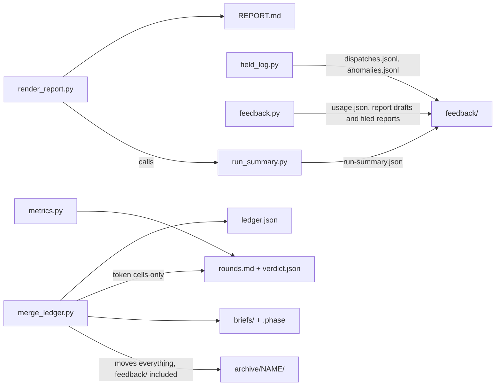
```mermaid
flowchart LR
    ML["merge_ledger.py"]
    MET["metrics.py"]
    RR["render_report.py"]
    RS["run_summary.py"]
    FL["field_log.py"]
    FB["feedback.py"]
    LJ["ledger.json"]
    RV["rounds.md + verdict.json"]
    RP["REPORT.md"]
    BR["briefs/ + .phase"]
    FD["feedback/"]
    AR["archive/NAME/"]
    ML --> LJ
    ML -->|"token cells only"| RV
    ML --> BR
    ML -->|"moves everything, feedback/ included"| AR
    MET --> RV
    RR --> RP
    RR -->|"calls"| RS
    RS -->|"run-summary.json"| FD
    FL -->|"dispatches.jsonl, anomalies.jsonl"| FD
    FB -->|"usage.json, report drafts and filed reports"| FD
```

The allowlist re-includes conclusions **at any depth** (`!ledger.json` with
`!*/`, and `!**/feedback/*.json` and kin), so archived conclusions and an
archived `feedback/` stay tracked while archived `fragments/` and `briefs/`
do not.

### 4.2 Entity model of `ledger.json` and `verdict.json`

Fields verified against `merge_ledger.py`, `metrics.py`, `render_report.py`
and the agent schemas. Neither 0.15.0 nor 0.16.0 added a ledger key.

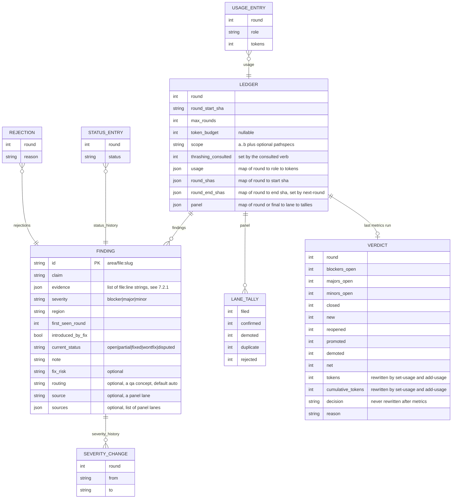
```mermaid
erDiagram
    LEDGER {
        int round
        string round_start_sha
        int max_rounds
        int token_budget "nullable"
        string scope "a..b plus optional pathspecs"
        int thrashing_consulted "set by the consulted verb"
        json usage "map of round to role to tokens"
        json round_shas "map of round to start sha"
        json round_end_shas "map of round to end sha, set by next-round"
        json panel "map of round or final to lane to tallies"
    }
    FINDING {
        string id PK "area/file:slug"
        string claim
        json evidence "list of file:line strings, see 7.2.1"
        string severity "blocker|major|minor"
        string region
        int first_seen_round
        bool introduced_by_fix
        string current_status "open|partial|fixed|wontfix|disputed"
        string note
        string fix_risk "optional"
        string routing "optional, a qa concept, default auto"
        string source "optional, a panel lane"
        json sources "optional, list of panel lanes"
    }
    STATUS_ENTRY {
        int round
        string status
    }
    SEVERITY_CHANGE {
        int round
        string from
        string to
    }
    REJECTION {
        int round
        string reason
    }
    LANE_TALLY {
        int filed
        int confirmed
        int demoted
        int duplicate
        int rejected
    }
    USAGE_ENTRY {
        int round
        string role
        int tokens
    }
    VERDICT {
        int round
        int blockers_open
        int majors_open
        int minors_open
        int closed
        int new
        int reopened
        int promoted
        int demoted
        int net
        int tokens "rewritten by set-usage and add-usage"
        int cumulative_tokens "rewritten by set-usage and add-usage"
        string decision "never rewritten after metrics"
        string reason
    }
    LEDGER ||--o{ FINDING : findings
    STATUS_ENTRY }o--|| FINDING : status_history
    FINDING ||--o{ SEVERITY_CHANGE : severity_history
    REJECTION }o--|| FINDING : rejections
    LEDGER ||--o{ LANE_TALLY : panel
    USAGE_ENTRY }o--|| LEDGER : usage
    LEDGER ||--o| VERDICT : "last metrics run"
```

### 4.3 Entity model of the `feedback/` record (0.15.0)

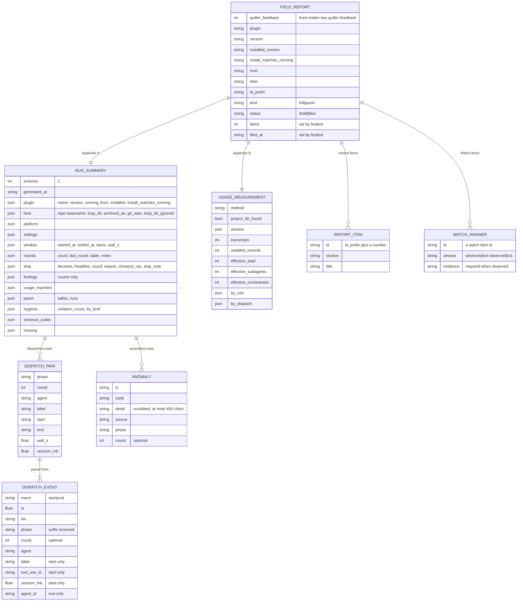
```mermaid
erDiagram
    RUN_SUMMARY {
        int schema "1"
        string generated_at
        json plugin "name, version, running_from, installed, install_matches_running"
        json host "repo basename, loop_dir, archived_as, git_repo, loop_dir_ignored"
        json platform
        json settings
        json window "started_at, ended_at, basis, wall_s"
        json rounds "count, last_round, table, notes"
        json stop "decision, headline, round, reason, closeout_ran, stop_note"
        json findings "counts only"
        json usage_reported
        json panel "tallies, runs"
        json hygiene "violation_count, by_kind"
        json closeout_suites
        json missing
    }
    DISPATCH_EVENT {
        string event "start|end"
        float ts
        string iso
        string phase "suffix removed"
        int round "optional"
        string agent
        string label "start only"
        string tool_use_id "start only"
        float session_mb "start only"
        string agent_id "end only"
    }
    DISPATCH_PAIR {
        string phase
        int round
        string agent
        string label
        string start
        string end
        float wall_s
        float session_mb
    }
    ANOMALY {
        string ts
        string code
        string detail "scrubbed, at most 400 chars"
        string source
        string phase
        int round "optional"
    }
    USAGE_MEASUREMENT {
        string method
        bool project_dir_found
        json window
        int transcripts
        int undated_records
        int effective_total
        int effective_subagents
        int effective_orchestrator
        json by_role
        json by_dispatch
    }
    FIELD_REPORT {
        int quiller_feedback "front-matter key quiller-feedback"
        string plugin
        string version
        string installed_version
        string install_matches_running
        string host
        string date
        string id_prefix
        string kind "full|quick"
        string status "draft|filed"
        int items "set by finalize"
        string filed_at "set by finalize"
    }
    REPORT_ITEM {
        string id "id_prefix plus a number"
        string section
        string title
    }
    WATCH_ANSWER {
        string id "a watch item id"
        string answer "observed|not observed|n/a"
        string evidence "required when observed"
    }
    RUN_SUMMARY ||--o{ DISPATCH_PAIR : "dispatches.rows"
    DISPATCH_PAIR ||--|{ DISPATCH_EVENT : "paired from"
    RUN_SUMMARY ||--o{ ANOMALY : "anomalies.rows"
    FIELD_REPORT ||--|| RUN_SUMMARY : "Appendix A"
    FIELD_REPORT ||--|| USAGE_MEASUREMENT : "Appendix B"
    FIELD_REPORT ||--o{ REPORT_ITEM : "minted items"
    FIELD_REPORT ||--o{ WATCH_ANSWER : "Watch items"
```

Sources: `run_summary.py build()` lines 398-433; `field_log.py` lines 141-146
(anomaly row), 178-198 (dispatch rows), 232-237 (pairs); `loop_usage.py
measure()` lines 238-259; `feedback.py` lines 398-403 (front matter), 632-634
(finalize additions), 502-549 (items), 456-484 (watch answers).
`DISPATCH_EVENT` and `ANOMALY` are one JSON object per line in their `.jsonl`
files; `DISPATCH_PAIR` exists only inside the summary.

### 4.4 Companion file shapes

- `briefs/round-N-brief.json` — `{"findings":[…], "tools": {"mutate": "<absolute path>"}}` = the output of `open auto --severity major`. `tools` lists only scripts that exist beside `merge_ledger.py`; in this plugin that is `mutate` (`merge_ledger.py` lines 118-129 and 285-289).
- `briefs/round-N-mutants.json` — `{"test_cmd", "timeout"?, "mutants":[{id,file,original,replacement,line?,test_cmd?,expect}]}` (`mutate.py` docstring lines 9-22).
- `<manifest>.results.json` — while running `{done:false, pid, started, total, results[]}`; when finished the run's summary plus `done:true` and `exit`; after a refusal or crash `error` (`mutate.py` lines 91-101, 258-262, 423, 427-443).
- `briefs/round-N.files` — one changed path per line; paths hidden by a pathspec carry a tab-separated marker (`merge_ledger.py` lines 583-585).
- `briefs/.dispatched` — one integer line. `briefs/.session-ok` — an empty marker.
- `fragments/round-N.json` — `{"findings":[…]}`; `first_seen_round` and `status_history` optional on new findings.
- `fragments/round-N-closeout.json` — as above plus `"suites": {"<target>": {"executed", "failed", "skipped"}}`, or `"suites": {}` with `"suites_note"`.
- `fragments/panel/round-N-<lane>.candidates.json` — `{"lane","filed","overflow_dropped","dropped_no_evidence"?,"diff_truncated"?,"cap"?,"cap_reason"?,"findings":[{claim,evidence,severity,confidence,area}]}`.
- `fragments/panel/round-N.run.json` — `{"round","lanes":[…],"failed","skipped","candidates_files"}`.
- `fragments/panel/round-N-panel.verified.json` — `{"verified_findings":[…], "notes_for_chair":[…], "lane_tallies":{…}}`.
- `rounds.md` — one table row per round: Round, Blockers, Majors, Minors, Closed, New, Reopened, Promoted, Net, Tokens, Decision (`metrics.py` line 207); plus optional `> round N: REVIEW_LOOP_UNATTENDED set …` lines.
- `panel.json` — `{"lanes":[…], "rounds":"seed+final"}`.

---

## 5. Sequence diagrams

Each diagram covers one scenario and only steps verified in `SKILL.md`, the
agent prompts, `hooks.json`, or the scripts. Participants are roles:

| Role | What it stands for |
|---|---|
| Orchestrator | the main agent executing a skill |
| Hooks | the Claude Code hook runner executing the six hook scripts |
| Ledger scripts | `merge_ledger.py`, `hygiene_check.sh`, `render_report.py` |
| Verdict engine | `metrics.py` |
| Panel runner | `panel_review.py` |
| Mutation runner | `mutate.py` |
| Run recorder | `field_log.py`, `run_summary.py` |
| Feedback tool | `feedback.py`, `loop_usage.py` |
| Loop state (disk) | `.review-loop/` |

Exact commands, flags and file names are in §3 and in the "Sources" line
under each diagram.

### 5.1 Session gate, then resume or fresh start

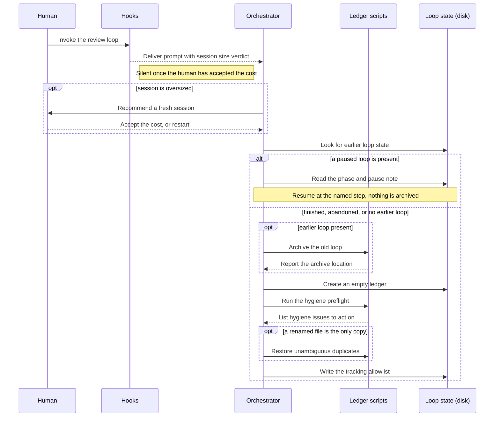
```mermaid
sequenceDiagram
    participant H as Human
    participant K as Hooks
    participant O as Orchestrator
    participant L as Ledger scripts
    participant S as Loop state (disk)

    H->>K: Invoke the review loop
    K-->>O: Deliver prompt with session size verdict
    Note right of K: Silent once the human has accepted the cost
    opt session is oversized
        O->>H: Recommend a fresh session
        H-->>O: Accept the cost, or restart
    end
    O->>S: Look for earlier loop state
    alt a paused loop is present
        O->>S: Read the phase and pause note
        Note over O,S: Resume at the named step, nothing is archived
    else finished, abandoned, or no earlier loop
        opt earlier loop present
            O->>L: Archive the old loop
            L-->>O: Report the archive location
        end
        O->>S: Create an empty ledger
        O->>L: Run the hygiene preflight
        L-->>O: List hygiene issues to act on
        opt a renamed file is the only copy
            O->>L: Restore unambiguous duplicates
        end
        O->>S: Write the tracking allowlist
    end
```

Sources: `review-loop-tools/hooks/hooks.json` UserPromptSubmit;
`review-loop-tools/scripts/session_guard.sh` lines 15-17 and 26-42;
`review-loop-tools/skills/review-loop/SKILL.md` Setup 0-2 (lines 67-144, the
PAUSED state at 75-81); `merge_ledger.py archive()` lines 698-848;
`review-loop-tools/scripts/hygiene_check.sh` lines 67-80.

### 5.2 Seeding as round 0 and the first dispatch gate

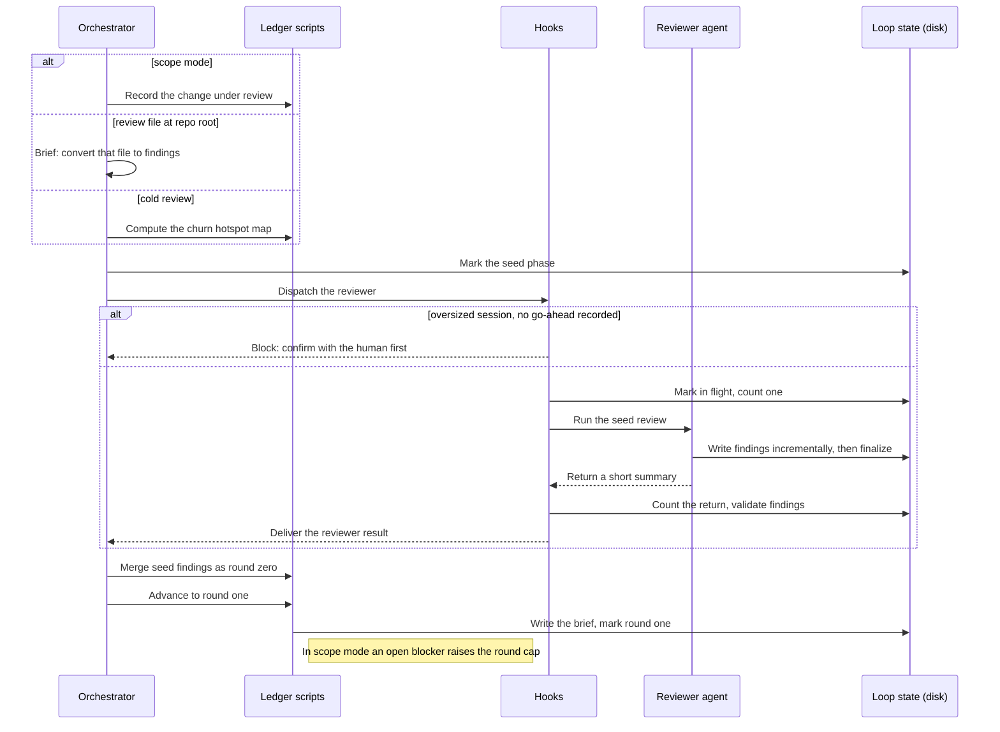
```mermaid
sequenceDiagram
    participant O as Orchestrator
    participant L as Ledger scripts
    participant K as Hooks
    participant R as Reviewer agent
    participant S as Loop state (disk)

    alt scope mode
        O->>L: Record the change under review
    else review file at repo root
        O->>O: Brief: convert that file to findings
    else cold review
        O->>L: Compute the churn hotspot map
    end
    O->>S: Mark the seed phase
    O->>K: Dispatch the reviewer
    alt oversized session, no go-ahead recorded
        K-->>O: Block: confirm with the human first
    else
        K->>S: Mark in flight, count one
        K->>R: Run the seed review
        R->>S: Write findings incrementally, then finalize
        R-->>K: Return a short summary
        K->>S: Count the return, validate findings
        K-->>O: Deliver the reviewer result
    end
    O->>L: Merge seed findings as round zero
    O->>L: Advance to round one
    L->>S: Write the brief, mark round one
    Note right of L: In scope mode an open blocker raises the round cap
```

Sources: `SKILL.md` Setup 3 (lines 187-215) and "Each round — Start" (lines
247-252); `review-loop-tools/scripts/dispatch_stamp.sh` lines 71-96;
`review-loop-tools/scripts/subagent_guard.sh` lines 33-64 and 66-186;
`merge_ledger.py` main lines 942-1008 (escalation at 997-1004) and
`next_round()` advance-only path lines 676-696. The panel's part of a scoped
seed is in §5.10.

### 5.3 A normal round

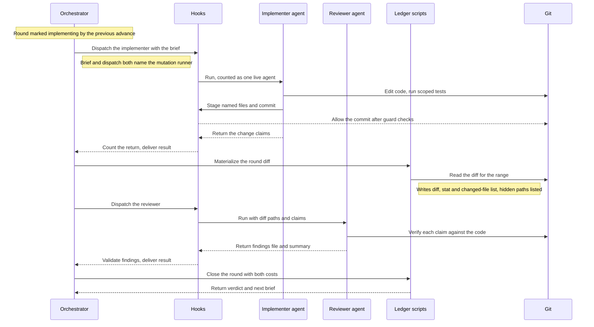
```mermaid
sequenceDiagram
    participant O as Orchestrator
    participant K as Hooks
    participant I as Implementer agent
    participant R as Reviewer agent
    participant L as Ledger scripts
    participant G as Git

    Note over O: Round marked implementing by the previous advance
    O->>K: Dispatch the implementer with the brief
    Note right of O: Brief and dispatch both name the mutation runner
    K->>I: Run, counted as one live agent
    I->>G: Edit code, run scoped tests
    I->>K: Stage named files and commit
    K-->>G: Allow the commit after guard checks
    I-->>K: Return the change claims
    K-->>O: Count the return, deliver result
    O->>L: Materialize the round diff
    L->>G: Read the diff for the range
    Note right of L: Writes diff, stat and changed-file list, hidden paths listed
    O->>K: Dispatch the reviewer
    K->>R: Run with diff paths and claims
    R->>G: Verify each claim against the code
    R-->>K: Return findings file and summary
    K-->>O: Validate findings, deliver result
    O->>L: Close the round with both costs
    L-->>O: Return verdict and next brief
```

Sources: `SKILL.md` "Each round" steps 1-3 (lines 253-286);
`review-loop-tools/agents/implementer.md` lines 52-114;
`review-loop-tools/agents/skeptical-reviewer.md` lines 87-131;
`review-loop-tools/scripts/commit_guard.sh` lines 36-72 and 74-93;
`merge_ledger.py write_diff()` lines 531-589 and `shipped_tools()` lines
118-129.

### 5.4 Closing a round: merge, verdict, advance

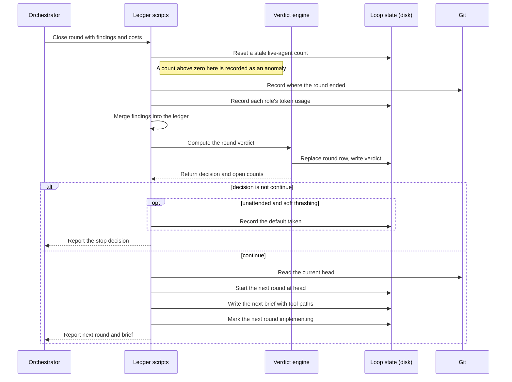
```mermaid
sequenceDiagram
    participant O as Orchestrator
    participant L as Ledger scripts
    participant V as Verdict engine
    participant S as Loop state (disk)
    participant G as Git

    O->>L: Close round with findings and costs
    L->>S: Reset a stale live-agent count
    Note right of L: A count above zero here is recorded as an anomaly
    L->>G: Record where the round ended
    L->>S: Record each role's token usage
    L->>L: Merge findings into the ledger
    L->>V: Compute the round verdict
    V->>S: Replace round row, write verdict
    V-->>L: Return decision and open counts
    alt decision is not continue
        opt unattended and soft thrashing
            L->>S: Record the default taken
        end
        L-->>O: Report the stop decision
    else continue
        L->>G: Read the current head
        L->>S: Start the next round at head
        L->>S: Write the next brief with tool paths
        L->>S: Mark the next round implementing
        L-->>O: Report next round and brief
    end
```

Sources: `merge_ledger.py next_round()` lines 591-696 (counter reset 616,
`round_end_shas` 619-633, usages 634-640, merge and metrics 641-654,
unattended line 655-675, advance 676-696), `settle_dispatch_counter()` lines
96-116; `metrics.py main()` lines 110-228.

### 5.5 A token count that arrives late (0.16.0)

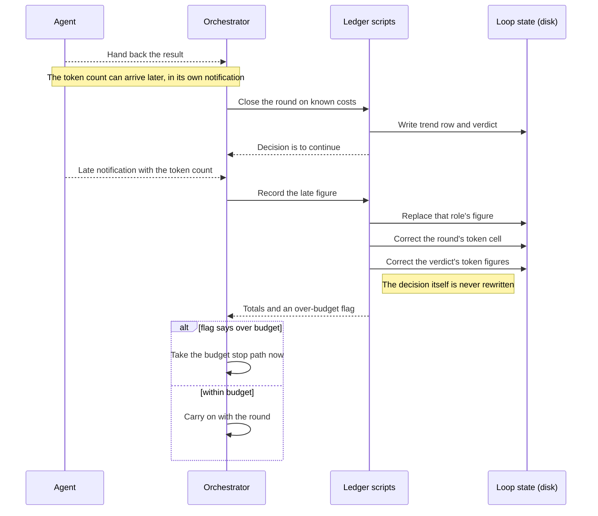
```mermaid
sequenceDiagram
    participant A as Agent
    participant O as Orchestrator
    participant L as Ledger scripts
    participant S as Loop state (disk)

    A-->>O: Hand back the result
    Note over A,O: The token count can arrive later, in its own notification
    O->>L: Close the round on known costs
    L->>S: Write trend row and verdict
    L-->>O: Decision is to continue
    A-->>O: Late notification with the token count
    O->>L: Record the late figure
    L->>S: Replace that role's figure
    L->>S: Correct the round's token cell
    L->>S: Correct the verdict's token figures
    Note right of L: The decision itself is never rewritten
    L-->>O: Totals and an over-budget flag
    alt flag says over budget
        O->>O: Take the budget stop path now
    else within budget
        O->>O: Carry on with the round
    end
```

Sources: `merge_ledger.py _usage()` lines 319-364 and `sync_round_tokens()`
lines 366-425; `SKILL.md` lines 275-286 and 486-494;
`review-loop-tools/tests/hooks_selftest.py` lines 162-200. A repeated
notification for the same dispatch is not a second cost (`SKILL.md` lines
259-262).

### 5.6 Thrashing detection: soft stop, human consult, hard stop


```mermaid
sequenceDiagram
    participant O as Orchestrator
    participant L as Ledger scripts
    participant V as Verdict engine
    participant H as Human
    participant S as Loop state (disk)

    O->>L: Close the round
    L->>V: Compute the round verdict
    V->>V: Detect reopen, flat net, or region churn
    V->>V: Exempt a converging series
    alt no blockers, progress, human not consulted
        V-->>L: Soft thrashing, ask the human
        L-->>O: Report soft thrashing
        alt attended
            O->>S: Mark awaiting the human
            O->>H: Abort, or continue one round?
            H-->>O: Continue
            O->>L: Record the consultation
            O->>L: Advance to the next round
            Note over V: The next thrashing signal is hard
        else unattended
            L->>S: Record the default taken
            O->>O: Abort, close out, report
        end
    else
        V-->>L: Hard thrashing, stop
        L-->>O: Report the stop
    end
```

Sources: `metrics.py` lines 159-184; `merge_ledger.py consulted()` lines
913-931 and `next_round()` unattended branch lines 655-675; `SKILL.md` "Each
round" step 4 (lines 287-303) and "Stop conditions" (lines 414-440).

### 5.7 Stop, panel final pass, overlapping dispatches

The scenario is split in two: the panel final pass itself, then the live
count that lets the closeout implementer run beside it.

#### 5.7.1 Panel final pass

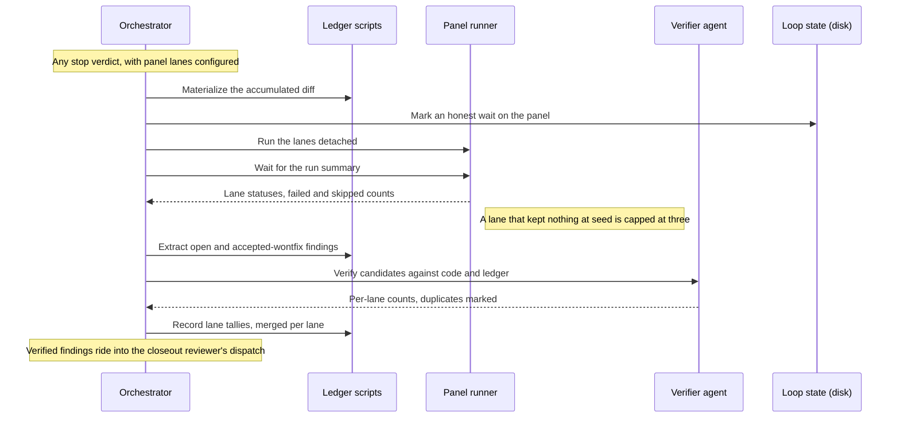
```mermaid
sequenceDiagram
    participant O as Orchestrator
    participant L as Ledger scripts
    participant P as Panel runner
    participant V as Verifier agent
    participant S as Loop state (disk)

    Note over O: Any stop verdict, with panel lanes configured
    O->>L: Materialize the accumulated diff
    O->>S: Mark an honest wait on the panel
    O->>P: Run the lanes detached
    O->>P: Wait for the run summary
    P-->>O: Lane statuses, failed and skipped counts
    Note right of P: A lane that kept nothing at seed is capped at three
    O->>L: Extract open and accepted-wontfix findings
    O->>V: Verify candidates against code and ledger
    V-->>O: Per-lane counts, duplicates marked
    O->>L: Record lane tallies, merged per lane
    Note over O: Verified findings ride into the closeout reviewer's dispatch
```

Sources: `SKILL.md` "Panel final pass" (lines 305-335); `panel_review.py
run()` lines 964-1110 (`--detach` 984-999, empty-diff refusal 1027-1037,
banners 1064-1076), `wait()` lines 1112-1141, `run_lane()` cap lines 896-901;
`merge_ledger.py open_findings()` wontfix branch lines 250-256 and
`panel_tally()` lines 850-911;
`review-loop-tools/agents/panel-verifier.md` lines 46-52.

#### 5.7.2 Two agents live at once (0.16.0)

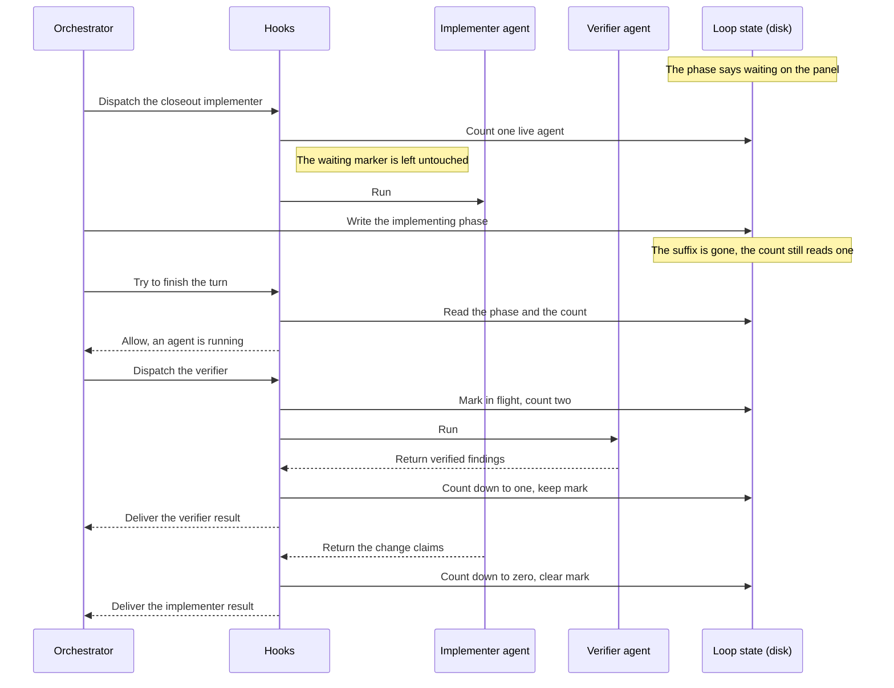
```mermaid
sequenceDiagram
    participant O as Orchestrator
    participant K as Hooks
    participant I as Implementer agent
    participant V as Verifier agent
    participant S as Loop state (disk)

    Note over S: The phase says waiting on the panel
    O->>K: Dispatch the closeout implementer
    K->>S: Count one live agent
    Note right of K: The waiting marker is left untouched
    K->>I: Run
    O->>S: Write the implementing phase
    Note over S: The suffix is gone, the count still reads one
    O->>K: Try to finish the turn
    K->>S: Read the phase and the count
    K-->>O: Allow, an agent is running
    O->>K: Dispatch the verifier
    K->>S: Mark in flight, count two
    K->>V: Run
    V-->>K: Return verified findings
    K->>S: Count down to one, keep mark
    K-->>O: Deliver the verifier result
    I-->>K: Return the change claims
    K->>S: Count down to zero, clear mark
    K-->>O: Deliver the implementer result
```

Sources: `review-loop-tools/scripts/dispatch_stamp.sh` lines 17-25 (the
rationale) and 63-96; `review-loop-tools/scripts/loop_guard.sh` lines 10-16
and 46-52; `review-loop-tools/scripts/subagent_guard.sh` lines 23-64;
`review-loop-tools/tests/hooks_selftest.py` lines 101-131, which replay this
sequence and assert the count reads 1, 2, 1, 0; `SKILL.md` lines 39-46 and
313-314.

### 5.8 Closeout and the final report

#### 5.8.1 Closeout cycle

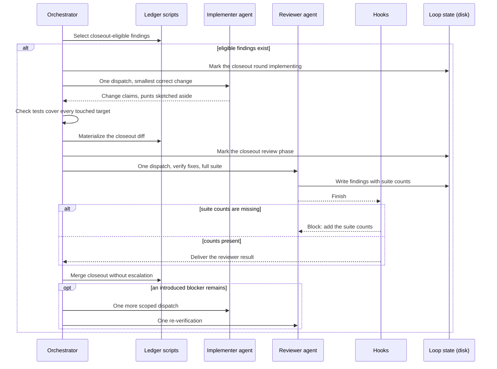
```mermaid
sequenceDiagram
    participant O as Orchestrator
    participant L as Ledger scripts
    participant I as Implementer agent
    participant R as Reviewer agent
    participant K as Hooks
    participant S as Loop state (disk)

    O->>L: Select closeout-eligible findings
    alt eligible findings exist
        O->>S: Mark the closeout round implementing
        O->>I: One dispatch, smallest correct change
        I-->>O: Change claims, punts sketched aside
        O->>O: Check tests cover every touched target
        O->>L: Materialize the closeout diff
        O->>S: Mark the closeout review phase
        O->>R: One dispatch, verify fixes, full suite
        R->>S: Write findings with suite counts
        R-->>K: Finish
        alt suite counts are missing
            K-->>R: Block: add the suite counts
        else counts present
            K-->>O: Deliver the reviewer result
        end
        O->>L: Merge closeout without escalation
        opt an introduced blocker remains
            O->>I: One more scoped dispatch
            O->>R: One re-verification
        end
    end
```

Sources: `SKILL.md` "Closeout" (lines 337-388);
`merge_ledger.py open_findings()` closeout branch lines 260-266;
`review-loop-tools/scripts/subagent_guard.sh` `check_suites` lines 76-108 and
144-145; `review-loop-tools/agents/skeptical-reviewer.md` lines 73-80.
Closeout token usage is recorded with `add-usage`, never `set-usage`
(`SKILL.md` lines 493-494).

#### 5.8.2 Final report and run record

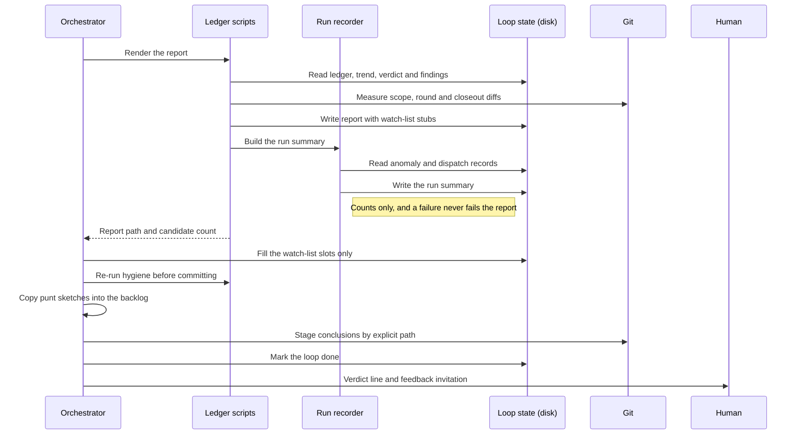
```mermaid
sequenceDiagram
    participant O as Orchestrator
    participant L as Ledger scripts
    participant U as Run recorder
    participant S as Loop state (disk)
    participant G as Git
    participant H as Human

    O->>L: Render the report
    L->>S: Read ledger, trend, verdict and findings
    L->>G: Measure scope, round and closeout diffs
    L->>S: Write report with watch-list stubs
    L->>U: Build the run summary
    U->>S: Read anomaly and dispatch records
    U->>S: Write the run summary
    Note right of U: Counts only, and a failure never fails the report
    L-->>O: Report path and candidate count
    O->>S: Fill the watch-list slots only
    O->>L: Re-run hygiene before committing
    O->>O: Copy punt sketches into the backlog
    O->>G: Stage conclusions by explicit path
    O->>S: Mark the loop done
    O->>H: Verdict line and feedback invitation
```

Sources: `SKILL.md` "Final report" (lines 442-469); `render_report.py main()`
(closeout section lines 256-291, watch list lines 302-404, summary call lines
408-419); `run_summary.py build()` and `write()` lines 355-447.

### 5.9 Panel setup: probe and consent

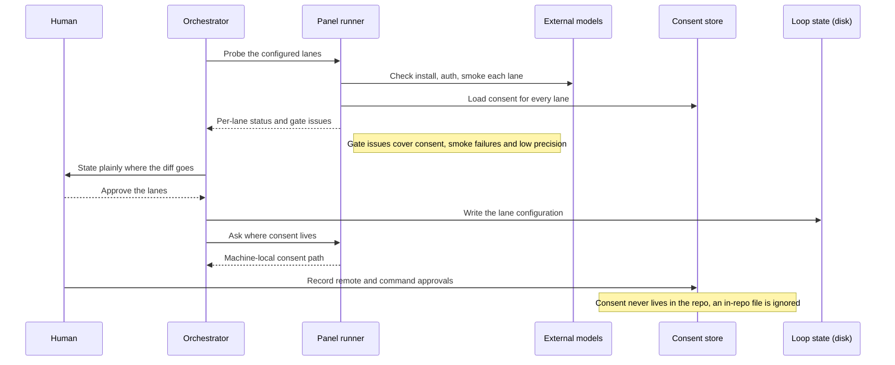
```mermaid
sequenceDiagram
    participant H as Human
    participant O as Orchestrator
    participant P as Panel runner
    participant X as External models
    participant C as Consent store
    participant S as Loop state (disk)

    O->>P: Probe the configured lanes
    P->>X: Check install, auth, smoke each lane
    P->>C: Load consent for every lane
    P-->>O: Per-lane status and gate issues
    Note right of P: Gate issues cover consent, smoke failures and low precision
    O->>H: State plainly where the diff goes
    H-->>O: Approve the lanes
    O->>S: Write the lane configuration
    O->>P: Ask where consent lives
    P-->>O: Machine-local consent path
    H->>C: Record remote and command approvals
    Note over C: Consent never lives in the repo, an in-repo file is ignored
```

Sources: `SKILL.md` Setup 2b (lines 145-186); `panel_review.py probe()` lines
346-467 (`gate_issues` 427-466), `consent_path()` lines 184-237,
`load_consent()` lines 239-275, `consent_path_cmd()` lines 277-300,
`precision_disabled()` lines 609-627.

### 5.10 Panel seed pass: lanes, verifier, chair

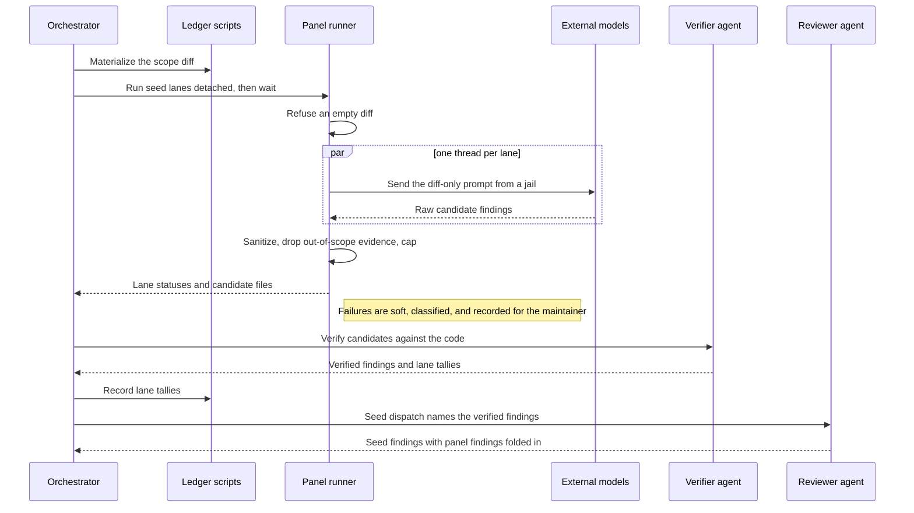
```mermaid
sequenceDiagram
    participant O as Orchestrator
    participant L as Ledger scripts
    participant P as Panel runner
    participant X as External models
    participant V as Verifier agent
    participant R as Reviewer agent

    O->>L: Materialize the scope diff
    O->>P: Run seed lanes detached, then wait
    P->>P: Refuse an empty diff
    par one thread per lane
        P->>X: Send the diff-only prompt from a jail
        X-->>P: Raw candidate findings
    end
    P->>P: Sanitize, drop out-of-scope evidence, cap
    P-->>O: Lane statuses and candidate files
    Note right of P: Failures are soft, classified, and recorded for the maintainer
    O->>V: Verify candidates against the code
    V-->>O: Verified findings and lane tallies
    O->>L: Record lane tallies
    O->>R: Seed dispatch names the verified findings
    R-->>O: Seed findings with panel findings folded in
```

Sources: `SKILL.md` "PANEL SEED PASS" (lines 216-242); `panel_review.py
run()` lines 964-1110 (telemetry 1077-1098), `run_lane()` lines 842-959 (jail
runners 662-817, model list 902-931, sanitize 543-585);
`review-loop-tools/agents/panel-verifier.md`;
`review-loop-tools/agents/skeptical-reviewer.md` lines 132-137;
`merge_ledger.py panel_tally()` lines 850-911.

### 5.11 Mutation testing

#### 5.11.1 Inside a round

```mermaid
sequenceDiagram
    participant I as Implementer agent
    participant M as Mutation runner
    participant G as Git
    participant O as Orchestrator
    participant R as Reviewer agent

    I->>I: Write a manifest with a control mutant
    I->>G: Commit the fix and tests first
    I->>M: Run the manifest with the named runner
    M->>M: Validate manifest, refuse uncommitted files
    M->>G: Cut a throwaway worktree at head
    M->>M: Run each gate unmutated, refuse red
    loop each mutant
        M->>G: Apply the mutant in the worktree
        M->>M: Run its gate, classify, time it
        M->>G: Restore the file
    end
    M->>G: Remove the worktree
    M-->>I: Kill counts, mismatches, errors
    I-->>O: Claims name the manifest
    O->>R: Dispatch naming manifest and runner
    R->>M: Re-run verbatim, plus call-site mutants
    M-->>R: Summary
    Note over R: Errors or a red baseline make the count unverified
```

Sources: `review-loop-tools/agents/implementer.md` lines 58-95;
`review-loop-tools/scripts/mutate.py` lines 212-425 (validation 263-298,
dirty check 312-327, baseline 344-370, mutant loop 371-404, teardown
405-408); `review-loop-tools/agents/skeptical-reviewer.md` lines 116-131.

#### 5.11.2 A stale copy, and a run longer than the command ceiling (0.16.0)

```mermaid
sequenceDiagram
    participant A as Agent
    participant M as Mutation runner
    participant B as Background run
    participant S as Loop state (disk)

    A->>M: Run an old cached copy
    M->>M: Find a newer version installed alongside
    M->>S: Record the refusal
    M-->>A: Refuse, naming the current copy
    A->>M: Start detached with the named copy
    M->>B: Launch the run in the background
    M-->>A: Return at once with results location
    A->>M: Wait for the run
    loop each mutant
        B->>S: Save results so far
    end
    alt still running at the time limit
        M-->>A: Still running, wait again
    else finished, refused or crashed
        B->>S: Close the results record
        M-->>A: Same summary and exit status
    end
    opt a few mutants need a rerun
        A->>M: Rerun a named subset, same manifest
    end
```

Sources: `review-loop-tools/scripts/mutate.py` `newer_sibling()` lines 66-86,
refusal 234-241, detach 242-257, `save_results()` 91-101, `wait()` 131-177,
`--only` 299-310, exit handler 427-443;
`review-loop-tools/tests/mutate_selftest.py` lines 68-159;
`merge_ledger.py shipped_tools()` lines 118-129.

### 5.12 Command guards denying a shell call

```mermaid
sequenceDiagram
    participant A as Any agent
    participant K as Hooks
    participant S as Loop state (disk)

    A->>K: Stage everything and commit
    K->>S: Is a loop live?
    K-->>A: Block: stage files by path
    Note right of K: Live means a round, seed or awaiting-human phase
    A->>K: Dump a whole large file
    K->>S: Is a round in flight?
    K-->>A: Block: locate, then read a window
    A->>K: Re-pull the whole round diff
    K->>S: Does the round diff exist on disk?
    K-->>A: Block: read the diff already on disk
    A->>K: Write a heredoc mentioning a test command
    K-->>A: Allow: data, not a command
    Note right of K: Heredoc bodies and quoted strings are stripped before matching
    Note over K,S: Each denial records which rule fired, never the command
```

Sources: `review-loop-tools/scripts/commit_guard.sh` lines 13-17 and 36-72;
`review-loop-tools/scripts/read_guard.sh` lines 10-16 (active phases), 27-38
(denial telemetry), 51-57 (`strip_data`, `CMD_START`), 59-99 (rules);
`review-loop-tools/hooks/hooks.json` PreToolUse Bash entry (both scripts run
on every Bash call); `review-loop-tools/tests/hooks_selftest.py` lines
280-316.

### 5.13 Stall guard and findings validation

```mermaid
sequenceDiagram
    participant O as Orchestrator
    participant K as Hooks
    participant R as Reviewer agent
    participant S as Loop state (disk)

    Note over S: Review phase marked, a dispatch is owed
    O->>K: Try to finish without dispatching
    K->>S: Read the phase and the count
    K-->>O: Block: dispatch now, or mark done
    Note right of K: A forced continuation is never re-blocked
    O->>K: Dispatch the reviewer
    K->>S: Mark in flight, count one
    K->>R: Run
    R->>S: Write findings missing a claim
    R-->>K: Finish
    K->>S: Count down, clear mark at zero
    K->>S: Validate every flat findings file
    alt invalid and older than ten seconds
        K-->>R: Block: rewrite the findings file
    else valid, or still being written
        K-->>O: Deliver the reviewer result
    end
```

Sources: `review-loop-tools/scripts/loop_guard.sh` lines 20-30
(`stop_hook_active`) and 46-52 (the block);
`review-loop-tools/scripts/dispatch_stamp.sh` lines 92-96;
`review-loop-tools/scripts/subagent_guard.sh` lines 33-64 (count) and 66-186
(validation, 10 s grace at 175-177). Note the order inside the SubagentStop
hook: the count is decremented **before** validation runs; §7.2.3 describes
the consequence.

### 5.14 Transport failure, partial resume, and honest waits

```mermaid
sequenceDiagram
    participant O as Orchestrator
    participant K as Hooks
    participant R as Reviewer agent
    participant S as Loop state (disk)

    O->>K: Dispatch the reviewer
    K->>S: Mark in flight, count one
    K->>R: Run
    R->>S: Save partial findings incrementally
    R--xK: Die mid-run
    K->>S: Count down, clear the mark
    K-->>O: Failed result
    O->>O: Back off inside the turn
    O->>K: Re-dispatch same reviewer, resume partial
    Note over O: Model fallback only after three failures, disclosed in the report
    O->>S: Mark an honest non-agent wait
    O->>K: Try to finish the turn
    K->>S: Read the phase marker
    K-->>O: Allow: honest wait
    Note right of S: Partial files are never policed
```

Sources: `SKILL.md` "Waiting, failures, and pauses" (lines 391-412), which is
also the only source for the claim that the mark is cleared when an agent
fails (the host's behaviour was not verified);
`review-loop-tools/scripts/loop_guard.sh` lines 36-39;
`review-loop-tools/scripts/subagent_guard.sh` lines 116 and 126 (a `.partial`
suffix never matches the name pattern);
`review-loop-tools/agents/skeptical-reviewer.md` lines 170-177.

### 5.15 Archiving a finished loop, and repairing renamed files

```mermaid
sequenceDiagram
    participant O as Orchestrator
    participant L as Ledger scripts
    participant S as Loop state (disk)
    participant G as Git

    O->>S: Detect a finished or abandoned loop
    O->>L: Archive the loop
    L->>S: Name the archive by its own sha
    L->>L: Scan for duplicate names first
    loop each state file
        L->>S: Move the file, verify source gone
    end
    Note right of S: The run record moves with its loop
    L->>S: Sweep unknown files into legacy
    L->>L: Re-scan, settle briefly, re-scan again
    alt new sync-conflict duplicates appeared
        L-->>O: Fail: the duplicate is the real file
        O->>L: Restore unambiguous duplicates
        L->>G: Compare tracked names with files on disk
        L-->>O: Restored names, and those left for a human
    else clean
        L-->>O: Report archive location and counts
    end
    O->>S: Create a fresh ledger, keep the allowlist
```

Sources: `merge_ledger.py archive()` lines 698-848 (naming 714-728, scans
736-746 with telemetry off, per-file move helpers 748-774, move list
including `feedback` 776-784, `KEEP` set and legacy sweep 794-809, settle and
re-check 814-831, anomalies 832-839, failure 840-848);
`review-loop-tools/scripts/hygiene_check.sh` lines 56-89 and 116-150;
`SKILL.md` Setup 1 and 2 (lines 82-94, 104-114).

### 5.16 What the run records about itself (0.15.0)

```mermaid
sequenceDiagram
    participant O as Orchestrator
    participant K as Hooks
    participant A as Agent
    participant X as Loop scripts
    participant T as Run record (disk)

    O->>K: Dispatch an agent
    K->>T: Record dispatch start and session size
    K->>A: Run
    A->>K: Attempt a denied command
    K->>T: Record which rule fired
    K-->>A: Block with the fix
    A-->>K: Return
    K->>T: Record the dispatch return
    K-->>O: Deliver the result
    X->>T: Record lane failures and refusals
    O->>X: Note a workaround as it happens
    X->>T: Append the orchestrator's note
    Note over T: Recording never changes behavior and can be switched off
    O->>X: Render the report
    X->>T: Pair starts with returns, count anomalies
    X->>T: Write the run summary
```

Sources: `review-loop-tools/scripts/dispatch_stamp.sh` lines 26-30 and 37-40;
`review-loop-tools/scripts/subagent_guard.sh` lines 14-21;
`review-loop-tools/scripts/read_guard.sh` lines 27-38;
`review-loop-tools/scripts/field_log.py` (contract lines 17-20, `dispatch`
165-202, `pair_dispatches` 208-238); `merge_ledger.py anomaly()` lines 66-94;
`panel_review.py` lines 1077-1098; `mutate.py` lines 103-114;
`run_summary.py build()` lines 371-386.

### 5.17 Filing a field report (0.15.0)

```mermaid
sequenceDiagram
    participant H as Human
    participant O as Orchestrator
    participant F as Feedback tool
    participant S as Loop state (disk)
    participant C as Session transcripts
    participant D as Maintainer drop

    H->>O: Ask to file feedback
    O->>F: Scaffold a draft
    F->>S: Read or build the run summary
    F->>C: Measure effective tokens per role
    F->>S: Write draft with watch questions
    F-->>O: Draft path and what is missing
    O->>O: Read settled decisions and known items
    O->>S: Answer watch items, describe defects
    O->>F: Finalize the report
    alt a watch item is unanswered
        F-->>O: Refuse and list the problems
    else complete
        F->>S: Mint item ids, append the data
        F->>D: Copy the filed report
        F-->>O: Paths, ids and staging line
        O->>H: Report path, drop path, item ids
    end
    Note over F,D: Quick mode skips the questions and files the numbers alone
```

Sources: `review-loop-tools/skills/feedback/SKILL.md` lines 13-65;
`review-loop-tools/scripts/feedback.py` `scaffold()` lines 341-442,
`measure_usage()` 282-297, `finalize()` 568-681, `drop_dir()` 551-566;
`review-loop-tools/scripts/loop_usage.py` `measure()` lines 231-259. What
reads the drop (`tools/ingest_feedback.py`) is repo tooling outside this
plugin.

---

## 6. Verdict precedence

The decision is a fixed `if/elif` chain (`review-loop-tools/scripts/metrics.py`
lines 171-196). The order matters: a converged round beats everything, the
budget beats thrashing, and the backstop is reached only when nothing earlier
fired. The chain is drawn in two parts.

```mermaid
flowchart TD
    S["Round signals computed from finding history"] --> C1{"No open blockers or majors, and none new?"}
    C1 -->|"yes"| CONV["Converged"]
    C1 -->|"no"| C2{"Token spend has reached the budget?"}
    C2 -->|"yes"| BUD["Budget stop"]
    C2 -->|"no"| C3{"Churn signal present, and not a converging series?"}
    C3 -->|"yes, with progress and no human consulted"| TS["Soft thrashing, ask the human"]
    C3 -->|"yes, otherwise"| TH["Thrashing, hard stop"]
    C3 -->|"no"| NEXT["Go on to the later checks"]
```

```mermaid
flowchart TD
    START["No earlier stop fired"] --> C4{"Same disputed findings as last round?"}
    C4 -->|"yes"| ST["Stalemate"]
    C4 -->|"no"| C5{"Little net progress twice, nothing serious open or new?"}
    C5 -->|"yes"| DIM["Diminishing returns"]
    C5 -->|"no"| C6{"Round cap reached?"}
    C6 -->|"yes"| BS["Backstop"]
    C6 -->|"no"| CONT["Continue"]
```

Exact conditions, by identifier (`metrics.py`):

| Decision | Condition | Lines |
|---|---|---|
| `converged` | `blockers_open == 0 and majors_open == 0 and not new_blocker_major` | 171-172 |
| `budget` | `token_budget` set and `cumulative_tokens >= token_budget` | 157, 173-174 |
| `thrashing_soft` | `thrash_signal`, `blockers_open == 0`, `closed > 0`, `thrashing_consulted` unset | 175-181 |
| `thrashing` | `thrash_signal` otherwise | 182-184 |
| `stalemate` | disputed set identical to round N-1 and non-empty | 185-186 |
| `diminishing` | `net <= 1` for N and N-1, `blockers_open == 0`, no new blocker/major | 187-192 |
| `backstop` | `N >= max_rounds` | 193-194 |
| `continue` | none of the above | 195-196 |

`thrash_signal` = any finding reopened (`fixed→open`) at least twice, OR
`net <= 0` for rounds N and N-1, OR the same region appears in new/reopened
findings in N, N-1, N-2 unless both of the last two rounds were net-positive
with no reopens (lines 136-151, 164-166). `converging_series()` clears the
whole signal (lines 167-168).

The budget check uses the usage known **when metrics runs**. A figure that
arrives later cannot change the decision; `set-usage` reports it through
`over_budget` instead (§5.5).

---

## 7. State of the architecture (maintainer-facing)

### 7.1 Design decisions and their rationale

Where the rationale is documented (`HANDOFF.md` §3, commit messages, inline
"(measured: …)" notes) it is cited; otherwise it is labelled as inference.

| Decision | Where | Rationale |
|---|---|---|
| Control logic lives in prose, scripts are judgment-free | whole plugin | Documented: `HANDOFF.md` §3 "All ledger/report/planning mutations go through the scripts … The orchestrator is plumbing" |
| Seed merges as round 0 | `SKILL.md` Setup 3; `metrics.py` | Documented: a seed merged as round 1 "poisons the net metric (N new, 0 closed)" |
| Hooks instead of prompt rules for stall, fragment, read and staging discipline | `hooks/hooks.json`, `scripts/*_guard.sh` | Documented in `README.md` ("zero token cost") and commit `df466f2` |
| The diff is materialized once and read from disk | `merge_ledger.py write_diff` | Documented in its docstring: "21 git diff/show calls, 601K tokens, in one run" |
| Three model pins (`opus` / `sonnet` / `inherit`) | agent frontmatter | Documented: `HANDOFF.md` §3 "Model pins", `FIELD-QUESTIONS.md` `s-model-pins` |
| `set-usage` replaces, `add-usage` accumulates | `merge_ledger.py _usage` | Documented: an accumulate-only readout once inflated a budget by 89% |
| **`set-usage` corrects figures, never a decision** (0.16.0) | `merge_ledger.py sync_round_tokens` | Documented: docstring lines 367-373, `HANDOFF.md` §3, `s-usage-never-rewrites-decision`. **Inference:** re-running metrics for a closed round could flip a `continue` row after the next round had already started; printing a flag leaves the ordering of events intact |
| **The live-dispatch count is the source of truth; the suffix is its display** (0.16.0) | `dispatch_stamp.sh`, `subagent_guard.sh`, `loop_guard.sh` | Documented: commit `5e5dfd9` item A1, the header comments of all three scripts, `HANDOFF.md` §3. Expiring the count by age and re-stamping on PostToolUse were considered and rejected there |
| **A stale count fails open until a round boundary** (0.16.0) | `loop_guard.sh` lines 14-16; `merge_ledger.py settle_dispatch_counter` | Documented: "as a stuck suffix always did". The reset lives in both `set-round` and `next-round` because the qa skill never calls `next-round` (`docs/proposal-2026-09-27-weatherapp-0.14.0-report.md`, "As built") |
| **Briefs name script paths; `mutate.py` refuses beside a newer version; the plugin never prunes the cache** (0.16.0) | `merge_ledger.py shipped_tools`, `mutate.py newer_sibling` | Documented: two implementers ran the 0.13.0 copy under 0.14.0; `HANDOFF.md` §3, `s-no-cache-pruning` |
| **The closeout `suites` rule is armed only during the closeout review** (0.16.0) | `subagent_guard.sh` lines 76-80 | Documented in the comment: a closeout fragment left by an earlier pass must never block a later reviewer |
| **`--restore` repairs only the unambiguous case** (0.16.0) | `hygiene_check.sh` lines 19-25, 67-80 | Documented: both field agents did exactly this by hand in three runs; with two rivals "which one is real is a human's call" |
| **Telemetry never changes behaviour and never creates a loop directory** (0.15.0) | `field_log.py` lines 17-20 | Documented in the docstring and commit `aed07f8` |
| **The run summary carries counts only** (0.15.0) | `run_summary.py` lines 19-24 | Documented: "this file leaves the host repo" |
| **The plugin version is read from the running code** (0.15.0) | `run_summary.py plugin_identity` | Documented: one whole feedback cycle went to reports from a stale install (`HANDOFF.md` §1) |
| **The drop is machine-local and outside every repo** (0.15.0) | `feedback.py drop_dir` | Documented in the docstring. **Inference:** the containment check on `XDG_DATA_HOME` mirrors the one `panel_review.py` applies to `XDG_CONFIG_HOME`, for the same repo-shipped-environment reason |
| **The token measurement ships with the plugin** (0.15.0) | `loop_usage.py` | Documented: it was reimplemented from a docstring by both field agents; commit `aed07f8` reports it reproduces the earlier script to the token on 433 transcripts |
| Consent is machine-local, keyed by realpath hash | `panel_review.py consent_path/load_consent` | Documented across commits `15c45f1`, `907074b`, `9baf5ae` and the docstring |
| External panel models are finders only; a blind verifier sits between them and the ledger | `agents/panel-verifier.md`, `SKILL.md` 2b | Documented in `docs/proposal-multi-provider-review-panel.md` |
| Panel runs `seed+final` only | `SKILL.md` | Documented: "so metrics and convergence are untouched" (`README.md`). **Inference:** also cost, since each lane pays for the whole diff |
| Panel lanes and long mutation runs are detached and polled | `panel_review.py`, `mutate.py` | Documented: the Bash tool's 600 s ceiling; the results file is the contract |
| Default-closed `.gitignore` allowlist; staging by explicit path enforced by hook | `SKILL.md` Setup 2, `commit_guard.sh` | Documented: commit `2ed0b5f` and `docs/plugin-feedback-conclusions-in-git.md` |
| Archive is per-file with a post-check and a settle | `merge_ledger.py archive` | Documented in comments at lines 749-753 and 819-822 |
| Closeout is a single no-iteration cycle | `SKILL.md` Closeout | Documented: a closeout "minor" once grew to 28% of a run's cost |

**Inference on evolution:** the git history shows a strict "field report →
numbered proposal → release" cadence (`HANDOFF.md` §1). Nearly every rule in
`SKILL.md` carries a "(measured: …)" clause naming the incident that created
it; the file has grown from 67 lines (`b997308`, 2026-08-14) to 549 by
accretion of such clauses rather than by restructuring. 0.15.0 carried no
fix from a field report (its commit message says so): it moved the reporting
itself into the plugins.

### 7.2 Verified defects and gaps

Items 7.2.1 to 7.2.5 were reproduced at `5e5dfd9` by running the real script
in a scratch directory, except where a step is labelled as inference; no
script changed in 0.16.1, so they stand. Item 7.2.6 was found by reading the
prompt files and is fixed in 0.16.1.

#### 7.2.1 `union_evidence()` wipes list-shaped evidence on merge

`review-loop-tools/scripts/merge_ledger.py` lines 170-174:

```python
def union_evidence(old, new):
    if not isinstance(old, dict):
        old = {}
    if not isinstance(new, dict):
        return old
```

The review loop's evidence is a **list of `file:line` strings** (the schema
in `agents/skeptical-reviewer.md` line 192; accepted by `subagent_guard.sh`
lines 159-167). For an existing finding the merge path (lines 979-980) calls
`union_evidence(list, list)`, which returns `{}`, so the first merge that
updates a finding discards its evidence. Verified by calling the function
(`union_evidence(["a.py:1"], ["a.py:1","b.py:2"])` returns `{}`) and by
counting the repo's own loop state: 18 of 27 findings in
`.review-loop/ledger.json` and 16 of 18 in
`.review-loop/archive/panel-feature-loop-2026-09-09/ledger.json` have
`evidence: {}`. `render_report.py finding_line()` prints nothing for `{}`.
Present since before 0.14.0 and unchanged by both releases.

**Inference:** the function was written for the qa loop's dict-shaped
evidence and never given a list branch. The fix is a few lines; the function
is mirrored into `qa-loop-tools/scripts/`.

#### 7.2.2 A detached panel run that exits early never writes its summary

The docstring says the summary file is "always written" (`panel_review.py`
lines 27-29). It is written only at the end of a full run (lines 1099-1110).
Six earlier exits in `run()` write nothing: an unreadable `panel.json`
(1006-1008), a non-object one (1012-1015), no lanes (1018-1019), a missing
`.stat`/`.diff` (1022-1026), an empty diff (1033-1037) and a `--lanes` name
that is not configured (1043-1046). Under `--detach`
their message goes to the log file, and `wait` polls for a summary that will
never appear, exiting 3 with "the run is still going (or never started)".
Reproduced for the no-panel and missing-diff cases.

`mutate.py` solved the same problem in 0.16.0: its exit handler closes the
results file on any refusal (lines 427-443) and its `wait` reports a dead
pid (lines 168-170). The panel pairing has neither.

#### 7.2.3 A blocked findings file costs two counts

In `subagent_guard.sh` the count is decremented (lines 33-64) before the
fragment is validated (lines 66-186). Reproduced: with a count of 2 and an
invalid fragment, the hook exits 2 and leaves the count at 1; the next run,
after the fragment is fixed, takes it to 0 and strips the mark, and the Stop
hook then blocks. Two `end` rows are recorded for one dispatch.

**Inference:** a blocked subagent continues, stops again, and fires
SubagentStop a second time (that is the purpose of the block). With a second
agent still live, its return is then the one that finds the count already at
zero. The visible effects would be a Stop-hook block during a legitimate
wait, and `unmatched_returns` above zero in the run summary. The error is in
the conservative direction (a block, not a missed stall).

#### 7.2.4 `commit_guard.sh` without `jq` runs the commit checks on every shell call

Lines 22-27 extract the command only when `jq` exists; otherwise `cmd` stays
empty, the `""` case at line 76 falls through, and the `REVIEW_LOOP_MAX_DIFF`
and `REVIEW_LOOP_TEST_CMD` checks run on **every** Bash call, whatever the
phase. Reproduced with `jq` removed from `PATH`, `.phase` at `done` and the
command `ls -la`: the test command ran and the call was blocked with exit 2.
The comment on line 76 says "fail open, allow". 0.15.0 added a
`commit-guard-no-jq` anomaly (lines 42-45), recorded only while a loop is
live; it reports the staging rules failing open, not the env-knob checks
failing closed.

#### 7.2.5 The session gate runs only on a bare-phase dispatch

`dispatch_stamp.sh` returns at lines 64-69 for `:waiting:` and `:dispatched`
phases, before the gate at lines 71-91. Reproduced: with a 3 MB transcript
and no `briefs/.session-ok`, a dispatch under `seed-review:waiting:panel` was
allowed and counted; the same dispatch on a bare `seed-review` was blocked.

**Inference:** in a scoped loop with a panel, the first agent dispatched is
the verifier, and `SKILL.md` lines 216-236 do not say to clear the waiting
marker before dispatching it. The gate would then first fire on the second
dispatch (the seed reviewer), after one agent has already been paid for in
the oversized session.

#### 7.2.6 Fixed in 0.16.1: the reviewer prompt gave two incompatible instructions for long manifests

In 0.16.0, `review-loop-tools/agents/skeptical-reviewer.md` lines 118-120
said a manifest longer than the command ceiling runs with `--detach` then
`wait`, and that `--only` re-runs a subset "without copying the manifest",
while a passage twenty lines below, left from 0.14.0, told the reviewer to
split the manifest into verbatim parts, run each in the foreground, and
never background the run. 0.16.0 had replaced the matching paragraph in
`review-loop-tools/agents/implementer.md` (lines 102-104, "never copy or
split the manifest") and missed the reviewer's (`BACKLOG.md`, "Found by the
documenters").

0.16.1 replaced the passage. Lines 141-144 now read "Never rewrite an
implementer's mutants, and never copy or split its manifest: a long one runs
detached, a few mutants re-run with `--only` (both above)", which agrees
with lines 118-120 and with the implementer's prompt. The sentence still
sits at the end of the paragraph on device verification, an unrelated topic.
Runs made on 0.16.0 can still show a split manifest for this reason, which
bears on how the watch item `w-mutate-long-run` is read.

### 7.3 Coupling and accumulated debt

- **Mirrored scripts, no build step.** Eleven scripts are byte-identical in
  `qa-loop-tools` and four of those in `arch-docs-tools` (§3.0). The
  invariant is kept by discipline (`cmp` before every commit, `HANDOFF.md` §2
  item 2) plus one automated check, and that check covers `CONTROLS.md`
  only. `feedback_selftest.py --plugin qa-loop-tools` exercises the qa copies
  but does not compare them.
- **qa concerns inside the review copies.** `merge_ledger.py` detects a qa
  loop by directory basename or by which metrics script sits beside it
  (`is_qa`, line 617) and branches to `qa_metrics.py`, a `--pass` flag and a
  `-testing` phase; `shipped_tools()` looks for `nfr_analyze.py` (line 126);
  `archive()`'s `KEEP` set lists `WORKFLOWS.md`, `TESTCASES.md`,
  `HARNESS_NOTES.md`, `tools`, `driver`; `render_report.py` renders persona
  matrices, coverage gaps, `routing: proposal` sections and the
  `FIX REJECTED` note convention; `run_summary.py` probes `xcodebuild` for
  `qa-…` plugins, reads `coverage.json` and keeps `parallel_testers`,
  `emit_regression_tests`, `regression_test_arming`, `implemented_rounds`;
  `field_log.py` lists qa codes; `subagent_guard.sh` validates
  `*.results.json`. None of these are produced by the review loop.
- **`mutate.py` assumes the loop directory's name and place.** Its telemetry
  writes to `<repo root>/.review-loop` (line 107), a fixed name, where every
  other script takes the loop directory as an argument.
- **The phase protocol is split across many pattern matches.** Any new phase
  name must keep matching `round*|seed*` in `dispatch_stamp.sh:60`,
  `loop_guard.sh:46`, `read_guard.sh:14`, `subagent_guard.sh:37` and the
  regex in `field_log.py:163`; `round*|seed*|awaiting-human*` in
  `commit_guard.sh:39`; `*review*|*testing*` in `subagent_guard.sh:69`; the
  substring `closeout` in `subagent_guard.sh:79`; and `round-(\d+)-` in
  `read_guard.sh:88`. The 0.16.0 phase `round-<N>-closeout-review` depends on
  three of these at once.
- **Four writers for one marker.** `merge_ledger.py next-round` writes bare
  phases, `dispatch_stamp.sh` appends `:dispatched`, `subagent_guard.sh`
  strips it, and the prose writes `awaiting-human`, `done` and
  `:waiting:<reason>`. 0.16.0 removed the correctness dependence on the
  suffix; the count now has three writers of its own (§2.2).
- **Dependence on the host's private file layout.** `loop_usage.py` derives
  `~/.claude/projects/<encoded path>` and reads `agent-<id>.jsonl` beside
  `agent-<id>.meta.json`; `run_summary.py` reads
  `~/.claude/plugins/installed_plugins.json`; `mutate.py` assumes cached
  plugin versions sit in sibling directories named `X.Y.Z`. **Inference:**
  none of these layouts is a documented interface of the host, so a host
  release can silently turn the measurement to zero or the stale-copy check
  to a no-op. Each degrades quietly by design (`project_dir_found: false`,
  `installed: null`, no refusal).
- **Hook order within one batch is unverified.** `BACKLOG.md` records that
  whether the dispatch hook runs before or after a same-batch shell call,
  and whether a hand-back reliably precedes its token notification, are each
  known from one field run. 0.16.0 no longer depends on the order; both
  orders are tested in `hooks_selftest.py` lines 101-131.
- **`suites_note` is free text.** A closeout reviewer can satisfy the guard
  with `"suites": {}` and any note (`BACKLOG.md`).
- **`read_guard.sh` is regex heuristics.** It waves through any pipe into
  `grep|rg|head|tail|sed|awk|wc|cut|sort|uniq|xcpretty|xcbeautify|tee|python3|jq`
  or any redirect (lines 59-60), so `cat big.swift | tee /dev/null` passes.
  Acceptable for a cost guard; do not treat it as a security boundary.
- **`panel.json.rounds` is documentation only.** `SKILL.md` tells the
  orchestrator to write `rounds: "seed+final"`; the only script that reads
  the key is `run_summary.py` (line 203), which copies it into the summary.
  The seed/final schedule is enforced by prose.
- **Panel lane tags vary in real data.** `agents/panel-verifier.md` specifies
  `source: "panel:<lane>"`; in the repo's own loop state the round-1 brief
  and the ledger carry `panel:codex`, while
  `round-final-panel.verified.json` carries `source: "codex"`.
  `render_report.py` prints whatever it gets, and `run_summary.py` counts a
  finding as `panel_sourced` only when a tag starts with `panel` (lines
  150-152), so a bare `codex` tag is not counted.
- **`REVIEW.md` seed mode has no script support.** Present since `b997308`,
  it is a one-line instruction to the reviewer (`SKILL.md` lines 205-206);
  there is no fixture or self-test for it.
- **`--stop-note`** in `render_report.py` and `run_summary.py` is not
  mentioned by `SKILL.md`, `README.md`, `CONTROLS.md` or any agent prompt.
- **Prompt size.** `SKILL.md` (549 lines) and `CONTROLS.md` (642 lines) are
  read into the orchestrator's context; the plugin's own cost doctrine
  (`HANDOFF.md` §4, "cost is turns × context") argues against unbounded
  growth. Both grew in each of the last three releases.
- **The drop is never pruned** and nothing moves a report between machines
  (`BACKLOG.md`).

### 7.4 Inconsistencies worth fixing

- **`README.md` lags the code.** It says only `REPORT.md`, `ledger.json`,
  `rounds.md` and `verdict.json` are tracked (lines 46-48; the allowlist also
  re-includes `panel.json` and three `feedback/` patterns); "Two hooks guard
  the loop" (lines 113-116; six are wired); the Panel section shows
  "filed/confirmed/rejected" (lines 96-97; the table has seven columns); and
  the "Optional commit guard" section describes only the env knobs, not the
  staging rules.
- **Who runs the diff.** `SKILL.md` lines 11-16 and `README.md` lines 112-113
  say the reviewer computes the diff itself from a sha range, and
  `agents/skeptical-reviewer.md` line 90 says "Run `git diff <range>`
  yourself". The same skill materializes the diff once per round (lines
  263-274), the same prompt says "Never re-pull the whole diff with git"
  (lines 59-60), and `read_guard.sh` lines 88-99 deny an unfiltered
  whole-range `git diff` while the round's diff file exists. The older
  wording survives beside the newer rule.
- **Who stamps the marker.** `SKILL.md` lines 29-31 tell the orchestrator to
  append `:dispatched` right after every dispatch; lines 45-46, 257 and
  513-517 say the hook does it and the suffix never needs repair by hand.
- **Three statements of the token scale.** `render_report.py` line 127 prints
  "measured 4-7x below billed effective"; `SKILL.md` line 490 and
  `merge_ledger.py` line 326 say "~4x" for code loops and "~11x" for
  simulator loops; `run_summary.py` line 419 says "4-7x (code) to ~11x
  (simulator)"; `FIELD-QUESTIONS.md` `s-reported-token-scale` says 4-7x.
- **`merge_ledger.py`'s own usage text is incomplete.** The docstring (lines
  4-16) omits the `consulted` and `notes-rotate` verbs, the `wontfix` filter
  and `--severity` for `open`, `--usage` for `next-round`, `--replace` for
  `panel-tally` and `--no-escalate` for merge. `SKILL.md`'s Contracts list
  documents `open` as `[auto|proposal|all|closeout]` (line 481) and lists
  `wontfix` separately (lines 499-500).
- **Allowlist stamps.** `SKILL.md` line 121 is stamped `v0.15.0` while the
  plugin is `0.16.1`. This is intended: the stamp names the release that
  last changed the template (`HANDOFF.md` §2 item 1, which since the 0.16.1
  revision also describes the test correctly), and
  `feedback_selftest.py` lines 86-93 assert only that it is no newer than
  the plugin. The repo's own `.review-loop/.gitignore` is stamped `v0.11.0`
  and lacks the `feedback/` rules; `feedback.py` would add them on the first
  report.
- **`docs/proposal-multi-provider-review-panel.md`** describes a
  `panel_review.sh` and candidates at
  `fragments/round-N-<lane>.candidates.json`; the shipped implementation is
  `panel_review.py` writing under `fragments/panel/` (moved in `ce34f74`).
  The proposal is historical, not a spec.

### 7.5 Vestigial or dormant code

- `merge_ledger.py notes-rotate` (lines 433-529): rotates `HARNESS_NOTES.md`,
  a qa-loop artifact. Nothing in this plugin writes that file. Present since
  `c9e4415` (0.7.1) because the file is mirrored.
- `merge_ledger.py set-round`'s `build_sha` branch (lines 202-203): taken
  only when the ledger has `build_sha` and lacks `round_start_sha`, a qa
  ledger shape.
- `merge_ledger.py shipped_tools()`'s `nfr_analyze` entry (line 126): the
  script exists only in `qa-loop-tools`, so the key never appears in a
  review brief.
- `render_report.py`'s `coverage.json`, persona matrix, coverage gaps and UX
  proposals sections (lines 186-195, 221-254) and `run_summary.py
  coverage_counts()`: qa-only inputs; dead for review runs.
- `merge_ledger.py archive` `KEEP` entry `panel-consent.json` (lines
  796-802): the pre-0.12 in-repo consent file is deliberately not archived
  so that `panel_review.py`'s stderr hint keeps firing until the human
  deletes it. Intentional legacy handling, removable once no checkout
  carries the old file.
- `"FIX REJECTED" in note` fallbacks (`render_report.py` lines 201 and 314,
  `run_summary.py` line 140): the qa fix-reviewer's note convention; the
  review loop records rejections in the `rejections` array.
- The "missing count file means one live dispatch" branches
  (`dispatch_stamp.sh` lines 41-43 and 69, `subagent_guard.sh` lines 38-39):
  compatibility for a loop that was mid-dispatch during an upgrade from
  before 0.14.0.
- `loop_usage.py --by-role` (line 271): accepted and stored, but the default
  output is already per role; the flag changes nothing.
- `review-loop-tools/scripts/__pycache__/` exists on disk. It is ignored by
  the repo-root `.gitignore` and excluded from this inventory.

---

## Appendix — Not covered

- `.review-loop/` at the repo root (the plugin reviewing itself) was used
  only as evidence of file shapes; its findings, reports and archive
  contents are not documented. It predates 0.14.0.
- `qa-loop-tools/` and `arch-docs-tools/` are separate deliverables; the
  mirrored-script relationship is described only from this side, and the
  qa-only and arch-only scripts that call the shared ones (`plan_round.py`,
  `arch_summary.py`) were not read.
- `tools/ingest_feedback.py` and `tools/render_field_questions.py` are repo
  tooling, not shipped in the plugin. They are named where the plugin's
  files depend on them (the drop's reader, the generated third section of
  `FIELD-QUESTIONS.md`) and are otherwise not documented here.
- `docs/architecture/feedback/` holds a run record written by
  `arch-docs-tools`; it is not part of this deliverable.
- `review-loop-tools/scripts/__pycache__/` (build artefact) — intentionally
  ignored.
- `docs/inbox/` field reports were not read; history claims that cite them
  are taken from `HANDOFF.md`, the proposal docs and commit messages, not
  verified against the raw memos.
- The behaviour of the external CLIs (`codex`, `gemini`, `ollama`) and of the
  Claude Code hook runner itself is described only as this plugin invokes
  them. Three points in this document rest on host behaviour that was not
  verified: that SubagentStop fires when an agent fails (§5.14), that it
  fires again after a blocked stop (§7.2.3), and the on-disk layout of
  transcripts and the plugin cache (§7.3).
- Every file under `review-loop-tools/` of type `.py`, `.sh`, `.md` and
  `.json` appears in the inventory in §3; none is omitted.
