# review-loop-tools — architecture

**Deliverable:** `review-loop-tools` (Claude Code plugin, version `0.14.0` per
`review-loop-tools/.claude-plugin/plugin.json`).
**Root:** `/Users/plit/Documents/src/quiller-claude-plugins/review-loop-tools`
**Siblings (documented separately):** `qa-loop-tools`, `arch-docs-tools`.

This document was written from the code, the prompt files, the git history
(`git log -- review-loop-tools`, 39 commits from 2026-08-14 to 2026-09-20),
`HANDOFF.md`, the proposal docs under `docs/`, and — as evidence of the
real on-disk data model only — the generated state directory `.review-loop/`
at the repo root. Every claim cites a file path. Statements reconstructed from
history rather than read from code are labelled **Inference**. The sequence
diagrams in §5 were re-verified against 0.14.0 on 2026-09-20; line numbers in
their "Sources" lines are current.

---

## 1. What it is

`review-loop-tools` runs an **adversarial implementer/reviewer convergence
loop** inside a Claude Code session against the user's target repository. A
`skeptical-reviewer` subagent files structured findings; an `implementer`
subagent fixes or argues against them and commits; a deterministic
`metrics.py` computes a verdict each round (`converged`, `thrashing`,
`thrashing_soft`, `stalemate`, `diminishing`, `backstop`, `budget`,
`continue`); the loop stops, runs an optional cross-provider "panel" pass and
a "closeout" mop-up, and renders `REPORT.md`
(`review-loop-tools/README.md`, `review-loop-tools/skills/review-loop/SKILL.md`).

Three things make the design unusual, and they drive most of the code:

1. **The control logic is prose.** The orchestrator is the main Claude
   session executing `skills/review-loop/SKILL.md` (478 lines); the three
   subagents are `agents/*.md` prompt files. The Python/shell scripts are
   deliberately "judgment-free" plumbing that the prose invokes by exact
   command line.
2. **Hooks enforce the protocol at zero token cost.** Six shell hooks wired
   in `hooks/hooks.json` block stalls, malformed fragments, expensive reads,
   sloppy staging, and oversized-session starts.
3. **All loop state lives in the target repo** under `.review-loop/`, never
   in the plugin directory. A default-closed `.gitignore` allowlist decides
   which state files are "conclusions" (tracked) versus "scratch"
   (`SKILL.md` Setup step 2).

### 1.1 Top-level architecture

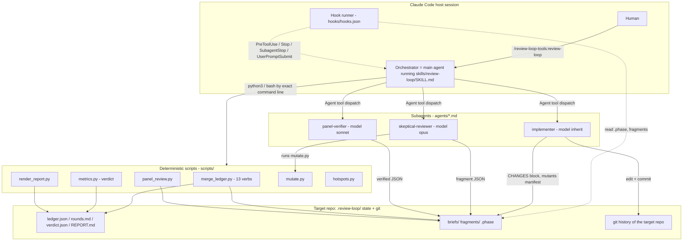
```mermaid
flowchart TB
    subgraph HOST["Claude Code host session"]
        USER["Human"]
        ORCH["Orchestrator = main agent running skills/review-loop/SKILL.md"]
        HOOKS["Hook runner - hooks/hooks.json"]
    end
    subgraph AGENTS["Subagents - agents/*.md"]
        IMPL["implementer - model inherit"]
        REV["skeptical-reviewer - model opus"]
        PV["panel-verifier - model sonnet"]
    end
    subgraph SCRIPTS["Deterministic scripts - scripts/"]
        ML["merge_ledger.py - 13 verbs"]
        MET["metrics.py - verdict"]
        RR["render_report.py"]
        PR["panel_review.py"]
        MU["mutate.py"]
        HS["hotspots.py"]
    end
    subgraph STATE["Target repo: .review-loop/ state + git"]
        LED["ledger.json / rounds.md / verdict.json / REPORT.md"]
        SCR["briefs/ fragments/ .phase"]
        GIT["git history of the target repo"]
    end
    USER -->|"/review-loop-tools:review-loop"| ORCH
    ORCH -->|"Agent tool dispatch"| IMPL
    ORCH -->|"Agent tool dispatch"| REV
    ORCH -->|"Agent tool dispatch"| PV
    ORCH -->|"python3 / bash by exact command line"| SCRIPTS
    HOOKS -.->|"PreToolUse / Stop / SubagentStop / UserPromptSubmit"| ORCH
    HOOKS -.->|"read .phase, fragments"| SCR
    IMPL -->|"edit + commit"| GIT
    IMPL -->|"CHANGES block, mutants manifest"| SCR
    REV -->|"fragment JSON"| SCR
    PV -->|"verified JSON"| SCR
    REV -->|"runs mutate.py"| MU
    ML --> LED
    ML --> SCR
    MET --> LED
    RR --> LED
    PR --> SCR
```

### 1.2 External dependencies touched by this plugin

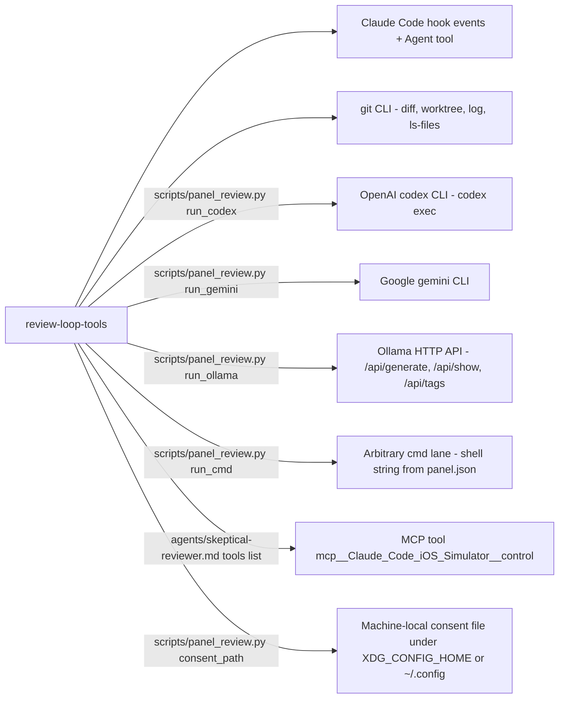
```mermaid
flowchart LR
    PLUG["review-loop-tools"]
    CC["Claude Code hook events + Agent tool"]
    GITX["git CLI - diff, worktree, log, ls-files"]
    CODEX["OpenAI codex CLI - codex exec"]
    GEM["Google gemini CLI"]
    OLL["Ollama HTTP API - /api/generate, /api/show, /api/tags"]
    CMD["Arbitrary cmd lane - shell string from panel.json"]
    SIM["MCP tool mcp__Claude_Code_iOS_Simulator__control"]
    CONS["Machine-local consent file under XDG_CONFIG_HOME or ~/.config"]
    PLUG --> CC
    PLUG --> GITX
    PLUG -->|"scripts/panel_review.py run_codex"| CODEX
    PLUG -->|"scripts/panel_review.py run_gemini"| GEM
    PLUG -->|"scripts/panel_review.py run_ollama"| OLL
    PLUG -->|"scripts/panel_review.py run_cmd"| CMD
    PLUG -->|"agents/skeptical-reviewer.md tools list"| SIM
    PLUG -->|"scripts/panel_review.py consent_path"| CONS
```

Sources: `scripts/panel_review.py` (`RUNNERS` map, `consent_path`),
`agents/skeptical-reviewer.md` frontmatter `tools:`, `scripts/mutate.py`
(`git worktree`), `scripts/hotspots.py` (`git log`), `scripts/hygiene_check.sh`
(`git ls-files`). `jq` is an optional dependency of `scripts/commit_guard.sh`
(see §7.3).

---

## 2. Hook wiring

`hooks/hooks.json` registers six hook commands; every one receives the loop
directory `.review-loop` as `$1` except `session_guard.sh`, which takes only
a threshold. All hooks read the host's JSON payload on stdin.

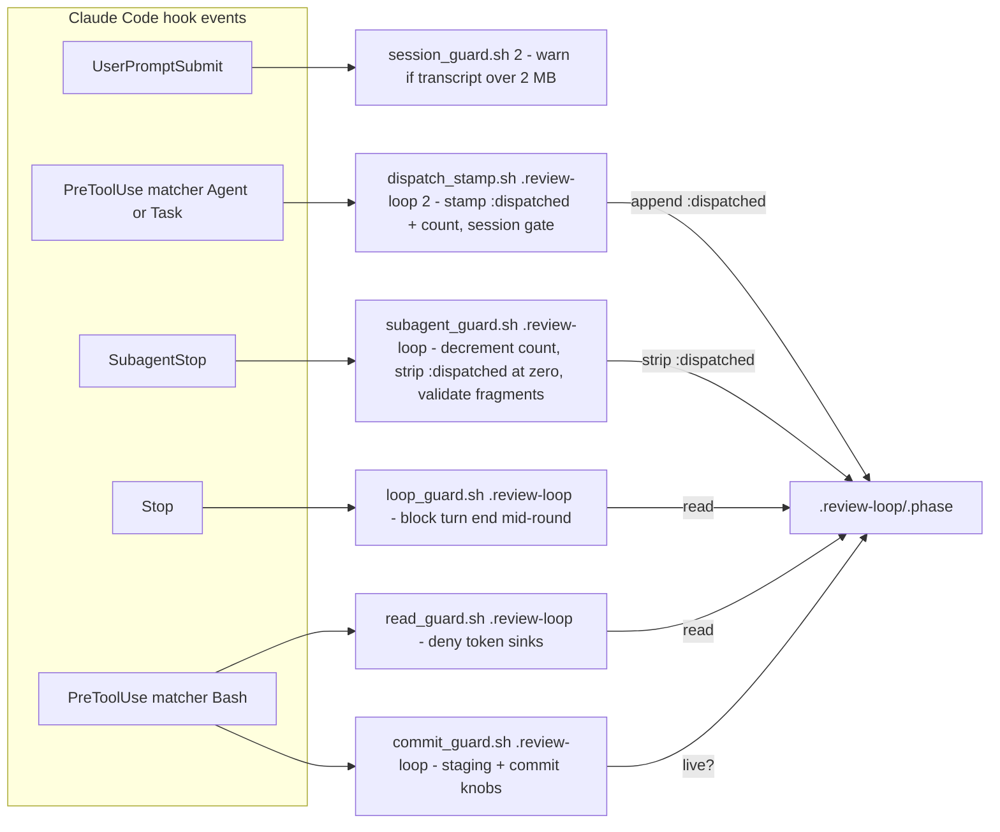
```mermaid
flowchart LR
    subgraph EVENTS["Claude Code hook events"]
        UPS["UserPromptSubmit"]
        PTB["PreToolUse matcher Bash"]
        PTA["PreToolUse matcher Agent or Task"]
        STOP["Stop"]
        SSTOP["SubagentStop"]
    end
    SG["session_guard.sh 2 - warn if transcript over 2 MB"]
    CG["commit_guard.sh .review-loop - staging + commit knobs"]
    RG["read_guard.sh .review-loop - deny token sinks"]
    DS["dispatch_stamp.sh .review-loop 2 - stamp :dispatched + count, session gate"]
    LG["loop_guard.sh .review-loop - block turn end mid-round"]
    SUB["subagent_guard.sh .review-loop - decrement count, strip :dispatched at zero, validate fragments"]
    PH[".review-loop/.phase"]
    UPS --> SG
    PTB --> CG
    PTB --> RG
    PTA --> DS
    STOP --> LG
    SSTOP --> SUB
    DS -->|"append :dispatched"| PH
    SUB -->|"strip :dispatched"| PH
    LG -->|"read"| PH
    RG -->|"read"| PH
    CG -->|"live?"| PH
```

Exit-code contract (verified in each script): exit `0` allows; exit `2`
blocks the action and the message on stderr is shown to the agent
(`dispatch_stamp.sh:55`, `loop_guard.sh:41`, `commit_guard.sh:38,42,46,50,66,73`,
`read_guard.sh:18` via `|| exit 2`, `subagent_guard.sh:54` via `|| exit 2`).
`session_guard.sh` and `hygiene_check.sh` always exit 0 (advisory).

---

## 3. Module inventory

Because this is a prompt-driven plugin, the `.md` prompt files are inventoried
as first-class modules alongside the scripts.

| Module | Kind | Lines | Primary path |
|---|---|---:|---|
| Plugin manifest | JSON | 15 | `.claude-plugin/plugin.json` |
| Orchestrator skill | prompt (control logic) | 478 | `skills/review-loop/SKILL.md` |
| Controls skill | prompt | 10 | `skills/controls/SKILL.md` |
| Operator reference | doc (shipped, read by controls skill) | 517 | `CONTROLS.md` |
| implementer | agent prompt | 121 | `agents/implementer.md` |
| skeptical-reviewer | agent prompt | 192 | `agents/skeptical-reviewer.md` |
| panel-verifier | agent prompt | 103 | `agents/panel-verifier.md` |
| Panel seat template | prompt template | 43 | `templates/panel-reviewer.md` |
| Hook wiring | JSON | 58 | `hooks/hooks.json` |
| session_guard | hook script | 39 | `scripts/session_guard.sh` |
| dispatch_stamp | hook script | 63 | `scripts/dispatch_stamp.sh` |
| loop_guard | hook script | 46 | `scripts/loop_guard.sh` |
| subagent_guard | hook script | 132 | `scripts/subagent_guard.sh` |
| read_guard | hook script | 87 | `scripts/read_guard.sh` |
| commit_guard | hook script | 76 | `scripts/commit_guard.sh` |
| hygiene_check | advisory script | 83 | `scripts/hygiene_check.sh` |
| merge_ledger | state-mutation CLI | 831 | `scripts/merge_ledger.py` |
| metrics | verdict computation | 231 | `scripts/metrics.py` |
| render_report | report generator | 398 | `scripts/render_report.py` |
| hotspots | churn map | 67 | `scripts/hotspots.py` |
| mutate | mutation runner | 215 | `scripts/mutate.py` |
| panel_review | multi-provider lanes | 1131 | `scripts/panel_review.py` |
| panel_selftest | test | 1255 | `tests/panel_selftest.py` |
| hooks_selftest | test (new in 0.14.0) | 143 | `tests/hooks_selftest.py` |
| README | doc | 158 | `README.md` |

### 3.1 Plugin manifest — `.claude-plugin/plugin.json`

Name, version `0.14.0`, description, author, keywords, license. No
`hooks`/`agents`/`skills` keys: the host discovers `hooks/hooks.json`,
`agents/*.md`, and `skills/*/SKILL.md` by directory convention. The marketplace
entry lives at the repo root (`.claude-plugin/marketplace.json`, name
`quiller`) and carries no version — `HANDOFF.md` §2.1 makes bumping this file
mandatory on every user-visible change because the plugin cache is keyed by it.

### 3.2 Orchestrator skill — `skills/review-loop/SKILL.md`

**Purpose.** The loop's control program. The main agent reads it when the
user invokes `/review-loop-tools:review-loop` and follows it turn by turn.

**Interface (what it consumes/produces).** User arguments (max rounds, a
scope range, a token budget, "a panel"); it produces subagent dispatches and
exact script invocations. It owns the `.phase` marker and the WATCH LIST
section of the final report.

**Structure (section headings in the file):** Hard rules; Setup (steps 0, 1,
2, 2b PANEL, 3 seed); Each round (three plumbing turns); Panel final pass;
Closeout; Waiting, failures, and pauses; Stop conditions; Final report;
Contracts (canonical fields and verbs).

**Key rules it encodes (each verified in the file):**

- Orchestrator never edits source, never hand-edits ledger findings, never
  overrides a pinned model, stages loop files by explicit path only.
- The reviewer receives a **sha range and materialized diff paths**, never a
  summary; the implementer's CHANGES block travels "clearly labeled as the
  implementer's unverified claims".
- `.review-loop/fragments/` is exclusively for subagent-written files;
  orchestrator-composed material goes to `.review-loop/briefs/`.
- Phase marker protocol: `seed-review`, `round-<N>-implementing`,
  `round-<N>-review`, `awaiting-human`, `done`, with suffixes `:dispatched`
  and `:waiting:<reason>`. Since 0.14.0 the hooks count live dispatches in
  `briefs/.dispatched`, so two agents may run at once (`SKILL.md` lines
  29-38).
- Seed is merged as **round 0**; scope mode defaults `max_rounds` to 2 with
  automatic escalation to 5 on an open blocker (enforced in
  `merge_ledger.py` main, lines 818-824).
- Implementers never edit `BACKLOG.md`; punts go to `briefs/*-punts.md` and
  the orchestrator copies sketches at record time (lines 46-50).
- The `.gitignore` allowlist template (stamped `v0.12.0` — see §7.4).
- Panel runs are detached and waited on (`run … --detach` then `wait`), and
  the probe's `gate_issues` list is the go/no-go for a panel (lines 121-162,
  192-218, 271-301).
- Transport failure policy: retry the same dispatch up to 3 times with
  in-turn `sleep 60/180/300`; `.partial` files carry resumable work.

**Dependencies.** Every script in `scripts/`, the three agents, the hooks
(it explains the `:dispatched` stamp and Stop-hook behaviour to itself).

**Pattern.** A hand-written state machine in prose, with the invariant that
every state transition is either a script verb or a `.phase` write.

### 3.3 Controls skill and reference — `skills/controls/SKILL.md`, `CONTROLS.md`

The `controls` skill is ten lines: read `${CLAUDE_PLUGIN_ROOT}/CONTROLS.md`
and answer from it. `CONTROLS.md` is the operator reference for **both** loop
plugins (tags `[qa]`, `[review]`, `[both]`). It is byte-identical to the
repo-root `CONTROLS.md` and to `qa-loop-tools/CONTROLS.md` (verified with
`diff -q`); `tests/panel_selftest.py` line ~1240 enforces that identity, and
`HANDOFF.md` §2.3 names the root copy canonical.

### 3.4 `agents/implementer.md`

- **Frontmatter:** `tools: Read, Edit, Write, Bash`, `model: inherit`.
- **Contract in:** the open-findings brief (`briefs/round-N-brief.json`) plus
  the reviewer's latest summary; optionally a simulator udid.
- **Contract out:** a fenced `json CHANGES` block with `commit_sha`,
  `actions[]` (`fixed|partial|wontfix` with rationale and files),
  `disputes[]`, `mutations` (manifest path or null), `verify_cmd`,
  `touched_files[]`; and a git commit titled `review-loop round <N>: …`.
- **Rules:** fix/partial/wontfix with a concrete technical reason; scoped
  test runs with filtered output; new tests verified by class name; a
  mutation manifest at `.review-loop/briefs/round-<N>-mutants.json` that the
  implementer must self-run with `mutate.py` before returning — **committing
  first** (the runner refuses a dirty tree), including **one control
  mutant**, optionally a per-mutant `test_cmd`, and mutating call sites not
  only bodies (lines 69-87); never edits `BACKLOG.md` — punts go to
  `briefs/round-<N>-punts.md` / `briefs/closeout-punts.md` (lines 88-93);
  stage by explicit path; never background long commands (a return without
  a CHANGES block is read as a pause).

### 3.5 `agents/skeptical-reviewer.md`

- **Frontmatter:** `tools: Read, Grep, Glob, Bash, mcp__Claude_Code_iOS_Simulator__control`, `model: opus`.
- **Contract in:** ledger path, `briefs/round-N.stat` and `.diff` paths, the
  CHANGES block (claims to validate) including `verify_cmd`, the mutation
  manifest path plus the path to `mutate.py`, a fragment output path,
  optionally a hotspot table (cold seed) or a verified panel file.
- **Contract out:** a LEDGER fragment `{"findings":[…]}` written
  incrementally to `<fragment>.partial` then `mv`'d; a 2-3 line prose
  summary; **never** the JSON pasted into the response.
- **Status vocabulary:** `fixed | partial | open | wontfix | disputed`; on a
  rejected fix append `{"round", "reason"}` to the finding's `rejections`.
- **Finding ID convention:** `<area>/<file>:<slug>`.
- **Discipline sections:** reading windows of ≤120 lines, diff-first,
  scoped tests, collateral-damage sweep over `touched_files`, simulator
  discipline (one named udid only), mutation re-run with the
  `errors > 0 ⇒ unverified` rule and the `baseline_red` rule; the reviewer
  writes **one or two call-site mutants of its own** (lines 108-119); panel
  findings are folded in with `source`/`sources` kept, a restatement of an
  existing finding keeps the reviewer's ID, and the verifier's
  `notes_for_chair` are read as leads (lines 120-125).

### 3.6 `agents/panel-verifier.md`

- **Frontmatter:** `tools: Read, Grep, Glob, Bash`, `model: sonnet`.
- **Contract in:** `fragments/panel/round-<N>-<lane>.candidates.json` paths,
  the round `.stat`/`.diff` paths, repo root, an output path
  `fragments/panel/round-<N>-panel.verified.json`; on the final pass also
  the open-findings and wontfix extracts (lines 46-52).
- **Contract out:** `{"verified_findings":[…], "notes_for_chair":[…], "lane_tallies":{lane:{filed,confirmed,demoted,duplicate,rejected}}}`.
  Each verified finding carries `source` (single kept lane), `sources`
  (all lanes that filed it — cross-lane dedupe) and `duplicate_of` (a ledger
  id, or null). Duplicates stay in `verified_findings` but tally only under
  `duplicate`; "kept" = confirmed + demoted. Rejected candidates appear only
  as counts. The verifier reads the stat's EXCLUDED trailer before judging
  any "X was not updated" claim (lines 53-56). Adds no findings of its own;
  observations go to `notes_for_chair`.

### 3.7 `templates/panel-reviewer.md`

The stance prompt fed to every external lane by `panel_review.py
build_prompt()`. Diff-only ("You see ONLY the diff stat and the diff"), at
most 10 findings, JSON-only response with `claim`, `evidence[]`, `severity`,
`confidence` (0-1), `area`.

### 3.8 Hook scripts — `scripts/*_guard.sh`, `scripts/dispatch_stamp.sh`

| Script | Trigger | Reads | Blocks when | Side effects |
|---|---|---|---|---|
| `session_guard.sh [thr] [dirs…]` | UserPromptSubmit | `prompt`, `transcript_path`, `briefs/.session-ok` | never (prints a warning if prompt matches `review[- ]loop\|qa[- ]loop` and transcript > thr MB); **prints nothing once `briefs/.session-ok` exists** (lines 15-17) | none |
| `dispatch_stamp.sh <dir> [thr]` | PreToolUse Agent/Task | `.phase`, `transcript_path`, `briefs/.dispatched` | phase is `round*`/`seed*` without suffix, no `briefs/.session-ok`, transcript > thr MB | creates `briefs/.session-ok`; rewrites `.phase` as `<phase>:dispatched` and writes count `1` to `briefs/.dispatched`; if already `:dispatched`, **increments the count** under `flock` (lines 25-38, 60-62) |
| `loop_guard.sh [dirs…]` | Stop | `stop_hook_active`, `.phase` | phase is `round*`/`seed*` and has neither `:dispatched` nor `:waiting:` | none |
| `subagent_guard.sh [dirs…]` | SubagentStop | `.phase`, `briefs/.dispatched`, `fragments/*.json`, `ledger.json` ids | phase matches `*review*`/`*testing*` and a flat fragment matching `(seed\|round-…)\.json` is invalid and older than 10 s | **decrements the count; strips `:dispatched` only at zero** (a missing count file counts as one live dispatch, lines 23-42; macOS `sed -i ''` with GNU fallback) |
| `read_guard.sh [dirs…]` | PreToolUse Bash | `.phase`, `tool_input.command`, `briefs/round-N.diff` | unfiltered `cat` of >200-line file, `head -n >200`, `sed -n A,Bp` window >200, unfiltered `xcodebuild … test`/`swift test`, unfiltered whole-range `git diff/show` while `briefs/round-N.diff` exists — **after stripping heredoc bodies and single-quoted strings, and only at command positions** (`strip_data`, `CMD_START`, lines 37-47) | none |
| `commit_guard.sh [dir]` | PreToolUse Bash | `tool_input.command` via `jq`, `.phase` content, env knobs | `git add -A/--all`, `-f/--force`, `git add .`, directory-add of the loop dir — **only while `.phase` is `round*`/`seed*`/`awaiting-human*`; `done` arms nothing** (lines 26-31); on `git commit`: staged lines > `REVIEW_LOOP_MAX_DIFF`, or `REVIEW_LOOP_TEST_CMD` fails | runs the test command as a side effect |

Defaults: `loop_guard.sh`, `subagent_guard.sh`, `read_guard.sh` and
`session_guard.sh` guard **both** `.review-loop` and `.qa-loop` when invoked
without directory arguments (`dirs=(.review-loop .qa-loop)`); `hooks.json`
passes one directory to the first three and none to `session_guard.sh`.

Validation rules in `subagent_guard.sh` lines 89-119: every finding needs `id`
and `current_status`; a finding whose id is not already in `ledger.json`
additionally needs `severity`, `claim`, and — if present — `evidence` that is
either a non-empty list of strings or an object with non-empty
`screenshots`/`repro`/`measurements`; `status_history[].round` must be an
integer. The regex deliberately matches only the flat `fragments/` directory,
so `fragments/panel/*` and `*.partial` files are never policed.

### 3.9 `scripts/hygiene_check.sh <loop-dir>`

Advisory git-hygiene report, always exit 0, four checks: tracked scratch
paths (`evidence|fragments|briefs|scratch|__pycache__`, `.phase`, `*.pyc`),
Finder/iCloud duplicate names (`X 2.json`) in the index or on disk, tracked
files >256 KB, and a missing or denylist-style `.gitignore` (first rule must be
`*`). Invoked at Setup, before the report, and internally by
`merge_ledger.py archive` before/after the move to detect sync-conflict
duplicates.

### 3.10 `scripts/merge_ledger.py` — the only sanctioned ledger mutator

Dispatch is by first argument (`main()`, lines 753-761); anything not a verb
name is the positional **merge** form.

| Verb | Signature | What it does (verified) |
|---|---|---|
| merge (default) | `<ledger> <fragment> <round> [--no-escalate]` | For each fragment finding: existing id → overwrite scalars except `status_history`, `first_seen_round`, `evidence`, `severity_history`, `rejections`; union `rejections`; record severity change in `severity_history`; `evidence` through `union_evidence()`; append `{round,status}` to `status_history`; set `current_status`. New id → `first_seen_round` defaults to round, `status_history` seeded. Sets `ledger.round`. If `scope` set, `max_rounds == 2`, and any open/partial blocker → `max_rounds = 5` and reports `escalated_max_rounds` (unless `--no-escalate`). |
| `resolve` | `<ledger> <id> <status> <round> [note]` | Human/orchestrator decision: appends to `status_history`, sets `current_status`, prepends `RESOLVED (round N):` to `note`. |
| `set-round` | `<ledger> <N> [sha]` | Sets `round`; with sha sets `round_start_sha` (or `build_sha` if that key exists and `round_start_sha` doesn't) and `round_shas[N]`. |
| `consulted` | `<ledger> <N>` | Sets `thrashing_consulted = N`; metrics then makes the next thrashing signal hard. |
| `open` | `<ledger> [auto\|proposal\|all\|closeout\|wontfix] [--region X…] [--severity S]` | Prints open/partial findings minus `status_history`. `closeout` = auto-routed AND (`introduced_by_fix` OR minor). **`wontfix` (0.14.0)** prints the accepted-disagreement set for the final-pass verifier's dedupe (lines 165-171). `--severity` floor is bypassed by `fix_risk` findings. Region matching is boundary-safe (`WF-1` ≠ `WF-10`). |
| `archive` | `<loop-dir> [name]` | Per-file `os.replace` move of `ledger.json, rounds.md, REPORT.md, coverage.json, verdict.json, fragments/, briefs/, .phase` and `evidence/round-*` into `archive/<name>/`; unknown top-level files go to `archive/<name>/legacy/`; `KEEP` set survives (incl. `panel.json`, `panel-consent.json`, `BACKLOG.md`). Default name = timestamp + scope-start sha (or `round_start_sha`). Runs `hygiene_check.sh` before and after; **0.14.0: sleeps `REVIEW_LOOP_ARCHIVE_SETTLE_S` (default 3 s) and re-checks**, reporting `duplicates_detected_late` (lines 642-668); any new "duplicate name" line → exit 1. |
| `scope` | `<ledger> <a..b> [pathspecs]` | Stores the range plus pathspecs in `ledger.scope`, parsed by **`split_range`** (lines 202-212), the one parser shared with `diff`. |
| `set-usage` / `add-usage` | `<ledger> <N> <role> <tokens>` | Replace / accumulate `usage[N][role]`. |
| `diff` | `<loop-dir> <N\|final\|label> <range> [pathspecs]` | Writes `briefs/round-<N>.diff`, `.stat` and **`.files`** (the unfiltered changed-file list) via `git diff`, always appending `:(exclude)<loop-dir-basename>`; the `.stat` gets an **`EXCLUDED (changed in range; not shown in this view)` trailer** for paths hidden by pathspecs; on any git failure all three files are removed before exit 1 (lines 365-423). |
| `next-round` | `<loop-dir> <N> [--fragment F] [--usage role=tokens…] [--sha S] [--pass …] [--phase-next NAME] [--brief-severity major\|minor]` | **Records `round_end_shas[N] = HEAD` first** (lines 452-466); applies usages; if `--fragment`: re-invokes itself in merge mode, runs `metrics.py` (or `qa_metrics.py` when `is_qa`), and stops if `decision != continue` (recording the unattended default line in `rounds.md` when `REVIEW_LOOP_UNATTENDED` is set and the decision is `thrashing_soft`). Otherwise: `set-round N+1 <HEAD>`, writes `briefs/round-<N+1>-brief.json` from `open auto --severity major`, writes `.phase = round-<N+1>-implementing`. |
| `panel-tally` | `<ledger> <N\|final> <verified.json> [--replace]` | Validates `lane_tallies` shape (dict of dict of non-bool ints) before writing; **merges per lane into `ledger.panel[key]`** (a two-batch round keeps both), `--replace` restores whole-round replacement; prints per lane `filed`, `kept = confirmed + demoted`, and `duplicate` (lines 670-731). |
| `notes-rotate` | `<loop-dir> [--round N]` | Rotates `HARNESS_NOTES.md` — a qa-loop artifact; see §7.5. |

**Pattern.** A single-file CLI with verb functions and a self-recursive
`next-round` (it shells out to its own file for the merge and to `metrics.py`
for the verdict, `next_round()` lines 474-483). Output is one JSON line on
stdout so the orchestrator's context takes only the summary.

### 3.11 `scripts/metrics.py <ledger> <N>`

Computes the verdict for round N purely from `status_history`
(`status_at(f, r)` = last status entry with `round <= r`, or
`current_status`). Signals: `closed/new/reopened/net`, open counts by
severity, `new_blocker_major`, `reopen_count` (only `fixed→open` counts),
region churn over three rounds, disputed-set equality, promotions from
`severity_history`, token usage vs `token_budget`, and the
`converging_series()` exemption (all open findings `introduced_by_fix`, worst
open severity non-increasing over the last 2-3 rounds, no reopens). Decision
precedence is fixed in code (lines 171-196) — see the flowchart in §6.
Side effects: idempotently replaces round N's row in `rounds.md`, writes
`verdict.json`, prints the verdict JSON. Unchanged in 0.14.0.

### 3.12 `scripts/render_report.py <loop-dir> [--out P] [--stop-note "…"]`

Renders every mechanical section of `REPORT.md` from `ledger.json`,
`rounds.md`, `verdict.json`, optional `coverage.json`, and
`fragments/round-*-closeout.json`: headline (with the
`converged-in-closeout` relabel when a `thrashing_soft`/`backstop` stop ended
with a closeout and 0 open blockers/majors), token table, Panel table from
`ledger.panel` (**with a `Duplicate` column** since 0.14.0, line 137), open
findings by severity, disputed, UX proposals (qa), rejections, severity
changes, persona matrix / coverage gaps (qa), closeout (**with an optional
`suites` table** read from the closeout fragments, lines 253-278), wontfix,
and WATCH LIST candidate stubs. The WATCH LIST always lists the seed scope
diff first, then each round's diff ending at **`round_end_shas[N]`** (falling
back to the next round's start sha, lines 358-378), and — when a closeout
ran — **the closeout diff as its own candidate** (lines 379-386).

### 3.13 `scripts/hotspots.py [root] [--since 6.months] [--top 30]`

`git log --since --format=%ct --name-only`, filtered to source extensions,
scored `commits × (1 + log1p(size_kb)) / (1 + days/90)`. Prints a markdown
table on stdout and `{"hotspots": […]}` on stderr. Used only for the cold
(no scope, no `REVIEW.md`) seed.

### 3.14 `scripts/mutate.py <manifest.json> [--repo root] [--allow-dirty]`

Validates the manifest up front (each mutant needs `file`, `original`, a
string `replacement` — `""` means delete the line — `expect` in
`killed|survived`, no multi-line `original` with `line`, and a non-empty
string `test_cmd` per mutant or inherited, lines 92-117). Then, new in
0.14.0: **refuses uncommitted changes to the manifest's files** unless
`--allow-dirty` (lines 118-126); creates a detached `git worktree` of HEAD in
a temp dir; **runs every distinct `test_cmd` once unmutated and exits 2 with
`baseline_red` if any is not green** (lines 144-166). For each mutant: apply
by text substitution (exactly one match unless `line` given), run `set -o
pipefail; <test_cmd>` (the mutant's own `test_cmd` if it has one) under
`/bin/bash` with `PYTHONDONTWRITEBYTECODE=1`, classify `killed` (non-zero
exit or timeout) / `survived`, restore the file. Worktree is removed in
`finally`. Prints `{killed, survived, errors, mismatches, results[]}`; exit 1
on any mismatch or error, with a loud stderr banner when `errors > 0`.

### 3.15 `scripts/panel_review.py` — the multi-provider panel

Four verbs (`main()`, line 1121): `probe [<panel.json>] [--smoke]`,
`run <loop-dir> <round> [--lanes a,b] [--force] [--detach]`,
`wait <loop-dir> <round> [--timeout s]`, `consent-path [<loop-dir>]`.

- **Config:** `<loop-dir>/panel.json` `{lanes:[{name,type,model,timeout_s,max_diff_tokens,enabled,num_ctx_max,cmd,precision_override}], rounds}`; git-tracked by the allowlist. `model` may be a **list tried in order** on `quota`/`model-unavailable` errors (`run_lane`, lines 902-931); the result records `model_used`.
- **Consent:** machine-local JSON at
  `<XDG_CONFIG_HOME|~/.config>/review-loop-tools/consent/<sha256(realpath(loop))>.json`
  with `remote_lanes_approved` (must be JSON `true`) and `cmd_lanes_approved`
  (list of exact command strings or sha256 digests). `consent_path()` rejects a
  relative `XDG_CONFIG_HOME`, one that resolves inside the reviewed repo, and
  returns `None` (fail closed) when even `~/.config` resolves inside the repo.
  An in-repo `panel-consent.json` is ignored with a stderr hint.
- **`probe` (lines 346-469):** per-lane installed/auth/smoke/endpoint as
  before; since 0.14.0 it **loads consent and reports `gate_issues`** (missing
  consent, unapproved cmd, `disabled-by-precision`, failed smoke, not
  installed) with a stderr `GATE` line each, and **smokes the local lane** too.
- **Gating in `run_lane()` (lines 842-897):** existing candidates → status
  `cached` unless `--force`; `disabled-by-precision` when the lane filed
  ≥5 with 0 kept in every pass of the two most recent archived loops
  (`precision_disabled`, lines 609-627) unless `precision_override`;
  `codex`/`gemini` need remote consent; `ollama` needs it only when
  `OLLAMA_HOST` is not loopback (`is_loopback` is exact host/IP, not prefix);
  `cmd` needs the exact string approved; `enabled:false` skips; unknown type
  skips.
- **Prompt:** `templates/panel-reviewer.md` + `## DIFF STAT` + `## DIFF`,
  each in a fence longer than any backtick run in the payload; diff truncated
  at `max_diff_tokens × 4` chars on a `diff --git` boundary with an explicit
  note.
- **Runners:** `run_codex` (`codex exec --sandbox read-only
  --skip-git-repo-check --output-last-message <abs file> [-m model] -`, in an
  empty temp cwd with `CLAUDE*`/`DYLD_*`/`NODE_OPTIONS`-class env stripped and
  `PWD/OLDPWD` pointed at the jail); `run_gemini` (`gemini [-m model]` with
  `GEMINI_CLI_TRUST_WORKSPACE=true`, same jail); `run_ollama` (POST
  `/api/generate` with `format: json` and `num_ctx` sized from the prompt,
  refused when above `num_ctx_max` or the model's trained context from
  `/api/show`, re-checked against `prompt_eval_count`, proxies bypassed for
  loopback); `run_cmd` (`shell=True` in its own session, process group killed
  on timeout).
- **Output:** `fragments/panel/round-<N>-<safe lane name>.candidates.json`
  (top 10 by confidence after `sanitize()`, severity clamped to `minor` when
  out of vocabulary; **candidates whose evidence names no file in
  `briefs/round-N.files` are dropped** and counted as `dropped_no_evidence`,
  lines 527-585; **a lane that kept 0 of ≥5 at seed is capped at 3 on the
  final pass**, lines 897-901) and `.raw.txt`. Lanes run in a
  `ThreadPoolExecutor`; every failure is soft. Each result carries
  `elapsed_s`, passive `tokens` when the CLI printed usage, and on failure an
  `error_kind` from `ERROR_KINDS` (`quota`, `model-unavailable`, `auth`,
  `launch`, `other`, plus `timeout`/`no-json`, lines 112-135) with a stderr
  banner per failed or skipped lane; the summary counts `failed` and
  `skipped` and is written atomically to `fragments/panel/round-<N>.run.json`.
- **`run` preconditions (lines 1022-1039):** the `.stat`/`.diff` must exist
  and the diff must not be empty (exit 2 with a re-run hint).
- **`--detach` / `wait`:** `--detach` re-execs the run in a new session with
  stdout/stderr to `round-<N>.run.log` and prints the pid and the `wait`
  command; `wait` polls for the summary every 2 s up to 540 s (exit 3 on
  timeout so the orchestrator simply calls it again), lines 984-999,
  1090-1119.

### 3.16 `tests/panel_selftest.py`

A single-process, hermetic self-test (temp dir, `XDG_CONFIG_HOME` pointed at
a sibling temp dir) with ~143 `ok(...)` checks covering the panel's consent
gates, jail, sanitization, tally validation, report tolerance, the
subagent guard's flat-vs-subdir behaviour, the codex lane end-to-end through a
stub `codex` on PATH, and the byte-identity of the three `CONTROLS.md`
copies. Invoked directly (`python3 tests/panel_selftest.py`); it is also the
`test_cmd` used by this repo's own `.review-loop/briefs/round-*-mutants.json`
manifests when the plugin was reviewed by its own loop.

### 3.17 `tests/hooks_selftest.py` (new in 0.14.0)

Runs the **real hook scripts** against a temp loop directory with fake hook
payloads on stdin (`hook()` helper, lines 33-36) and checks the four
0.14.0 hook fixes: the live-dispatch count (two stamps need two SubagentStops
before `:dispatched` is stripped; a missing count file strips on the first
return; the count never goes negative; `:waiting:` phases are untouched,
lines 55-85), `read_guard` command-position matching (heredoc and
single-quoted `xcodebuild test` strings are allowed, an unfiltered run after
`&&`/`;` is still denied, lines 89-108), `commit_guard` arming only on
`round*`/`seed*`/`awaiting-human` (`git add -A` passes at `done`, lines
111-123), and `session_guard` standing down once `briefs/.session-ok` exists
(lines 127-136). Invoked directly (`python3 tests/hooks_selftest.py`);
`HANDOFF.md` §2 lists it beside `panel_selftest.py`.

---

## 4. Data model — the `.review-loop/` state directory

All persistent state is JSON/markdown on disk in the target repo. The
allowlist in `SKILL.md` Setup step 2 decides what git tracks.

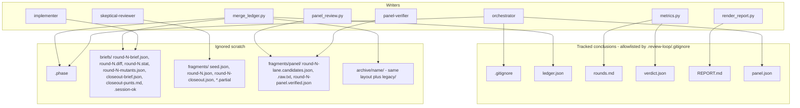
```mermaid
flowchart TB
    subgraph TRACKED["Tracked conclusions - allowlisted by .review-loop/.gitignore"]
        GI[".gitignore"]
        LJ["ledger.json"]
        RM["rounds.md"]
        VJ["verdict.json"]
        RP["REPORT.md"]
        PJ["panel.json"]
    end
    subgraph SCRATCH["Ignored scratch"]
        PH[".phase"]
        BR["briefs/ round-N-brief.json, round-N.diff, round-N.stat, round-N-mutants.json, closeout-brief.json, closeout-punts.md, .session-ok"]
        FR["fragments/ seed.json, round-N.json, round-N-closeout.json, *.partial"]
        FP["fragments/panel/ round-N-lane.candidates.json, .raw.txt, round-N-panel.verified.json"]
        AR["archive/name/ - same layout plus legacy/"]
    end
    subgraph WRITERS["Writers"]
        ML["merge_ledger.py"]
        MET["metrics.py"]
        RR["render_report.py"]
        PR["panel_review.py"]
        REV["skeptical-reviewer"]
        PV["panel-verifier"]
        IMPL["implementer"]
        ORCH["orchestrator"]
    end
    ML --> LJ
    ML --> BR
    ML --> PH
    ML --> AR
    MET --> RM
    MET --> VJ
    RR --> RP
    PR --> FP
    PV --> FP
    REV --> FR
    IMPL --> BR
    ORCH --> PH
    ORCH --> GI
    ORCH --> PJ
```

`archive/<name>/` in the real run at the repo root contains `briefs/`,
`fragments/`, `ledger.json`, `legacy/`, `REPORT.md`, `rounds.md`,
`verdict.json` — matching `merge_ledger.py archive`'s move list. Note the
allowlist re-includes `ledger.json` etc. **at any depth** (`!ledger.json` with
`!*/`), so archived conclusions stay tracked while archived `fragments/`
do not.

### 4.1 Entity model of `ledger.json`

Fields verified against `merge_ledger.py`, `metrics.py`, `render_report.py`,
the agent schemas, and the live ledger (27 findings; key frequency counted).
`round_end_shas` and `LANE_TALLY.duplicate` were added in 0.14.0.

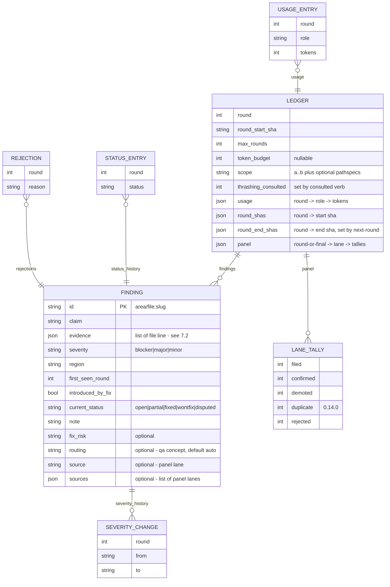
```mermaid
erDiagram
    LEDGER {
        int round
        string round_start_sha
        int max_rounds
        int token_budget "nullable"
        string scope "a..b plus optional pathspecs"
        int thrashing_consulted "set by consulted verb"
        json usage "round -> role -> tokens"
        json round_shas "round -> start sha"
        json round_end_shas "round -> end sha, set by next-round"
        json panel "round-or-final -> lane -> tallies"
    }
    FINDING {
        string id PK "area/file:slug"
        string claim
        json evidence "list of file:line - see 7.2"
        string severity "blocker|major|minor"
        string region
        int first_seen_round
        bool introduced_by_fix
        string current_status "open|partial|fixed|wontfix|disputed"
        string note
        string fix_risk "optional"
        string routing "optional - qa concept, default auto"
        string source "optional - panel lane"
        json sources "optional - list of panel lanes"
    }
    STATUS_ENTRY {
        int round
        string status
    }
    SEVERITY_CHANGE {
        int round
        string from
        string to
    }
    REJECTION {
        int round
        string reason
    }
    LANE_TALLY {
        int filed
        int confirmed
        int demoted
        int duplicate "0.14.0"
        int rejected
    }
    USAGE_ENTRY {
        int round
        string role
        int tokens
    }
    LEDGER ||--o{ FINDING : findings
    STATUS_ENTRY }o--|| FINDING : status_history
    FINDING ||--o{ SEVERITY_CHANGE : severity_history
    REJECTION }o--|| FINDING : rejections
    LEDGER ||--o{ LANE_TALLY : panel
    USAGE_ENTRY }o--|| LEDGER : usage
```

Companion file shapes (verified in the live run and the scripts that write
them):

- `briefs/round-N-brief.json` — `{"findings":[…]}` = `open auto --severity major` output (finding minus `status_history`).
- `briefs/round-N-mutants.json` — `{"test_cmd", "timeout"?, "mutants":[{id,file,original,replacement,line?,test_cmd?,expect}]}` (`mutate.py` docstring).
- `briefs/round-N.files` — one changed path per line; hidden-by-pathspec paths carry a tab-separated marker (`merge_ledger.py write_diff`, 0.14.0).
- `briefs/final-open.json`, `briefs/final-wontfix.json` — `open all` / `open wontfix` extracts handed to the final-pass verifier (`SKILL.md` lines 287-289).
- `briefs/.dispatched` — the live-dispatch count (an integer line), `briefs/.session-ok` — the session-size go-ahead marker (both hook-written).
- `fragments/round-N.json` — `{"findings":[…]}` with the same finding fields; `first_seen_round`/`status_history` optional on new findings.
- `fragments/panel/round-N-<lane>.candidates.json` — `{"lane","filed","overflow_dropped","dropped_no_evidence"?,"diff_truncated"?,"cap"?,"cap_reason"?,"findings":[{claim,evidence,severity,confidence,area}]}` (`panel_review.py sanitize()` / `run_lane()`).
- `fragments/panel/round-N.run.json` — the lane run summary `{"round","lanes":[…],"failed","skipped","candidates_files"}` written atomically by `run` and read by `wait` (0.14.0).
- `fragments/panel/round-N-panel.verified.json` — `{"verified_findings":[…], "notes_for_chair":[…], "lane_tallies":{…}}` (`agents/panel-verifier.md`).
- `rounds.md` — one markdown table row per round: Round, Blockers, Majors, Minors, Closed, New, Reopened, Promoted, Net, Tokens, Decision (`metrics.py` line 207); plus an optional `> round N: REVIEW_LOOP_UNATTENDED set …` quote line (`merge_ledger.py next_round`).
- `verdict.json` — the last `metrics.py` verdict object.
- `panel.json` — `{"lanes":[…], "rounds":"seed+final"}`.

---

## 5. Sequence diagrams

Each diagram covers one scenario and only steps verified in `SKILL.md`, the
agent prompts, `hooks.json`, or the scripts. Participants are roles:
"Orchestrator" is the main agent executing `SKILL.md`; "Hooks" is the Claude
Code hook runner executing the six scripts in `hooks/hooks.json`; "Ledger
scripts" covers `merge_ledger.py`, `hygiene_check.sh` and `render_report.py`;
"Verdict engine" is `metrics.py`; "Panel runner" is `panel_review.py`;
"Mutation runner" is `mutate.py`; "Loop state (disk)" is `.review-loop/`.
Exact commands, flags and file names are in §3 and in the "Sources" line
under each diagram.

### 5.1 Session gate and loop startup (Setup steps 0-2)

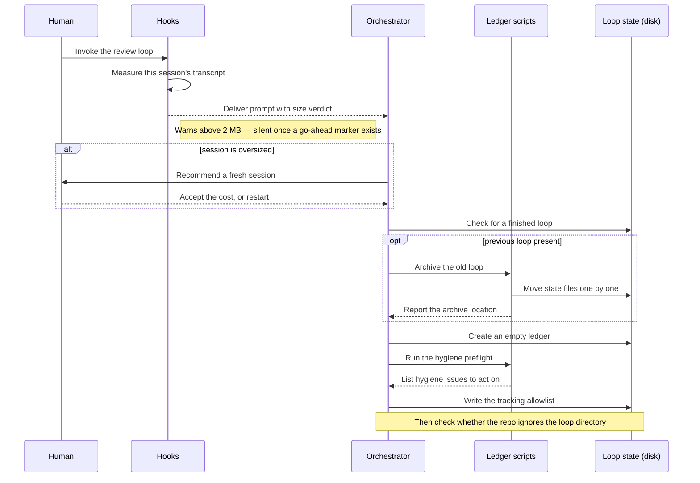
```mermaid
sequenceDiagram
    participant H as Human
    participant K as Hooks
    participant O as Orchestrator
    participant L as Ledger scripts
    participant S as Loop state (disk)

    H->>K: Invoke the review loop
    K->>K: Measure this session's transcript
    K-->>O: Deliver prompt with size verdict
    Note right of K: Warns above 2 MB — silent once a go-ahead marker exists
    alt session is oversized
        O->>H: Recommend a fresh session
        H-->>O: Accept the cost, or restart
    end
    O->>S: Check for a finished loop
    opt previous loop present
        O->>L: Archive the old loop
        L->>S: Move state files one by one
        L-->>O: Report the archive location
    end
    O->>S: Create an empty ledger
    O->>L: Run the hygiene preflight
    L-->>O: List hygiene issues to act on
    O->>S: Write the tracking allowlist
    Note over O,S: Then check whether the repo ignores the loop directory
```

Sources: `hooks/hooks.json` UserPromptSubmit; `scripts/session_guard.sh`
lines 15-17 (stand-down) and 26-37 (warning); `SKILL.md` Setup 0-2 (lines
59-120); `merge_ledger.py archive()` lines 531-668; `scripts/hygiene_check.sh`.
Scope mode sets `max_rounds` to 2 instead of 5 (`SKILL.md` lines 82-87).

### 5.2 Seeding as round 0 (three modes) and the first dispatch gate

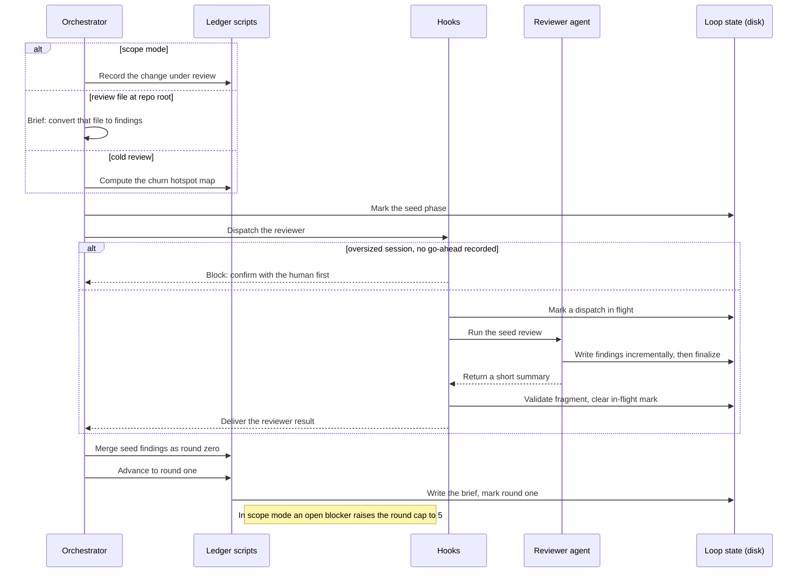
```mermaid
sequenceDiagram
    participant O as Orchestrator
    participant L as Ledger scripts
    participant K as Hooks
    participant R as Reviewer agent
    participant S as Loop state (disk)

    alt scope mode
        O->>L: Record the change under review
    else review file at repo root
        O->>O: Brief: convert that file to findings
    else cold review
        O->>L: Compute the churn hotspot map
    end
    O->>S: Mark the seed phase
    O->>K: Dispatch the reviewer
    alt oversized session, no go-ahead recorded
        K-->>O: Block: confirm with the human first
    else
        K->>S: Mark a dispatch in flight
        K->>R: Run the seed review
        R->>S: Write findings incrementally, then finalize
        R-->>K: Return a short summary
        K->>S: Validate fragment, clear in-flight mark
        K-->>O: Deliver the reviewer result
    end
    O->>L: Merge seed findings as round zero
    O->>L: Advance to round one
    L->>S: Write the brief, mark round one
    Note right of L: In scope mode an open blocker raises the round cap to 5
```

Sources: `SKILL.md` Setup 3 (lines 163-191) and "Each round — Start" (lines
223-228); `scripts/dispatch_stamp.sh` lines 39-62 (gate, stamp, count);
`scripts/subagent_guard.sh` lines 20-45 (decrement/strip) and 47-131
(validation); `merge_ledger.py` main lines 762-829 (merge, escalation at
818-824) and `next_round()` advance-only path lines 509-529.

### 5.3 A normal round N (implementer → commit guard → diff → reviewer → next-round)

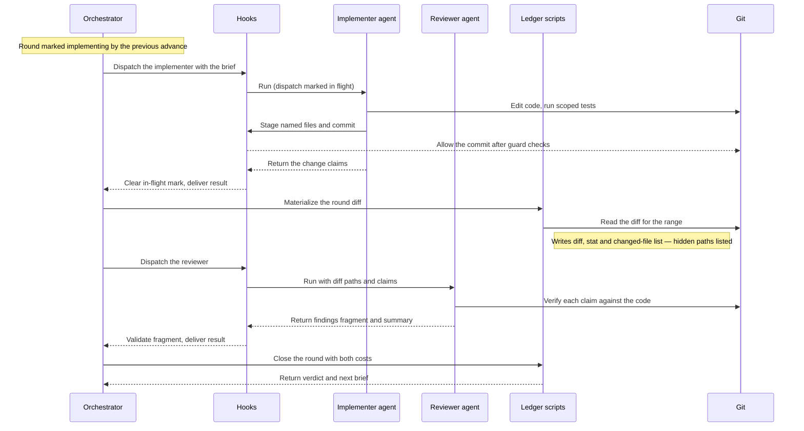
```mermaid
sequenceDiagram
    participant O as Orchestrator
    participant K as Hooks
    participant I as Implementer agent
    participant R as Reviewer agent
    participant L as Ledger scripts
    participant G as Git

    Note over O: Round marked implementing by the previous advance
    O->>K: Dispatch the implementer with the brief
    K->>I: Run (dispatch marked in flight)
    I->>G: Edit code, run scoped tests
    I->>K: Stage named files and commit
    K-->>G: Allow the commit after guard checks
    I-->>K: Return the change claims
    K-->>O: Clear in-flight mark, deliver result
    O->>L: Materialize the round diff
    L->>G: Read the diff for the range
    Note right of L: Writes diff, stat and changed-file list — hidden paths listed
    O->>K: Dispatch the reviewer
    K->>R: Run with diff paths and claims
    R->>G: Verify each claim against the code
    R-->>K: Return findings fragment and summary
    K-->>O: Validate fragment, deliver result
    O->>L: Close the round with both costs
    L-->>O: Return verdict and next brief
```

Sources: `SKILL.md` "Each round" steps 1-3 (lines 229-252);
`agents/implementer.md` lines 52-102; `agents/skeptical-reviewer.md` lines
79-101; `scripts/commit_guard.sh` lines 26-54 (staging discipline while live)
and 56-75 (commit knobs); `merge_ledger.py write_diff()` lines 365-423
(`.diff`, `.stat` with EXCLUDED trailer, `.files`).

### 5.4 Inside `next-round`: merge, metrics, advance

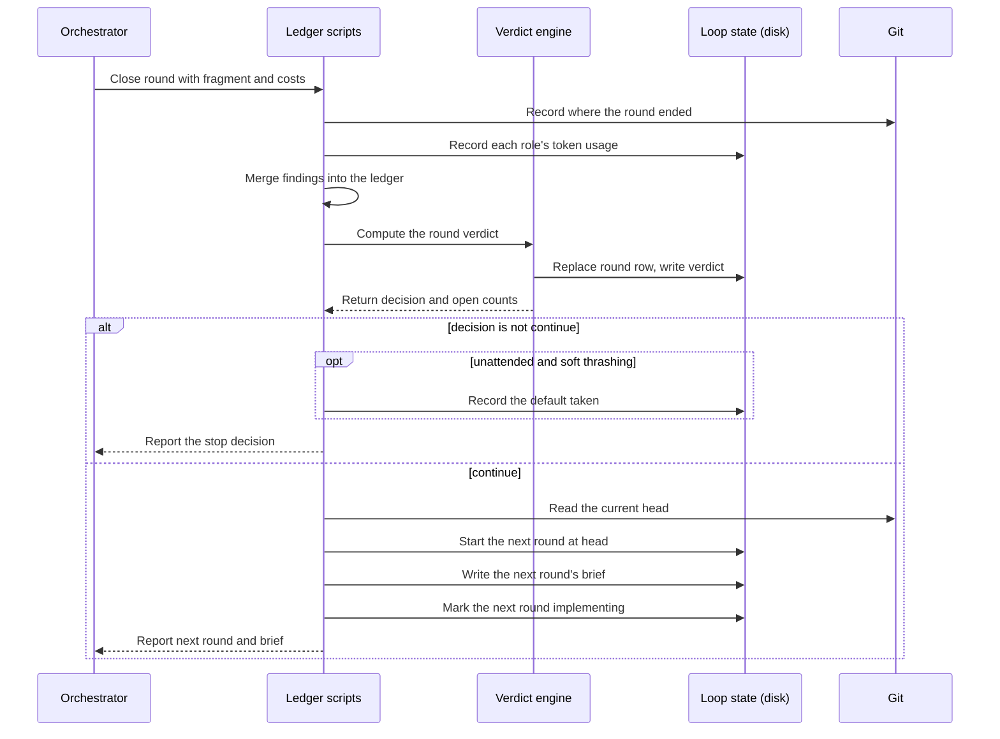
```mermaid
sequenceDiagram
    participant O as Orchestrator
    participant L as Ledger scripts
    participant V as Verdict engine
    participant S as Loop state (disk)
    participant G as Git

    O->>L: Close round with fragment and costs
    L->>G: Record where the round ended
    L->>S: Record each role's token usage
    L->>L: Merge findings into the ledger
    L->>V: Compute the round verdict
    V->>S: Replace round row, write verdict
    V-->>L: Return decision and open counts
    alt decision is not continue
        opt unattended and soft thrashing
            L->>S: Record the default taken
        end
        L-->>O: Report the stop decision
    else continue
        L->>G: Read the current head
        L->>S: Start the next round at head
        L->>S: Write the next round's brief
        L->>S: Mark the next round implementing
        L-->>O: Report next round and brief
    end
```

Sources: `merge_ledger.py next_round()` lines 425-529 (`round_end_shas` at
452-466, usages 467-473, merge and metrics 474-487, unattended line 488-508,
advance 509-529); `metrics.py main()` lines 110-229.

### 5.5 Thrashing detection: soft stop, human consult, hard stop

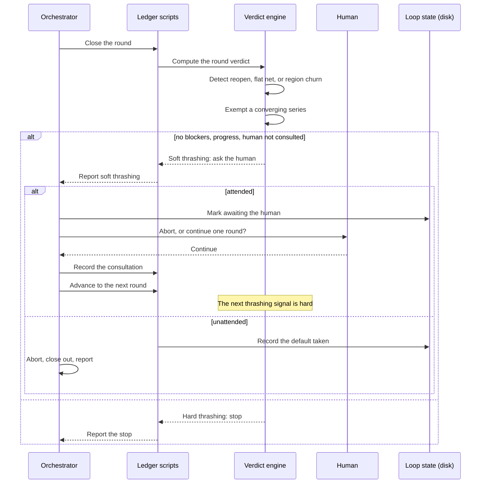
```mermaid
sequenceDiagram
    participant O as Orchestrator
    participant L as Ledger scripts
    participant V as Verdict engine
    participant H as Human
    participant S as Loop state (disk)

    O->>L: Close the round
    L->>V: Compute the round verdict
    V->>V: Detect reopen, flat net, or region churn
    V->>V: Exempt a converging series
    alt no blockers, progress, human not consulted
        V-->>L: Soft thrashing: ask the human
        L-->>O: Report soft thrashing
        alt attended
            O->>S: Mark awaiting the human
            O->>H: Abort, or continue one round?
            H-->>O: Continue
            O->>L: Record the consultation
            O->>L: Advance to the next round
            Note over V: The next thrashing signal is hard
        else unattended
            L->>S: Record the default taken
            O->>O: Abort, close out, report
        end
    else
        V-->>L: Hard thrashing: stop
        L-->>O: Report the stop
    end
```

Sources: `metrics.py` lines 159-184; `merge_ledger.py consulted()` lines
733-751 and `next_round()` unattended branch lines 488-508; `SKILL.md` "Each
round" step 4 (lines 253-269) and "Stop conditions" (lines 372-398).

### 5.6 Stop, panel final pass, closeout, report (convergence / backstop / budget)

The scenario is split in two: the optional panel final pass, then the
closeout and report that follow every stop.

#### 5.6.1 Panel final pass

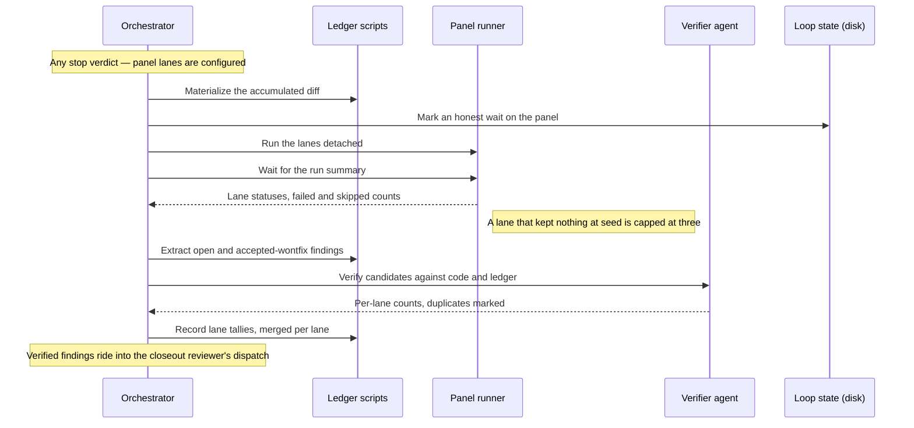
```mermaid
sequenceDiagram
    participant O as Orchestrator
    participant L as Ledger scripts
    participant P as Panel runner
    participant V as Verifier agent
    participant S as Loop state (disk)

    Note over O: Any stop verdict — panel lanes are configured
    O->>L: Materialize the accumulated diff
    O->>S: Mark an honest wait on the panel
    O->>P: Run the lanes detached
    O->>P: Wait for the run summary
    P-->>O: Lane statuses, failed and skipped counts
    Note right of P: A lane that kept nothing at seed is capped at three
    O->>L: Extract open and accepted-wontfix findings
    O->>V: Verify candidates against code and ledger
    V-->>O: Per-lane counts, duplicates marked
    O->>L: Record lane tallies, merged per lane
    Note over O: Verified findings ride into the closeout reviewer's dispatch
```

Sources: `SKILL.md` "Panel final pass" (lines 271-301); `panel_review.py
run()` lines 964-1088 (`--detach` 984-999, empty-diff refusal 1022-1039,
counts and banners 1063-1088), `wait()` lines 1090-1119, `run_lane()` cap
lines 897-901; `merge_ledger.py open_findings()` wontfix branch lines
165-171 and `panel_tally()` lines 670-731; `agents/panel-verifier.md` lines
46-52.

#### 5.6.2 Closeout and final report

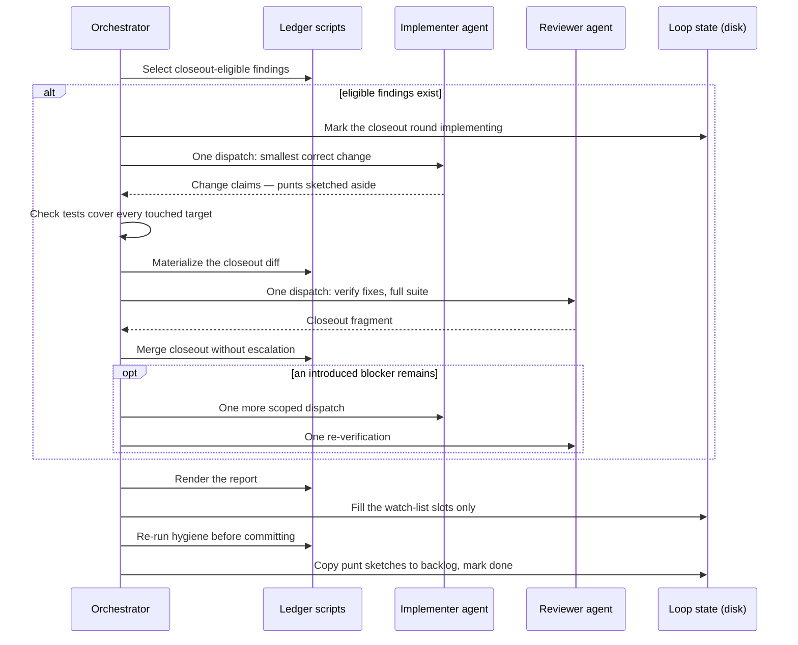
```mermaid
sequenceDiagram
    participant O as Orchestrator
    participant L as Ledger scripts
    participant I as Implementer agent
    participant R as Reviewer agent
    participant S as Loop state (disk)

    O->>L: Select closeout-eligible findings
    alt eligible findings exist
        O->>S: Mark the closeout round implementing
        O->>I: One dispatch: smallest correct change
        I-->>O: Change claims — punts sketched aside
        O->>O: Check tests cover every touched target
        O->>L: Materialize the closeout diff
        O->>R: One dispatch: verify fixes, full suite
        R-->>O: Closeout fragment
        O->>L: Merge closeout without escalation
        opt an introduced blocker remains
            O->>I: One more scoped dispatch
            O->>R: One re-verification
        end
    end
    O->>L: Render the report
    O->>S: Fill the watch-list slots only
    O->>L: Re-run hygiene before committing
    O->>S: Copy punt sketches to backlog, mark done
```

Sources: `SKILL.md` "Closeout" (lines 303-346) and "Final report" (lines
400-421); `merge_ledger.py open_findings()` closeout branch lines 175-181;
`render_report.py main()` (closeout section lines 250-280, watch list lines
358-386). Closeout token usage is recorded with `add-usage`, never
`set-usage` (`SKILL.md` lines 442-443).

### 5.7 Panel seed pass: probe, consent, lanes, verifier, chair

Split in two: the human-facing gate, then the seed run itself.

#### 5.7.1 Probe and consent

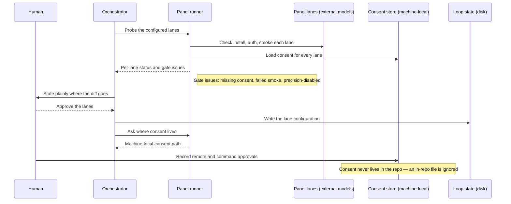
```mermaid
sequenceDiagram
    participant H as Human
    participant O as Orchestrator
    participant P as Panel runner
    participant X as Panel lanes (external models)
    participant C as Consent store (machine-local)
    participant S as Loop state (disk)

    O->>P: Probe the configured lanes
    P->>X: Check install, auth, smoke each lane
    P->>C: Load consent for every lane
    P-->>O: Per-lane status and gate issues
    Note right of P: Gate issues: missing consent, failed smoke, precision-disabled
    O->>H: State plainly where the diff goes
    H-->>O: Approve the lanes
    O->>S: Write the lane configuration
    O->>P: Ask where consent lives
    P-->>O: Machine-local consent path
    H->>C: Record remote and command approvals
    Note over C: Consent never lives in the repo — an in-repo file is ignored
```

Sources: `SKILL.md` Setup 2b (lines 121-162); `panel_review.py probe()`
lines 346-469 (`gate_issues` 428-464), `consent_path()` lines 184-237,
`load_consent()` lines 239-275, `consent_path_cmd()` lines 277-300,
`precision_disabled()` lines 609-627.

#### 5.7.2 Seed lanes, verifier, chair

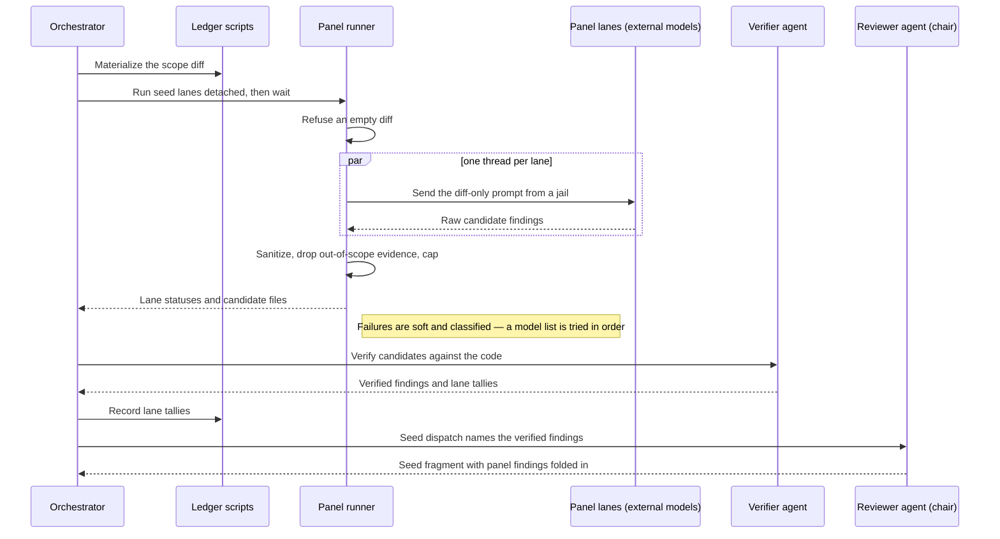
```mermaid
sequenceDiagram
    participant O as Orchestrator
    participant L as Ledger scripts
    participant P as Panel runner
    participant X as Panel lanes (external models)
    participant V as Verifier agent
    participant R as Reviewer agent (chair)

    O->>L: Materialize the scope diff
    O->>P: Run seed lanes detached, then wait
    P->>P: Refuse an empty diff
    par one thread per lane
        P->>X: Send the diff-only prompt from a jail
        X-->>P: Raw candidate findings
    end
    P->>P: Sanitize, drop out-of-scope evidence, cap
    P-->>O: Lane statuses and candidate files
    Note right of P: Failures are soft and classified — a model list is tried in order
    O->>V: Verify candidates against the code
    V-->>O: Verified findings and lane tallies
    O->>L: Record lane tallies
    O->>R: Seed dispatch names the verified findings
    R-->>O: Seed fragment with panel findings folded in
```

Sources: `SKILL.md` "PANEL SEED PASS" (lines 192-218); `panel_review.py
run()` lines 964-1088, `run_lane()` lines 842-959 (jail runners 662-820,
model list 902-931, sanitize 543-585); `agents/panel-verifier.md`;
`agents/skeptical-reviewer.md` lines 120-125; `merge_ledger.py panel_tally()`
lines 670-731.

### 5.8 Mutation testing inside a round

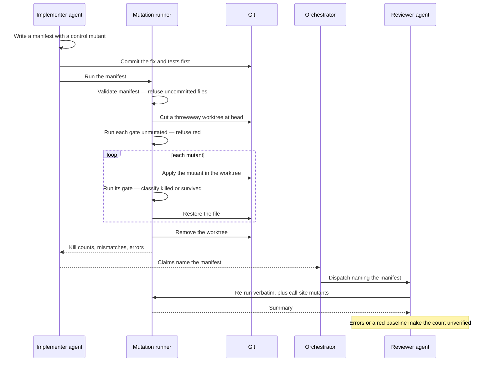
```mermaid
sequenceDiagram
    participant I as Implementer agent
    participant M as Mutation runner
    participant G as Git
    participant O as Orchestrator
    participant R as Reviewer agent

    I->>I: Write a manifest with a control mutant
    I->>G: Commit the fix and tests first
    I->>M: Run the manifest
    M->>M: Validate manifest — refuse uncommitted files
    M->>G: Cut a throwaway worktree at head
    M->>M: Run each gate unmutated — refuse red
    loop each mutant
        M->>G: Apply the mutant in the worktree
        M->>M: Run its gate — classify killed or survived
        M->>G: Restore the file
    end
    M->>G: Remove the worktree
    M-->>I: Kill counts, mismatches, errors
    I-->>O: Claims name the manifest
    O->>R: Dispatch naming the manifest
    R->>M: Re-run verbatim, plus call-site mutants
    M-->>R: Summary
    Note over R: Errors or a red baseline make the count unverified
```

Sources: `agents/implementer.md` lines 62-87; `scripts/mutate.py` lines
74-212 (validation 92-117, dirty check 118-126, baseline 144-166, mutant loop
167-197, teardown 198-201); `agents/skeptical-reviewer.md` lines 108-119.

### 5.9 PreToolUse enforcement: read_guard and commit_guard denying a Bash call

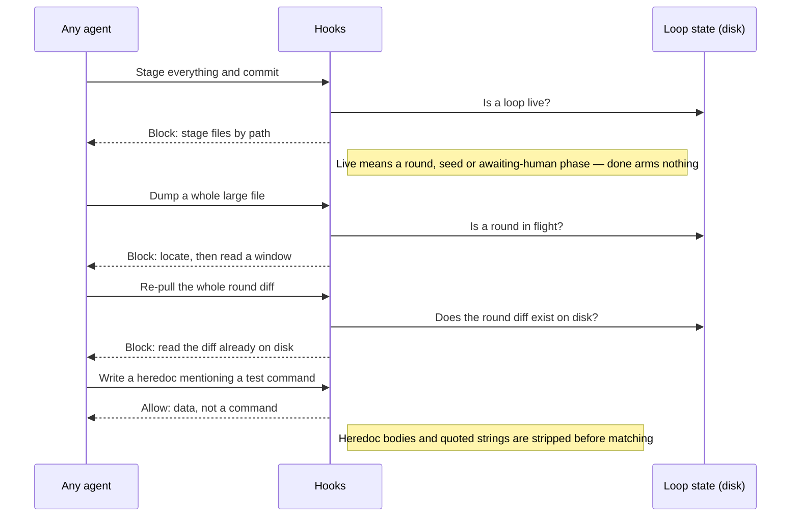
```mermaid
sequenceDiagram
    participant A as Any agent
    participant K as Hooks
    participant S as Loop state (disk)

    A->>K: Stage everything and commit
    K->>S: Is a loop live?
    K-->>A: Block: stage files by path
    Note right of K: Live means a round, seed or awaiting-human phase — done arms nothing
    A->>K: Dump a whole large file
    K->>S: Is a round in flight?
    K-->>A: Block: locate, then read a window
    A->>K: Re-pull the whole round diff
    K->>S: Does the round diff exist on disk?
    K-->>A: Block: read the diff already on disk
    A->>K: Write a heredoc mentioning a test command
    K-->>A: Allow: data, not a command
    Note right of K: Heredoc bodies and quoted strings are stripped before matching
```

Sources: `scripts/commit_guard.sh` lines 19-54; `scripts/read_guard.sh` lines
9-16 (active phases), 37-47 (`strip_data`, `CMD_START`), 52-85 (denials);
`hooks/hooks.json` PreToolUse Bash entry (both scripts run on every Bash
call); `tests/hooks_selftest.py` lines 89-123.

### 5.10 Stop-hook stall guard and SubagentStop fragment validation

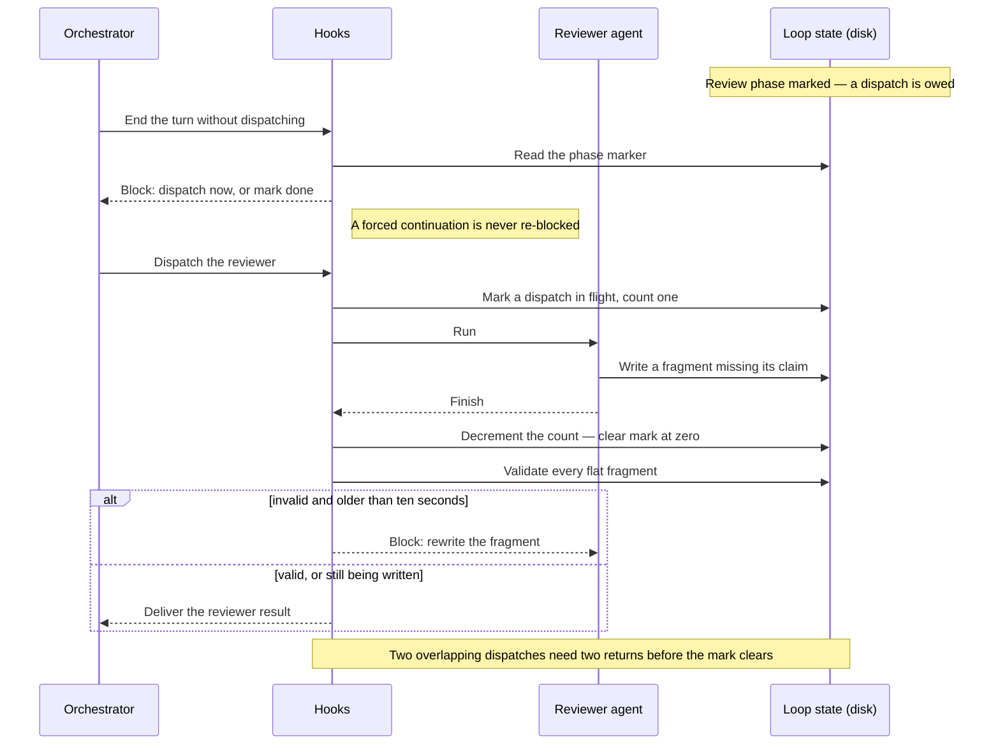
```mermaid
sequenceDiagram
    participant O as Orchestrator
    participant K as Hooks
    participant R as Reviewer agent
    participant S as Loop state (disk)

    Note over S: Review phase marked — a dispatch is owed
    O->>K: End the turn without dispatching
    K->>S: Read the phase marker
    K-->>O: Block: dispatch now, or mark done
    Note right of K: A forced continuation is never re-blocked
    O->>K: Dispatch the reviewer
    K->>S: Mark a dispatch in flight, count one
    K->>R: Run
    R->>S: Write a fragment missing its claim
    R-->>K: Finish
    K->>S: Decrement the count — clear mark at zero
    K->>S: Validate every flat fragment
    alt invalid and older than ten seconds
        K-->>R: Block: rewrite the fragment
    else valid, or still being written
        K-->>O: Deliver the reviewer result
    end
    Note over K,S: Two overlapping dispatches need two returns before the mark clears
```

Sources: `scripts/loop_guard.sh` (the `stop_hook_active` early exit at lines
14-23 prevents an infinite block; the block at 39-42); `scripts/dispatch_stamp.sh`
lines 25-38 and 60-62 (count); `scripts/subagent_guard.sh` lines 20-45
(decrement/strip) and 47-131 (validation, 10 s grace at 121-123);
`tests/hooks_selftest.py` lines 55-85; `SKILL.md` "Waiting, failures, and
pauses" (lines 349-370).

### 5.11 Transport failure, partial resume, and honest waits

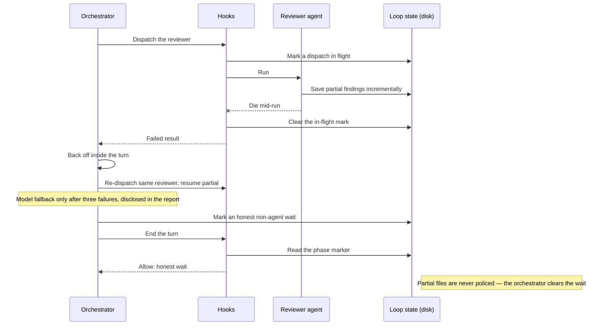
```mermaid
sequenceDiagram
    participant O as Orchestrator
    participant K as Hooks
    participant R as Reviewer agent
    participant S as Loop state (disk)

    O->>K: Dispatch the reviewer
    K->>S: Mark a dispatch in flight
    K->>R: Run
    R->>S: Save partial findings incrementally
    R--xK: Die mid-run
    K->>S: Clear the in-flight mark
    K-->>O: Failed result
    O->>O: Back off inside the turn
    O->>K: Re-dispatch same reviewer, resume partial
    Note over O: Model fallback only after three failures, disclosed in the report
    O->>S: Mark an honest non-agent wait
    O->>K: End the turn
    K->>S: Read the phase marker
    K-->>O: Allow: honest wait
    Note right of S: Partial files are never policed — the orchestrator clears the wait
```

Sources: `SKILL.md` "Waiting, failures, and pauses" (lines 349-370);
`scripts/loop_guard.sh` case `*:waiting:*` lines 29-32;
`scripts/dispatch_stamp.sh` line 24 (a `:waiting:` phase is not stamped);
`scripts/subagent_guard.sh` `FRAGMENT_NAME` regex line 64 (a `.partial`
suffix never matches `\.json$`); `agents/skeptical-reviewer.md` lines
159-164.

### 5.12 Archiving a finished loop and starting the next one (resume-after-stop)

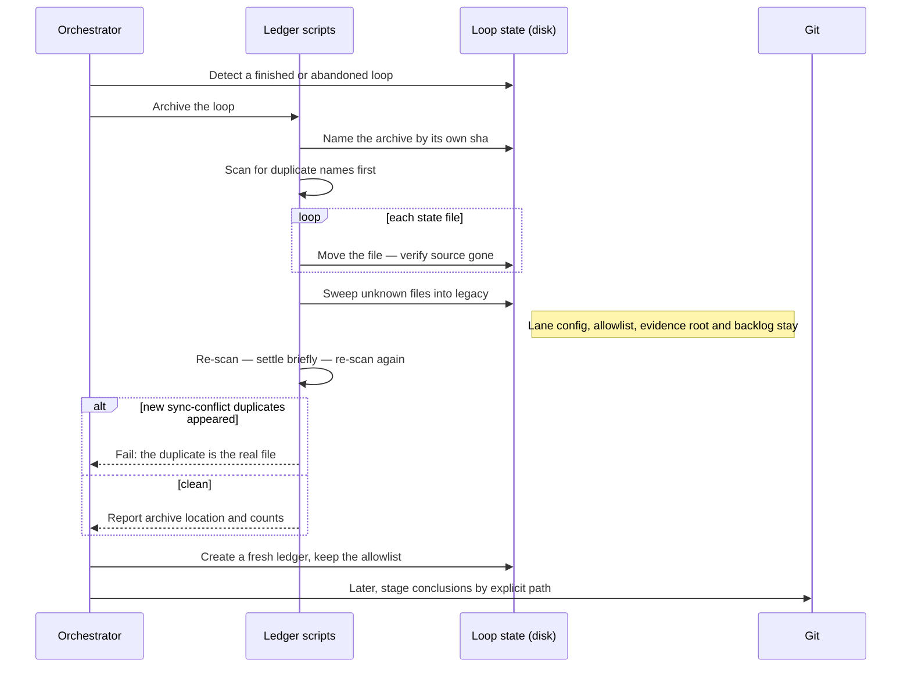
```mermaid
sequenceDiagram
    participant O as Orchestrator
    participant L as Ledger scripts
    participant S as Loop state (disk)
    participant G as Git

    O->>S: Detect a finished or abandoned loop
    O->>L: Archive the loop
    L->>S: Name the archive by its own sha
    L->>L: Scan for duplicate names first
    loop each state file
        L->>S: Move the file — verify source gone
    end
    L->>S: Sweep unknown files into legacy
    Note right of S: Lane config, allowlist, evidence root and backlog stay
    L->>L: Re-scan — settle briefly — re-scan again
    alt new sync-conflict duplicates appeared
        L-->>O: Fail: the duplicate is the real file
    else clean
        L-->>O: Report archive location and counts
    end
    O->>S: Create a fresh ledger, keep the allowlist
    O->>G: Later, stage conclusions by explicit path
```

Sources: `merge_ledger.py archive()` lines 531-668 (naming 538-561,
per-file move helpers 578-606, KEEP set 624-630, settle and re-check 642-668);
`SKILL.md` Setup step 1 (lines 67-79); `.review-loop/.gitignore` allowlist
semantics (`SKILL.md` lines 101-115).

---

## 6. Verdict precedence in `metrics.py`

The decision is a fixed `if/elif` chain (`metrics.py` lines 171-196). The
order matters: `converged` beats everything, `budget` beats thrashing, and
`backstop` is only reached if nothing earlier fired.

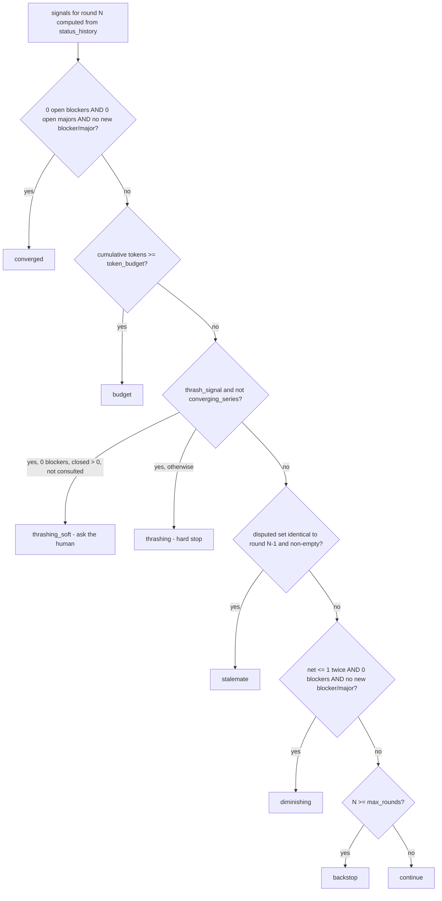
```mermaid
flowchart TD
    S["signals for round N computed from status_history"] --> C1{"0 open blockers AND 0 open majors AND no new blocker/major?"}
    C1 -->|yes| CONV["converged"]
    C1 -->|no| C2{"cumulative tokens >= token_budget?"}
    C2 -->|yes| BUD["budget"]
    C2 -->|no| C3{"thrash_signal and not converging_series?"}
    C3 -->|"yes, 0 blockers, closed > 0, not consulted"| TS["thrashing_soft - ask the human"]
    C3 -->|"yes, otherwise"| TH["thrashing - hard stop"]
    C3 -->|no| C4{"disputed set identical to round N-1 and non-empty?"}
    C4 -->|yes| ST["stalemate"]
    C4 -->|no| C5{"net <= 1 twice AND 0 blockers AND no new blocker/major?"}
    C5 -->|yes| DIM["diminishing"]
    C5 -->|no| C6{"N >= max_rounds?"}
    C6 -->|yes| BS["backstop"]
    C6 -->|no| CONT["continue"]
```

`thrash_signal` = any finding reopened (`fixed→open`) ≥ 2 times, OR `net <= 0`
for rounds N and N-1, OR the same region appears in new/reopened findings in
N, N-1, N-2 (unless both of the last two rounds were net-positive with no
reopens). `converging_series()` clears the whole signal.

---

## 7. State of the architecture (maintainer-facing)

### 7.1 Design decisions and their rationale

Where the rationale is documented (`HANDOFF.md` §3 "Design decisions that
look wrong but are settled", commit messages, inline "(measured: …)" notes)
it is cited; otherwise labelled as inference.

| Decision | Where | Rationale |
|---|---|---|
| Control logic lives in prose (`SKILL.md`, `agents/*.md`), scripts are judgment-free | whole plugin | Documented: `HANDOFF.md` §3 "All ledger/report/planning mutations go through the scripts … The orchestrator is plumbing". Scripts exist so that "8/8 killed" and the verdict are checkable, not trusted (`README.md` "Checkable claims"). |
| Seed merges as round 0 | `SKILL.md` Setup 3; `metrics.py` | Documented: a seed merged as round 1 "poisons the net metric (N new, 0 closed)" and looks like thrashing. |
| Hooks instead of prompt rules for stall/fragment/read/staging discipline | `hooks/hooks.json`, `scripts/*_guard.sh` | Documented in `README.md` ("zero token cost") and commit `df466f2` (0.2.0 "hooks + token-efficiency contracts"). |
| The diff is materialized once and read from disk | `merge_ledger.py write_diff` | Documented in the docstring: "21 git diff/show calls, 601K tokens, in one run". |
| Reviewer gets a sha range, not a summary | `SKILL.md` hard rules | Documented in `README.md`: the orchestrator must not launder the implementer's claims. |
| Three model pins (`opus` / `sonnet` / `inherit`) | agent frontmatter | Documented: diversity against correlated blind spots; `HANDOFF.md` §3 "Model pins". |
| `set-usage` replaces, `add-usage` accumulates | `merge_ledger.py _usage` | Documented: an accumulate-only readout once inflated a budget by 89%. |
| `fixed→partial` is refinement, not a reopen | `metrics.py reopen_count` | Documented in the code comment and `HANDOFF.md` §3. |
| Converging-series exemption with a 2-3 round window | `metrics.py converging_series` | Documented in the docstring and `docs/proposal-2026-09-09-field-reports.md` B1. |
| Consent is machine-local, keyed by realpath hash; nothing in-repo can grant it | `panel_review.py consent_path/load_consent` | Documented across commits `15c45f1`, `907074b`, `9baf5ae` and the docstring: clones/bundles ship attacker-chosen files, `XDG_CONFIG_HOME`/`HOME` can be repo-shipped via `.envrc`. |
| External panel models are finders only; a blind verifier sits between them and the ledger | `agents/panel-verifier.md`, `SKILL.md` 2b | Documented in `docs/proposal-multi-provider-review-panel.md`: flood control (cap 10) and per-lane precision as the keep/drop signal; metrics untouched. |
| Panel runs `seed+final` only, not per round | `SKILL.md` | Documented: "so metrics and convergence are untouched" (`README.md`). **Inference:** also cost — each lane pays for the whole diff. |
| Panel lanes run detached and are polled with `wait` | `panel_review.py run --detach`, `wait` | Documented in the `wait()` docstring and `SKILL.md` lines 198-202: the Bash tool's 600 s ceiling versus lane timeouts above it; the summary file is the contract, so the orchestrator never invents process management. (0.14.0) |
| Per-lane precision disables a lane automatically | `panel_review.py precision_disabled` | Documented in `SKILL.md` lines 129-132 and 280-282: a measured 0/40 lane cost ~140K verifier tokens per run. (0.14.0) |
| Default-closed `.gitignore` allowlist; staging by explicit path enforced by hook | `SKILL.md` Setup 2, `commit_guard.sh` | Documented: commit `2ed0b5f` (0.10.0 "conclusions in git, evidence and scratch on disk") and `docs/plugin-feedback-conclusions-in-git.md`; a committed `fragments 2/` and a `.pyc` motivated it. |
| Archive is per-file with a post-check | `merge_ledger.py archive` | Documented: iCloud/Dropbox produced ` 2`-suffixed duplicates that "sat unnoticed for 3 hours" (B3); the 0.14.0 settle-and-re-check exists because a duplicate once appeared seconds after the check printed 0 (comment at lines 642-646). |
| Closeout is a single no-iteration cycle with the "smallest correct change" rule | `SKILL.md` Closeout | Documented: a closeout "minor" once grew to 28% of a run's cost; `HANDOFF.md` §3 calls the area fragile. |

**Inference on evolution:** the git history shows a strict "field report →
numbered proposal → release" cadence (`HANDOFF.md` §1). Nearly every rule in
`SKILL.md` carries a "(measured: …)" clause naming the incident that created
it; the prose has grown from 67 lines (`b997308`, 2026-08-14) to 478 lines
by accretion of such clauses rather than by restructuring.

### 7.2 Verified defect: `union_evidence()` wipes list-shaped evidence on merge

`merge_ledger.py` lines 86-97 (unchanged in 0.14.0):

```python
def union_evidence(old, new):
    if not isinstance(old, dict):
        old = {}
    if not isinstance(new, dict):
        return old
```

The review loop's evidence is a **list of `file:line` strings** (schema in
`agents/skeptical-reviewer.md`; accepted by `subagent_guard.sh` lines 105-113).
For an existing finding, the merge path (line 800) calls
`union_evidence(list, list)`, which returns `{}` — so the first merge that
updates a finding discards its evidence. Verified by calling the function
directly (`union_evidence(["a.py:1"], ["a.py:1","b.py:2"]) -> {}`) and by
counting the live ledger: **18 of 27** findings in `.review-loop/ledger.json`
and **16 of 18** in `.review-loop/archive/panel-feature-loop-2026-09-09/ledger.json`
have `evidence: {}`; the only multi-round findings that kept a list are ones
whose later status change came via `resolve` (which never touches evidence).
`render_report.py finding_line()` renders nothing for `{}`, so REPORT.md
loses the `evidence:` line for most findings.

**Inference:** `union_evidence` was written (commit `df466f2`, shared with
qa-loop-tools) for the qa loop's dict-shaped evidence
(`screenshots`/`repro`/`measurements`) and was never given a list branch. The
fix is a few lines; the function is mirrored into `qa-loop-tools/scripts/`.

### 7.3 Coupling and accumulated debt

- **Mirrored scripts with panel-only divergence.** Eight scripts are
  authored here and copied into `qa-loop-tools/scripts/` (`HANDOFF.md` §2.2).
  As of 0.14.0 all six hook scripts plus `hygiene_check.sh` are
  byte-identical (`subagent_guard.sh` included — its 7 comment-only lines of
  drift are gone); `merge_ledger.py` (79 diff lines) and `render_report.py`
  (81) diverge. There is no build step: the invariant is enforced by
  discipline plus one self-test check for `CONTROLS.md` only.
- **qa concerns inside the review copy.** `merge_ledger.py` detects
  `.qa-loop` by directory basename (`is_qa`, line 450) and branches to
  `qa_metrics.py` and a `--pass` flag; `archive()`'s `KEEP` set lists
  `WORKFLOWS.md`, `TESTCASES.md`, `HARNESS_NOTES.md`, `tools`, `driver`;
  `render_report.py` renders persona matrices, coverage gaps, `routing:
  proposal` sections, and the `FIX REJECTED` note convention;
  `subagent_guard.sh` validates `*.results.json`. None of these are produced by
  the review loop.
- **The orchestrator's `.phase` protocol is split across three writers.**
  `merge_ledger.py next-round` writes bare phases, `dispatch_stamp.sh` appends
  `:dispatched` (and now owns the `briefs/.dispatched` count),
  `subagent_guard.sh` strips it at count zero, and the prose writes
  `awaiting-human`, `done`, and `:waiting:<reason>`. Any new phase name must
  keep matching `round*|seed*` in three shell `case` statements
  (`loop_guard.sh:39`, `read_guard.sh:14`, `dispatch_stamp.sh:39`),
  `round*|seed*|awaiting-human*` in `commit_guard.sh:29`, and
  `*review*|*testing*` in `subagent_guard.sh:50`.
- **Resolved in 0.14.0 — single-bit dispatch marker.** Before 0.14.0 the
  first of two concurrent subagents to return stripped `:dispatched` for
  both, after which the Stop hook blocked ordinary turns (measured three
  times in one run per the `dispatch_stamp.sh` header comment). The count in
  `briefs/.dispatched` under `flock` fixes it; `tests/hooks_selftest.py`
  covers the two-dispatch case. A stale count file from a crashed run would
  keep `:dispatched` set until enough returns arrive — the orchestrator's
  `:waiting:`/`done` writes are the escape hatch.
- **Resolved in 0.14.0 — `scope` and `diff` parsed ranges differently.**
  `scope` normalized through `shlex` while `diff` took its argument verbatim,
  so a quoted `main..HEAD -- :!prompts.md` accepted by one failed the other
  with "bad revision" (measured twice, per the `split_range` docstring at
  lines 202-208). Both verbs now share `split_range`.
- **`commit_guard.sh` without `jq`.** Lines 15-17 only extract the command
  when `jq` exists; otherwise `cmd` stays empty, the `"")` case at line 58
  falls through, and the `REVIEW_LOOP_MAX_DIFF` / `REVIEW_LOOP_TEST_CMD`
  checks run on **every** Bash call — including running the test command.
  The comment says "fail open, allow"; the code does not match it when either
  knob is set. Still present in 0.14.0.
- **`read_guard.sh` is regex heuristics.** It whitelists any pipe into
  `grep|rg|head|tail|sed|awk|wc|cut|sort|uniq|xcpretty|xcbeautify|tee|python3|jq`
  or any redirect, so `cat big.swift | tee /dev/null` passes; the 0.14.0
  `strip_data` pass reduces false positives, not false negatives. Acceptable
  for a cost guard; do not treat it as a security boundary.
- **`panel.json.rounds` is documentation only.** `SKILL.md` tells the
  orchestrator to write `rounds: "seed+final"`, but no script reads the key
  (grep of `panel_review.py`); the seed/final schedule is enforced by prose.
- **Panel lane-tag inconsistency in real data.** `agents/panel-verifier.md`
  specifies `source: "panel:<lane>"`, and the round-1 brief in the live run
  carries `panel:codex`, but `round-final-panel.verified.json` carries
  `source: "codex"`. `render_report.py` prints whatever it gets, so report
  tags vary by run.
- **`REVIEW.md` seed mode has no script support.** Present since the first
  commit (`b997308`), it is a one-line instruction to the reviewer; there is
  no fixture, self-test, or field evidence in the repo that it has been used.
- **`--stop-note`** in `render_report.py` is never mentioned by `SKILL.md`,
  `README.md`, or `CONTROLS.md`.
- **Prompt size.** `SKILL.md` (478 lines) plus `CONTROLS.md` (517 lines,
  loaded by the `controls` skill) are read into the orchestrator's context;
  the plugin's own cost doctrine (`HANDOFF.md` §4 "cost is turns × context")
  argues against unbounded growth here. Both grew again in 0.14.0.

### 7.4 Inconsistencies worth fixing

- The `.gitignore` template in `SKILL.md` line 102 is stamped `Managed by
  review-loop-tools v0.12.0` while `plugin.json` is `0.14.0`; the live
  `.review-loop/.gitignore` at the repo root says `v0.11.0`. Per
  `HANDOFF.md` §2.1 the stamp names the release that last changed the
  template, so `v0.12.0` may be intentional — but the rule is easy to
  misread and the three values differ.
- `docs/proposal-multi-provider-review-panel.md` describes a
  `panel_review.sh` and candidates at `fragments/round-N-<lane>.candidates.json`;
  the shipped implementation is `panel_review.py` writing under
  `fragments/panel/` (the subdir was added in `ce34f74` so the SubagentStop
  guard would not police candidate files as ledger fragments). The proposal
  is historical, not a spec.
- `README.md` "Optional commit guard" describes only the env knobs; the
  staging-discipline blocks added in 0.10.0 are documented in `SKILL.md`
  and `CONTROLS.md` but not in that README section's heading.
- `SKILL.md`'s Contracts list (line 433) still documents `open` as
  `[auto|proposal|all|closeout]`; the `wontfix` filter added in 0.14.0 is
  listed separately at lines 448-449 rather than in the signature.

### 7.5 Vestigial or dormant code

- `merge_ledger.py notes-rotate` (lines 271-363): rotates `HARNESS_NOTES.md`,
  a qa-loop artifact (`CONTROLS.md` tags it `[qa]`). Nothing in this plugin
  writes that file. Present since `c9e4415` (0.7.1) because the file is
  mirrored.
- `merge_ledger.py set-round`'s `build_sha` branch: only taken when the
  ledger already has `build_sha` and lacks `round_start_sha` — a qa ledger
  shape (introduced `6d7e45e`).
- `render_report.py` `coverage.json` / persona matrix / coverage gaps /
  UX proposals sections (since `b221d1b`): qa-only inputs; dead for review
  runs.
- `merge_ledger.py archive` `KEEP` entry `panel-consent.json`: the pre-0.12
  in-repo consent file is deliberately **not** archived so that
  `panel_review.py`'s stderr hint keeps firing until the human deletes it
  (comment at lines 627-630). Intentional, but it is legacy handling that can
  be removed once no checkout carries the old file.
- `render_report.py` `"FIX REJECTED" in note` fallback (lines 195, 303): the
  qa fix-reviewer's note convention; the review loop records rejections in
  the `rejections` array instead.
- `subagent_guard.sh`'s "missing count file means one live dispatch" branch
  (lines 34-35): pre-0.14 compatibility for a loop that was mid-dispatch
  during an upgrade; removable once no such loop can exist.
- `scripts/__pycache__/` exists on disk (excluded from this inventory); it
  is exactly the kind of stray `hygiene_check.sh` flags in host repos.

---

## Appendix — Not covered

- `.review-loop/` at the repo root (the plugin reviewing itself) was used
  only as evidence of file shapes; its findings, reports, and archive
  contents are not documented.
- `qa-loop-tools/` and `arch-docs-tools/` are separate deliverables; the
  mirrored-script relationship is described only from this side.
- `scripts/__pycache__/` (build artefact) — intentionally ignored.
- `docs/inbox/` field reports were not read; history claims that cite them
  are taken from `HANDOFF.md` and the proposal docs, not verified against the
  raw memos.
- The behaviour of the external CLIs (`codex`, `gemini`, `ollama`) and of the
  Claude Code hook runner itself is described only as this plugin invokes
  them; their own semantics were not verified.
