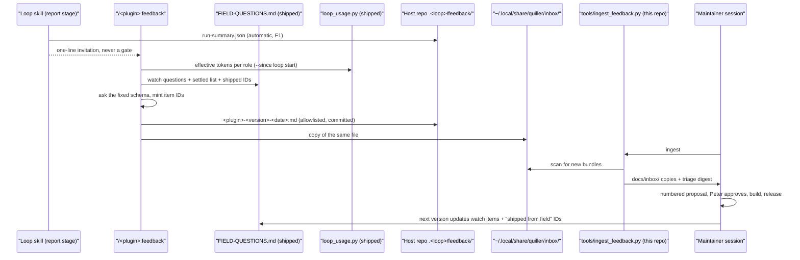

# Proposal: a frictionless feedback path from field agents to the maintainer

Written 2026-09-13. Status: **proposed, not approved, nothing built.**

## The problem, measured against the current cycle

HANDOFF §1 describes the cycle: field agents run the plugins in their own
repos, write memos, Peter delivers copies to `docs/inbox/`, the maintainer
digests them into a numbered proposal. It works — the 0.13.0 pair came out of
it — but every step costs the field agent or Peter effort that the plugin
could absorb. Evidence from the two field repos and this one:

| Friction | Evidence |
|---|---|
| No fixed shape or name for a report | Causeway holds 10 feedback files under 6 naming schemes (`qa-loop-0.12.0-feedback.md`, `review-loop-orchestrator-feedback.md`, `qa-loop-2026-09-09-decisions.md`, …); weatherapp uses `loop-tooling-feedback-<date>.md` plus separate `token-usage-<date>.md`. The digest step normalizes by hand. |
| Token accounting is re-derived per repo | `docs/inbox/loop-usage.py` docstring: "the previous two measurements were made with throwaway scratchpad scripts that did not survive the session". It hard-codes `~/.claude/projects/-Users-plit-Documents-src-cardgame`. Both agents spend a section of every report on tables this script produces. |
| Version of the running plugin is unverified | HANDOFF §1: one entire cycle was spent on "0.4.0 features are absent" from a stale install. Reports state the version from memory; `installed_plugins.json` is the ground truth nobody reads first. |
| Settled decisions get re-reported | Proposal 2026-09-09 Part C declined D3 (reopen semantics) and D4 (budget scale) against HANDOFF §3 — both were already settled with field evidence the field agents never saw. |
| Watch items never reach the field | HANDOFF §5 lists ten things "for the next field reports" to check. They live only in this repo; a field agent finds out by accident. |
| Delivery is manual | HANDOFF: "Peter delivers feedback". The field repos are on the same Mac. |
| Autonomous decisions are a separate genre | Both agents wrote a `decisions` file (HANDOFF §7 wants human-flags on autonomous choices). Nothing prompts for it or carries it with the report. |
| arch-docs-tools has no path at all | This session found three script defects in it (coverage skips `.sh`, lint rejects crow's-foot `erDiagram`, survey ignores `.md`) with nowhere to file them but the conversation. |

The precedent for the fix is `docs/plugin-feedback-conclusions-in-git.md`:
the plugin, not the host repo, owns the vocabulary of its outputs. Apply the
same rule to feedback. The design goal is that **an agent who has just
finished a loop can file a complete, versioned, measured report in one
command and under a minute of its own effort**, and that the maintainer's
first two diagnostics run before a human reads a word.

## The proposed cycle

## Part A — what ships in the plugins

### A1. The loop writes the objective half itself

At report time, `render_report.py` (shared; authored in review, mirrored to
qa per ritual §2.2) additionally writes `<loopdir>/feedback/run-summary.json`:

- `plugin`, `version` read from `${CLAUDE_PLUGIN_ROOT}/.claude-plugin/plugin.json`
  — the code that actually ran, not what the report author remembers — and
  the matching entry from `~/.claude/plugins/installed_plugins.json` when
  present (a mismatch means a symlinked or `--plugin-dir` install; recorded,
  not judged).
- Platform: `sw_vers`, `xcodebuild -version` (qa only), `claude --version`
  if the binary answers; every field is "unknown" rather than absent when a
  probe fails.
- Settings used, rounds, stop condition and verdict per round (from
  `verdict.json` and `rounds.md`), finding counts by severity and
  `current_status`, fix-review rejections, proposals, `(unattended default:
  …)` markers (review B2), hygiene violations, archive events, the usage
  table from `set-usage`.
- Anomalies: a new shared verb `merge_ledger.py anomaly <loopdir> "<one
  line>"` appends to `<loopdir>/feedback/anomalies.jsonl`. Scripts call it
  where they already detect a deviation and today only print: grant-probe
  failure and driver `ping` failure (Stage 0), `plan_round.py` lint
  warnings and DEGENERATED reductions, `notes-rotate` `over_ceiling`,
  `commit_guard.sh` running without `jq`, archive duplicate-name detection,
  `hygiene_check.sh` violations. Skill text tells the orchestrator to call
  it whenever it works around the plugin ("hand-built a chunk", "abandoned
  the provisioner") — the two things field reports are made of, captured at
  the moment they happen instead of reconstructed eight hours later.

`feedback/` joins the loop-dir allowlist template (`!feedback/`,
`!feedback/*.json`, `!feedback/*.jsonl`, `!feedback/*.md`) with the template
stamp bumped per ritual §2.1. It is a conclusion: small, and it is the
evidence every memo cites.

### A2. One command: `/<plugin>:feedback`

A `feedback` skill in each loop plugin (and arch-docs-tools, A6). It is the
only thing a field agent needs to know, and the loop skill's report stage
ends with the invitation: "Feedback for the plugin maintainer: run
`/qa-loop-tools:feedback` — the objective bundle takes seconds; answer only
what you observed." Not a hook, not a gate (see D2).

What it does, in order:

1. Reads `feedback/run-summary.json` and `anomalies.jsonl`. If the loop dir
   has no summary (older plugin, aborted run), it builds what it can from
   `ledger.json` and says which fields are missing.
2. Runs the shipped `loop_usage.py` (A4) with `--since` taken from the
   loop's first `rounds.md` entry and `--dir` derived from the cwd. The
   agent gets the effective-token table without writing a line.
3. Reads the shipped `FIELD-QUESTIONS.md` (A3) and asks the agent each
   watch item as a closed question: `observed / not observed / not
   applicable`, plus one line of evidence if observed.
4. Asks the fixed subjective schema, every section optional:
   - **Keep**: what worked and should not be "simplified" away.
   - **Defects**, in impact order. Each: what happened, what was expected,
     smallest repro, evidence path in the loop dir, cost (turns, tokens, or
     wall clock if known), a suggested mechanism if the agent has one.
   - **Friction**: not a defect, but cost effort (docs conflated two things,
     a verb's output was misread, a default was wrong for this repo).
   - **Decisions taken without the human**: the `decisions` genre, folded in
     — what the contract wanted a human for, what was chosen, why.
   - **Seen again**: items already listed as open or shipped in
     `FIELD-QUESTIONS.md`, by ID, with "still happens / fixed for us".
   - **Wishes**: one line each.
5. Mints an ID per item: `<plugin-short>-<version>-<yyyymmdd>-<host>-<n>`,
   e.g. `qa-0.15.0-20260920-weatherapp-3`. `<host>` is the host repo's
   directory name. Proposals and commit messages cite these instead of
   "agent 2 #7".
6. Writes one file, `<loopdir>/feedback/<plugin>-<version>-<date>.md`:
   the answers, then the run summary and usage table as fenced JSON at the
   end. Self-contained, so it survives any delivery channel. Staged by
   explicit path and committed in the host repo (conclusions in git).
7. Copies the same file to `${XDG_DATA_HOME:-~/.local/share}/quiller/inbox/<host>/`
   — the delivery step, on the same machine the maintainer works on. The
   consent store already uses the XDG family under `XDG_CONFIG_HOME`, so
   this adds no new convention. Nothing is written into any other repo.

`--quick` runs steps 1, 2, 6 and 7 only: the objective bundle, no questions.
That is the floor: a report with the version, the verdicts, the anomalies
and the cost is worth more than most prose, and it costs the agent nothing.
A free-form memo can be attached as an appendix; the schema is what ingest
parses.

### A3. The maintainer's questions ship with the plugin

New per-plugin file `FIELD-QUESTIONS.md` at the plugin root, versioned with
the code. Three sections:

- **Watch items for this version** — HANDOFF §5's watch list moves here and
  HANDOFF links to it, so there is one source. Each item is one closed
  question the feedback skill will ask.
- **Settled decisions** — HANDOFF §3 mirrored as one line each with "settled
  with field evidence; report only NEW evidence". The agent reads this before
  writing defects. Expected effect: D3/D4-style declines stop consuming
  proposal space.
- **Open and recently shipped items** — item IDs from prior field reports
  with their disposition (`shipped in 0.13.0`, `declined: <reason>`,
  `BACKLOG`). This is what closes the loop for the reporter: the agent that
  filed `qa-0.12.0-20260909-weatherapp-2` sees it landed. It also lets the
  next report say "seen again" by ID instead of re-describing.

Ritual change (HANDOFF §2.8 extended): every release updates all three
sections in the same commit. Per-plugin content, so this file is NOT
byte-synced like CONTROLS.md.

### A4. Adopt `loop_usage.py` into the plugins

`review-loop-tools/scripts/loop_usage.py`, mirrored to qa. Agent 2's script
as delivered, with the project directory derived from `--dir` (default: the
cwd encoded the way Claude Code names `~/.claude/projects/` entries) and no
hard-coded path. Same accounting as `docs/loop-token-usage.md` (effective =
input×1 + cache_read×0.1 + cache_write×2 + output×5, dedup by requestId,
images 1,600 flat) so numbers stay comparable with every prior measurement.
This reverses proposal 2026-09-09 J4 ("commit the copy, don't maintain it")
— see judgment call J3.

### A5. Nothing new for the orchestrator to remember

The loop skills gain exactly two lines: the `anomaly` verb in the Contracts
section and the one-line invitation at the end of the report stage.
CONTROLS.md gains a "Feedback" section (root copy, synced) describing the
command, the drop location, and `--quick`.

### A6. arch-docs-tools gets the same command

`/arch-docs-tools:feedback` with the same schema. Its objective half is the
survey JSON, lint and coverage numbers, diagram counts per doc, and the
deliverable split chosen; the file lands in `docs/architecture/feedback/`
and the same XDG drop. The three defects this session found would have been
its first bundle.

## Part B — what stays in this repo (not shipped)

### B1. `tools/ingest_feedback.py`

Run by the maintainer session at the start of a cycle:

1. Scans the XDG drop (and any paths given on the command line, for bundles
   delivered from another machine) for files not yet in `docs/inbox/`; copies
   them in under their own names. Peter's hand-off step disappears.
2. Prints a triage digest, which becomes the proposal's "Sources" and
   "Version check" sections:
   - reported version vs the current `plugin.json` per plugin — **stale
     install flagged before anyone reads a claim** (HANDOFF's first
     diagnostic, automated);
   - installed-vs-running mismatch (symlink or `--plugin-dir` installs);
   - watch-item answers as a table across all bundles;
   - every defect item with its ID, impact rank, and whether it has a repro
     and an evidence path (missing → flagged, since "reproduce minimally
     first" is HANDOFF's second diagnostic);
   - items whose text matches a settled-decision keyword list, tagged
     "possibly settled — verify against HANDOFF §3";
   - anomalies grouped by code across bundles (three agents hitting the same
     fallback is a defect even if nobody wrote it up);
   - usage totals per role, and the reported-vs-effective ratio per run.
3. Writes `docs/inbox/dispositions.json` skeleton entries (`id`, `status:
   "new"`) for the proposal to fill in.

### B2. Dispositions are recorded once and flow forward

When a proposal is approved, its item dispositions go into
`docs/inbox/dispositions.json` (`shipped: <version>` / `declined: <reason>`
/ `backlog`). A small `tools/render_field_questions.py` regenerates the
"Open and recently shipped" section of each plugin's `FIELD-QUESTIONS.md`
from it, so the file the field agent reads is never hand-maintained. Commit
messages keep carrying the reasoning (the decision log ritual is unchanged).

## Part C — declined, with reasons

- **D1. GitHub Issues as the channel.** `gh` is not installed (HANDOFF §6),
  field agents would need credentials, and an issue is an outward-facing
  publish of a report that may quote app internals. A single self-contained
  file plus a same-machine drop covers both agents today; if a field agent
  is ever off-machine, the file is still the unit and can be sent by any
  means, then ingested by path.
- **D2. Auto-filing at loop end via a Stop hook.** Hooks are zero-token
  enforcement; feedback needs judgment, and forcing questions at the end of
  an eight-hour run is the opposite of frictionless. The objective half is
  automatic (A1); the subjective half is a one-line invitation.
- **D3. Free-form memos as the primary format.** The ten existing memos
  already converge on the same sections (keep / defects in impact order /
  cost / decisions). The schema codifies practice; memos remain allowed as
  an appendix.
- **D4. A shared database or dashboard.** Two field agents and one
  maintainer; files in git and a directory scan are the right size.
- **D5. Writing into the marketplace checkout from a field session.** A
  session in one repo writing into another repo's tree is exactly the kind
  of cross-boundary write `commit_guard` exists to prevent. The XDG drop is
  outside every repo; ingest is the only thing that writes into this one.
- **D6. Making feedback part of convergence or the report's WATCH LIST.**
  The report is for the app owner; feedback is for the plugin maintainer.
  Mixing them would put plugin bugs in front of the wrong reader.

## Part D — judgment calls flagged for Peter

- **J1. Drop location.** `${XDG_DATA_HOME:-~/.local/share}/quiller/inbox/`
  over `~/.claude/quiller-inbox/` or the field repo alone. Chosen for
  consistency with the consent store; the alternative is discoverable from
  a Claude session with no XDG knowledge. Either works.
- **J2. `feedback/` as a conclusion.** Allowlisted and committed in the host
  repo. It is small, and the memo cites it. The alternative (scratch, on
  disk only) means the host repo's history loses the evidence for its own
  plugin feedback.
- **J3. Adopting `loop_usage.py`.** Reverses 2026-09-09 J4. Reason: the
  measurement is the most expensive part of every report and has now been
  reimplemented by both agents from a docstring; shipping it makes numbers
  comparable across repos and versions. Cost: one more mirrored script.
- **J4. ID scheme includes the host name.** Makes IDs readable in commit
  messages (`qa-0.15.0-20260920-weatherapp-3`) at the cost of leaking the
  host repo's directory name into this repo's history, which the inbox
  files already do.
- **J5. Watch items move out of HANDOFF.** HANDOFF §5 keeps a pointer, the
  content lives in each plugin's `FIELD-QUESTIONS.md`. One source, but a
  maintainer reading HANDOFF alone no longer sees the list inline.

## Part E — build order and validation

1. **A3 + A1** first, as `review-loop-tools 0.14.0` / `qa-loop-tools 0.15.0`:
   `FIELD-QUESTIONS.md` seeded from HANDOFF §3 and §5, `run-summary.json`,
   the `anomaly` verb, the allowlist template bump, the two skill lines.
   Shared-script sync per ritual §2.2; CONTROLS.md "Feedback" section synced.
2. **A2 + A4**: the `feedback` skill and `loop_usage.py` in both loop
   plugins. Smoke test per ritual §5 in a scratch loop dir: `--quick` on a
   dir with no summary, a full run answering three watch items, and a run
   where `~/.claude/plugins/installed_plugins.json` disagrees with
   `plugin.json`.
3. **A6**: `arch-docs-tools 0.2.0`.
4. **B1 + B2** in this repo's `tools/`, plus `docs/inbox/dispositions.json`
   seeded with the 2026-09-09 items so the first regenerated
   `FIELD-QUESTIONS.md` already tells the field what shipped.
5. HANDOFF: §1 cadence rewritten around ingest, §2 rituals 1, 2, 8 amended,
   §5 watch list replaced by the pointer — same commit as step 1.
6. Standard sweep: `json.tool`, `ast.parse`, `bash -n`, no `/Users/` paths.

First measurement of the process itself: the next two field reports should
arrive by ingest with no hand delivery, state the running version in their
first ten lines, answer every watch item, and contain zero items that
ingest tags as settled. If any of those four fails, that is the first
feedback on the feedback process.
